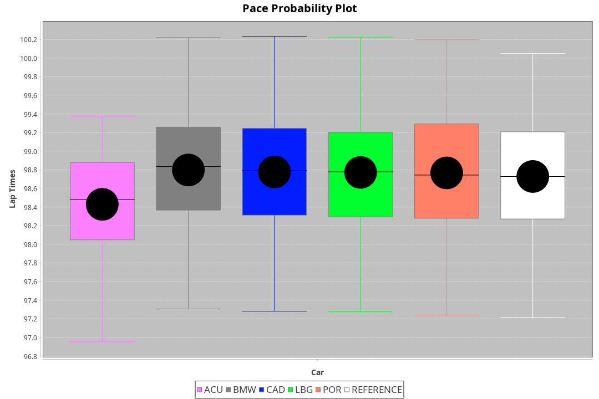
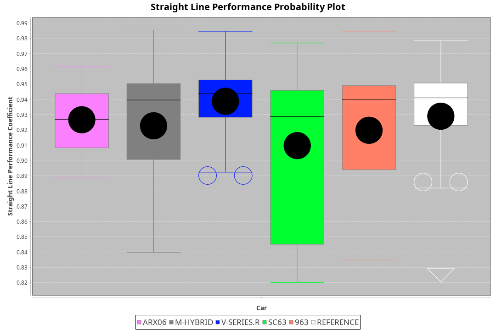
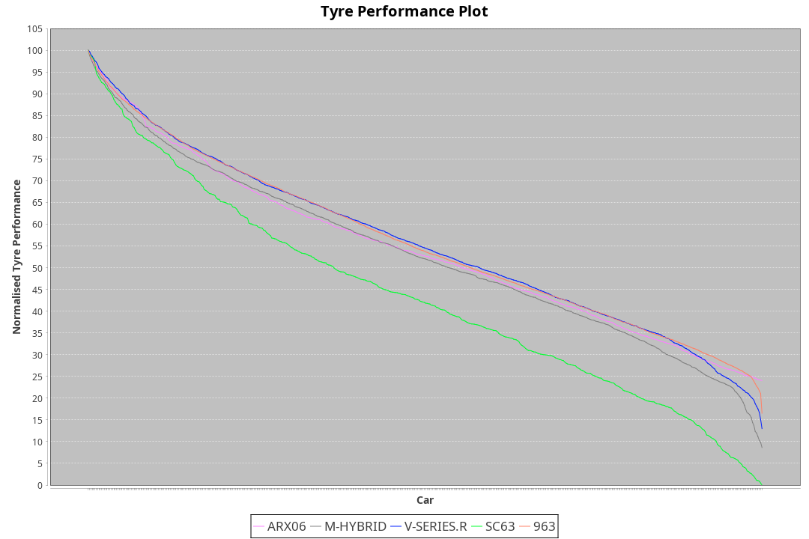

|Manufacturer|Car|Type|RP|QP|Weight|Power¹|Threshhold|PINC|Power²|E/Stint|AVG Vmax|FDS|RDLC|L/Stint|BOP-Grade|ModelAccuracy|ModelPoints|Match%|
|:-|:-|:-|:-|:-|:-|:-|:-|:-|:-|:-|:-|:-|:-|:-|:-|:-|:-|:-|
|Acura|ARX06|LMDH|1:38.16|1:33.52|1065kg|509kw|210.0kph|0%|509kw|904MJ|313.13kph|-|1.00|29|-D2|100.00%|995|62.77%|
|BMW|M Hybrid V8 LMDh|LMDH|1:38.78|1:33.69|1060kg|503kw|210.0kph|0%|503kw|890MJ|308.71kph|-|1.01|29|+A2|98.60%|1690|94.76%|
|Cadillac|V-Series.R|LMDH|1:38.75|1:33.93|1042kg|496kw|210.0kph|0%|496kw|872MJ|313.34kph|-|1.02|29|+B1|98.38%|1765|87.92%|
|Lamborghini|SC63|LMDH|1:38.76|1:33.60|1041kg|503kw|210.0kph|0%|503kw|884MJ|311.95kph|-|1.05|29|+B1|96.77%|419|86.29%|
|Porsche|963|LMDH|1:38.72|1:33.92|1058kg|502kw|210.0kph|0%|502kw|888MJ|313.37kph|-|1.01|29|~A1|96.81%|5438|100.00%|

### BoP Accuracy: 86.35%; Overall BoP Grade: B1

## Power below Threshhold
|N/Nmax|CAD|POR|BMW|ACU|LBG|
|:-|:-|:-|:-|:-|:-|
|0.550|244|247|248|251|248|
|0.575|267|270|271|274|271|
|0.600|287|290|291|294|291|
|0.625|307|310|311|315|311|
|0.650|327|331|332|336|332|
|0.675|348|352|353|357|353|
|0.700|369|374|374|379|374|
|0.725|390|395|395|400|395|
|0.750|410|415|416|421|416|
|0.775|429|434|435|440|435|
|0.800|445|451|452|457|452|
|0.825|460|466|467|472|467|
|0.850|471|477|478|484|478|
|0.875|481|487|488|494|488|
|0.900|488|494|495|501|495|
|0.925|493|499|500|506|500|
|**0.950**|**496**|**502**|**503**|**509**|**503**|
|0.975|494|500|501|507|501|
|1.000|491|497|498|504|498|
|1.025|424|429|430|435|430|

## Power above Threshhold
|N/Nmax|CAD|POR|BMW|ACU|LBG|
|:-|:-|:-|:-|:-|:-|
|0.550|244|247|248|251|248|
|0.575|267|270|271|274|271|
|0.600|287|290|291|294|291|
|0.625|307|310|311|315|311|
|0.650|327|331|332|336|332|
|0.675|348|352|353|357|353|
|0.700|369|374|374|379|374|
|0.725|390|395|395|400|395|
|0.750|410|415|416|421|416|
|0.775|429|434|435|440|435|
|0.800|445|451|452|457|452|
|0.825|460|466|467|472|467|
|0.850|471|477|478|484|478|
|0.875|481|487|488|494|488|
|0.900|488|494|495|501|495|
|0.925|493|499|500|506|500|
|**0.950**|**496**|**502**|**503**|**509**|**503**|
|0.975|494|500|501|507|501|
|1.000|491|497|498|504|498|
|1.025|424|429|430|435|430|
