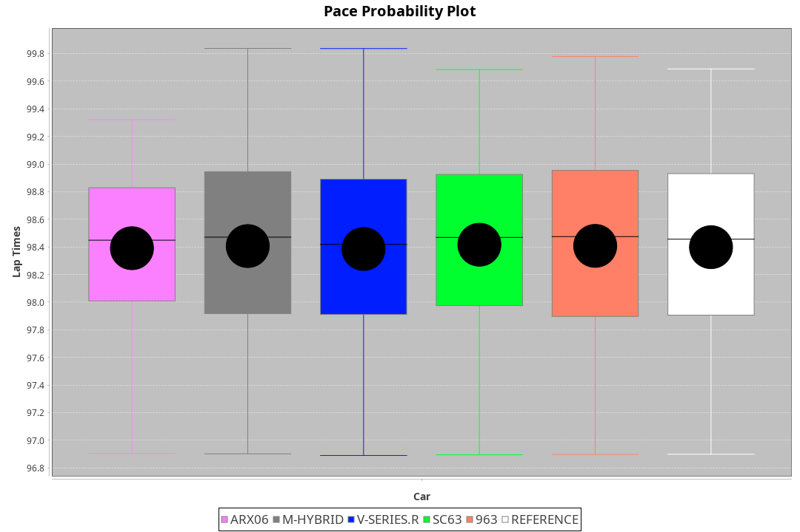
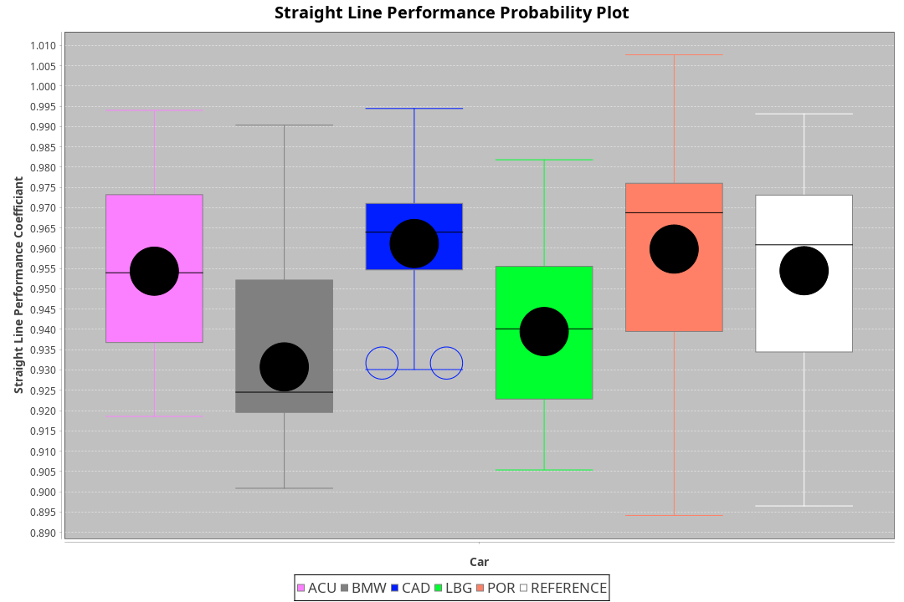
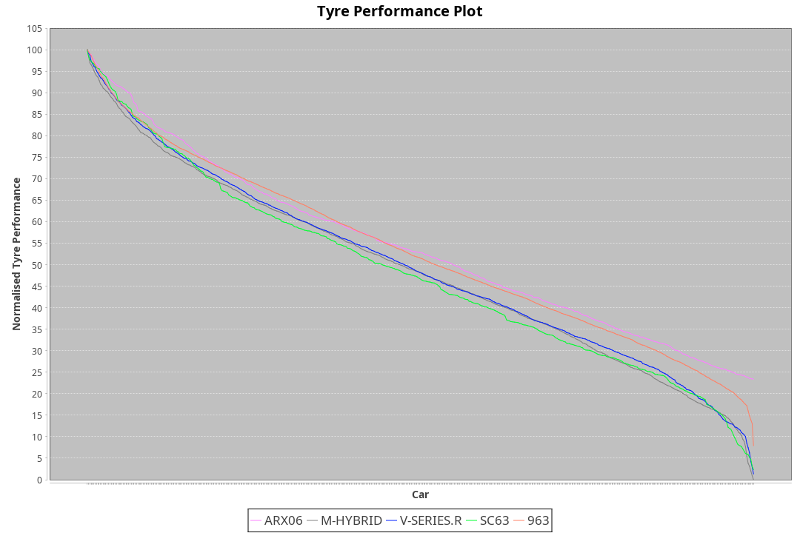

|Manufacturer|Car|Weight|Power|PINC|E/Stint|FDS|
|:-|:-|:-|:-|:-|:-|:-|
|Acura|ARX06|1030kg|509kw|-|905MJ|-|
|BMW|M Hybrid V8 LMDh|1032kg|512kw|-|904MJ|-|
|Cadillac|V-Series.R|1032kg|508kw|-|896MJ|-|
|Lamborghini|SC63|1058kg|520kw|-|913MJ|-|
|Porsche|963|1034kg|512kw|-|897MJ|-|

### BoP Accuracy: 95.33%; Overall BoP Grade: A1
|Manufacturer|Car|Type|RP|QP|Weight|Power¹|Threshhold|PINC|Power²|E/Stint|AVG Vmax|FDS|RDLC|L/Stint|BOP-Grade|ModelAccuracy|ModelPoints|Match%|
|:-|:-|:-|:-|:-|:-|:-|:-|:-|:-|:-|:-|:-|:-|:-|:-|:-|:-|:-|
|Acura|ARX06|LMDH|1:37.61|1:32.28|1030kg|509kw|0.0kph|-|509kw|905MJ|315.75kph|-|1.04|29|+B1|100.00%|995|86.19%|
|BMW|M Hybrid V8 LMDh|LMDH|1:37.61|1:33.09|1032kg|512kw|0.0kph|-|512kw|904MJ|311.31kph|-|1.04|29|~A1|98.60%|1690|100.00%|
|Cadillac|V-Series.R|LMDH|1:37.60|1:32.85|1032kg|508kw|0.0kph|-|508kw|896MJ|315.37kph|-|1.03|29|~A1|91.10%|1770|98.56%|
|Lamborghini|SC63|LMDH|1:37.61|1:35.23|1058kg|520kw|0.0kph|-|520kw|913MJ|312.29kph|-|1.03|29|+A2|96.77%|419|91.89%|
|Porsche|963|LMDH|1:37.60|1:32.79|1034kg|512kw|0.0kph|-|512kw|897MJ|316.00kph|-|1.03|29|~A1|93.14%|5746|100.00%|

## Power below Threshhold
|N/Nmax|ARX06|MHYBRIDV8LMDH|VSERIES.R|SC63|963|
|:-|:-|:-|:-|:-|:-|
|0.550|251|252|250|256|252|
|0.575|274|275|273|279|275|
|0.600|294|296|293|300|296|
|0.625|315|317|314|322|317|
|0.650|336|338|335|343|338|
|0.675|357|359|357|365|359|
|0.700|379|381|378|387|381|
|0.725|400|403|399|409|403|
|0.750|421|423|420|430|423|
|0.775|440|442|439|449|442|
|0.800|457|460|456|467|460|
|0.825|472|475|471|482|475|
|0.850|484|486|483|494|486|
|0.875|494|497|493|505|497|
|0.900|501|504|500|512|504|
|0.925|506|509|505|517|509|
|**0.950**|**509**|**512**|**508**|**520**|**512**|
|0.975|507|510|506|518|510|
|1.000|504|506|503|514|506|
|1.025|435|437|434|444|437|

## Power above Threshhold
|N/Nmax|ARX06|MHYBRIDV8LMDH|VSERIES.R|SC63|963|
|:-|:-|:-|:-|:-|:-|
|0.550|251|252|250|256|252|
|0.575|274|275|273|279|275|
|0.600|294|296|293|300|296|
|0.625|315|317|314|322|317|
|0.650|336|338|335|343|338|
|0.675|357|359|357|365|359|
|0.700|379|381|378|387|381|
|0.725|400|403|399|409|403|
|0.750|421|423|420|430|423|
|0.775|440|442|439|449|442|
|0.800|457|460|456|467|460|
|0.825|472|475|471|482|475|
|0.850|484|486|483|494|486|
|0.875|494|497|493|505|497|
|0.900|501|504|500|512|504|
|0.925|506|509|505|517|509|
|**0.950**|**509**|**512**|**508**|**520**|**512**|
|0.975|507|510|506|518|510|
|1.000|504|506|503|514|506|
|1.025|435|437|434|444|437|
