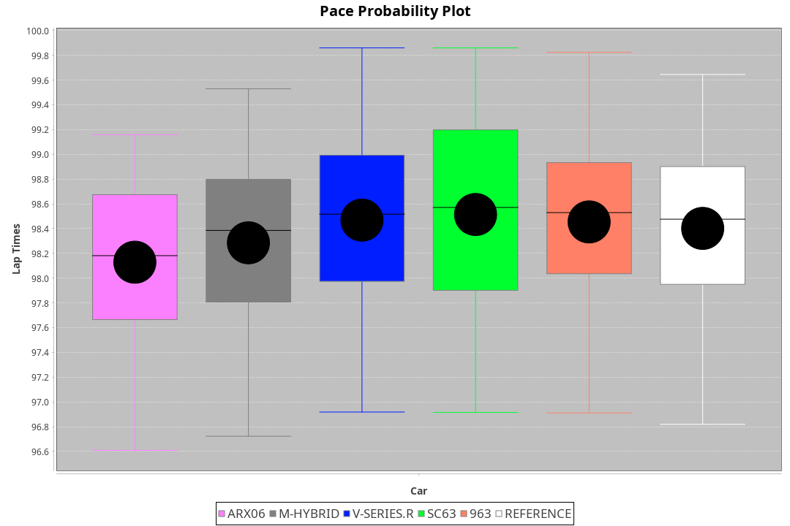
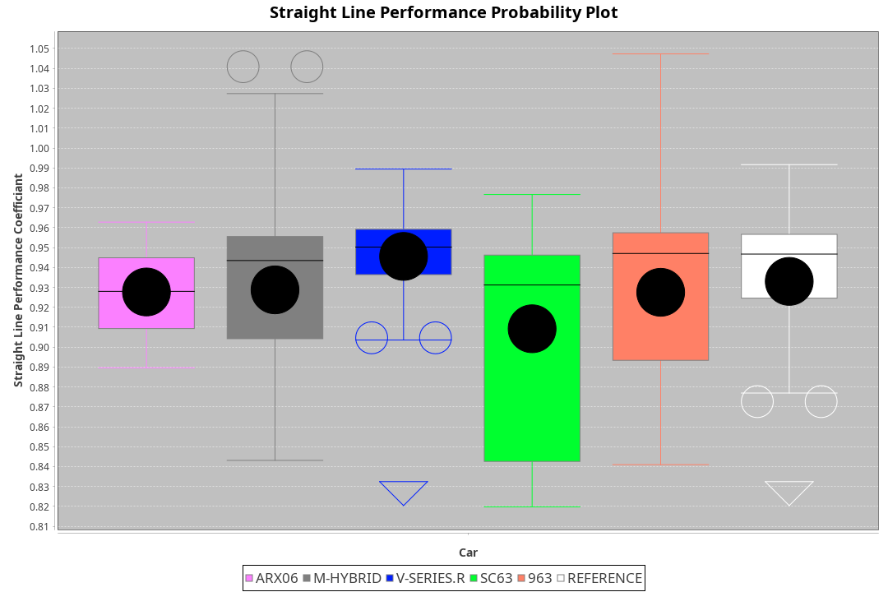
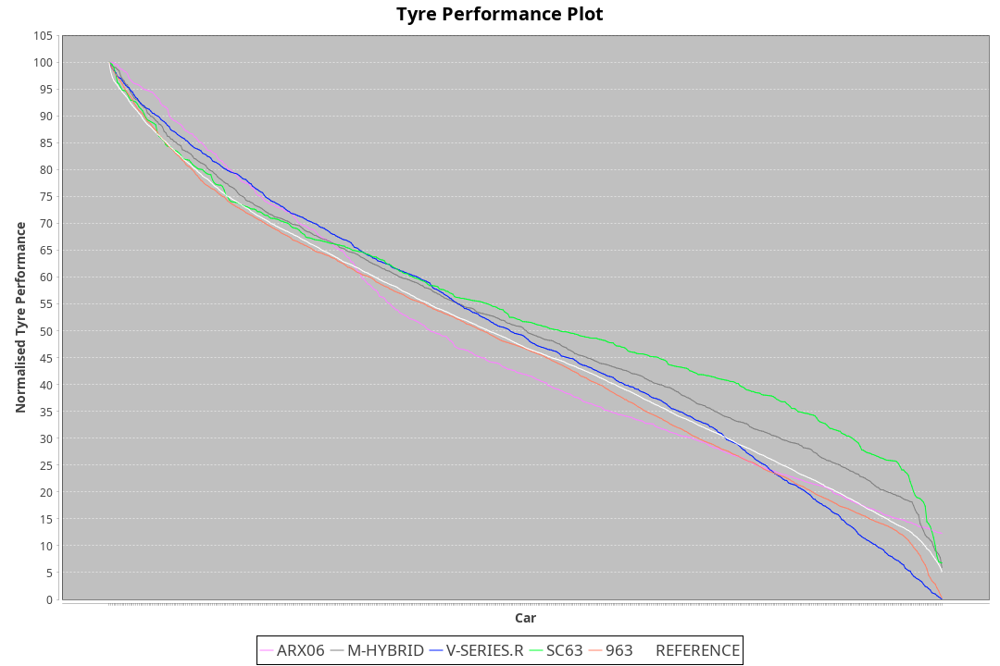

| Manufacturer | Car        | Weight | Power   | PINC    | E/Stint | FDS     |
|:-|:-|:-|:-|:-|:-|:-|
| Cadillac     | V-Series.R | 1044kg | 510.0kw | -1.00%  | 902MJ   |    -    |
| Porsche      | 963        | 1057kg | 516.0kw | -1.00%  | 902MJ   |    -    |
| BMW          | M-Hybrid   | 1051kg | 512.0kw | 1.00%   | 910MJ   |    -    |
| Acura        | ARX06      | 1082kg | 511.0kw | 1.00%   | 915MJ   |    -    |
| Lamborghini  | SC63       | 1042kg | 520.0kw |    -    | 909MJ   |    -    |

### BoP Accuracy: 87.30%; Overall BoP Grade: B1
| Manufacturer | Car        | Type | RP      | QP      | Weight | Power¹  | Threshhold | PINC    | Power²   | E/Stint | AVG Vmax  | FDS     | RDLC | L/Stint | BOP-Grade | Model Accuracy | Model Points | Match% | SimDiff |
|:-|:-|:-|:-|:-|:-|:-|:-|:-|:-|:-|:-|:-|:-|:-|:-|:-|:-|:-|:-|
| Acura        | ARX06      | LMDH | 1:37.60 | 1:32.21 | 1082kg | 511.0kw | 210.0kph   | 1.00%   | 516.10kw |  915MJ  | 307.11kph |    -    | 0.99 | 29      | +B2       | 100.00%        | 996          | 81.11% | -0.02   |
| BMW          | M-Hybrid   | LMDH | 1:37.35 | 1:31.97 | 1051kg | 512.0kw | 210.0kph   | 1.00%   | 517.10kw |  910MJ  | 308.20kph |    -    | 1.02 | 29      | -A2       | 100.00%        | 3339         | 91.05% | +0.34   |
| Cadillac     | V-Series.R | LMDH | 1:37.42 | 1:32.16 | 1044kg | 510.0kw | 210.0kph   | -1.00%  | 504.90kw |  902MJ  | 308.79kph |    -    | 1.03 | 29      | ~A1       | 99.56%         | 5841         | 97.54% | -0.19   |
| Lamborghini  | SC63       | LMDH | 1:38.02 | 1:33.61 | 1042kg | 520.0kw | 210.0kph   |    -    | 520.00kw |  909MJ  | 306.47kph |    -    | 1.06 | 30      | +C2       | 100.00%        | 784          | 72.95% | #       |
| Porsche      | 963        | LMDH | 1:37.34 | 1:31.84 | 1057kg | 516.0kw | 210.0kph   | -1.00%  | 510.80kw |  902MJ  | 307.08kph |    -    | 1.02 | 29      | -A2       | 98.39%         | 16118        | 93.88% | +0.08   |

## Power below Threshhold
| N/Nmax    | ARX06   | M-HYBRID | V-SERIES.R | SC63    | 963     |
|:-|:-|:-|:-|:-|:-|
|  0.550    |  252    |  252     |  251       |  256    |  254    |
|  0.575    |  275    |  275     |  274       |  279    |  277    |
|  0.600    |  295    |  296     |  295       |  300    |  298    |
|  0.625    |  316    |  317     |  316       |  322    |  319    |
|  0.650    |  337    |  338     |  337       |  343    |  340    |
|  0.675    |  359    |  359     |  358       |  365    |  362    |
|  0.700    |  380    |  381     |  380       |  387    |  384    |
|  0.725    |  402    |  403     |  401       |  409    |  406    |
|  0.750    |  422    |  423     |  422       |  430    |  427    |
|  0.775    |  441    |  442     |  441       |  449    |  446    |
|  0.800    |  459    |  460     |  458       |  467    |  463    |
|  0.825    |  474    |  475     |  473       |  482    |  478    |
|  0.850    |  485    |  486     |  485       |  494    |  490    |
|  0.875    |  496    |  497     |  495       |  505    |  501    |
|  0.900    |  503    |  504     |  502       |  512    |  508    |
|  0.925    |  508    |  509     |  507       |  517    |  513    |
| **0.950** | **511** | **512**  | **510**    | **520** | **516** |
|  0.975    |  509    |  510     |  508       |  518    |  514    |
|  1.000    |  505    |  506     |  505       |  514    |  510    |
|  1.025    |  436    |  437     |  436       |  444    |  441    |

## Power above Threshhold
| N/Nmax    | ARX06      | M-HYBRID   | V-SERIES.R | SC63    | 963        |
|:-|:-|:-|:-|:-|:-|
|  0.550    |  254.05    |  255.06    |  248.44    |  256    |  251.41    |
|  0.575    |  277.06    |  278.06    |  271.48    |  279    |  274.45    |
|  0.600    |  298.06    |  298.07    |  291.52    |  300    |  295.49    |
|  0.625    |  319.07    |  320.07    |  312.56    |  322    |  316.52    |
|  0.650    |  340.07    |  341.08    |  333.59    |  343    |  337.56    |
|  0.675    |  362.08    |  363.08    |  354.63    |  365    |  358.59    |
|  0.700    |  384.08    |  385.09    |  375.67    |  387    |  380.63    |
|  0.725    |  406.09    |  407.09    |  396.71    |  409    |  401.66    |
|  0.750    |  427.09    |  427.10    |  416.74    |  430    |  422.70    |
|  0.775    |  446.10    |  446.10    |  435.78    |  449    |  441.73    |
|  0.800    |  463.10    |  464.11    |  453.81    |  467    |  458.75    |
|  0.825    |  478.10    |  479.11    |  468.84    |  482    |  473.78    |
|  0.850    |  490.10    |  491.11    |  479.86    |  494    |  485.80    |
|  0.875    |  501.11    |  502.12    |  489.87    |  505    |  495.82    |
|  0.900    |  508.11    |  509.12    |  496.89    |  512    |  502.83    |
|  0.925    |  513.11    |  514.12    |  501.89    |  517    |  507.84    |
| **0.950** | **516.11** | **517.12** | **504.90** | **520** | **510.84** |
|  0.975    |  514.11    |  515.12    |  502.90    |  518    |  508.84    |
|  1.000    |  510.11    |  511.12    |  499.89    |  514    |  505.83    |
|  1.025    |  441.09    |  441.10    |  430.77    |  444    |  436.72    |
