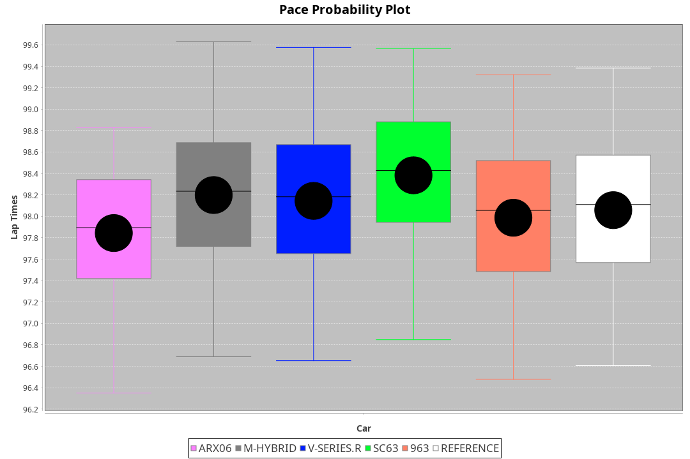
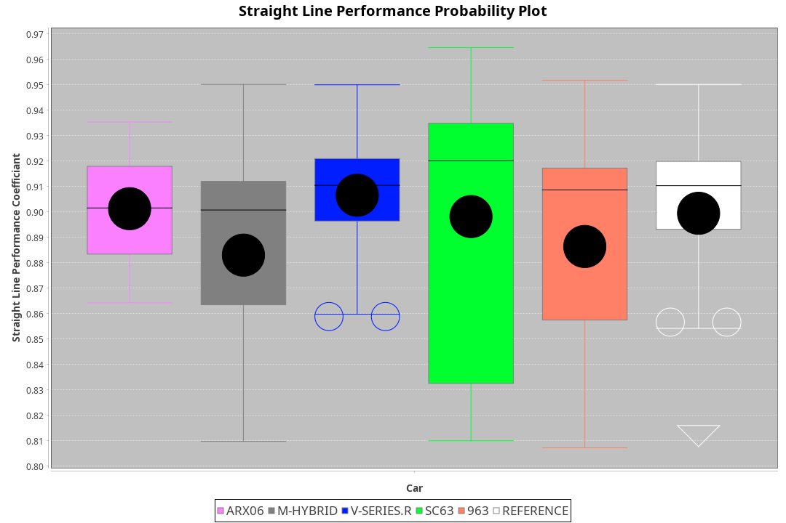
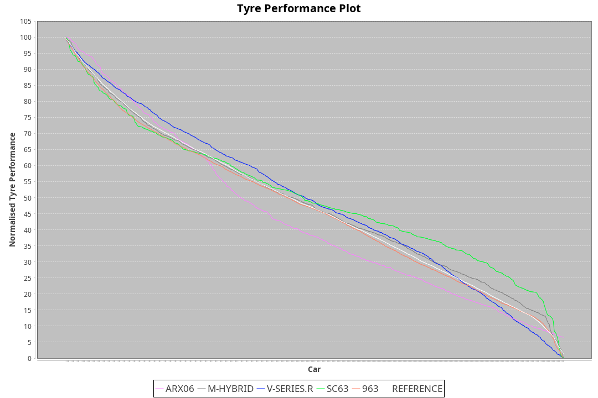

| Manufacturer | Car        | Weight | Power   | PINC    | E/Stint | FDS     |
|:-|:-|:-|:-|:-|:-|:-|
| Acura        | ARX06      | 1100kg | 480.0kw |    -    | 887MJ   |    -    |
| BMW          | M-Hybrid   | 1100kg | 480.0kw | 0.70%   | 886MJ   |    -    |
| Cadillac     | V-Series.R | 1100kg | 480.0kw |    -    | 882MJ   |    -    |
| Lamborghini  | SC63       | 1068kg | 520.0kw |    -    | 912MJ   |    -    |
| Porsche      | 963        | 1100kg | 480.0kw | 1.50%   | 878MJ   |    -    |

### BoP Accuracy: 89.71%; Overall BoP Grade: B1
| Manufacturer | Car        | Type | RP      | QP      | Weight | Power¹  | Threshhold | PINC    | Power²   | E/Stint | AVG Vmax  | FDS     | RDLC | L/Stint | BOP-Grade | Model Accuracy | Model Points | Match% | SimDiff |
|:-|:-|:-|:-|:-|:-|:-|:-|:-|:-|:-|:-|:-|:-|:-|:-|:-|:-|:-|:-|
| Acura        | ARX06      | LMDH | 1:37.89 | 1:32.49 | 1100kg | 480.0kw | 250.0kph   |    -    | 480.00kw |  887MJ  | 297.72kph |    -    | 0.97 | 29      | -C1       | 100.00%        | 996          | 79.87% | +0.13   |
| BMW          | M-Hybrid   | LMDH | 1:38.26 | 1:32.82 | 1100kg | 480.0kw | 250.0kph   | 0.70%   | 483.40kw |  886MJ  | 296.77kph |    -    | 0.98 | 29      | +A2       | 99.20%         | 3081         | 92.74% | +0.13   |
| Cadillac     | V-Series.R | LMDH | 1:38.22 | 1:32.91 | 1100kg | 480.0kw | 250.0kph   |    -    | 480.00kw |  882MJ  | 297.83kph |    -    | 0.97 | 29      | +B1       | 99.22%         | 5358         | 86.84% | -0.20   |
| Lamborghini  | SC63       | LMDH | 1:38.26 | 1:33.88 | 1068kg | 520.0kw | 250.0kph   |    -    | 520.00kw |  912MJ  | 303.60kph |    -    | 1.03 | 30      | +A2       | 100.00%        | 784          | 94.10% | #       |
| Porsche      | 963        | LMDH | 1:37.98 | 1:32.63 | 1100kg | 480.0kw | 250.0kph   | 1.50%   | 487.20kw |  878MJ  | 296.90kph |    -    | 0.98 | 29      | ~A1       | 99.87%         | 14199        | 95.02% | +0.14   |

## Power below Threshhold
| N/Nmax    | ARX06   | M-HYBRID | V-SERIES.R | SC63    | 963     |
|:-|:-|:-|:-|:-|:-|
|  0.550    |  236    |  236     |  236       |  256    |  236    |
|  0.575    |  258    |  258     |  258       |  279    |  258    |
|  0.600    |  277    |  277     |  277       |  300    |  277    |
|  0.625    |  297    |  297     |  297       |  322    |  297    |
|  0.650    |  317    |  317     |  317       |  343    |  317    |
|  0.675    |  337    |  337     |  337       |  365    |  337    |
|  0.700    |  358    |  358     |  358       |  387    |  358    |
|  0.725    |  378    |  378     |  378       |  409    |  378    |
|  0.750    |  397    |  397     |  397       |  430    |  397    |
|  0.775    |  415    |  415     |  415       |  449    |  415    |
|  0.800    |  431    |  431     |  431       |  467    |  431    |
|  0.825    |  445    |  445     |  445       |  482    |  445    |
|  0.850    |  456    |  456     |  456       |  494    |  456    |
|  0.875    |  466    |  466     |  466       |  505    |  466    |
|  0.900    |  472    |  472     |  472       |  512    |  472    |
|  0.925    |  477    |  477     |  477       |  517    |  477    |
| **0.950** | **480** | **480**  | **480**    | **520** | **480** |
|  0.975    |  478    |  478     |  478       |  518    |  478    |
|  1.000    |  475    |  475     |  475       |  514    |  475    |
|  1.025    |  410    |  410     |  410       |  444    |  410    |

## Power above Threshhold
| N/Nmax    | ARX06   | M-HYBRID   | V-SERIES.R | SC63    | 963        |
|:-|:-|:-|:-|:-|:-|
|  0.550    |  236    |  238.18    |  236       |  256    |  240.10    |
|  0.575    |  258    |  260.19    |  258       |  279    |  262.11    |
|  0.600    |  277    |  279.21    |  277       |  300    |  281.12    |
|  0.625    |  297    |  299.22    |  297       |  322    |  301.12    |
|  0.650    |  317    |  319.24    |  317       |  343    |  322.13    |
|  0.675    |  337    |  339.25    |  337       |  365    |  342.14    |
|  0.700    |  358    |  360.27    |  358       |  387    |  363.15    |
|  0.725    |  378    |  380.28    |  378       |  409    |  383.16    |
|  0.750    |  397    |  399.30    |  397       |  430    |  403.17    |
|  0.775    |  415    |  418.31    |  415       |  449    |  421.17    |
|  0.800    |  431    |  434.32    |  431       |  467    |  437.18    |
|  0.825    |  445    |  448.33    |  445       |  482    |  452.19    |
|  0.850    |  456    |  459.34    |  456       |  494    |  463.19    |
|  0.875    |  466    |  469.35    |  466       |  505    |  473.19    |
|  0.900    |  472    |  475.35    |  472       |  512    |  479.20    |
|  0.925    |  477    |  480.36    |  477       |  517    |  484.20    |
| **0.950** | **480** | **483.36** | **480**    | **520** | **487.20** |
|  0.975    |  478    |  481.36    |  478       |  518    |  485.20    |
|  1.000    |  475    |  478.36    |  475       |  514    |  482.20    |
|  1.025    |  410    |  413.31    |  410       |  444    |  416.17    |
