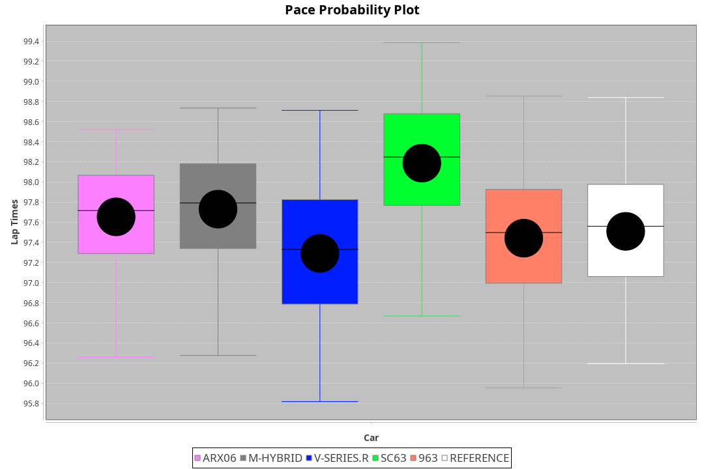
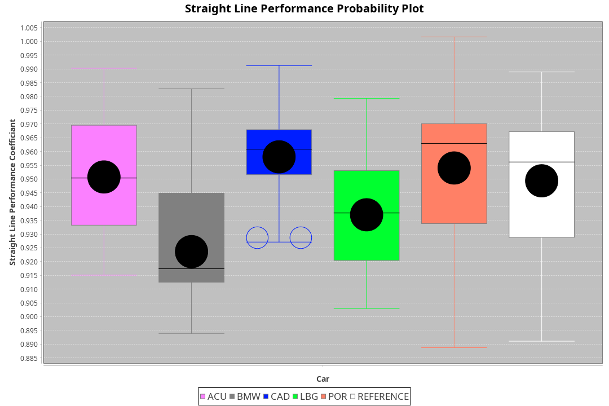
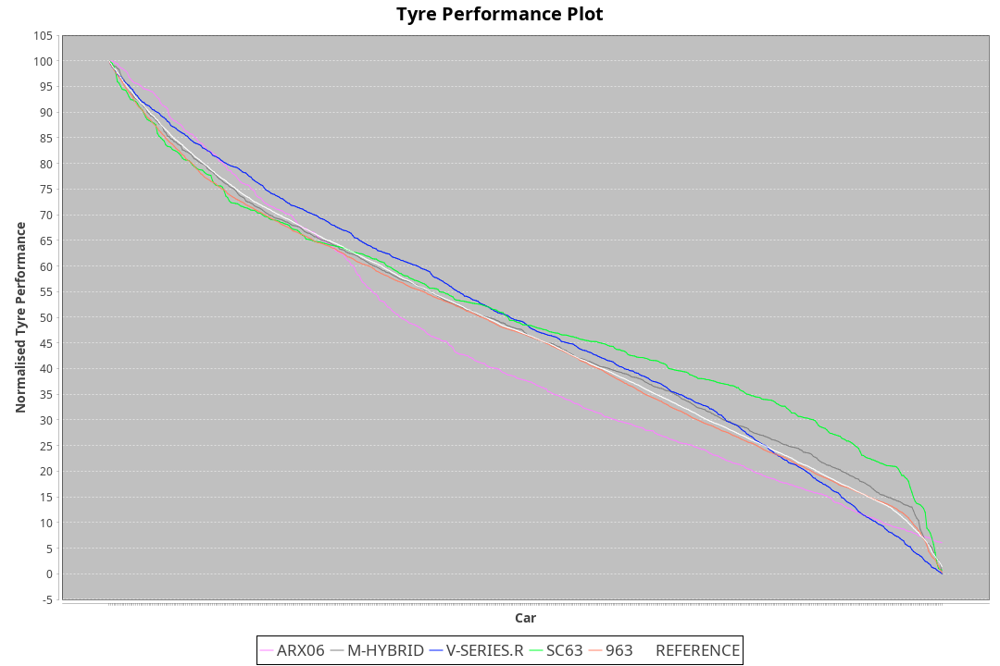

|Manufacturer|Car|Weight|Power|PINC|E/Stint|FDS|
|:-|:-|:-|:-|:-|:-|:-|
|Acura|ARX06|1070kg|512kw|-|909MJ|-|
|BMW|M Hybrid V8 LMDh|1060kg|506kw|-|892MJ|-|
|Cadillac|V-Series.R|1032kg|499kw|-|873MJ|-|
|Lamborghini|SC63|1041kg|502kw|-|883MJ|-|
|Porsche|963|1048kg|505kw|-|889MJ|-|

### BoP Accuracy: 85.64%; Overall BoP Grade: B1
|Manufacturer|Car|Type|RP|QP|Weight|Power¹|Threshhold|PINC|Power²|E/Stint|AVG Vmax|FDS|RDLC|L/Stint|BOP-Grade|ModelAccuracy|ModelPoints|Match%|
|:-|:-|:-|:-|:-|:-|:-|:-|:-|:-|:-|:-|:-|:-|:-|:-|:-|:-|:-|
|Acura|ARX06|LMDH|1:38.00|1:33.37|1070kg|512kw|210.0kph|-|512kw|909MJ|313.22kph|-|1.00|29|-D1|100.00%|995|66.36%|
|BMW|M Hybrid V8 LMDh|LMDH|1:38.52|1:33.46|1060kg|506kw|210.0kph|-|506kw|892MJ|309.17kph|-|1.01|29|~A1|98.60%|1690|96.12%|
|Cadillac|V-Series.R|LMDH|1:38.35|1:33.56|1032kg|499kw|210.0kph|-|499kw|873MJ|314.57kph|-|1.03|29|~A1|98.38%|1765|97.61%|
|Lamborghini|SC63|LMDH|1:38.84|1:33.68|1041kg|502kw|210.0kph|-|502kw|883MJ|311.80kph|-|1.05|29|+D1|96.77%|419|68.68%|
|Porsche|963|LMDH|1:38.31|1:33.55|1048kg|505kw|210.0kph|-|505kw|889MJ|314.59kph|-|1.02|29|~A1|96.81%|5438|99.42%|

## Power below Threshhold
|N/Nmax|ACU|BMW|CAD|LBG|POR|
|:-|:-|:-|:-|:-|:-|
|0.550|252|249|246|247|249|
|0.575|275|272|268|270|272|
|0.600|296|292|288|290|292|
|0.625|317|313|308|310|312|
|0.650|338|334|329|331|333|
|0.675|359|355|350|352|355|
|0.700|381|377|371|374|376|
|0.725|403|398|392|395|397|
|0.750|423|418|412|415|417|
|0.775|442|437|431|434|436|
|0.800|460|454|448|451|454|
|0.825|475|469|463|466|469|
|0.850|486|481|474|477|480|
|0.875|497|491|484|487|490|
|0.900|504|498|491|494|497|
|0.925|509|503|496|499|502|
|**0.950**|**512**|**506**|**499**|**502**|**505**|
|0.975|510|504|497|500|503|
|1.000|506|501|494|497|500|
|1.025|437|432|426|429|431|

## Power above Threshhold
|N/Nmax|ACU|BMW|CAD|LBG|POR|
|:-|:-|:-|:-|:-|:-|
|0.550|252|249|246|247|249|
|0.575|275|272|268|270|272|
|0.600|296|292|288|290|292|
|0.625|317|313|308|310|312|
|0.650|338|334|329|331|333|
|0.675|359|355|350|352|355|
|0.700|381|377|371|374|376|
|0.725|403|398|392|395|397|
|0.750|423|418|412|415|417|
|0.775|442|437|431|434|436|
|0.800|460|454|448|451|454|
|0.825|475|469|463|466|469|
|0.850|486|481|474|477|480|
|0.875|497|491|484|487|490|
|0.900|504|498|491|494|497|
|0.925|509|503|496|499|502|
|**0.950**|**512**|**506**|**499**|**502**|**505**|
|0.975|510|504|497|500|503|
|1.000|506|501|494|497|500|
|1.025|437|432|426|429|431|
