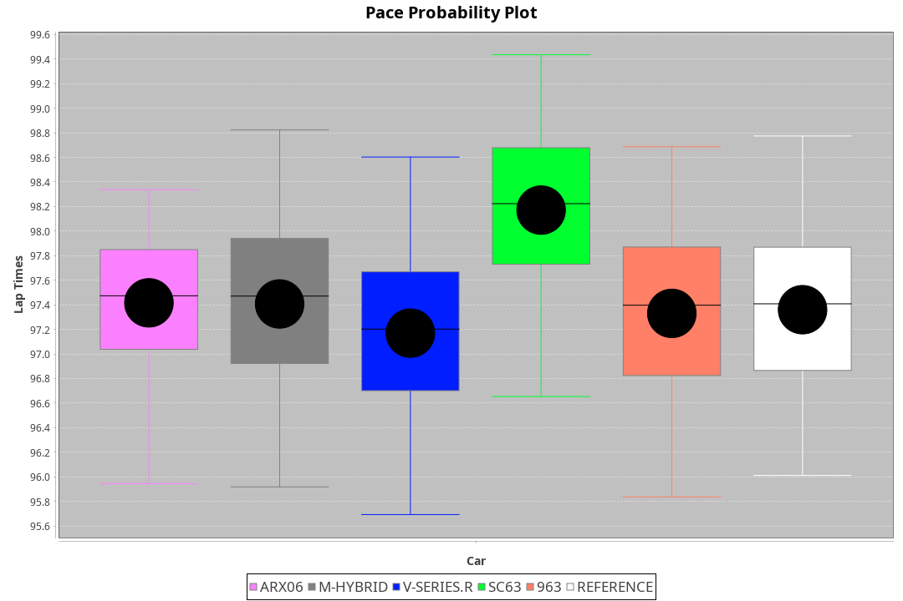
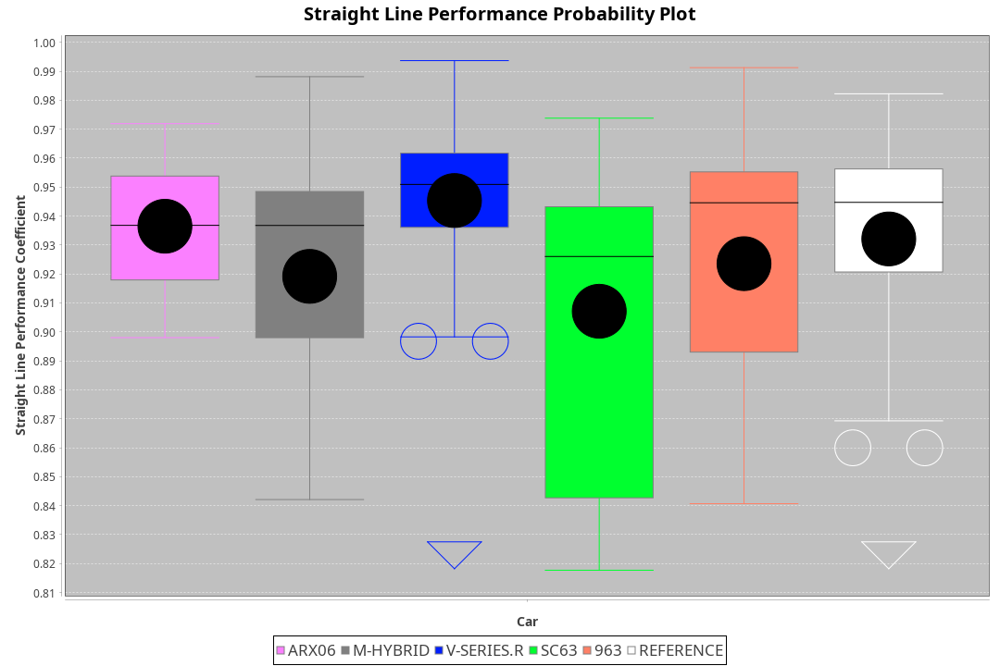

|Manufacturer|Car|Weight|Power|PINC|E/Stint|FDS|
|:-|:-|:-|:-|:-|:-|:-|
|Acura|ARX06|1072kg|520kw|-|919MJ|-|
|BMW|M Hybrid V8 LMDh|1031kg|514kw|-|905MJ|-|
|Cadillac|V-Series.R|1030kg|510kw|-|897MJ|-|
|Lamborghini|SC63|1042kg|516kw|-|908MJ|-|
|Porsche|963|1051kg|519kw|-|905MJ|-|

### BoP Accuracy: 92.52%; Overall BoP Grade: A2
|Manufacturer|Car|Type|RP|QP|Weight|Power¹|Threshhold|PINC|Power²|E/Stint|AVG Vmax|FDS|RDLC|L/Stint|BOP-Grade|ModelAccuracy|ModelPoints|Match%|
|:-|:-|:-|:-|:-|:-|:-|:-|:-|:-|:-|:-|:-|:-|:-|:-|:-|:-|:-|
|Acura|ARX06|LMDH|1:37.38|1:32.08|1072kg|520kw|0.0kph|-|520kw|919MJ|314.29kph|-|0.99|29|-B1|100.00%|995|85.62%|
|BMW|M Hybrid V8 LMDh|LMDH|1:37.43|1:32.92|1031kg|514kw|0.0kph|-|514kw|905MJ|311.69kph|-|1.04|29|~A1|98.60%|1690|100.00%|
|Cadillac|V-Series.R|LMDH|1:37.41|1:32.67|1030kg|510kw|0.0kph|-|510kw|897MJ|315.84kph|-|1.04|29|~A1|91.10%|1770|100.00%|
|Lamborghini|SC63|LMDH|1:37.69|1:35.31|1042kg|516kw|0.0kph|-|516kw|908MJ|312.88kph|-|1.05|29|+C1|96.77%|419|78.26%|
|Porsche|963|LMDH|1:37.30|1:32.52|1051kg|519kw|0.0kph|-|519kw|905MJ|315.78kph|-|1.01|29|~A1|93.14%|5746|98.72%|

## Power below Threshhold
|N/Nmax|ARX06|MHYBRIDV8LMDH|VSERIES.R|SC63|963|
|:-|:-|:-|:-|:-|:-|
|0.550|256|253|251|254|256|
|0.575|279|276|274|277|279|
|0.600|300|297|295|298|299|
|0.625|322|318|316|319|321|
|0.650|343|339|337|340|342|
|0.675|365|361|358|362|364|
|0.700|387|383|380|384|386|
|0.725|409|404|401|406|408|
|0.750|430|425|422|427|429|
|0.775|449|444|441|446|448|
|0.800|467|462|458|463|466|
|0.825|482|477|473|478|481|
|0.850|494|488|485|490|493|
|0.875|505|499|495|501|504|
|0.900|512|506|502|508|511|
|0.925|517|511|507|513|516|
|**0.950**|**520**|**514**|**510**|**516**|**519**|
|0.975|518|512|508|514|517|
|1.000|514|508|505|510|513|
|1.025|444|439|436|441|443|

## Power above Threshhold
|N/Nmax|ARX06|MHYBRIDV8LMDH|VSERIES.R|SC63|963|
|:-|:-|:-|:-|:-|:-|
|0.550|256|253|251|254|256|
|0.575|279|276|274|277|279|
|0.600|300|297|295|298|299|
|0.625|322|318|316|319|321|
|0.650|343|339|337|340|342|
|0.675|365|361|358|362|364|
|0.700|387|383|380|384|386|
|0.725|409|404|401|406|408|
|0.750|430|425|422|427|429|
|0.775|449|444|441|446|448|
|0.800|467|462|458|463|466|
|0.825|482|477|473|478|481|
|0.850|494|488|485|490|493|
|0.875|505|499|495|501|504|
|0.900|512|506|502|508|511|
|0.925|517|511|507|513|516|
|**0.950**|**520**|**514**|**510**|**516**|**519**|
|0.975|518|512|508|514|517|
|1.000|514|508|505|510|513|
|1.025|444|439|436|441|443|
