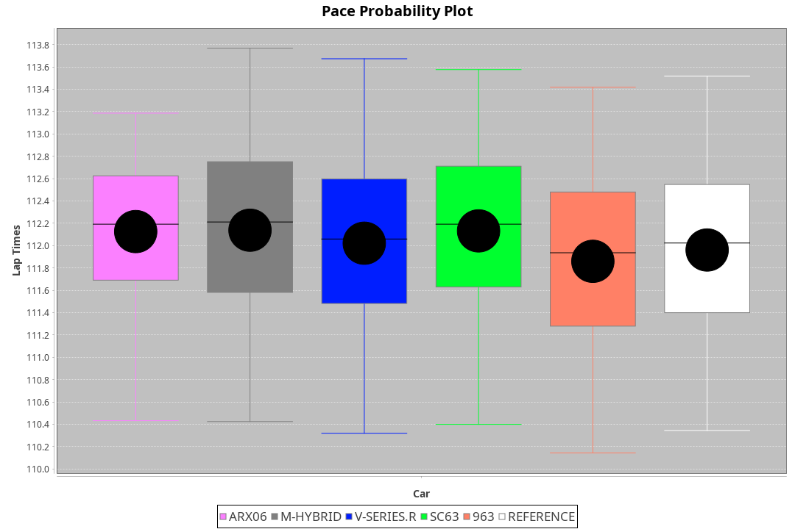
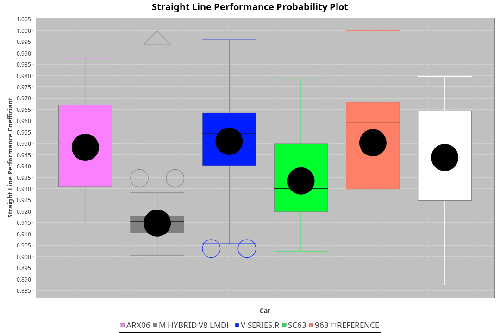
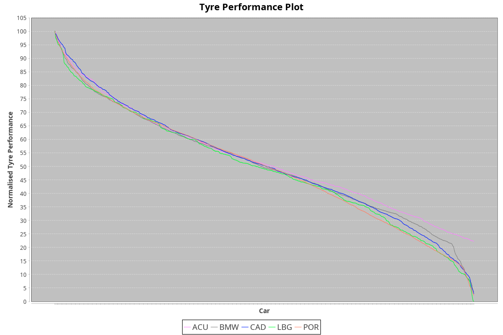

|Manufacturer|Car|Weight|Power|PINC|E/Stint|FDS|
|:-|:-|:-|:-|:-|:-|:-|
|Acura|ARX06|1070kg|510kw|-|907MJ|-|
|BMW|M Hybrid V8 LMDh|1058kg|507kw|-|893MJ|-|
|Cadillac|V-Series.R|1042kg|496kw|-|872MJ|-|
|Lamborghini|SC63|1041kg|502kw|-|883MJ|-|
|Porsche|963|1050kg|502kw|-|887MJ|-|

### BoP Accuracy: 94.25%; Overall BoP Grade: A2
|Manufacturer|Car|Type|RP|QP|Weight|Power¹|Threshhold|PINC|Power²|E/Stint|AVG Vmax|FDS|RDLC|L/Stint|BOP-Grade|ModelAccuracy|ModelPoints|Match%|
|:-|:-|:-|:-|:-|:-|:-|:-|:-|:-|:-|:-|:-|:-|:-|:-|:-|:-|:-|
|Acura|ARX06|LMDH|1:52.69|1:49.11|1070kg|510kw|210.0kph|-|510kw|907MJ|277.66kph|-|1.00|29|+B1|100.00%|995|86.05%|
|BMW|M Hybrid V8 LMDh|LMDH|1:52.70|1:48.67|1058kg|507kw|210.0kph|-|507kw|893MJ|274.60kph|-|1.02|29|~A1|98.60%|1690|100.00%|
|Cadillac|V-Series.R|LMDH|1:52.68|1:48.95|1042kg|496kw|210.0kph|-|496kw|872MJ|278.03kph|-|1.02|29|~A1|98.38%|1765|96.06%|
|Lamborghini|SC63|LMDH|1:52.79|1:48.66|1041kg|502kw|210.0kph|-|502kw|883MJ|276.67kph|-|1.05|29|+B1|96.77%|419|89.14%|
|Porsche|963|LMDH|1:52.70|1:49.00|1050kg|502kw|210.0kph|-|502kw|887MJ|278.59kph|-|1.02|29|~A1|96.81%|5438|100.00%|

## Power below Threshhold
|N/Nmax|ACU|BMW|CAD|LBG|POR|
|:-|:-|:-|:-|:-|:-|
|0.550|251|250|244|247|247|
|0.575|274|273|267|270|270|
|0.600|295|293|287|290|290|
|0.625|316|314|307|310|310|
|0.650|337|335|327|331|331|
|0.675|358|356|348|352|352|
|0.700|380|377|369|374|374|
|0.725|401|399|390|395|395|
|0.750|422|419|410|415|415|
|0.775|441|438|429|434|434|
|0.800|458|455|445|451|451|
|0.825|473|470|460|466|466|
|0.850|485|482|471|477|477|
|0.875|495|492|481|487|487|
|0.900|502|499|488|494|494|
|0.925|507|504|493|499|499|
|**0.950**|**510**|**507**|**496**|**502**|**502**|
|0.975|508|505|494|500|500|
|1.000|505|502|491|497|497|
|1.025|436|433|424|429|429|

## Power above Threshhold
|N/Nmax|ACU|BMW|CAD|LBG|POR|
|:-|:-|:-|:-|:-|:-|
|0.550|251|250|244|247|247|
|0.575|274|273|267|270|270|
|0.600|295|293|287|290|290|
|0.625|316|314|307|310|310|
|0.650|337|335|327|331|331|
|0.675|358|356|348|352|352|
|0.700|380|377|369|374|374|
|0.725|401|399|390|395|395|
|0.750|422|419|410|415|415|
|0.775|441|438|429|434|434|
|0.800|458|455|445|451|451|
|0.825|473|470|460|466|466|
|0.850|485|482|471|477|477|
|0.875|495|492|481|487|487|
|0.900|502|499|488|494|494|
|0.925|507|504|493|499|499|
|**0.950**|**510**|**507**|**496**|**502**|**502**|
|0.975|508|505|494|500|500|
|1.000|505|502|491|497|497|
|1.025|436|433|424|429|429|
