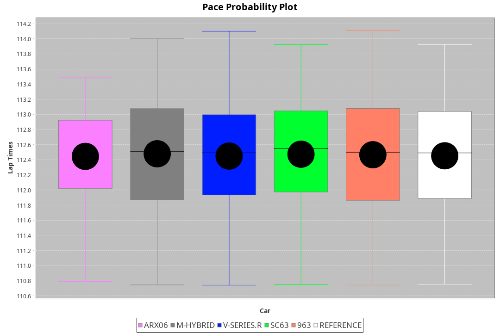
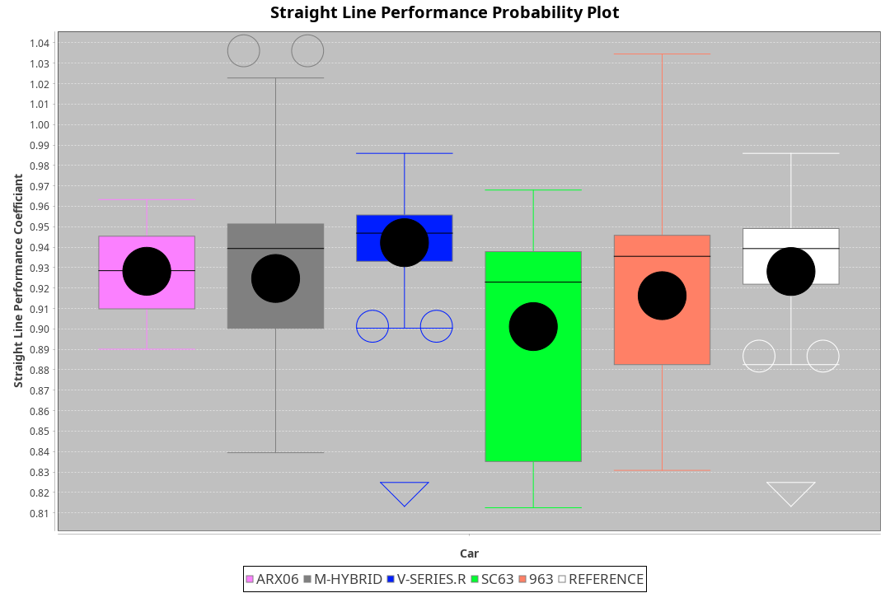
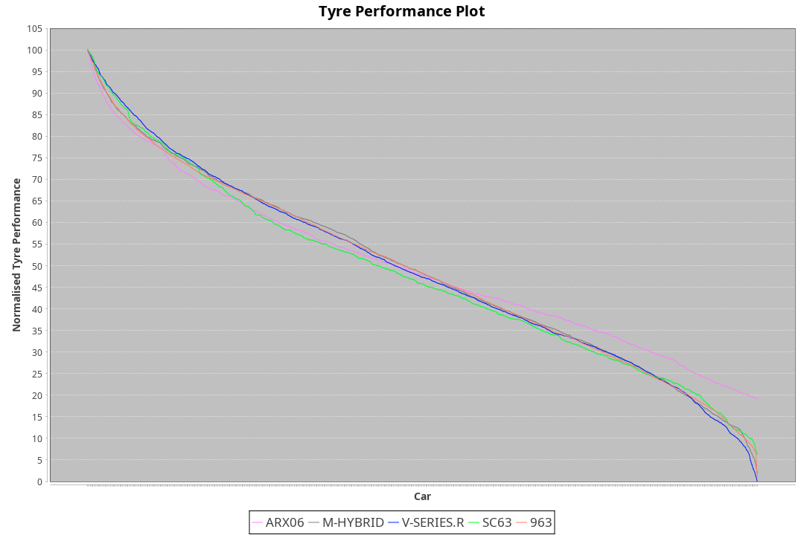

|Manufacturer|Car|Type|RP|QP|Weight|Power¹|Threshhold|PINC|Power²|E/Stint|AVG Vmax|FDS|RDLC|L/Stint|BOP-Grade|ModelAccuracy|ModelPoints|Match%|
|:-|:-|:-|:-|:-|:-|:-|:-|:-|:-|:-|:-|:-|:-|:-|:-|:-|:-|:-|
|Acura|ARX06|LMDH|1:51.79|1:48.27|1030kg|503kw|210.0kph|0%|503kw|895MJ|279.35kph|-|1.03|29|+B1|100.00%|995|86.06%|
|BMW|M Hybrid V8 LMDh|LMDH|1:51.82|1:47.85|1032kg|506kw|210.0kph|0%|506kw|889MJ|276.18kph|-|1.03|29|~A1|98.60%|1690|100.00%|
|Cadillac|V-Series.R|LMDH|1:51.80|1:48.13|1030kg|501kw|210.0kph|0%|501kw|875MJ|279.54kph|-|1.03|29|+A2|98.38%|1765|94.53%|
|Lamborghini|SC63|LMDH|1:51.80|1:47.74|1057kg|520kw|210.0kph|0%|520kw|901MJ|278.05kph|-|1.03|29|+A2|96.77%|419|92.94%|
|Porsche|963|LMDH|1:51.80|1:48.15|1030kg|504kw|210.0kph|0%|504kw|886MJ|280.21kph|-|1.03|29|~A1|96.81%|5438|100.00%|

### BoP Accuracy: 94.71%; Overall BoP Grade: A2

## Power below Threshhold
|N/Nmax|CAD|POR|BMW|ACU|LBG|
|:-|:-|:-|:-|:-|:-|
|0.550|247|248|249|248|256|
|0.575|270|271|272|271|279|
|0.600|290|291|292|291|300|
|0.625|310|312|313|311|322|
|0.650|331|333|334|332|343|
|0.675|352|354|355|353|365|
|0.700|373|375|377|374|387|
|0.725|394|396|398|395|409|
|0.750|414|416|418|416|430|
|0.775|433|435|437|435|449|
|0.800|450|453|454|452|467|
|0.825|465|468|469|467|482|
|0.850|476|479|481|478|494|
|0.875|486|489|491|488|505|
|0.900|493|496|498|495|512|
|0.925|498|501|503|500|517|
|**0.950**|**501**|**504**|**506**|**503**|**520**|
|0.975|499|502|504|501|518|
|1.000|496|499|501|498|514|
|1.025|428|430|432|430|444|

## Power above Threshhold
|N/Nmax|CAD|POR|BMW|ACU|LBG|
|:-|:-|:-|:-|:-|:-|
|0.550|247|248|249|248|256|
|0.575|270|271|272|271|279|
|0.600|290|291|292|291|300|
|0.625|310|312|313|311|322|
|0.650|331|333|334|332|343|
|0.675|352|354|355|353|365|
|0.700|373|375|377|374|387|
|0.725|394|396|398|395|409|
|0.750|414|416|418|416|430|
|0.775|433|435|437|435|449|
|0.800|450|453|454|452|467|
|0.825|465|468|469|467|482|
|0.850|476|479|481|478|494|
|0.875|486|489|491|488|505|
|0.900|493|496|498|495|512|
|0.925|498|501|503|500|517|
|**0.950**|**501**|**504**|**506**|**503**|**520**|
|0.975|499|502|504|501|518|
|1.000|496|499|501|498|514|
|1.025|428|430|432|430|444|
