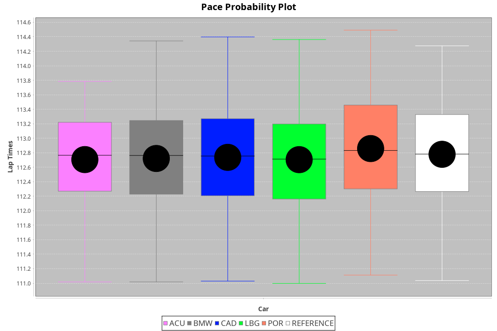
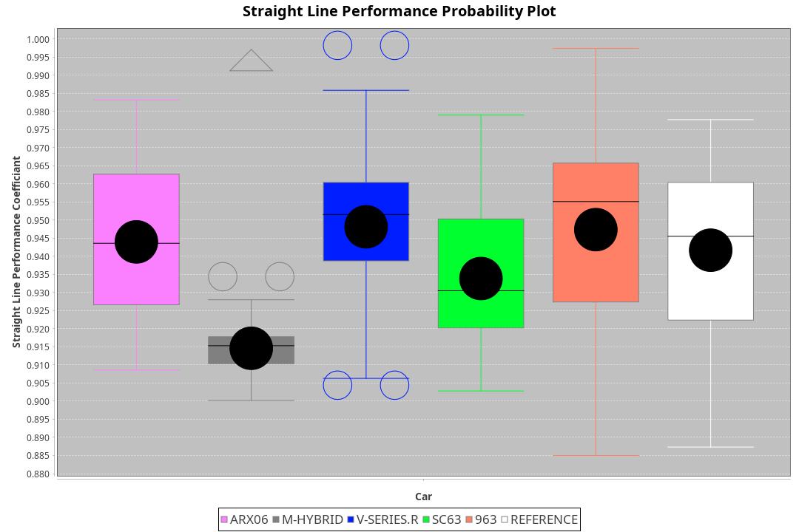
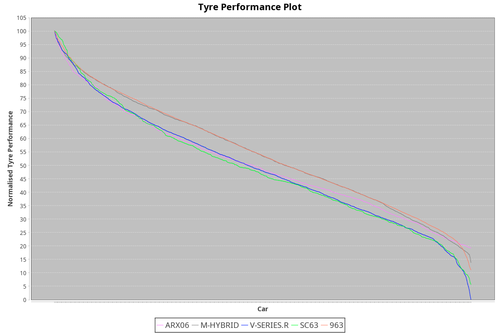

|Manufacturer|Car|Weight|Power|PINC|E/Stint|FDS|
|:-|:-|:-|:-|:-|:-|:-|
|Acura|ARX06|1069kg|509kw|-|909MJ|-|
|BMW|M-Hybrid|1053kg|505kw|1%|901MJ|-|
|Cadillac|V-Series.R|1042kg|502kw|-1%|890MJ|-|
|Lamborghini|SC63|1055kg|506kw|1%|902MJ|-|
|Porsche|963|1048kg|507kw|-1%|892MJ|-|

### BoP Accuracy: 97.97%; Overall BoP Grade: A1
|Manufacturer|Car|Type|RP|QP|Weight|Power¹|Threshhold|PINC|Power²|E/Stint|AVG Vmax|FDS|RDLC|L/Stint|BOP-Grade|ModelAccuracy|ModelPoints|Match%|
|:-|:-|:-|:-|:-|:-|:-|:-|:-|:-|:-|:-|:-|:-|:-|:-|:-|:-|:-|
|Acura|ARX06|LMDH|1:53.52|1:47.30|1069kg|509kw|210.0kph|-|509kw|909MJ|277.60kph|-|0.99|30|~A1|100.00%|995|96.84%|
|BMW|M-Hybrid|LMDH|1:53.45|1:48.35|1053kg|505kw|210.0kph|1%|510kw|901MJ|274.46kph|-|1.01|30|~A1|96.62%|1656|98.39%|
|Cadillac|V-Series.R|LMDH|1:53.54|1:48.03|1042kg|502kw|210.0kph|-1%|497kw|890MJ|277.53kph|-|1.02|30|~A1|90.68%|2081|99.58%|
|Lamborghini|SC63|LMDH|1:53.47|1:51.03|1055kg|506kw|210.0kph|1%|511kw|902MJ|275.98kph|-|1.04|30|~A1|92.15%|399|95.05%|
|Porsche|963|LMDH|1:53.54|1:48.14|1048kg|507kw|210.0kph|-1%|502kw|892MJ|278.25kph|-|1.01|30|~A1|95.67%|5902|100.00%|

## Power below Threshhold
|N/Nmax|ACURA|BMW|CADILLAC|LAMBORGHINI|PORSCHE|
|:-|:-|:-|:-|:-|:-|
|0.550|251|249|247|249|250|
|0.575|274|272|270|272|273|
|0.600|294|292|290|292|293|
|0.625|315|312|310|313|314|
|0.650|336|333|331|334|335|
|0.675|357|355|352|355|356|
|0.700|379|376|374|377|377|
|0.725|400|397|395|398|399|
|0.750|421|417|415|418|419|
|0.775|440|436|434|437|438|
|0.800|457|454|451|454|455|
|0.825|472|469|466|469|470|
|0.850|484|480|477|481|482|
|0.875|494|490|487|491|492|
|0.900|501|497|494|498|499|
|0.925|506|502|499|503|504|
|**0.950**|**509**|**505**|**502**|**506**|**507**|
|0.975|507|503|500|504|505|
|1.000|504|500|497|501|502|
|1.025|435|431|429|432|433|

## Power above Threshhold
|N/Nmax|ACURA|BMW|CADILLAC|LAMBORGHINI|PORSCHE|
|:-|:-|:-|:-|:-|:-|
|0.550|251|251|245|252|247|
|0.575|274|274|267|275|270|
|0.600|294|295|287|295|290|
|0.625|315|316|307|316|310|
|0.650|336|337|328|337|331|
|0.675|357|358|349|359|352|
|0.700|379|380|370|380|374|
|0.725|400|401|391|402|395|
|0.750|421|422|411|422|415|
|0.775|440|441|429|441|434|
|0.800|457|458|446|459|451|
|0.825|472|473|461|474|466|
|0.850|484|485|472|485|477|
|0.875|494|495|482|496|487|
|0.900|501|502|489|503|494|
|0.925|506|507|494|508|499|
|**0.950**|**509**|**510**|**497**|**511**|**502**|
|0.975|507|508|495|509|500|
|1.000|504|505|492|505|497|
|1.025|435|436|424|436|429|
