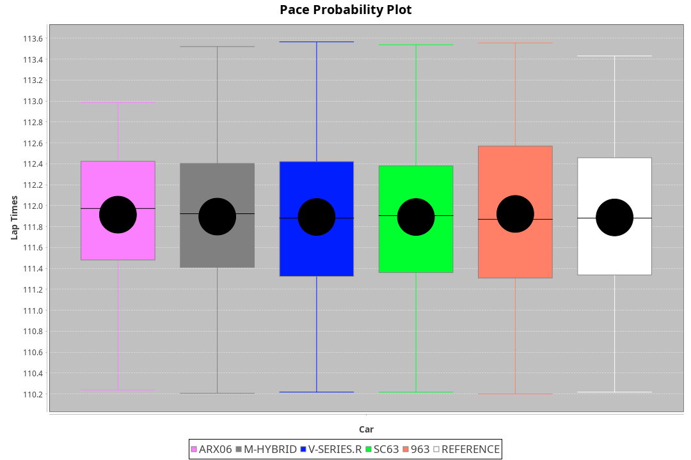
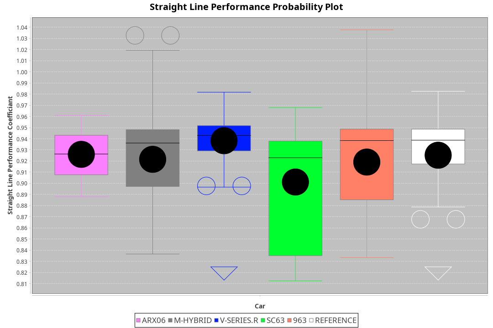
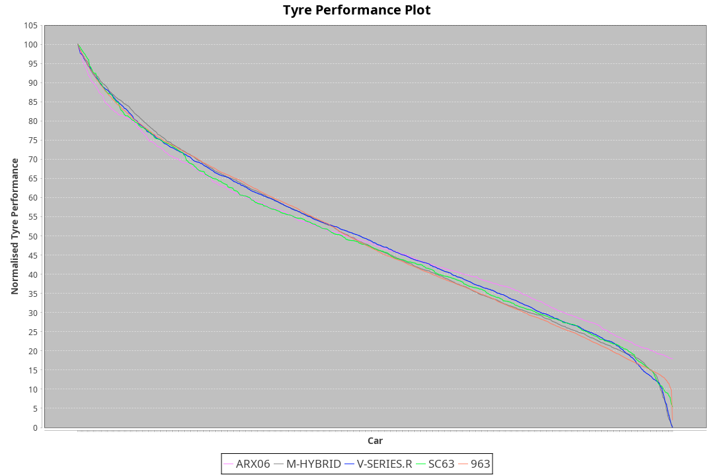

| Manufacturer | Car        | Weight | Power   | PINC    | E/Stint | FDS     |
|:-|:-|:-|:-|:-|:-|:-|
| Acura        | ARX06      | 1041kg | 480.0kw | 6.20%   | 893MJ   |    -    |
| BMW          | M-Hybrid   | 1030kg | 518.0kw | -7.30%  | 893MJ   |    -    |
| Cadillac     | V-Series.R | 1033kg | 480.0kw | 7.30%   | 894MJ   |    -    |
| Lamborghini  | SC63       | 1059kg | 520.0kw |    -    | 916MJ   |    -    |
| Porsche      | 963        | 1030kg | 497.0kw | -1.20%  | 890MJ   |    -    |

### BoP Accuracy: 94.41%; Overall BoP Grade: A2
| Manufacturer | Car        | Type | RP      | QP      | Weight | Power¹  | Threshhold | PINC    | Power²   | E/Stint | AVG Vmax  | FDS     | RDLC | L/Stint | BOP-Grade | Model Accuracy | Model Points | Match%  | SimDiff |
|:-|:-|:-|:-|:-|:-|:-|:-|:-|:-|:-|:-|:-|:-|:-|:-|:-|:-|:-|:-|
| Acura        | ARX06      | LMDH | 1:52.46 | 1:47.52 | 1041kg | 480.0kw | 250.0kph   | 6.20%   | 509.80kw |  893MJ  | 280.19kph |    -    | 1.03 | 29      | +B2       | 100.00%        | 996          | 81.22%  | #       |
| BMW          | M-Hybrid   | LMDH | 1:52.47 | 1:47.60 | 1030kg | 518.0kw | 250.0kph   | -7.30%  | 480.20kw |  893MJ  | 287.96kph |    -    | 1.03 | 29      | ~A1       | 98.62%         | 2363         | 100.00% | -0.38   |
| Cadillac     | V-Series.R | LMDH | 1:52.46 | 1:47.97 | 1033kg | 480.0kw | 250.0kph   | 7.30%   | 515.00kw |  894MJ  | 286.60kph |    -    | 1.03 | 29      | +A2       | 98.50%         | 4201         | 91.24%  | +1.35   |
| Lamborghini  | SC63       | LMDH | 1:52.46 | 1:48.64 | 1059kg | 520.0kw | 250.0kph   |    -    | 520.00kw |  916MJ  | 286.83kph |    -    | 1.02 | 29      | ~A1       | 100.00%        | 784          | 99.60%  | #       |
| Porsche      | 963        | LMDH | 1:52.47 | 1:47.57 | 1030kg | 497.0kw | 250.0kph   | -1.20%  | 491.00kw |  890MJ  | 287.46kph |    -    | 1.03 | 29      | ~A1       | 99.87%         | 12613        | 100.00% | +0.81   |

## Power below Threshhold
| N/Nmax    | ARX06   | M-HYBRID | V-SERIES.R | SC63    | 963     |
|:-|:-|:-|:-|:-|:-|
|  0.550    |  236    |  255     |  236       |  256    |  245    |
|  0.575    |  258    |  278     |  258       |  279    |  267    |
|  0.600    |  277    |  299     |  277       |  300    |  287    |
|  0.625    |  297    |  321     |  297       |  322    |  307    |
|  0.650    |  317    |  342     |  317       |  343    |  328    |
|  0.675    |  337    |  364     |  337       |  365    |  349    |
|  0.700    |  358    |  386     |  358       |  387    |  370    |
|  0.725    |  378    |  407     |  378       |  409    |  391    |
|  0.750    |  397    |  428     |  397       |  430    |  411    |
|  0.775    |  415    |  447     |  415       |  449    |  429    |
|  0.800    |  431    |  465     |  431       |  467    |  446    |
|  0.825    |  445    |  480     |  445       |  482    |  461    |
|  0.850    |  456    |  492     |  456       |  494    |  472    |
|  0.875    |  466    |  503     |  466       |  505    |  482    |
|  0.900    |  472    |  510     |  472       |  512    |  489    |
|  0.925    |  477    |  515     |  477       |  517    |  494    |
| **0.950** | **480** | **518**  | **480**    | **520** | **497** |
|  0.975    |  478    |  516     |  478       |  518    |  495    |
|  1.000    |  475    |  512     |  475       |  514    |  492    |
|  1.025    |  410    |  442     |  410       |  444    |  424    |

## Power above Threshhold
| N/Nmax    | ARX06      | M-HYBRID   | V-SERIES.R | SC63    | 963        |
|:-|:-|:-|:-|:-|:-|
|  0.550    |  251.37    |  236.09    |  254.02    |  256    |  242.02    |
|  0.575    |  274.41    |  258.10    |  277.02    |  279    |  264.02    |
|  0.600    |  294.44    |  277.11    |  297.02    |  300    |  284.02    |
|  0.625    |  315.47    |  297.12    |  319.02    |  322    |  304.02    |
|  0.650    |  336.50    |  317.12    |  340.03    |  343    |  324.02    |
|  0.675    |  357.53    |  337.13    |  362.03    |  365    |  345.03    |
|  0.700    |  379.57    |  358.14    |  383.03    |  387    |  366.03    |
|  0.725    |  400.60    |  378.15    |  405.03    |  409    |  386.03    |
|  0.750    |  421.63    |  397.15    |  426.03    |  430    |  406.03    |
|  0.775    |  440.66    |  415.16    |  445.03    |  449    |  424.03    |
|  0.800    |  457.68    |  431.17    |  463.04    |  467    |  441.03    |
|  0.825    |  472.70    |  445.17    |  478.04    |  482    |  455.03    |
|  0.850    |  484.72    |  456.18    |  489.04    |  494    |  466.03    |
|  0.875    |  494.74    |  466.18    |  500.04    |  505    |  476.03    |
|  0.900    |  501.75    |  472.18    |  507.04    |  512    |  483.04    |
|  0.925    |  506.76    |  477.18    |  512.04    |  517    |  488.04    |
| **0.950** | **509.76** | **480.19** | **515.04** | **520** | **491.04** |
|  0.975    |  507.76    |  478.19    |  513.04    |  518    |  489.04    |
|  1.000    |  504.75    |  475.18    |  509.04    |  514    |  486.04    |
|  1.025    |  435.65    |  410.16    |  440.03    |  444    |  419.03    |
