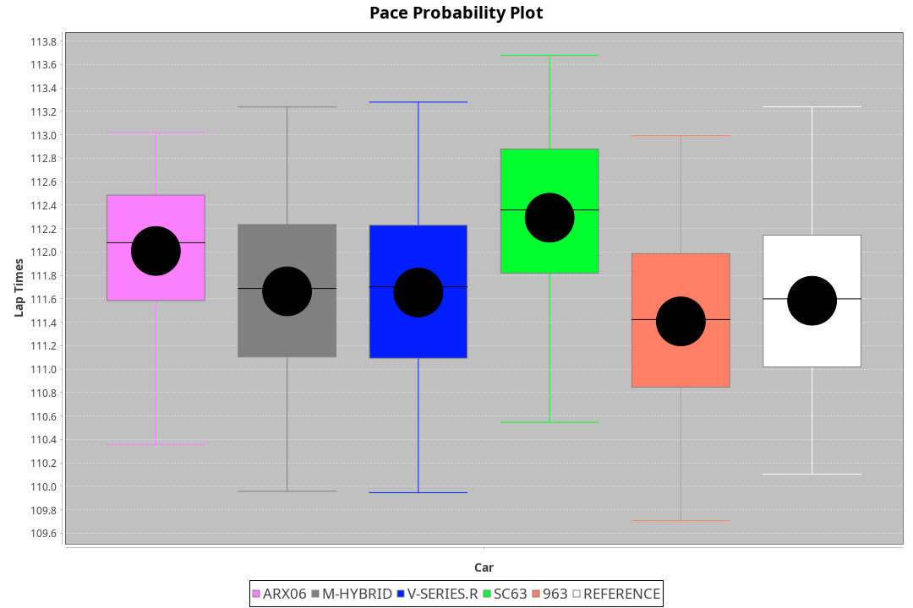
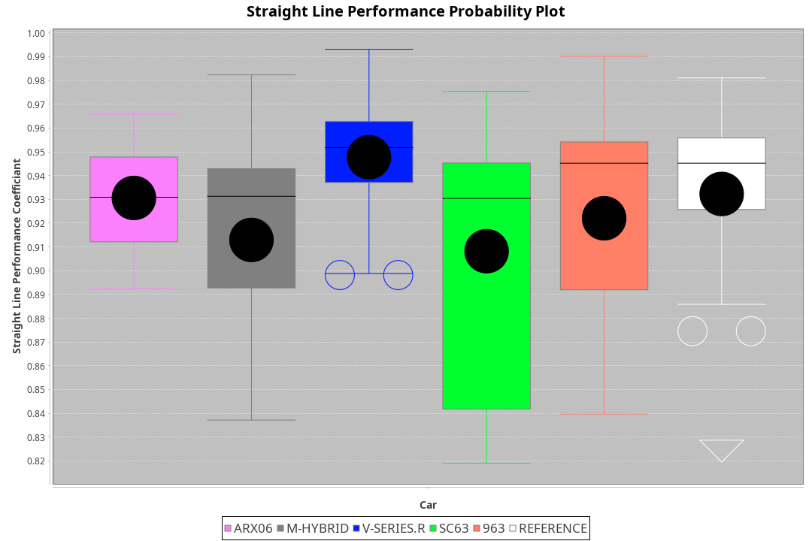
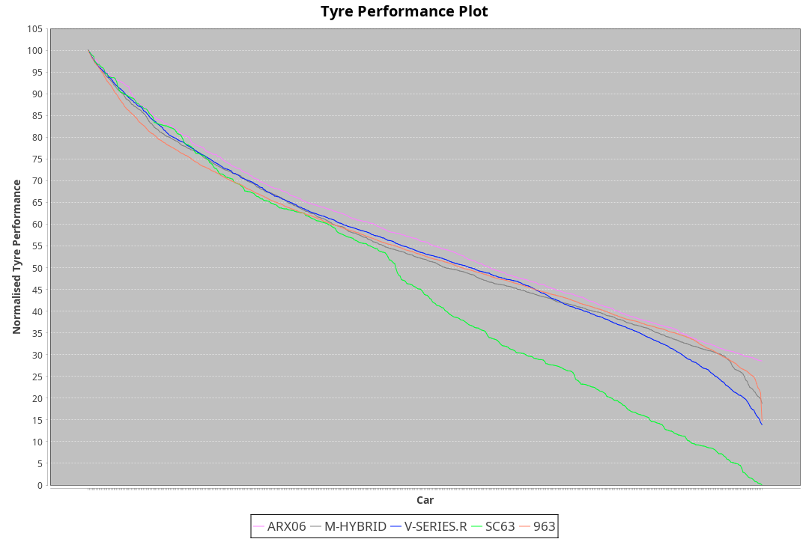

|Manufacturer|Car|Type|RP|QP|Weight|Power¹|Threshhold|PINC|Power²|E/Stint|AVG Vmax|FDS|RDLC|L/Stint|BOP-Grade|ModelAccuracy|ModelPoints|Match%|
|:-|:-|:-|:-|:-|:-|:-|:-|:-|:-|:-|:-|:-|:-|:-|:-|:-|:-|:-|
|Acura|ARX06|LMDH|1:51.94|1:48.40|1055kg|512kw|210.0kph|0%|512kw|906MJ|275.38kph-290.50kph|-|1.01|29|-D1|100.00%|995|66.22%|
|BMW|M Hybrid V8 LMDh|LMDH|1:52.86|1:48.82|1060kg|506kw|210.0kph|0%|506kw|892MJ|271.37kph-291.90kph|-|1.01|29|+B2|98.60%|1690|80.46%|
|Cadillac|V-Series.R|LMDH|1:52.05|1:48.37|1032kg|499kw|210.0kph|0%|499kw|873MJ|271.37kph-292.62kph|-|1.03|29|-B1|98.38%|1765|86.73%|
|Lamborghini|SC63|LMDH|1:52.79|1:48.66|1041kg|502kw|210.0kph|0%|502kw|883MJ|273.28kph-289.14kph|-|1.05|29|+C2|96.77%|419|73.92%|
|Porsche|963|LMDH|1:52.37|1:48.68|1048kg|505kw|210.0kph|0%|505kw|889MJ|272.63kph-293.07kph|-|1.02|29|~A1|96.81%|5438|100.00%|

### BoP Accuracy: 81.47%; Overall BoP Grade: B2

## Power below Threshhold
|N/Nmax|CAD|POR|BMW|ACU|LBG|
|:-|:-|:-|:-|:-|:-|
|0.550|246|249|249|252|247|
|0.575|268|272|272|275|270|
|0.600|288|292|292|296|290|
|0.625|308|312|313|317|310|
|0.650|329|333|334|338|331|
|0.675|350|355|355|359|352|
|0.700|371|376|377|381|374|
|0.725|392|397|398|403|395|
|0.750|412|417|418|423|415|
|0.775|431|436|437|442|434|
|0.800|448|454|454|460|451|
|0.825|463|469|469|475|466|
|0.850|474|480|481|486|477|
|0.875|484|490|491|497|487|
|0.900|491|497|498|504|494|
|0.925|496|502|503|509|499|
|**0.950**|**499**|**505**|**506**|**512**|**502**|
|0.975|497|503|504|510|500|
|1.000|494|500|501|506|497|
|1.025|426|431|432|437|429|

## Power above Threshhold
|N/Nmax|CAD|POR|BMW|ACU|LBG|
|:-|:-|:-|:-|:-|:-|
|0.550|246|249|249|252|247|
|0.575|268|272|272|275|270|
|0.600|288|292|292|296|290|
|0.625|308|312|313|317|310|
|0.650|329|333|334|338|331|
|0.675|350|355|355|359|352|
|0.700|371|376|377|381|374|
|0.725|392|397|398|403|395|
|0.750|412|417|418|423|415|
|0.775|431|436|437|442|434|
|0.800|448|454|454|460|451|
|0.825|463|469|469|475|466|
|0.850|474|480|481|486|477|
|0.875|484|490|491|497|487|
|0.900|491|497|498|504|494|
|0.925|496|502|503|509|499|
|**0.950**|**499**|**505**|**506**|**512**|**502**|
|0.975|497|503|504|510|500|
|1.000|494|500|501|506|497|
|1.025|426|431|432|437|429|
