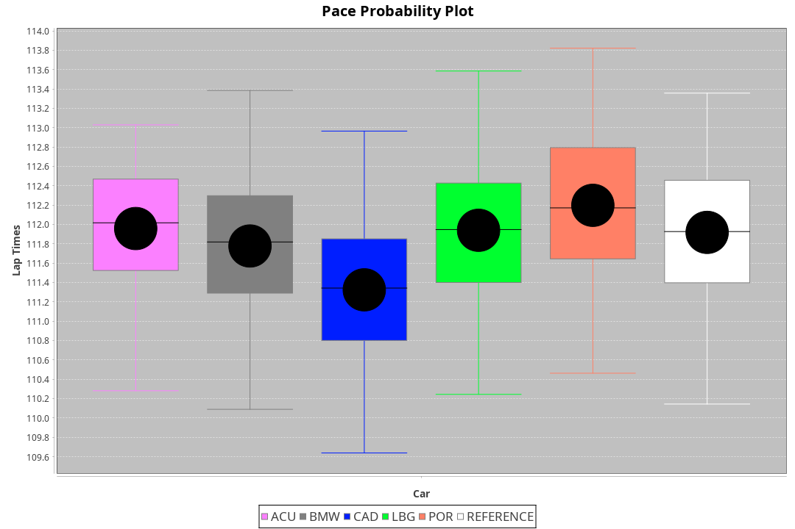
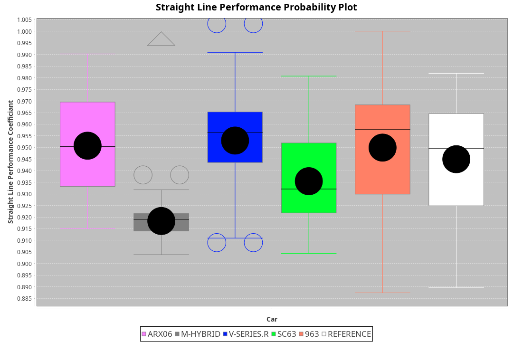
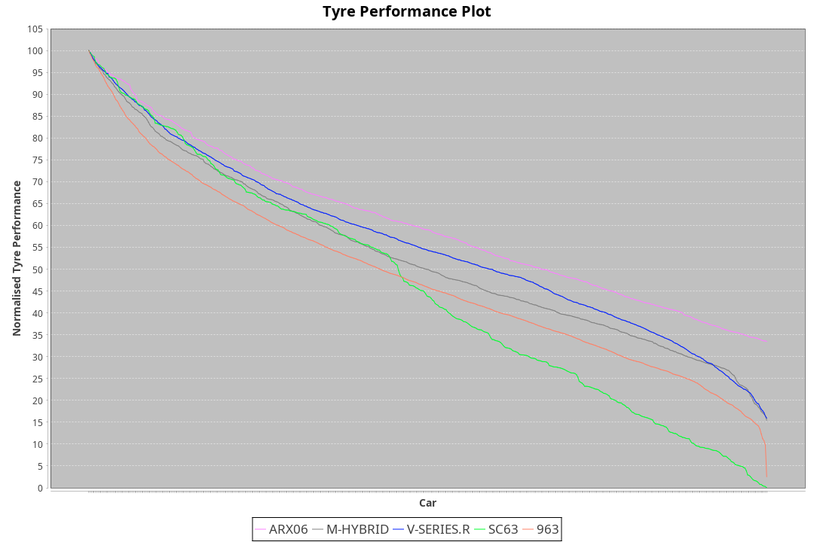

| Manufacturer | Car        | Weight | Power   | PINC    | E/Stint | FDS     |
|:-|:-|:-|:-|:-|:-|:-|
| Acura        | ARX06      | 1055kg | 512.0kw |    -    | 910MJ   |    -    |
| BMW          | M-Hybrid   | 1030kg | 506.0kw |    -    | 898MJ   |    -    |
| Cadillac     | V-Series.R | 1060kg | 520.0kw |    -    | 918MJ   |    -    |
| Lamborghini  | SC63       | 1044kg | 513.0kw |    -    | 908MJ   |    -    |
| Porsche      | 963        | 1049kg | 508.0kw |    -    | 904MJ   |    -    |

### BoP Accuracy: 87.62%; Overall BoP Grade: B1
| Manufacturer | Car        | Type | RP      | QP      | Weight | Power¹  | Threshhold | PINC    | Power²   | E/Stint | AVG Vmax  | FDS     | RDLC | L/Stint | BOP-Grade | Model Accuracy | Model Points | Match% | SimDiff |
|:-|:-|:-|:-|:-|:-|:-|:-|:-|:-|:-|:-|:-|:-|:-|:-|:-|:-|:-|:-|
| Acura        | ARX06      | LMDH | 1:51.73 | 1:46.85 | 1055kg | 512.0kw | 0.0kph     |    -    | 512.00kw |  910MJ  | 280.84kph |    -    | 1.02 | 29      | -B1       | 100.00%        | 996          | 86.05% | #       |
| BMW          | M-Hybrid   | LMDH | 1:51.61 | 1:46.81 | 1030kg | 506.0kw | 0.0kph     |    -    | 506.00kw |  898MJ  | 282.04kph |    -    | 1.04 | 29      | -A2       | 100.00%        | 3339         | 91.95% | -0.71   |
| Cadillac     | V-Series.R | LMDH | 1:51.67 | 1:46.76 | 1060kg | 520.0kw | 0.0kph     |    -    | 520.00kw |  918MJ  | 282.47kph |    -    | 1.01 | 29      | ~A1       | 99.00%         | 6039         | 95.53% | +1.31   |
| Lamborghini  | SC63       | LMDH | 1:52.52 | 1:48.85 | 1044kg | 513.0kw | 0.0kph     |    -    | 513.00kw |  908MJ  | 276.55kph |    -    | 1.06 | 29      | +D1       | 100.00%        | 784          | 68.99% | #       |
| Porsche      | 963        | LMDH | 1:51.76 | 1:46.77 | 1049kg | 508.0kw | 0.0kph     |    -    | 508.00kw |  904MJ  | 278.97kph |    -    | 1.03 | 29      | ~A1       | 100.00%        | 14574        | 95.58% | +1.02   |

## Power below Threshhold
| N/Nmax    | ARX06   | M-HYBRID | V-SERIES.R | SC63    | 963     |
|:-|:-|:-|:-|:-|:-|
|  0.550    |  252    |  249     |  256       |  253    |  250    |
|  0.575    |  275    |  272     |  279       |  276    |  273    |
|  0.600    |  296    |  292     |  300       |  296    |  293    |
|  0.625    |  317    |  313     |  322       |  317    |  314    |
|  0.650    |  338    |  334     |  343       |  338    |  335    |
|  0.675    |  359    |  355     |  365       |  360    |  357    |
|  0.700    |  381    |  377     |  387       |  382    |  378    |
|  0.725    |  403    |  398     |  409       |  403    |  399    |
|  0.750    |  423    |  418     |  430       |  424    |  420    |
|  0.775    |  442    |  437     |  449       |  443    |  439    |
|  0.800    |  460    |  454     |  467       |  461    |  456    |
|  0.825    |  475    |  469     |  482       |  476    |  471    |
|  0.850    |  486    |  481     |  494       |  487    |  483    |
|  0.875    |  497    |  491     |  505       |  498    |  493    |
|  0.900    |  504    |  498     |  512       |  505    |  500    |
|  0.925    |  509    |  503     |  517       |  510    |  505    |
| **0.950** | **512** | **506**  | **520**    | **513** | **508** |
|  0.975    |  510    |  504     |  518       |  511    |  506    |
|  1.000    |  506    |  501     |  514       |  507    |  503    |
|  1.025    |  437    |  432     |  444       |  438    |  434    |

## Power above Threshhold
| N/Nmax    | ARX06   | M-HYBRID | V-SERIES.R | SC63    | 963     |
|:-|:-|:-|:-|:-|:-|
|  0.550    |  252    |  249     |  256       |  253    |  250    |
|  0.575    |  275    |  272     |  279       |  276    |  273    |
|  0.600    |  296    |  292     |  300       |  296    |  293    |
|  0.625    |  317    |  313     |  322       |  317    |  314    |
|  0.650    |  338    |  334     |  343       |  338    |  335    |
|  0.675    |  359    |  355     |  365       |  360    |  357    |
|  0.700    |  381    |  377     |  387       |  382    |  378    |
|  0.725    |  403    |  398     |  409       |  403    |  399    |
|  0.750    |  423    |  418     |  430       |  424    |  420    |
|  0.775    |  442    |  437     |  449       |  443    |  439    |
|  0.800    |  460    |  454     |  467       |  461    |  456    |
|  0.825    |  475    |  469     |  482       |  476    |  471    |
|  0.850    |  486    |  481     |  494       |  487    |  483    |
|  0.875    |  497    |  491     |  505       |  498    |  493    |
|  0.900    |  504    |  498     |  512       |  505    |  500    |
|  0.925    |  509    |  503     |  517       |  510    |  505    |
| **0.950** | **512** | **506**  | **520**    | **513** | **508** |
|  0.975    |  510    |  504     |  518       |  511    |  506    |
|  1.000    |  506    |  501     |  514       |  507    |  503    |
|  1.025    |  437    |  432     |  444       |  438    |  434    |
