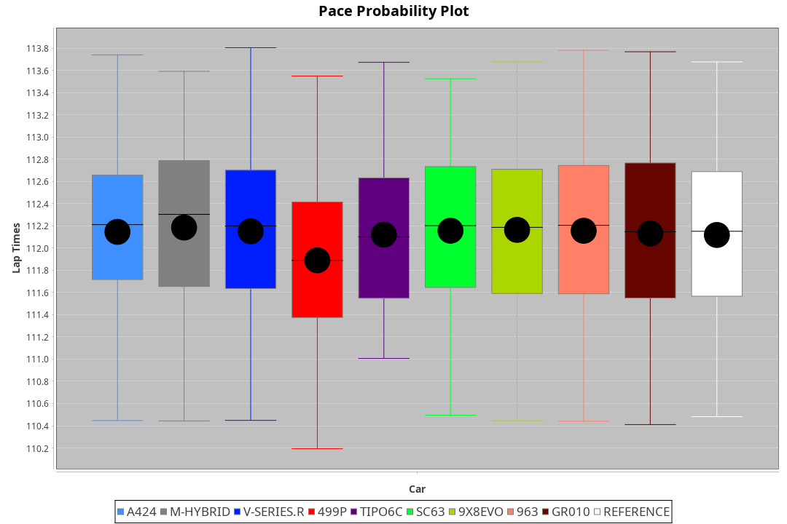
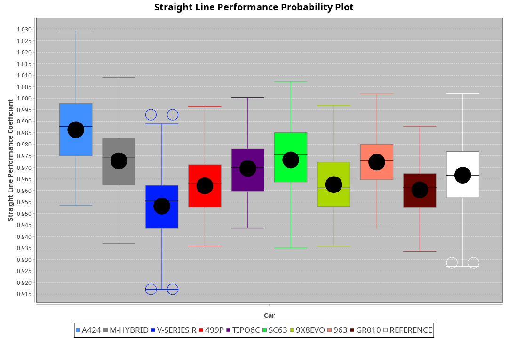
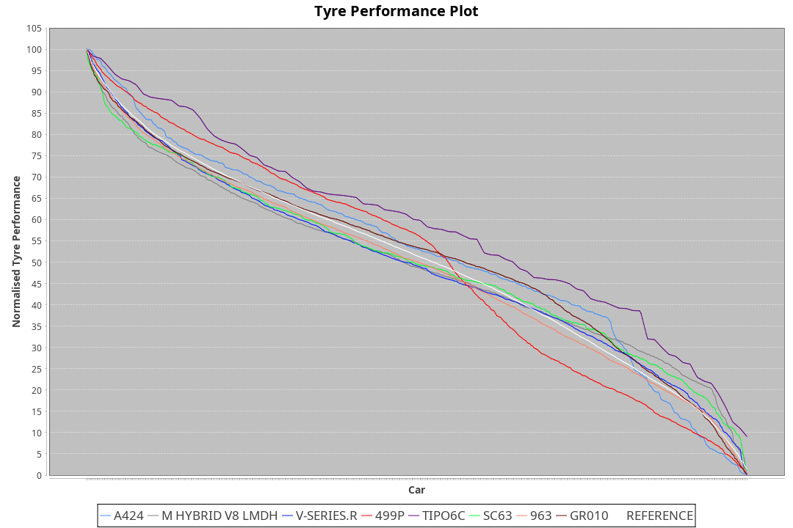

|Manufacturer|Car|Type|RP|QP|Weight|Power¹|Threshhold|PINC|Power²|E/Stint|AVG Vmax|FDS|RDLC|L/Stint|BOP-Grade|ModelAccuracy|ModelPoints|Match%|
|:-|:-|:-|:-|:-|:-|:-|:-|:-|:-|:-|:-|:-|:-|:-|:-|:-|:-|:-|
|Alpine|A424|LMDH|1:52.21|1:46.59|1033kg|513kw|210.0kph|0%|513kw|903MJ|281.60kph|-|1.02|34|~A1|81.46%|523|100.00%|
|BMW|M Hybrid V8 LMDh|LMDH|1:52.22|1:46.57|1042kg|515kw|210.0kph|0%|515kw|898MJ|277.19kph|-|1.03|34|~A1|98.60%|1690|100.00%|
|Cadillac|V-Series.R|LMDH|1:52.21|1:46.85|1032kg|510kw|210.0kph|0%|510kw|883MJ|281.11kph|-|1.03|34|~A1|98.38%|1765|97.33%|
|Ferrari|499P|LMHHU|1:52.21|1:46.83|1056kg|505kw|210.0kph|0%|505kw|887MJ|281.82kph|190kph|1.03|35|~A1|92.24%|2247|100.00%|
|Issotta Fraschini|Tipo6C|LMHHU|1:52.24|1:47.44|1030kg|520kw|210.0kph|0%|520kw|917MJ|282.02kph|140kph|1.08|34|+A2|66.67%|96|92.43%|
|Lamborghini|SC63|LMDH|1:52.21|1:46.47|1057kg|520kw|210.0kph|0%|520kw|901MJ|278.51kph|-|1.03|34|~A1|96.77%|419|95.82%|
|Porsche|963|LMDH|1:52.22|1:46.89|1037kg|513kw|210.0kph|0%|513kw|895MJ|281.44kph|-|1.03|34|~A1|96.81%|5438|100.00%|
|Toyota|GR010 - Hybrid|LMHHU|1:52.22|1:46.65|1060kg|509kw|210.0kph|0%|509kw|901MJ|279.94kph|190kph|1.03|35|~A1|86.04%|1751|100.00%|

### BoP Accuracy: 98.20%; Overall BoP Grade: A1

## Power below Threshhold
|N/Nmax|TOY|FER|CAD|POR|IF|BMW|ALP|LBG|
|:-|:-|:-|:-|:-|:-|:-|:-|:-|
|0.550|251|249|251|253|256|254|253|256|
|0.575|274|272|274|276|279|277|276|279|
|0.600|294|292|295|296|300|297|296|300|
|0.625|315|312|316|317|322|319|317|322|
|0.650|336|333|337|338|343|340|338|343|
|0.675|357|355|358|360|365|362|360|365|
|0.700|379|376|380|382|387|383|382|387|
|0.725|400|397|401|403|409|405|403|409|
|0.750|421|417|422|424|430|426|424|430|
|0.775|440|436|441|443|449|445|443|449|
|0.800|457|454|458|461|467|463|461|467|
|0.825|472|469|473|476|482|478|476|482|
|0.850|484|480|485|487|494|489|487|494|
|0.875|494|490|495|498|505|500|498|505|
|0.900|501|497|502|505|512|507|505|512|
|0.925|506|502|507|510|517|512|510|517|
|**0.950**|**509**|**505**|**510**|**513**|**520**|**515**|**513**|**520**|
|0.975|507|503|508|511|518|513|511|518|
|1.000|504|500|505|507|514|509|507|514|
|1.025|435|431|436|438|444|440|438|444|

## Power above Threshhold
|N/Nmax|TOY|FER|CAD|POR|IF|BMW|ALP|LBG|
|:-|:-|:-|:-|:-|:-|:-|:-|:-|
|0.550|251|249|251|253|256|254|253|256|
|0.575|274|272|274|276|279|277|276|279|
|0.600|294|292|295|296|300|297|296|300|
|0.625|315|312|316|317|322|319|317|322|
|0.650|336|333|337|338|343|340|338|343|
|0.675|357|355|358|360|365|362|360|365|
|0.700|379|376|380|382|387|383|382|387|
|0.725|400|397|401|403|409|405|403|409|
|0.750|421|417|422|424|430|426|424|430|
|0.775|440|436|441|443|449|445|443|449|
|0.800|457|454|458|461|467|463|461|467|
|0.825|472|469|473|476|482|478|476|482|
|0.850|484|480|485|487|494|489|487|494|
|0.875|494|490|495|498|505|500|498|505|
|0.900|501|497|502|505|512|507|505|512|
|0.925|506|502|507|510|517|512|510|517|
|**0.950**|**509**|**505**|**510**|**513**|**520**|**515**|**513**|**520**|
|0.975|507|503|508|511|518|513|511|518|
|1.000|504|500|505|507|514|509|507|514|
|1.025|435|431|436|438|444|440|438|444|
