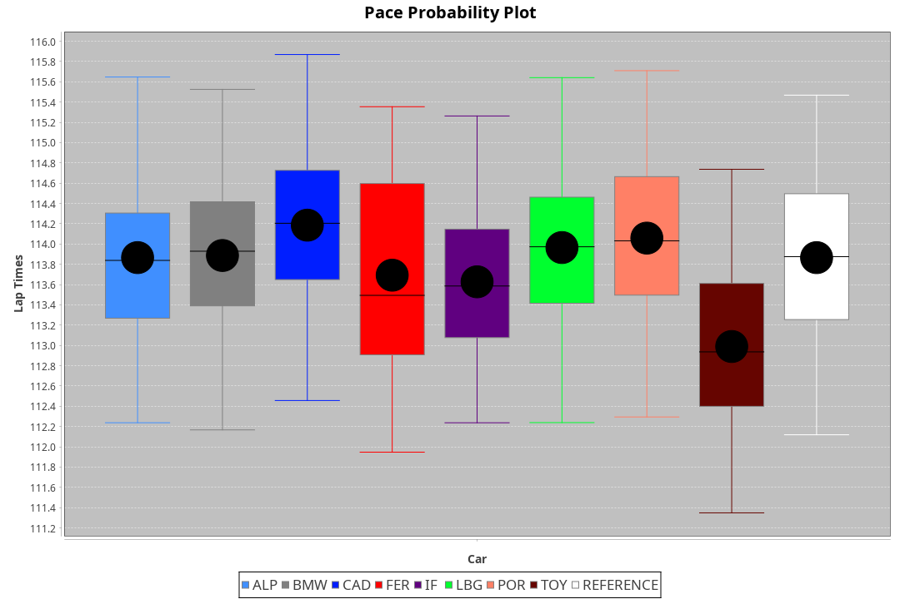
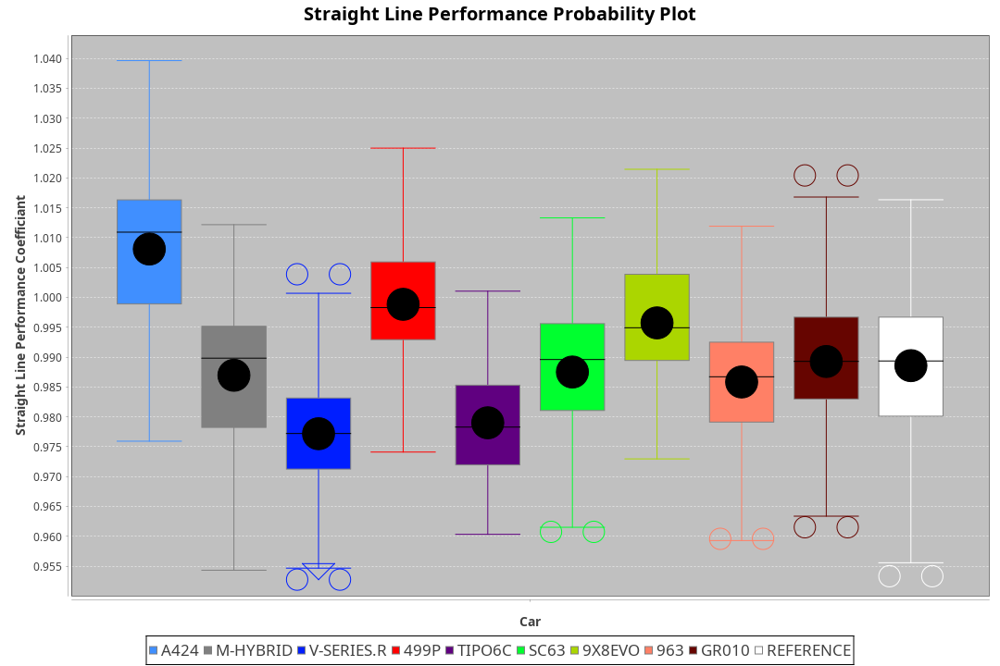
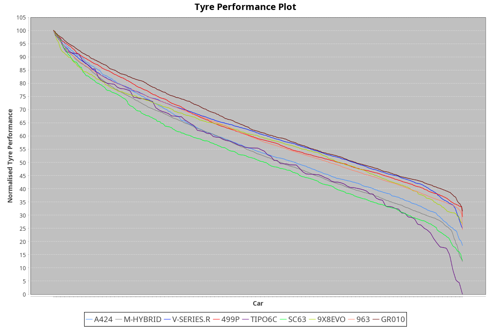

|Manufacturer|Car|Type|RP|QP|Weight|Power¹|Threshhold|PINC|Power²|E/Stint|AVG Vmax|FDS|RDLC|L/Stint|BOP-Grade|ModelAccuracy|ModelPoints|Match%|
|:-|:-|:-|:-|:-|:-|:-|:-|:-|:-|:-|:-|:-|:-|:-|:-|:-|:-|:-|
|Alpine|A424|LMDH|1:53.94|1:48.18|1071kg|507kw|210.0kph|-1%|502kw|900MJ|277.84kph|-|0.99|35|~A1|81.46%|523|99.52%|
|BMW|M Hybrid V8 LMDh|LMDH|1:53.86|1:48.07|1070kg|504kw|210.0kph|1%|509kw|893MJ|274.42kph|-|1.00|35|~A1|98.60%|1690|100.00%|
|Cadillac|V-Series.R|LMDH|1:54.16|1:48.64|1032kg|496kw|210.0kph|-1%|491kw|869MJ|278.74kph|-|1.03|35|+B2|98.38%|1765|80.68%|
|Ferrari|499P|LMHHU|1:53.65|1:48.15|1085kg|500kw|210.0kph|-1%|495kw|883MJ|278.80kph|190kph|1.01|35|~A1|92.24%|2247|96.99%|
|Issotta Fraschini|Tipo6C|LMHHU|1:53.95|1:49.03|1078kg|519kw|210.0kph|0%|519kw|921MJ|278.69kph|190kph|1.03|34|+A2|66.67%|96|92.52%|
|Lamborghini|SC63|LMDH|1:53.95|1:48.06|1041kg|503kw|210.0kph|0%|503kw|884MJ|277.26kph|-|1.05|35|+B1|96.77%|419|89.41%|
|Porsche|963|LMDH|1:54.00|1:48.53|1048kg|502kw|210.0kph|-1%|497kw|885MJ|278.77kph|-|1.02|35|~A1|96.81%|5438|100.00%|
|Toyota|GR010 - Hybrid|LMHHU|1:53.04|1:47.41|1099kg|507kw|210.0kph|1%|512kw|905MJ|277.70kph|190kph|1.00|35|-D1|86.04%|1751|68.52%|

### BoP Accuracy: 90.95%; Overall BoP Grade: A2

## Power below Threshhold
|N/Nmax|ALP|BMW|CAD|FER|IF|LBG|POR|TOY|
|:-|:-|:-|:-|:-|:-|:-|:-|:-|
|0.550|250|248|244|246|256|248|247|250|
|0.575|273|271|267|269|279|271|270|273|
|0.600|293|291|287|289|299|291|290|293|
|0.625|314|312|307|309|321|311|310|314|
|0.650|335|333|327|330|342|332|331|335|
|0.675|356|354|348|351|364|353|352|356|
|0.700|377|375|369|372|386|374|374|377|
|0.725|399|396|390|393|408|395|395|399|
|0.750|419|416|410|413|429|416|415|419|
|0.775|438|435|429|432|448|435|434|438|
|0.800|455|453|445|449|466|452|451|455|
|0.825|470|468|460|464|481|467|466|470|
|0.850|482|479|471|475|493|478|477|482|
|0.875|492|489|481|485|504|488|487|492|
|0.900|499|496|488|492|511|495|494|499|
|0.925|504|501|493|497|516|500|499|504|
|**0.950**|**507**|**504**|**496**|**500**|**519**|**503**|**502**|**507**|
|0.975|505|502|494|498|517|501|500|505|
|1.000|502|499|491|495|513|498|497|502|
|1.025|433|430|424|427|443|430|429|433|

## Power above Threshhold
|N/Nmax|ALP|BMW|CAD|FER|IF|LBG|POR|TOY|
|:-|:-|:-|:-|:-|:-|:-|:-|:-|
|0.550|247|251|242|244|256|248|245|252|
|0.575|270|274|264|266|279|271|267|275|
|0.600|290|294|284|286|299|291|287|296|
|0.625|310|315|304|306|321|311|307|317|
|0.650|331|336|324|327|342|332|328|338|
|0.675|352|357|345|348|364|353|349|359|
|0.700|374|379|366|369|386|374|370|381|
|0.725|395|400|386|389|408|395|391|403|
|0.750|415|421|406|409|429|416|411|423|
|0.775|434|440|424|428|448|435|429|442|
|0.800|451|457|441|445|466|452|446|460|
|0.825|466|472|455|459|481|467|461|475|
|0.850|477|484|466|470|493|478|472|486|
|0.875|487|494|476|480|504|488|482|497|
|0.900|494|501|483|487|511|495|489|504|
|0.925|499|506|488|492|516|500|494|509|
|**0.950**|**502**|**509**|**491**|**495**|**519**|**503**|**497**|**512**|
|0.975|500|507|489|493|517|501|495|510|
|1.000|497|504|486|490|513|498|492|506|
|1.025|429|435|419|423|443|430|424|437|
