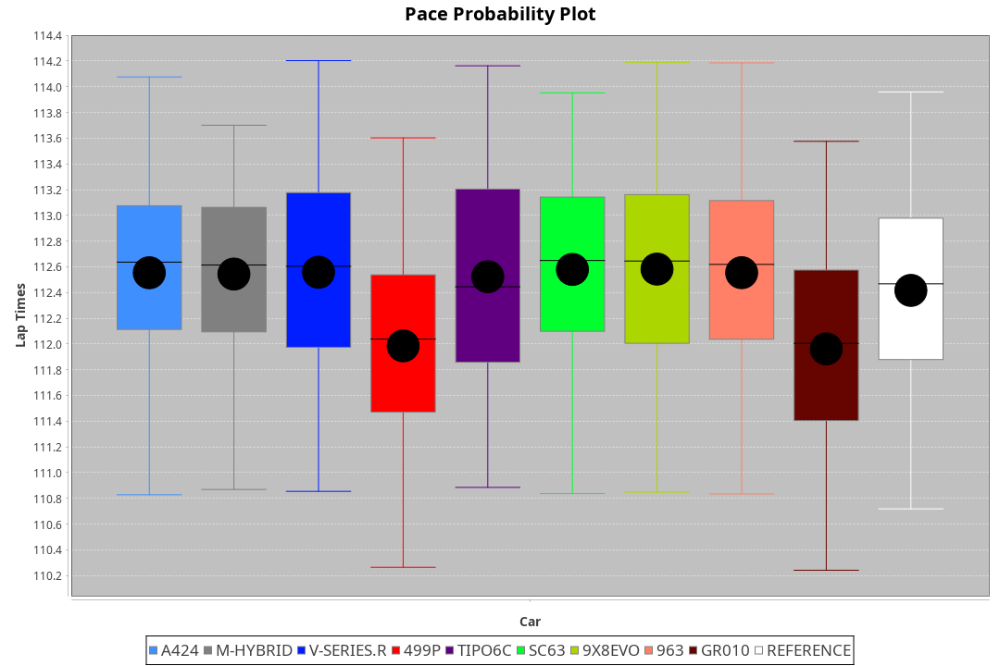
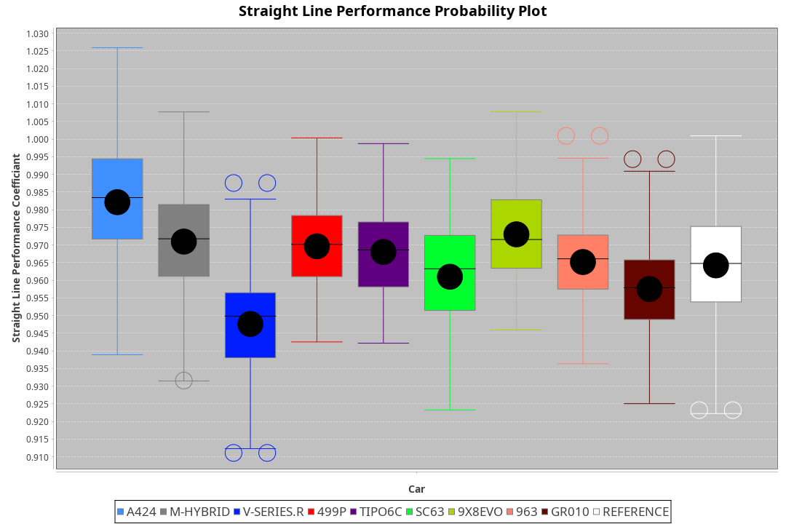
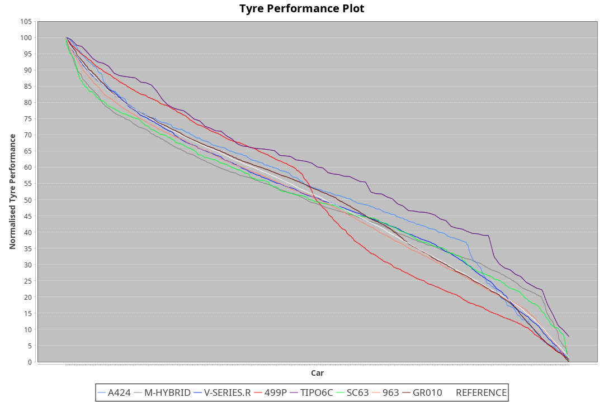

|Manufacturer|Car|Weight|Power|PINC|E/Stint|FDS|
|:-|:-|:-|:-|:-|:-|:-|
|Alpine|A424|1031kg|520kw|-3%|907MJ|-|
|BMW|M Hybrid V8 LMDh|1043kg|510kw|2%|907MJ|-|
|Cadillac|V-Series.R|1034kg|520kw|-4%|898MJ|-|
|Ferrari|499P|1058kg|519kw|-5%|897MJ|190kph|
|Issotta Fraschini|Tipo6C|1030kg|520kw|-|916MJ|150kph|
|Lamborghini|SC63|1057kg|520kw|-|913MJ|-|
|Porsche|963|1034kg|518kw|-2%|898MJ|-|
|Toyota|GR010|1057kg|518kw|-4%|898MJ|190kph|

### BoP Accuracy: 97.49%; Overall BoP Grade: A1
|Manufacturer|Car|Type|RP|QP|Weight|Power¹|Threshhold|PINC|Power²|E/Stint|AVG Vmax|FDS|RDLC|L/Stint|BOP-Grade|ModelAccuracy|ModelPoints|Match%|
|:-|:-|:-|:-|:-|:-|:-|:-|:-|:-|:-|:-|:-|:-|:-|:-|:-|:-|:-|
|Alpine|A424|LMDH|1:52.26|1:48.54|1031kg|520kw|210.0kph|-3%|504kw|907MJ|279.93kph|-|1.03|35|~A1|81.15%|521|100.00%|
|BMW|M Hybrid V8 LMDh|LMDH|1:52.25|1:47.13|1043kg|510kw|210.0kph|2%|520kw|907MJ|276.76kph|-|1.03|34|~A1|98.60%|1690|100.00%|
|Cadillac|V-Series.R|LMDH|1:52.27|1:46.87|1034kg|520kw|210.0kph|-4%|499kw|898MJ|279.75kph|-|1.03|35|~A1|91.10%|1770|97.50%|
|Ferrari|499P|LMHHU|1:52.26|1:47.01|1058kg|519kw|210.0kph|-5%|493kw|897MJ|280.30kph|190kph|1.03|35|~A1|84.26%|2292|100.00%|
|Issotta Fraschini|Tipo6C|LMHHU|1:52.30|1:49.44|1030kg|520kw|0.0kph|-|520kw|916MJ|281.55kph|150kph|1.08|34|+A2|66.67%|96|90.37%|
|Lamborghini|SC63|LMDH|1:52.26|1:49.60|1057kg|520kw|210.0kph|-|520kw|913MJ|277.63kph|-|1.03|34|+A2|96.77%|419|92.08%|
|Porsche|963|LMDH|1:52.26|1:46.81|1034kg|518kw|210.0kph|-2%|508kw|898MJ|280.72kph|-|1.03|35|~A1|93.14%|5746|100.00%|
|Toyota|GR010|LMHHU|1:52.26|1:47.02|1057kg|518kw|210.0kph|-4%|497kw|898MJ|280.79kph|190kph|1.03|35|~A1|87.37%|3154|100.00%|

## Power below Threshhold
|N/Nmax|A424|MHYBRIDV8LMDH|VSERIES.R|499P|TIPO6C|SC63|963|GR010|
|:-|:-|:-|:-|:-|:-|:-|:-|:-|
|0.550|256|251|256|256|256|256|255|255|
|0.575|279|274|279|279|279|279|278|278|
|0.600|300|295|300|299|300|300|299|299|
|0.625|322|316|322|321|322|322|321|321|
|0.650|343|337|343|342|343|343|342|342|
|0.675|365|358|365|364|365|365|364|364|
|0.700|387|380|387|386|387|387|386|386|
|0.725|409|401|409|408|409|409|407|407|
|0.750|430|422|430|429|430|430|428|428|
|0.775|449|441|449|448|449|449|447|447|
|0.800|467|458|467|466|467|467|465|465|
|0.825|482|473|482|481|482|482|480|480|
|0.850|494|485|494|493|494|494|492|492|
|0.875|505|495|505|504|505|505|503|503|
|0.900|512|502|512|511|512|512|510|510|
|0.925|517|507|517|516|517|517|515|515|
|**0.950**|**520**|**510**|**520**|**519**|**520**|**520**|**518**|**518**|
|0.975|518|508|518|517|518|518|516|516|
|1.000|514|505|514|513|514|514|512|512|
|1.025|444|436|444|443|444|444|442|442|

## Power above Threshhold
|N/Nmax|A424|MHYBRIDV8LMDH|VSERIES.R|499P|TIPO6C|SC63|963|GR010|
|:-|:-|:-|:-|:-|:-|:-|:-|:-|
|0.550|248|256|246|243|256|256|250|245|
|0.575|271|279|268|265|279|279|273|267|
|0.600|291|300|288|285|300|300|293|287|
|0.625|312|322|308|305|322|322|314|307|
|0.650|333|343|329|325|343|343|335|328|
|0.675|354|365|350|346|365|365|357|349|
|0.700|375|387|371|367|387|387|378|370|
|0.725|396|409|392|388|409|409|399|391|
|0.750|416|430|412|407|430|430|420|411|
|0.775|435|449|431|426|449|449|439|429|
|0.800|453|467|448|443|467|467|456|446|
|0.825|468|482|463|457|482|482|471|461|
|0.850|479|494|474|468|494|494|483|472|
|0.875|489|505|484|478|505|505|493|482|
|0.900|496|512|491|485|512|512|500|489|
|0.925|501|517|496|490|517|517|505|494|
|**0.950**|**504**|**520**|**499**|**493**|**520**|**520**|**508**|**497**|
|0.975|502|518|497|491|518|518|506|495|
|1.000|499|514|494|488|514|514|503|492|
|1.025|430|444|426|421|444|444|434|424|
