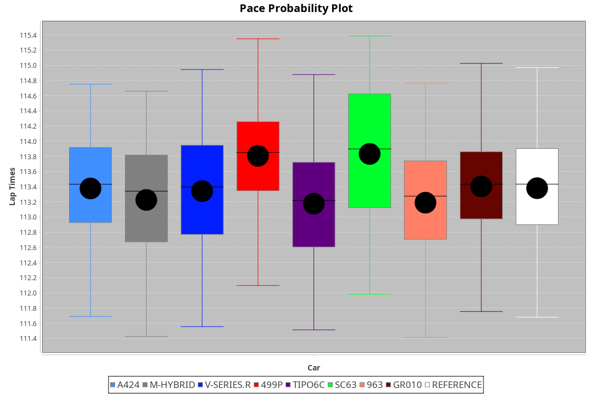
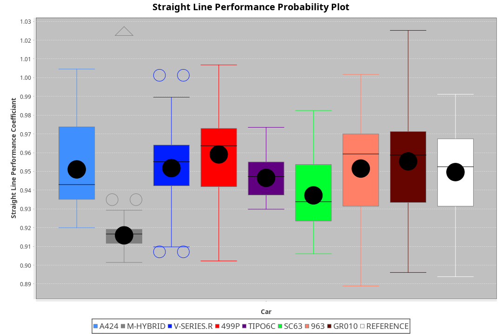
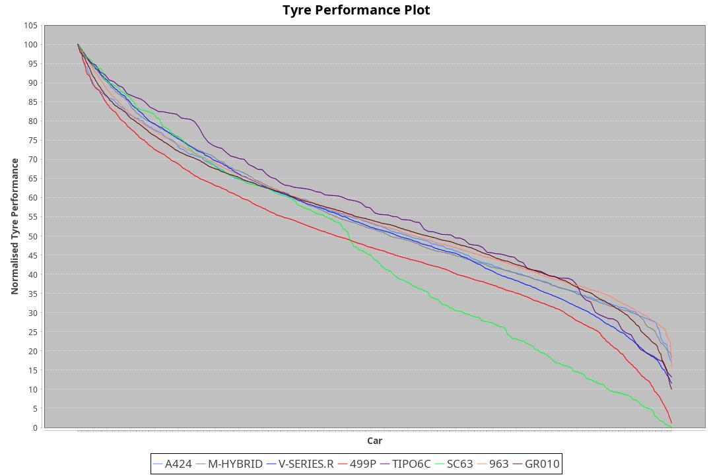

| Manufacturer     | Car        | Weight | Power   | PINC    | E/Stint | FDS     |
|:-|:-|:-|:-|:-|:-|:-|
| Alpine           | A424       | 1047kg | 520.0kw |    -    | 913MJ   |    -    |
| BMW              | M-Hybrid   | 1041kg | 512.0kw |    -    | 905MJ   |    -    |
| Cadillac         | V-Series.R | 1034kg | 510.0kw |    -    | 900MJ   |    -    |
| Ferrari          | 499P       | 1063kg | 508.0kw |    -    | 899MJ   | 190kph  |
| Isotta Fraschini | Tipo6C     | 1059kg | 520.0kw |    -    | 917MJ   | 190kph  |
| Lamborghini      | SC63       | 1042kg | 519.0kw |    -    | 908MJ   |    -    |
| Peugeot          | 9X8Evo     | 1050kg | 510.0kw |    -    | 899MJ   | 190kph  |
| Porsche          | 963        | 1047kg | 516.0kw |    -    | 910MJ   |    -    |
| Toyota           | GR010      | 1080kg | 512.0kw |    -    | 910MJ   | 190kph  |

### BoP Accuracy: 72.83%; Overall BoP Grade: C2
| Manufacturer     | Car        | Type  | RP      | QP      | Weight | Power¹  | Threshhold | PINC    | Power²   | E/Stint | AVG Vmax  | FDS     | RDLC | L/Stint | BOP-Grade | Model Accuracy | Model Points | Match%  | SimDiff |
|:-|:-|:-|:-|:-|:-|:-|:-|:-|:-|:-|:-|:-|:-|:-|:-|:-|:-|:-|:-|
| Alpine           | A424       | LMDH  | 1:51.24 | 1:46.48 | 1047kg | 520.0kw | 210.0kph   |    -    | 520.00kw |  913MJ  | 292.19kph |    -    | 1.01 | 34      | +B1       | 100.00%        | 946          | 85.73%  | #       |
| BMW              | M-Hybrid   | LMDH  | 1:51.51 | 1:46.43 | 1041kg | 512.0kw | 210.0kph   |    -    | 512.00kw |  905MJ  | 289.03kph |    -    | 1.02 | 34      | +B1       | 100.00%        | 1998         | 88.27%  | #       |
| Cadillac         | V-Series.R | LMDH  | 1:51.07 | 1:46.32 | 1034kg | 510.0kw | 210.0kph   |    -    | 510.00kw |  900MJ  | 287.08kph |    -    | 1.03 | 34      | +A2       | 98.11%         | 3991         | 90.90%  | ±2.26s  |
| Ferrari          | 499P       | LMHHU | 1:49.95 | 1:45.13 | 1063kg | 508.0kw | 210.0kph   |    -    | 508.00kw |  899MJ  | 289.23kph | 190kph  | 1.03 | 34      | -E2       | 98.72%         | 4180         | 52.93%  | ±2.99s  |
| Isotta Fraschini | Tipo6C     | LMHHU | 1:51.61 | 1:48.25 | 1059kg | 520.0kw | 210.0kph   |    -    | 520.00kw |  917MJ  | 288.35kph | 190kph  | 1.04 | 34      | +Ω1       | 97.73%         | 129          | 46.43%  | #       |
| Lamborghini      | SC63       | LMDH  | 1:51.86 | 1:47.53 | 1042kg | 519.0kw | 210.0kph   |    -    | 519.00kw |  908MJ  | 288.99kph |    -    | 1.04 | 34      | +E1       | 100.00%        | 784          | 59.74%  | #       |
| Peugeot          | 9X8Evo     | LMHHU | 1:50.40 | 1:45.94 | 1050kg | 510.0kw | 210.0kph   |    -    | 510.00kw |  899MJ  | 289.55kph | 190kph  | 1.01 | 34      | -C2       | 100.00%        | 636          | 74.57%  | #       |
| Porsche          | 963        | LMDH  | 1:51.06 | 1:45.87 | 1047kg | 516.0kw | 210.0kph   |    -    | 516.00kw |  910MJ  | 290.10kph |    -    | 1.01 | 34      | ~A1       | 99.91%         | 11713        | 100.00% | ±1.73s  |
| Toyota           | GR010      | LMHHU | 1:50.04 | 1:45.04 | 1080kg | 512.0kw | 210.0kph   |    -    | 512.00kw |  910MJ  | 288.01kph | 190kph  | 1.00 | 34      | -E1       | 99.90%         | 3123         | 56.88%  | ±2.65s  |

## Power below Threshhold
| N/Nmax    | A424    | M-HYBRID | V-SERIES.R | 499P    | TIPO6C  | SC63    | 9X8EVO  | 963     | GR010   |
|:-|:-|:-|:-|:-|:-|:-|:-|:-|:-|
|  0.550    |  256    |  252     |  251       |  250    |  256    |  256    |  251    |  254    |  252    |
|  0.575    |  279    |  275     |  274       |  273    |  279    |  279    |  274    |  277    |  275    |
|  0.600    |  300    |  296     |  295       |  293    |  300    |  299    |  295    |  298    |  296    |
|  0.625    |  322    |  317     |  316       |  314    |  322    |  321    |  316    |  319    |  317    |
|  0.650    |  343    |  338     |  337       |  335    |  343    |  342    |  337    |  340    |  338    |
|  0.675    |  365    |  359     |  358       |  357    |  365    |  364    |  358    |  362    |  359    |
|  0.700    |  387    |  381     |  380       |  378    |  387    |  386    |  380    |  384    |  381    |
|  0.725    |  409    |  403     |  401       |  399    |  409    |  408    |  401    |  406    |  403    |
|  0.750    |  430    |  423     |  422       |  420    |  430    |  429    |  422    |  427    |  423    |
|  0.775    |  449    |  442     |  441       |  439    |  449    |  448    |  441    |  446    |  442    |
|  0.800    |  467    |  460     |  458       |  456    |  467    |  466    |  458    |  463    |  460    |
|  0.825    |  482    |  475     |  473       |  471    |  482    |  481    |  473    |  478    |  475    |
|  0.850    |  494    |  486     |  485       |  483    |  494    |  493    |  485    |  490    |  486    |
|  0.875    |  505    |  497     |  495       |  493    |  505    |  504    |  495    |  501    |  497    |
|  0.900    |  512    |  504     |  502       |  500    |  512    |  511    |  502    |  508    |  504    |
|  0.925    |  517    |  509     |  507       |  505    |  517    |  516    |  507    |  513    |  509    |
| **0.950** | **520** | **512**  | **510**    | **508** | **520** | **519** | **510** | **516** | **512** |
|  0.975    |  518    |  510     |  508       |  506    |  518    |  517    |  508    |  514    |  510    |
|  1.000    |  514    |  506     |  505       |  503    |  514    |  513    |  505    |  510    |  506    |
|  1.025    |  444    |  437     |  436       |  434    |  444    |  443    |  436    |  441    |  437    |

## Power above Threshhold
| N/Nmax    | A424    | M-HYBRID | V-SERIES.R | 499P    | TIPO6C  | SC63    | 9X8EVO  | 963     | GR010   |
|:-|:-|:-|:-|:-|:-|:-|:-|:-|:-|
|  0.550    |  256    |  252     |  251       |  250    |  256    |  256    |  251    |  254    |  252    |
|  0.575    |  279    |  275     |  274       |  273    |  279    |  279    |  274    |  277    |  275    |
|  0.600    |  300    |  296     |  295       |  293    |  300    |  299    |  295    |  298    |  296    |
|  0.625    |  322    |  317     |  316       |  314    |  322    |  321    |  316    |  319    |  317    |
|  0.650    |  343    |  338     |  337       |  335    |  343    |  342    |  337    |  340    |  338    |
|  0.675    |  365    |  359     |  358       |  357    |  365    |  364    |  358    |  362    |  359    |
|  0.700    |  387    |  381     |  380       |  378    |  387    |  386    |  380    |  384    |  381    |
|  0.725    |  409    |  403     |  401       |  399    |  409    |  408    |  401    |  406    |  403    |
|  0.750    |  430    |  423     |  422       |  420    |  430    |  429    |  422    |  427    |  423    |
|  0.775    |  449    |  442     |  441       |  439    |  449    |  448    |  441    |  446    |  442    |
|  0.800    |  467    |  460     |  458       |  456    |  467    |  466    |  458    |  463    |  460    |
|  0.825    |  482    |  475     |  473       |  471    |  482    |  481    |  473    |  478    |  475    |
|  0.850    |  494    |  486     |  485       |  483    |  494    |  493    |  485    |  490    |  486    |
|  0.875    |  505    |  497     |  495       |  493    |  505    |  504    |  495    |  501    |  497    |
|  0.900    |  512    |  504     |  502       |  500    |  512    |  511    |  502    |  508    |  504    |
|  0.925    |  517    |  509     |  507       |  505    |  517    |  516    |  507    |  513    |  509    |
| **0.950** | **520** | **512**  | **510**    | **508** | **520** | **519** | **510** | **516** | **512** |
|  0.975    |  518    |  510     |  508       |  506    |  518    |  517    |  508    |  514    |  510    |
|  1.000    |  514    |  506     |  505       |  503    |  514    |  513    |  505    |  510    |  506    |
|  1.025    |  444    |  437     |  436       |  434    |  444    |  443    |  436    |  441    |  437    |
