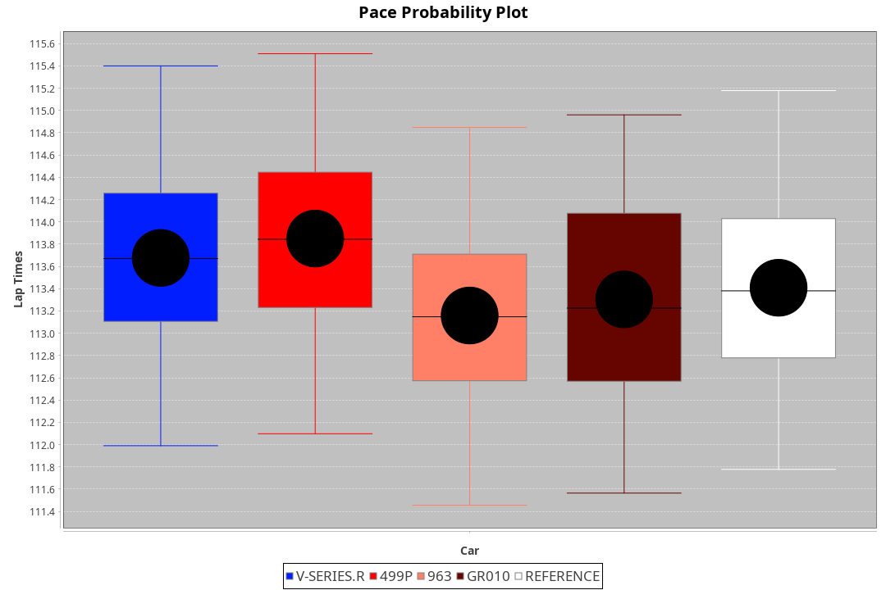
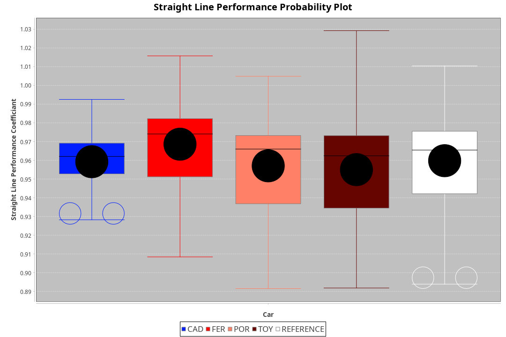
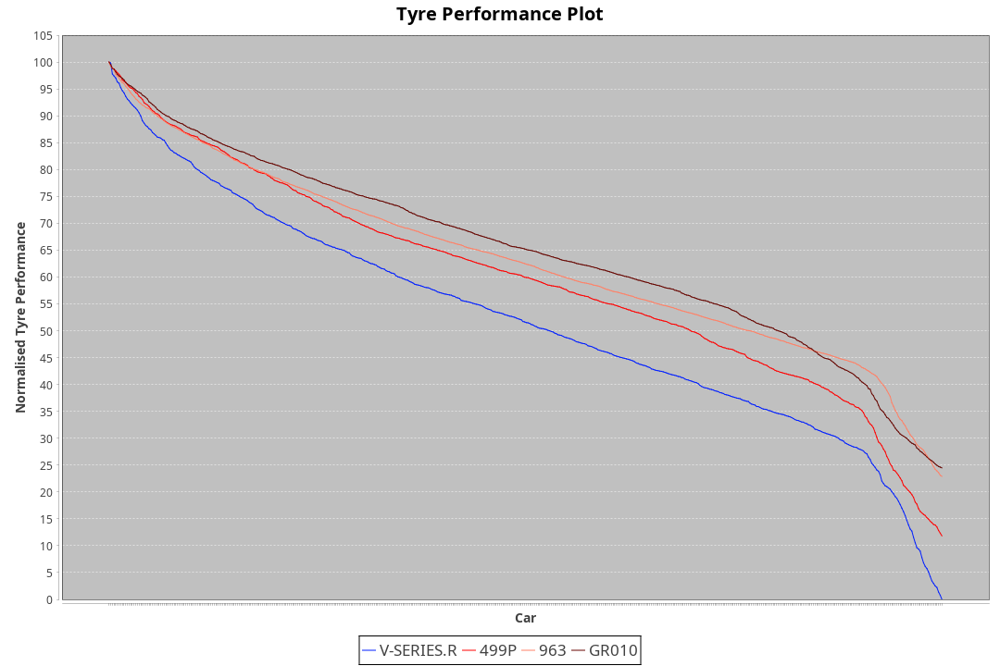

|Manufacturer|Car|Type|RP|QP|Weight|Power¹|Threshhold|PINC|Power²|E/Stint|AVG Vmax|FDS|RDLC|L/Stint|BOP-Grade|ModelAccuracy|ModelPoints|Match%|
|:-|:-|:-|:-|:-|:-|:-|:-|:-|:-|:-|:-|:-|:-|:-|:-|:-|:-|:-|
|Cadillac|V-Series.R|LMDH|1:53.03|1:47.61|1037kg|504kw|0.0kph|0%|504kw|878MJ|279.94kph|-|1.03|35|+D2|98.38%|1765|63.69%|
|Ferrari|499P|LMHHU|1:52.13|1:46.75|1075kg|509kw|0.0kph|0%|509kw|892MJ|281.12kph|190kph|1.01|35|-A2|92.24%|2247|90.35%|
|Porsche|963|LMDH|1:52.44|1:47.09|1053kg|514kw|0.0kph|0%|514kw|898MJ|280.51kph|-|1.01|34|~A1|96.81%|5438|100.00%|
|Toyota|GR010 - Hybrid|LMHHU|1:52.05|1:46.50|1080kg|514kw|0.0kph|0%|514kw|907MJ|279.32kph|190kph|1.01|35|-B1|86.04%|1751|89.99%|

### BoP Accuracy: 86.01%; Overall BoP Grade: B1

## Power below Threshhold
|N/Nmax|TOY|CAD|FER|POR|
|:-|:-|:-|:-|:-|
|0.550|253|248|251|253|
|0.575|276|271|274|276|
|0.600|297|291|294|297|
|0.625|318|312|315|318|
|0.650|339|333|336|339|
|0.675|361|354|357|361|
|0.700|383|375|379|383|
|0.725|404|396|400|404|
|0.750|425|416|421|425|
|0.775|444|435|440|444|
|0.800|462|453|457|462|
|0.825|477|468|472|477|
|0.850|488|479|484|488|
|0.875|499|489|494|499|
|0.900|506|496|501|506|
|0.925|511|501|506|511|
|**0.950**|**514**|**504**|**509**|**514**|
|0.975|512|502|507|512|
|1.000|508|499|504|508|
|1.025|439|430|435|439|

## Power above Threshhold
|N/Nmax|TOY|CAD|FER|POR|
|:-|:-|:-|:-|:-|
|0.550|253|248|251|253|
|0.575|276|271|274|276|
|0.600|297|291|294|297|
|0.625|318|312|315|318|
|0.650|339|333|336|339|
|0.675|361|354|357|361|
|0.700|383|375|379|383|
|0.725|404|396|400|404|
|0.750|425|416|421|425|
|0.775|444|435|440|444|
|0.800|462|453|457|462|
|0.825|477|468|472|477|
|0.850|488|479|484|488|
|0.875|499|489|494|499|
|0.900|506|496|501|506|
|0.925|511|501|506|511|
|**0.950**|**514**|**504**|**509**|**514**|
|0.975|512|502|507|512|
|1.000|508|499|504|508|
|1.025|439|430|435|439|
