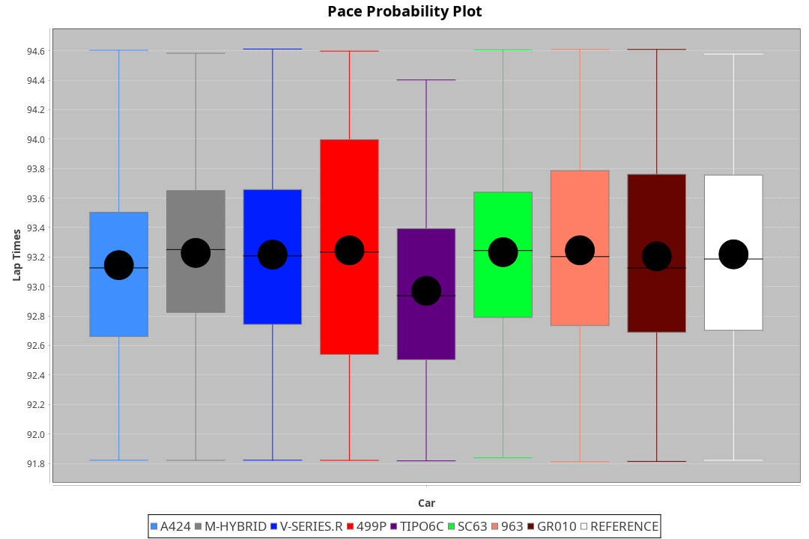
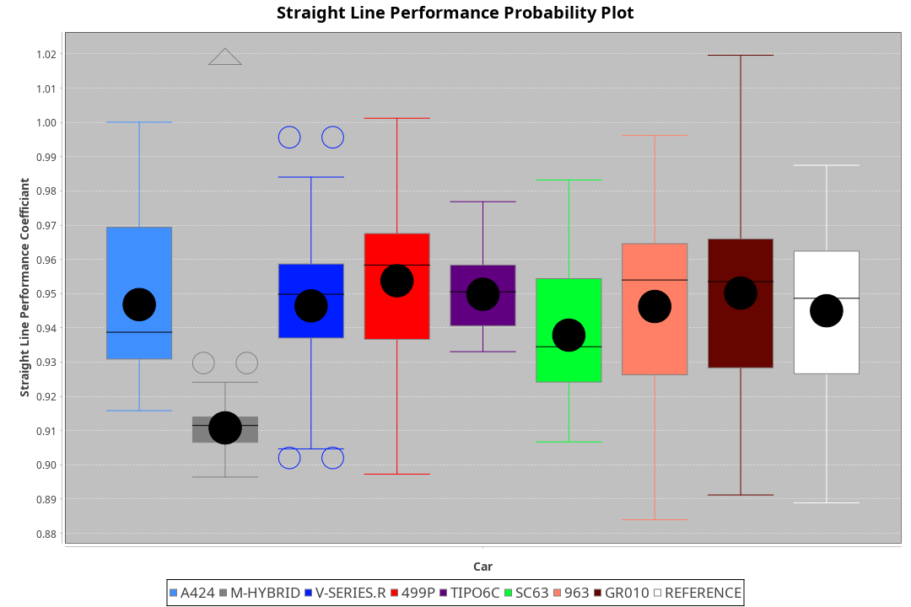
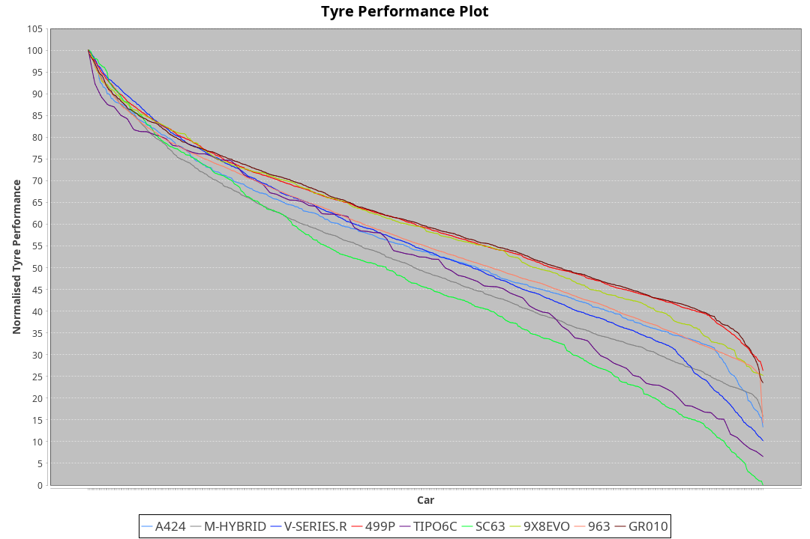

|Manufacturer|Car|Type|RP|QP|Weight|Power¹|Threshhold|PINC|Power²|E/Stint|AVG Vmax|FDS|RDLC|L/Stint|BOP-Grade|ModelAccuracy|ModelPoints|Match%|
|:-|:-|:-|:-|:-|:-|:-|:-|:-|:-|:-|:-|:-|:-|:-|:-|:-|:-|:-|
|Alpine|A424|LMDH|1:33.70|1:29.09|1077kg|507kw|210.0kph|0%|507kw|903MJ|324.03kph|-|0.99|41|~A1|81.46%|523|99.78%|
|BMW|M Hybrid V8 LMDh|LMDH|1:33.71|1:29.08|1061kg|504kw|210.0kph|0%|504kw|891MJ|320.05kph|-|1.01|41|~A1|98.60%|1690|98.73%|
|Cadillac|V-Series.R|LMDH|1:33.70|1:29.32|1037kg|496kw|210.0kph|0%|496kw|871MJ|325.15kph|-|1.03|41|+A2|98.38%|1765|91.27%|
|Ferrari|499P|LMHHU|1:33.28|1:28.91|1085kg|500kw|210.0kph|0%|500kw|885MJ|325.61kph|190kph|1.01|41|-B1|92.24%|2247|85.80%|
|Issotta Fraschini|Tipo6C|LMHHU|1:33.74|1:29.84|1075kg|520kw|210.0kph|0%|520kw|922MJ|325.38kph|190kph|1.03|41|+A2|66.67%|96|92.06%|
|Lamborghini|SC63|LMDH|1:33.70|1:29.00|1041kg|503kw|210.0kph|0%|503kw|884MJ|323.33kph|-|1.05|41|+B1|96.77%|419|89.39%|
|Porsche|963|LMDH|1:33.71|1:29.35|1057kg|502kw|210.0kph|0%|502kw|887MJ|324.88kph|-|1.01|41|~A1|96.81%|5438|100.00%|
|Toyota|GR010 - Hybrid|LMHHU|1:33.25|1:28.73|1099kg|507kw|210.0kph|0%|507kw|903MJ|323.20kph|190kph|1.00|41|-B1|86.04%|1751|87.18%|

### BoP Accuracy: 93.03%; Overall BoP Grade: A2

## Power below Threshhold
|N/Nmax|TOY|FER|CAD|POR|IF|BMW|ALP|LBG|
|:-|:-|:-|:-|:-|:-|:-|:-|:-|
|0.550|250|246|244|247|256|248|250|248|
|0.575|273|269|267|270|279|271|273|271|
|0.600|293|289|287|290|300|291|293|291|
|0.625|314|309|307|310|322|312|314|311|
|0.650|335|330|327|331|343|333|335|332|
|0.675|356|351|348|352|365|354|356|353|
|0.700|377|372|369|374|387|375|377|374|
|0.725|399|393|390|395|409|396|399|395|
|0.750|419|413|410|415|430|416|419|416|
|0.775|438|432|429|434|449|435|438|435|
|0.800|455|449|445|451|467|453|455|452|
|0.825|470|464|460|466|482|468|470|467|
|0.850|482|475|471|477|494|479|482|478|
|0.875|492|485|481|487|505|489|492|488|
|0.900|499|492|488|494|512|496|499|495|
|0.925|504|497|493|499|517|501|504|500|
|**0.950**|**507**|**500**|**496**|**502**|**520**|**504**|**507**|**503**|
|0.975|505|498|494|500|518|502|505|501|
|1.000|502|495|491|497|514|499|502|498|
|1.025|433|427|424|429|444|430|433|430|

## Power above Threshhold
|N/Nmax|TOY|FER|CAD|POR|IF|BMW|ALP|LBG|
|:-|:-|:-|:-|:-|:-|:-|:-|:-|
|0.550|250|246|244|247|256|248|250|248|
|0.575|273|269|267|270|279|271|273|271|
|0.600|293|289|287|290|300|291|293|291|
|0.625|314|309|307|310|322|312|314|311|
|0.650|335|330|327|331|343|333|335|332|
|0.675|356|351|348|352|365|354|356|353|
|0.700|377|372|369|374|387|375|377|374|
|0.725|399|393|390|395|409|396|399|395|
|0.750|419|413|410|415|430|416|419|416|
|0.775|438|432|429|434|449|435|438|435|
|0.800|455|449|445|451|467|453|455|452|
|0.825|470|464|460|466|482|468|470|467|
|0.850|482|475|471|477|494|479|482|478|
|0.875|492|485|481|487|505|489|492|488|
|0.900|499|492|488|494|512|496|499|495|
|0.925|504|497|493|499|517|501|504|500|
|**0.950**|**507**|**500**|**496**|**502**|**520**|**504**|**507**|**503**|
|0.975|505|498|494|500|518|502|505|501|
|1.000|502|495|491|497|514|499|502|498|
|1.025|433|427|424|429|444|430|433|430|
