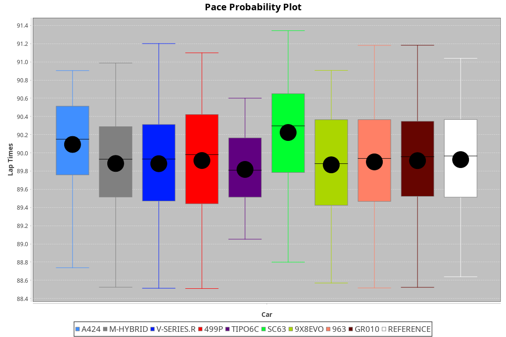
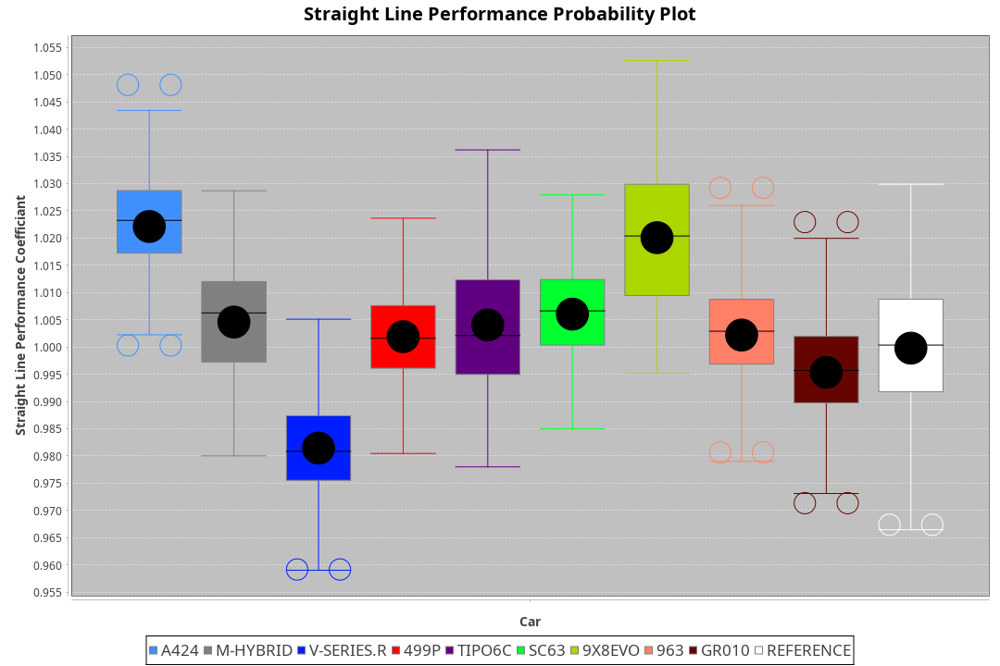
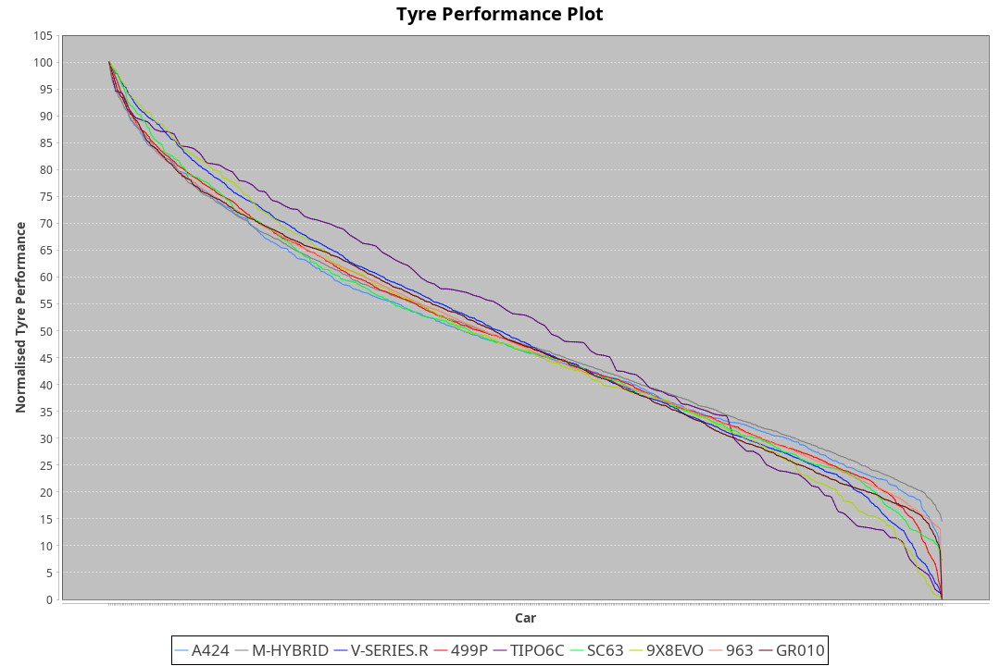

| Manufacturer     | Car        | Weight | Power   | PINC    | E/Stint | FDS     |
|:-|:-|:-|:-|:-|:-|:-|
| Alpine           | A424       | 1037kg | 505.0kw |    -    | 899MJ   |    -    |
| BMW              | M-Hybrid   | 1042kg | 503.0kw |    -    | 897MJ   |    -    |
| Cadillac         | V-Series.R | 1044kg | 500.0kw |    -    | 890MJ   |    -    |
| Ferrari          | 499P       | 1067kg | 490.0kw |    -    | 884MJ   | 190kph  |
| Isotta Fraschini | Tipo6C     | 1085kg | 520.0kw |    -    | 920MJ   | 190kph  |
| Lamborghini      | SC63       | 1060kg | 512.0kw |    -    | 904MJ   |    -    |
| Peugeot          | 9X8Evo     | 1035kg | 491.0kw |    -    | 880MJ   | 190kph  |
| Porsche          | 963        | 1041kg | 498.0kw |    -    | 891MJ   |    -    |
| Toyota           | GR010      | 1070kg | 493.0kw |    -    | 887MJ   | 190kph  |

### BoP Accuracy: 94.61%; Overall BoP Grade: A2
| Manufacturer     | Car        | Type  | RP      | QP      | Weight | Power¹  | Threshhold | PINC    | Power²   | E/Stint | AVG Vmax  | FDS     | RDLC | L/Stint | BOP-Grade | Model Accuracy | Model Points | Match%  | SimDiff |
|:-|:-|:-|:-|:-|:-|:-|:-|:-|:-|:-|:-|:-|:-|:-|:-|:-|:-|:-|:-|
| Alpine           | A424       | LMDH  | 1:30.92 | 1:29.09 | 1037kg | 505.0kw | 0.0kph     |    -    | 505.00kw |  899MJ  | 323.11kph |    -    | 1.01 | 40      | ~A1       | 99.61%         | 762          | 99.21%  | #       |
| BMW              | M-Hybrid   | LMDH  | 1:30.93 | 1:28.84 | 1042kg | 503.0kw | 0.0kph     |    -    | 503.00kw |  897MJ  | 320.22kph |    -    | 1.01 | 40      | ~A1       | 100.00%        | 1826         | 97.35%  | #       |
| Cadillac         | V-Series.R | LMDH  | 1:30.93 | 1:29.25 | 1044kg | 500.0kw | 0.0kph     |    -    | 500.00kw |  890MJ  | 316.39kph |    -    | 1.01 | 40      | ~A1       | 99.00%         | 3184         | 100.00% | ±0.64s  |
| Ferrari          | 499P       | LMHHU | 1:30.92 | 1:28.98 | 1067kg | 490.0kw | 0.0kph     |    -    | 490.00kw |  884MJ  | 316.80kph | 190kph  | 1.02 | 40      | ~A1       | 98.07%         | 3550         | 100.00% | ±0.56s  |
| Isotta Fraschini | Tipo6C     | LMHHU | 1:30.92 | 1:30.53 | 1085kg | 520.0kw | 0.0kph     |    -    | 520.00kw |  920MJ  | 317.81kph | 190kph  | 1.02 | 40      | +D1       | 96.81%         | 91           | 65.71%  | #       |
| Lamborghini      | SC63       | LMDH  | 1:30.92 | 1:29.68 | 1060kg | 512.0kw | 0.0kph     |    -    | 512.00kw |  904MJ  | 319.32kph |    -    | 1.02 | 40      | ~A1       | 100.00%        | 529          | 95.49%  | #       |
| Peugeot          | 9X8Evo     | LMHHU | 1:30.92 | 1:29.48 | 1035kg | 491.0kw | 0.0kph     |    -    | 491.00kw |  880MJ  | 320.32kph | 190kph  | 1.01 | 40      | +A2       | 99.21%         | 377          | 93.69%  | #       |
| Porsche          | 963        | LMDH  | 1:30.92 | 1:28.78 | 1041kg | 498.0kw | 0.0kph     |    -    | 498.00kw |  891MJ  | 318.57kph |    -    | 1.01 | 40      | ~A1       | 99.96%         | 10176        | 100.00% | ±0.53s  |
| Toyota           | GR010      | LMHHU | 1:30.93 | 1:29.01 | 1070kg | 493.0kw | 0.0kph     |    -    | 493.00kw |  887MJ  | 316.71kph | 190kph  | 1.02 | 40      | ~A1       | 99.95%         | 5509         | 100.00% | ±0.54s  |

## Power below Threshhold
| N/Nmax    | A424    | M-HYBRID | V-SERIES.R | 499P    | TIPO6C  | SC63    | 9X8EVO  | 963     | GR010   |
|:-|:-|:-|:-|:-|:-|:-|:-|:-|:-|
|  0.550    |  249    |  248     |  246       |  241    |  256    |  252    |  242    |  245    |  243    |
|  0.575    |  272    |  271     |  269       |  264    |  279    |  275    |  264    |  268    |  265    |
|  0.600    |  292    |  291     |  289       |  283    |  300    |  296    |  284    |  288    |  285    |
|  0.625    |  312    |  311     |  309       |  303    |  322    |  317    |  304    |  308    |  305    |
|  0.650    |  333    |  332     |  330       |  324    |  343    |  338    |  324    |  329    |  325    |
|  0.675    |  355    |  353     |  351       |  344    |  365    |  359    |  345    |  350    |  346    |
|  0.700    |  376    |  374     |  372       |  365    |  387    |  381    |  366    |  371    |  367    |
|  0.725    |  397    |  395     |  393       |  386    |  409    |  403    |  386    |  392    |  388    |
|  0.750    |  417    |  416     |  413       |  405    |  430    |  423    |  406    |  411    |  407    |
|  0.775    |  436    |  435     |  432       |  424    |  449    |  442    |  424    |  430    |  426    |
|  0.800    |  454    |  452     |  449       |  440    |  467    |  460    |  441    |  447    |  443    |
|  0.825    |  469    |  467     |  464       |  455    |  482    |  475    |  455    |  462    |  457    |
|  0.850    |  480    |  478     |  475       |  466    |  494    |  486    |  466    |  473    |  468    |
|  0.875    |  490    |  488     |  485       |  476    |  505    |  497    |  476    |  483    |  478    |
|  0.900    |  497    |  495     |  492       |  482    |  512    |  504    |  483    |  490    |  485    |
|  0.925    |  502    |  500     |  497       |  487    |  517    |  509    |  488    |  495    |  490    |
| **0.950** | **505** | **503**  | **500**    | **490** | **520** | **512** | **491** | **498** | **493** |
|  0.975    |  503    |  501     |  498       |  488    |  518    |  510    |  489    |  496    |  491    |
|  1.000    |  500    |  498     |  495       |  485    |  514    |  506    |  486    |  493    |  488    |
|  1.025    |  431    |  430     |  427       |  419    |  444    |  437    |  419    |  425    |  421    |

## Power above Threshhold
| N/Nmax    | A424    | M-HYBRID | V-SERIES.R | 499P    | TIPO6C  | SC63    | 9X8EVO  | 963     | GR010   |
|:-|:-|:-|:-|:-|:-|:-|:-|:-|:-|
|  0.550    |  249    |  248     |  246       |  241    |  256    |  252    |  242    |  245    |  243    |
|  0.575    |  272    |  271     |  269       |  264    |  279    |  275    |  264    |  268    |  265    |
|  0.600    |  292    |  291     |  289       |  283    |  300    |  296    |  284    |  288    |  285    |
|  0.625    |  312    |  311     |  309       |  303    |  322    |  317    |  304    |  308    |  305    |
|  0.650    |  333    |  332     |  330       |  324    |  343    |  338    |  324    |  329    |  325    |
|  0.675    |  355    |  353     |  351       |  344    |  365    |  359    |  345    |  350    |  346    |
|  0.700    |  376    |  374     |  372       |  365    |  387    |  381    |  366    |  371    |  367    |
|  0.725    |  397    |  395     |  393       |  386    |  409    |  403    |  386    |  392    |  388    |
|  0.750    |  417    |  416     |  413       |  405    |  430    |  423    |  406    |  411    |  407    |
|  0.775    |  436    |  435     |  432       |  424    |  449    |  442    |  424    |  430    |  426    |
|  0.800    |  454    |  452     |  449       |  440    |  467    |  460    |  441    |  447    |  443    |
|  0.825    |  469    |  467     |  464       |  455    |  482    |  475    |  455    |  462    |  457    |
|  0.850    |  480    |  478     |  475       |  466    |  494    |  486    |  466    |  473    |  468    |
|  0.875    |  490    |  488     |  485       |  476    |  505    |  497    |  476    |  483    |  478    |
|  0.900    |  497    |  495     |  492       |  482    |  512    |  504    |  483    |  490    |  485    |
|  0.925    |  502    |  500     |  497       |  487    |  517    |  509    |  488    |  495    |  490    |
| **0.950** | **505** | **503**  | **500**    | **490** | **520** | **512** | **491** | **498** | **493** |
|  0.975    |  503    |  501     |  498       |  488    |  518    |  510    |  489    |  496    |  491    |
|  1.000    |  500    |  498     |  495       |  485    |  514    |  506    |  486    |  493    |  488    |
|  1.025    |  431    |  430     |  427       |  419    |  444    |  437    |  419    |  425    |  421    |
