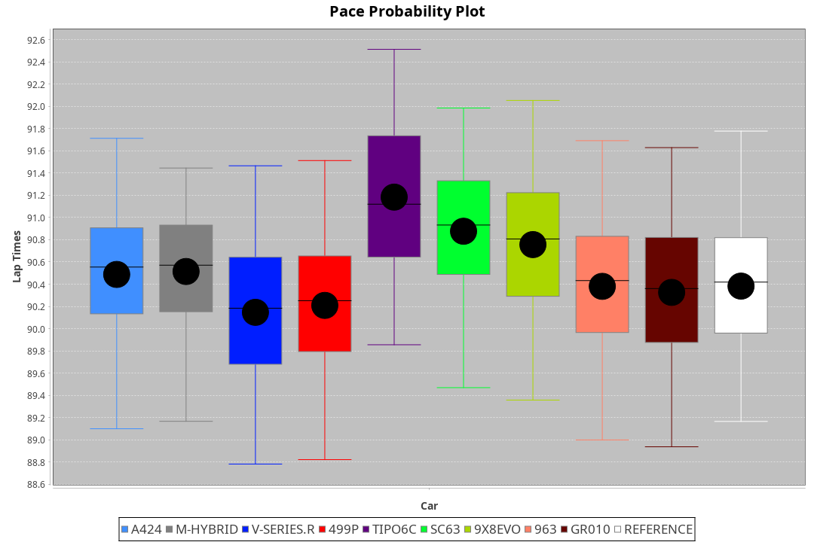
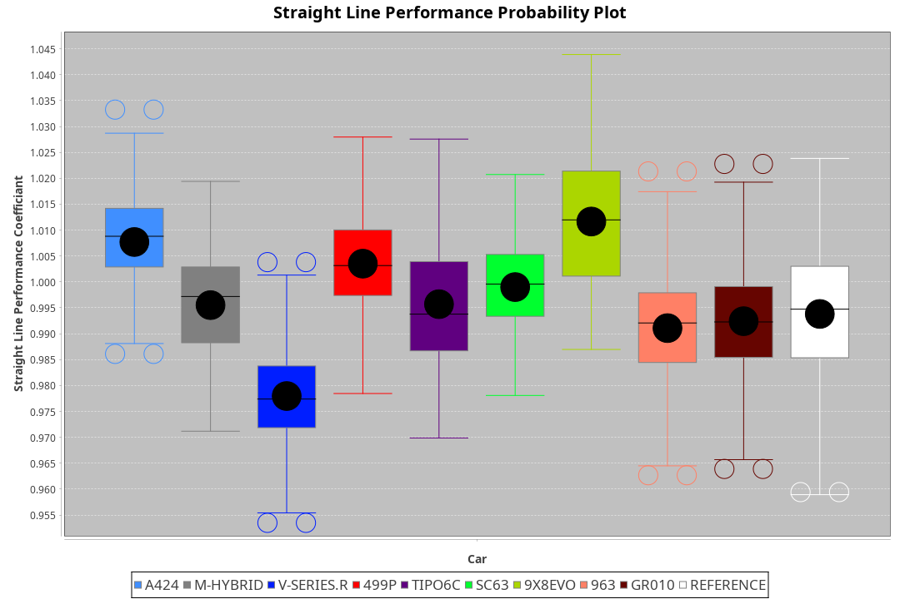
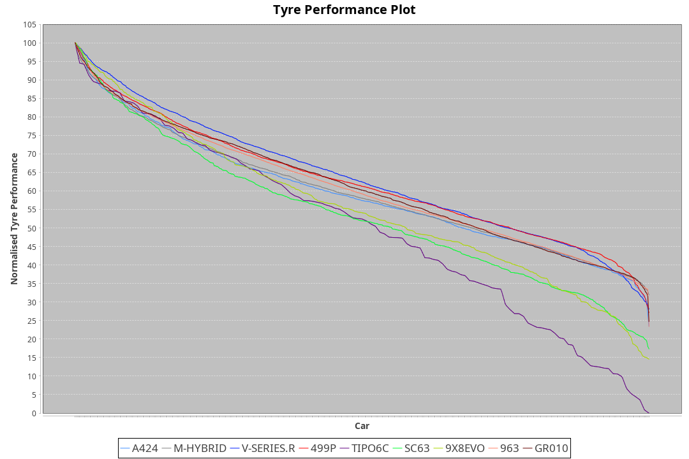

| Manufacturer     | Car        | Weight | Power   | PINC    | E/Stint | FDS     |
|:-|:-|:-|:-|:-|:-|:-|
| Alpine           | A424       | 1057kg | 517.0kw | -1.00%  | 910MJ   |    -    |
| BMW              | M-Hybrid   | 1041kg | 511.0kw | -1.00%  | 901MJ   |    -    |
| Cadillac         | V-Series.R | 1044kg | 507.0kw | 1.00%   | 899MJ   |    -    |
| Ferrari          | 499P       | 1063kg | 509.0kw |    -    | 896MJ   | 190kph  |
| Isotta Fraschini | Tipo6C     | 1054kg | 520.0kw |    -    | 918MJ   | 190kph  |
| Lamborghini      | SC63       | 1034kg | 512.0kw |    -    | 901MJ   |    -    |
| Peugeot          | 9X8Evo     | 1050kg | 510.0kw | -1.00%  | 896MJ   | 190kph  |
| Porsche          | 963        | 1057kg | 513.0kw | 1.00%   | 903MJ   |    -    |
| Toyota           | GR010      | 1090kg | 511.0kw | 1.00%   | 907MJ   | 190kph  |

### BoP Accuracy: 89.57%; Overall BoP Grade: B1
| Manufacturer     | Car        | Type  | RP      | QP      | Weight | Power¹  | Threshhold | PINC    | Power²   | E/Stint | AVG Vmax  | FDS     | RDLC | L/Stint | BOP-Grade | Model Accuracy | Model Points | Match%  | SimDiff |
|:-|:-|:-|:-|:-|:-|:-|:-|:-|:-|:-|:-|:-|:-|:-|:-|:-|:-|:-|:-|
| Alpine           | A424       | LMDH  | 1:30.89 | 1:29.49 | 1057kg | 517.0kw | 210.0kph   | -1.00%  | 511.80kw |  910MJ  | 323.99kph |    -    | 0.99 | 40      | ~A1       | 100.00%        | 635          | 98.66%  | #       |
| BMW              | M-Hybrid   | LMDH  | 1:31.15 | 1:29.16 | 1041kg | 511.0kw | 210.0kph   | -1.00%  | 505.90kw |  901MJ  | 322.21kph |    -    | 1.01 | 40      | ~A1       | 100.00%        | 1696         | 100.00% | #       |
| Cadillac         | V-Series.R | LMDH  | 1:30.87 | 1:29.05 | 1044kg | 507.0kw | 210.0kph   | 1.00%   | 512.10kw |  899MJ  | 318.47kph |    -    | 1.01 | 40      | ~A1       | 88.64%         | 2076         | 100.00% | #       |
| Ferrari          | 499P       | LMHHU | 1:30.92 | 1:28.93 | 1063kg | 509.0kw | 210.0kph   |    -    | 509.00kw |  896MJ  | 322.27kph | 190kph  | 1.03 | 40      | ~A1       | 91.94%         | 2476         | 100.00% | #       |
| Isotta Fraschini | Tipo6C     | LMHHU | 1:30.93 | 1:30.86 | 1054kg | 520.0kw | 210.0kph   |    -    | 520.00kw |  918MJ  | 323.11kph | 190kph  | 1.05 | 40      | +Ω1       | 100.00%        | 66           | 48.29%  | #       |
| Lamborghini      | SC63       | LMDH  | 1:30.92 | 1:30.61 | 1034kg | 512.0kw | 210.0kph   |    -    | 512.00kw |  901MJ  | 323.81kph |    -    | 1.05 | 40      | ~A1       | 100.00%        | 504          | 98.23%  | #       |
| Peugeot          | 9X8Evo     | LMHHU | 1:31.23 | 1:30.23 | 1050kg | 510.0kw | 210.0kph   | -1.00%  | 504.90kw |  896MJ  | 324.23kph | 190kph  | 1.00 | 40      | +C2       | 100.00%        | 249          | 70.46%  | #       |
| Porsche          | 963        | LMDH  | 1:30.65 | 1:28.42 | 1057kg | 513.0kw | 210.0kph   | 1.00%   | 518.10kw |  903MJ  | 321.32kph |    -    | 1.00 | 40      | -A2       | 90.40%         | 5633         | 90.47%  | #       |
| Toyota           | GR010      | LMHHU | 1:30.89 | 1:29.02 | 1090kg | 511.0kw | 210.0kph   | 1.00%   | 516.10kw |  907MJ  | 319.47kph | 190kph  | 1.00 | 40      | ~A1       | 90.11%         | 3235         | 100.00% | #       |

## Power below Threshhold
| N/Nmax    | A424    | M-HYBRID | V-SERIES.R | 499P    | TIPO6C  | SC63    | 9X8EVO  | 963     | GR010   |
|:-|:-|:-|:-|:-|:-|:-|:-|:-|:-|
|  0.550    |  255    |  252     |  250       |  251    |  256    |  252    |  251    |  253    |  252    |
|  0.575    |  278    |  275     |  273       |  274    |  279    |  275    |  274    |  276    |  275    |
|  0.600    |  298    |  295     |  293       |  294    |  300    |  296    |  295    |  296    |  295    |
|  0.625    |  320    |  316     |  314       |  315    |  322    |  317    |  316    |  317    |  316    |
|  0.650    |  341    |  337     |  335       |  336    |  343    |  338    |  337    |  338    |  337    |
|  0.675    |  363    |  359     |  356       |  357    |  365    |  359    |  358    |  360    |  359    |
|  0.700    |  385    |  380     |  377       |  379    |  387    |  381    |  380    |  382    |  380    |
|  0.725    |  407    |  402     |  399       |  400    |  409    |  403    |  401    |  403    |  402    |
|  0.750    |  427    |  422     |  419       |  421    |  430    |  423    |  422    |  424    |  422    |
|  0.775    |  446    |  441     |  438       |  440    |  449    |  442    |  441    |  443    |  441    |
|  0.800    |  464    |  459     |  455       |  457    |  467    |  460    |  458    |  461    |  459    |
|  0.825    |  479    |  474     |  470       |  472    |  482    |  475    |  473    |  476    |  474    |
|  0.850    |  491    |  485     |  482       |  484    |  494    |  486    |  485    |  487    |  485    |
|  0.875    |  502    |  496     |  492       |  494    |  505    |  497    |  495    |  498    |  496    |
|  0.900    |  509    |  503     |  499       |  501    |  512    |  504    |  502    |  505    |  503    |
|  0.925    |  514    |  508     |  504       |  506    |  517    |  509    |  507    |  510    |  508    |
| **0.950** | **517** | **511**  | **507**    | **509** | **520** | **512** | **510** | **513** | **511** |
|  0.975    |  515    |  509     |  505       |  507    |  518    |  510    |  508    |  511    |  509    |
|  1.000    |  511    |  505     |  502       |  504    |  514    |  506    |  505    |  507    |  505    |
|  1.025    |  441    |  436     |  433       |  435    |  444    |  437    |  436    |  438    |  436    |

## Power above Threshhold
| N/Nmax    | A424       | M-HYBRID   | V-SERIES.R | 499P    | TIPO6C  | SC63    | 9X8EVO     | 963        | GR010      |
|:-|:-|:-|:-|:-|:-|:-|:-|:-|:-|
|  0.550    |  252.41    |  249.44    |  252.03    |  251    |  256    |  252    |  248.44    |  255.06    |  254.05    |
|  0.575    |  275.45    |  272.48    |  275.04    |  274    |  279    |  275    |  271.48    |  278.07    |  277.06    |
|  0.600    |  295.48    |  292.51    |  296.04    |  294    |  300    |  296    |  291.52    |  299.08    |  298.06    |
|  0.625    |  316.51    |  312.55    |  317.04    |  315    |  322    |  317    |  312.56    |  321.08    |  319.07    |
|  0.650    |  337.55    |  333.59    |  338.05    |  336    |  343    |  338    |  333.59    |  342.09    |  340.07    |
|  0.675    |  359.58    |  355.63    |  359.05    |  357    |  365    |  359    |  354.63    |  364.09    |  362.08    |
|  0.700    |  380.62    |  376.66    |  381.05    |  379    |  387    |  381    |  375.67    |  386.10    |  384.08    |
|  0.725    |  402.65    |  397.70    |  403.06    |  400    |  409    |  403    |  396.71    |  407.10    |  406.09    |
|  0.750    |  422.69    |  417.73    |  423.06    |  421    |  430    |  423    |  416.74    |  428.11    |  427.09    |
|  0.775    |  441.72    |  436.77    |  442.06    |  440    |  449    |  442    |  435.78    |  447.11    |  446.10    |
|  0.800    |  459.75    |  454.80    |  460.06    |  457    |  467    |  460    |  453.81    |  465.12    |  463.10    |
|  0.825    |  474.77    |  469.83    |  475.06    |  472    |  482    |  475    |  468.84    |  480.12    |  478.10    |
|  0.850    |  485.79    |  480.85    |  486.07    |  484    |  494    |  486    |  479.86    |  492.12    |  490.10    |
|  0.875    |  496.81    |  490.86    |  497.07    |  494    |  505    |  497    |  489.87    |  503.13    |  501.11    |
|  0.900    |  503.82    |  497.88    |  504.07    |  501    |  512    |  504    |  496.89    |  510.13    |  508.11    |
|  0.925    |  508.83    |  502.88    |  509.07    |  506    |  517    |  509    |  501.89    |  515.13    |  513.11    |
| **0.950** | **511.83** | **505.89** | **512.07** | **509** | **520** | **512** | **504.90** | **518.13** | **516.11** |
|  0.975    |  509.83    |  503.89    |  510.07    |  507    |  518    |  510    |  502.90    |  516.13    |  514.11    |
|  1.000    |  505.82    |  500.88    |  506.07    |  504    |  514    |  506    |  499.89    |  512.13    |  510.11    |
|  1.025    |  436.71    |  431.76    |  437.06    |  435    |  444    |  437    |  430.77    |  442.11    |  441.09    |
