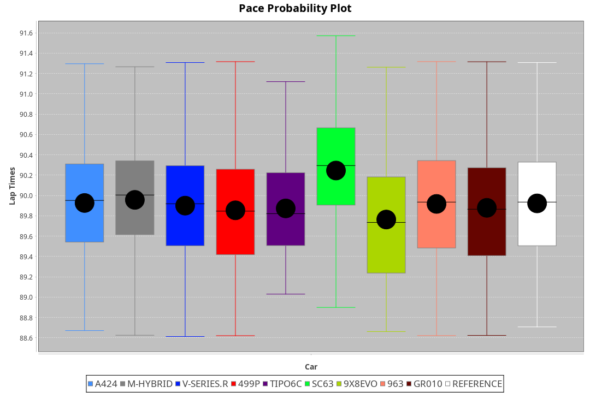
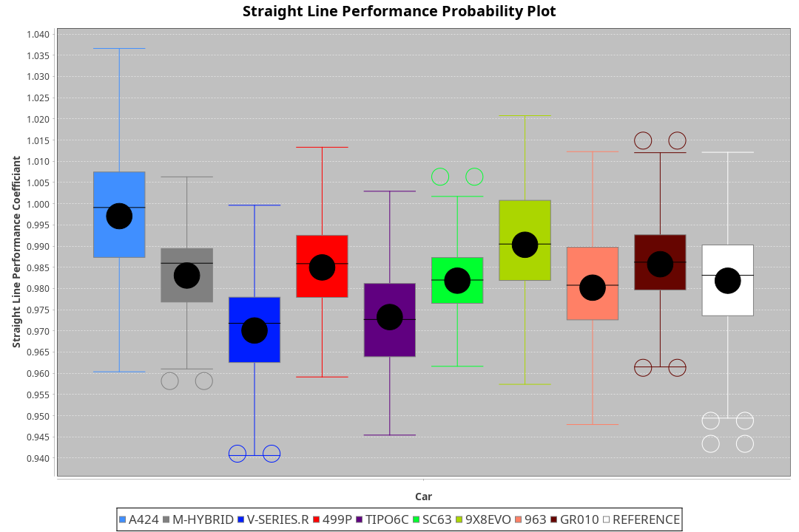
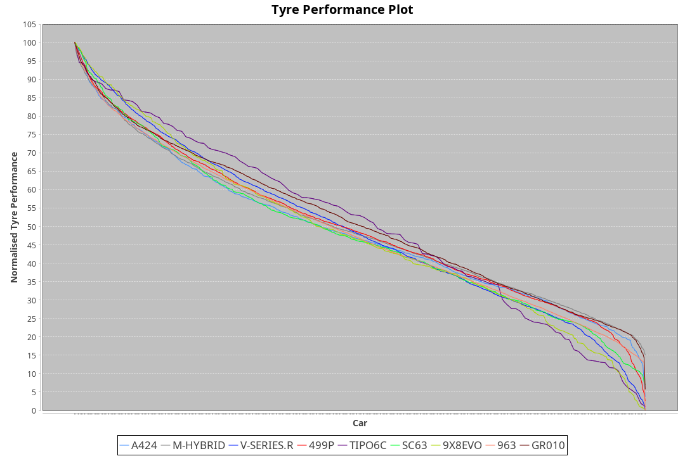

| Manufacturer     | Car        | Weight | Power   | PINC    | E/Stint | FDS     |
|:-|:-|:-|:-|:-|:-|:-|
| Alpine           | A424       | 1038kg | 489.0kw | -1.80%  | 880MJ   |    -    |
| BMW              | M-Hybrid   | 1065kg | 510.0kw | -5.40%  | 891MJ   |    -    |
| Cadillac         | V-Series.R | 1094kg | 487.0kw | 4.20%   | 894MJ   |    -    |
| Ferrari          | 499P       | 1100kg | 480.0kw | 0.40%   | 879MJ   | 200kph  |
| Isotta Fraschini | Tipo6C     | 1087kg | 520.0kw | -1.40%  | 916MJ   | 190kph  |
| Lamborghini      | SC63       | 1062kg | 519.0kw | -4.10%  | 899MJ   |    -    |
| Peugeot          | 9X8Evo     | 1081kg | 480.0kw |    -    | 875MJ   | 190kph  |
| Porsche          | 963        | 1062kg | 482.0kw | 1.40%   | 882MJ   |    -    |
| Toyota           | GR010      | 1100kg | 480.0kw |    -    | 879MJ   | 200kph  |

### BoP Accuracy: 91.96%; Overall BoP Grade: A2
| Manufacturer     | Car        | Type  | RP      | QP      | Weight | Power¹  | Threshhold | PINC    | Power²   | E/Stint | AVG Vmax  | FDS     | RDLC | L/Stint | BOP-Grade | Model Accuracy | Model Points | Match%  | SimDiff |
|:-|:-|:-|:-|:-|:-|:-|:-|:-|:-|:-|:-|:-|:-|:-|:-|:-|:-|:-|:-|
| Alpine           | A424       | LMDH  | 1:31.00 | 1:29.20 | 1038kg | 489.0kw | 250.0kph   | -1.80%  | 480.20kw |  880MJ  | 316.78kph |    -    | 1.01 | 40      | +A2       | 100.00%        | 870          | 93.85%  | #       |
| BMW              | M-Hybrid   | LMDH  | 1:30.99 | 1:28.91 | 1065kg | 510.0kw | 250.0kph   | -5.40%  | 482.50kw |  891MJ  | 313.06kph |    -    | 1.00 | 40      | ~A1       | 100.00%        | 1914         | 95.67%  | #       |
| Cadillac         | V-Series.R | LMDH  | 1:30.99 | 1:28.90 | 1094kg | 487.0kw | 250.0kph   | 4.20%   | 507.50kw |  894MJ  | 310.56kph |    -    | 0.98 | 40      | ~A1       | 98.03%         | 3773         | 95.77%  | ±0.24s  |
| Ferrari          | 499P       | LMHHU | 1:30.87 | 1:28.69 | 1100kg | 480.0kw | 250.0kph   | 0.40%   | 481.90kw |  879MJ  | 310.93kph | 200kph  | 0.99 | 40      | -A2       | 100.00%        | 4212         | 94.25%  | ±0.21s  |
| Isotta Fraschini | Tipo6C     | LMHHU | 1:30.99 | 1:30.45 | 1087kg | 520.0kw | 250.0kph   | -1.40%  | 512.70kw |  916MJ  | 315.41kph | 190kph  | 1.02 | 40      | +D1       | 100.00%        | 105          | 69.23%  | #       |
| Lamborghini      | SC63       | LMDH  | 1:31.00 | 1:29.66 | 1062kg | 519.0kw | 250.0kph   | -4.10%  | 497.70kw |  899MJ  | 315.76kph |    -    | 1.02 | 40      | ~A1       | 100.00%        | 597          | 100.00% | #       |
| Peugeot          | 9X8Evo     | LMHHU | 1:31.00 | 1:29.46 | 1081kg | 480.0kw | 250.0kph   |    -    | 480.00kw |  875MJ  | 311.77kph | 190kph  | 0.97 | 40      | +B2       | 100.00%        | 463          | 82.71%  | #       |
| Porsche          | 963        | LMDH  | 1:30.99 | 1:28.75 | 1062kg | 482.0kw | 250.0kph   | 1.40%   | 488.70kw |  882MJ  | 313.38kph |    -    | 1.00 | 40      | ~A1       | 99.21%         | 10753        | 100.00% | ±0.41s  |
| Toyota           | GR010      | LMHHU | 1:30.84 | 1:28.53 | 1100kg | 480.0kw | 250.0kph   |    -    | 480.00kw |  879MJ  | 309.83kph | 200kph  | 0.99 | 40      | ~A1       | 99.54%         | 3271         | 96.21%  | ±0.23s  |

## Power below Threshhold
| N/Nmax    | A424    | M-HYBRID | V-SERIES.R | 499P    | TIPO6C  | SC63    | 9X8EVO  | 963     | GR010   |
|:-|:-|:-|:-|:-|:-|:-|:-|:-|:-|
|  0.550    |  241    |  251     |  240       |  236    |  256    |  256    |  236    |  237    |  236    |
|  0.575    |  263    |  274     |  262       |  258    |  279    |  279    |  258    |  259    |  258    |
|  0.600    |  282    |  295     |  281       |  277    |  300    |  299    |  277    |  278    |  277    |
|  0.625    |  302    |  316     |  301       |  297    |  322    |  321    |  297    |  298    |  297    |
|  0.650    |  323    |  337     |  322       |  317    |  343    |  342    |  317    |  318    |  317    |
|  0.675    |  343    |  358     |  342       |  337    |  365    |  364    |  337    |  338    |  337    |
|  0.700    |  364    |  380     |  363       |  358    |  387    |  386    |  358    |  359    |  358    |
|  0.725    |  385    |  401     |  383       |  378    |  409    |  408    |  378    |  380    |  378    |
|  0.750    |  404    |  422     |  403       |  397    |  430    |  429    |  397    |  399    |  397    |
|  0.775    |  423    |  441     |  421       |  415    |  449    |  448    |  415    |  417    |  415    |
|  0.800    |  439    |  458     |  437       |  431    |  467    |  466    |  431    |  433    |  431    |
|  0.825    |  454    |  473     |  452       |  445    |  482    |  481    |  445    |  447    |  445    |
|  0.850    |  465    |  485     |  463       |  456    |  494    |  493    |  456    |  458    |  456    |
|  0.875    |  475    |  495     |  473       |  466    |  505    |  504    |  466    |  468    |  466    |
|  0.900    |  481    |  502     |  479       |  472    |  512    |  511    |  472    |  474    |  472    |
|  0.925    |  486    |  507     |  484       |  477    |  517    |  516    |  477    |  479    |  477    |
| **0.950** | **489** | **510**  | **487**    | **480** | **520** | **519** | **480** | **482** | **480** |
|  0.975    |  487    |  508     |  485       |  478    |  518    |  517    |  478    |  480    |  478    |
|  1.000    |  484    |  505     |  482       |  475    |  514    |  513    |  475    |  477    |  475    |
|  1.025    |  418    |  436     |  416       |  410    |  444    |  443    |  410    |  412    |  410    |

## Power above Threshhold
| N/Nmax    | A424       | M-HYBRID   | V-SERIES.R | 499P       | TIPO6C     | SC63       | 9X8EVO  | 963        | GR010   |
|:-|:-|:-|:-|:-|:-|:-|:-|:-|:-|
|  0.550    |  236.10    |  237.23    |  250.22    |  237.45    |  252.35    |  245.36    |  236    |  240.37    |  236    |
|  0.575    |  258.11    |  259.25    |  273.24    |  259.50    |  275.39    |  267.39    |  258    |  262.40    |  258    |
|  0.600    |  277.11    |  278.27    |  293.26    |  278.53    |  296.42    |  287.42    |  277    |  282.43    |  277    |
|  0.625    |  297.12    |  298.28    |  314.28    |  298.57    |  317.45    |  307.45    |  297    |  302.46    |  297    |
|  0.650    |  317.13    |  318.30    |  335.30    |  318.61    |  338.48    |  328.48    |  317    |  322.49    |  317    |
|  0.675    |  337.14    |  338.32    |  356.32    |  338.65    |  359.50    |  349.51    |  337    |  343.53    |  337    |
|  0.700    |  358.15    |  359.34    |  377.34    |  359.69    |  381.54    |  370.54    |  358    |  364.56    |  358    |
|  0.725    |  378.16    |  380.36    |  399.36    |  379.72    |  403.57    |  391.57    |  378    |  384.59    |  378    |
|  0.750    |  397.16    |  399.38    |  419.38    |  398.76    |  423.59    |  411.60    |  397    |  403.62    |  397    |
|  0.775    |  415.17    |  417.40    |  438.39    |  416.80    |  442.62    |  429.62    |  415    |  422.65    |  415    |
|  0.800    |  431.18    |  433.41    |  455.41    |  432.83    |  460.65    |  446.65    |  431    |  438.67    |  431    |
|  0.825    |  445.18    |  447.43    |  470.42    |  446.85    |  475.67    |  461.67    |  445    |  453.69    |  445    |
|  0.850    |  456.19    |  458.44    |  482.43    |  457.87    |  486.68    |  472.68    |  456    |  464.71    |  456    |
|  0.875    |  466.19    |  468.45    |  492.44    |  467.89    |  497.70    |  482.70    |  466    |  474.73    |  466    |
|  0.900    |  472.19    |  474.45    |  499.45    |  473.90    |  504.71    |  489.71    |  472    |  480.74    |  472    |
|  0.925    |  477.20    |  479.46    |  504.45    |  478.91    |  509.72    |  494.72    |  477    |  485.74    |  477    |
| **0.950** | **480.20** | **482.46** | **507.45** | **481.92** | **512.72** | **497.72** | **480** | **488.75** | **480** |
|  0.975    |  478.20    |  480.46    |  505.45    |  479.92    |  510.72    |  495.72    |  478    |  486.74    |  478    |
|  1.000    |  475.20    |  477.46    |  502.45    |  476.91    |  506.71    |  492.71    |  475    |  483.74    |  475    |
|  1.025    |  410.17    |  412.39    |  433.39    |  411.79    |  437.61    |  424.62    |  410    |  417.64    |  410    |
