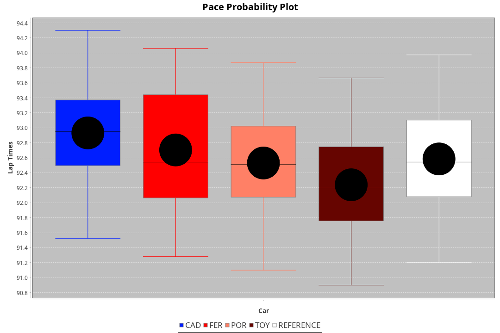
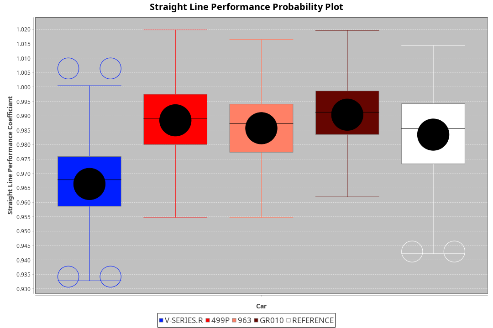
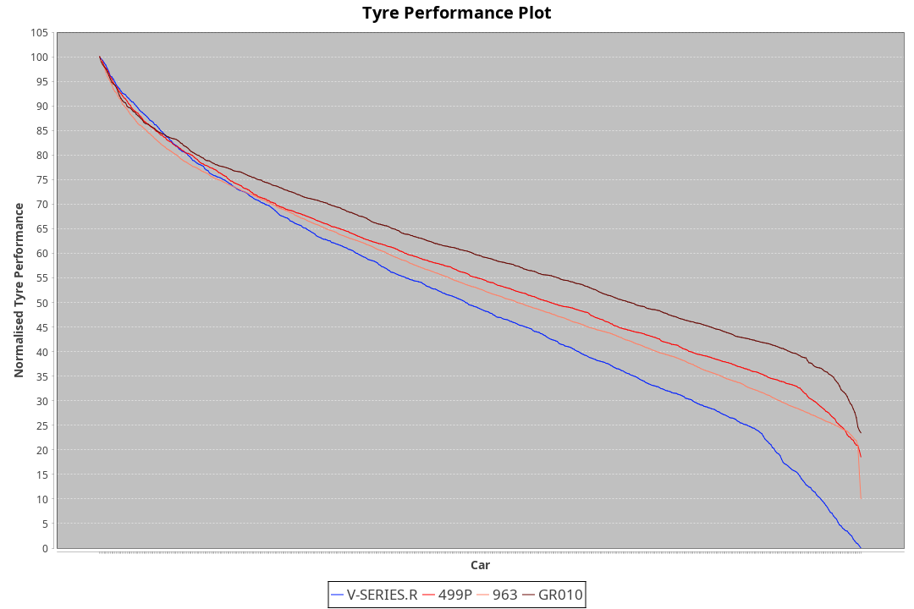

| Manufacturer | Car        | Weight | Power | PINC    | E/Stint | FDS     |
|:-|:-|:-|:-|:-|:-|:-|
| Cadillac     | V-Series.R | 1039kg | 505kw |    -    | 894MJ   |    -    |
| Ferrari      | 499P       | 1076kg | 505kw |    -    | 898MJ   | 190kph  |
| Porsche      | 963        | 1048kg | 514kw |    -    | 900MJ   |    -    |
| Toyota       | GR010      | 1080kg | 514kw |    -    | 906MJ   | 190kph  |

### BoP Accuracy: 95.79%; Overall BoP Grade: A1
| Manufacturer | Car        | Type  | RP      | QP      | Weight | Power¹ | Threshhold | PINC    | Power² | E/Stint | AVG Vmax  | FDS     | RDLC | L/Stint | BOP-Grade | Model Accuracy | Model Points | Match% |
|:-|:-|:-|:-|:-|:-|:-|:-|:-|:-|:-|:-|:-|:-|:-|:-|:-|:-|:-|
| Cadillac     | V-Series.R | LMDH  | 1:32.19 | 1:27.85 | 1039kg | 505kw  | 0.0kph     |    -    | 505kw  |  894MJ  | 323.97kph |    -    | 1.02 | 40      | +A2       | 98.95%         | 2271         | 91.94% |
| Ferrari      | 499P       | LMHHU | 1:32.16 | 1:27.79 | 1076kg | 505kw  | 0.0kph     |    -    | 505kw  |  898MJ  | 323.45kph | 190kph  | 1.02 | 40      | ~A1       | 99.93%         | 2718         | 98.51% |
| Porsche      | 963        | LMDH  | 1:32.27 | 1:27.88 | 1048kg | 514kw  | 0.0kph     |    -    | 514kw  |  900MJ  | 325.54kph |    -    | 1.01 | 41      | ~A1       | 99.98%         | 6168         | 98.11% |
| Toyota       | GR010      | LMHHU | 1:32.03 | 1:27.67 | 1080kg | 514kw  | 0.0kph     |    -    | 514kw  |  906MJ  | 324.93kph | 190kph  | 1.01 | 41      | -A2       | 98.53%         | 3557         | 94.58% |

## Power below Threshhold
| N/Nmax    | V-SERIES.R | 499P    | 963     | GR010   |
|:-|:-|:-|:-|:-|
|  0.550    |  249       |  249    |  253    |  253    |
|  0.575    |  272       |  272    |  276    |  276    |
|  0.600    |  292       |  292    |  297    |  297    |
|  0.625    |  312       |  312    |  318    |  318    |
|  0.650    |  333       |  333    |  339    |  339    |
|  0.675    |  355       |  355    |  361    |  361    |
|  0.700    |  376       |  376    |  383    |  383    |
|  0.725    |  397       |  397    |  404    |  404    |
|  0.750    |  417       |  417    |  425    |  425    |
|  0.775    |  436       |  436    |  444    |  444    |
|  0.800    |  454       |  454    |  462    |  462    |
|  0.825    |  469       |  469    |  477    |  477    |
|  0.850    |  480       |  480    |  488    |  488    |
|  0.875    |  490       |  490    |  499    |  499    |
|  0.900    |  497       |  497    |  506    |  506    |
|  0.925    |  502       |  502    |  511    |  511    |
| **0.950** | **505**    | **505** | **514** | **514** |
|  0.975    |  503       |  503    |  512    |  512    |
|  1.000    |  500       |  500    |  508    |  508    |
|  1.025    |  431       |  431    |  439    |  439    |

## Power above Threshhold
| N/Nmax    | V-SERIES.R | 499P    | 963     | GR010   |
|:-|:-|:-|:-|:-|
|  0.550    |  249       |  249    |  253    |  253    |
|  0.575    |  272       |  272    |  276    |  276    |
|  0.600    |  292       |  292    |  297    |  297    |
|  0.625    |  312       |  312    |  318    |  318    |
|  0.650    |  333       |  333    |  339    |  339    |
|  0.675    |  355       |  355    |  361    |  361    |
|  0.700    |  376       |  376    |  383    |  383    |
|  0.725    |  397       |  397    |  404    |  404    |
|  0.750    |  417       |  417    |  425    |  425    |
|  0.775    |  436       |  436    |  444    |  444    |
|  0.800    |  454       |  454    |  462    |  462    |
|  0.825    |  469       |  469    |  477    |  477    |
|  0.850    |  480       |  480    |  488    |  488    |
|  0.875    |  490       |  490    |  499    |  499    |
|  0.900    |  497       |  497    |  506    |  506    |
|  0.925    |  502       |  502    |  511    |  511    |
| **0.950** | **505**    | **505** | **514** | **514** |
|  0.975    |  503       |  503    |  512    |  512    |
|  1.000    |  500       |  500    |  508    |  508    |
|  1.025    |  431       |  431    |  439    |  439    |
