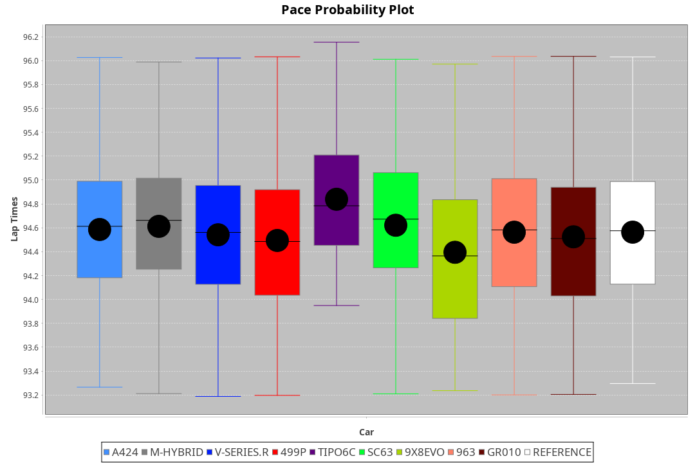
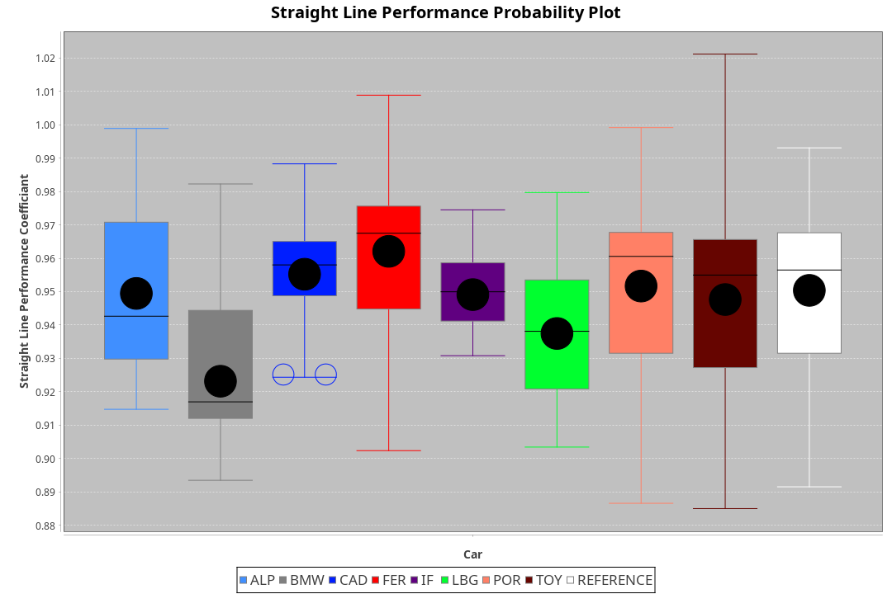
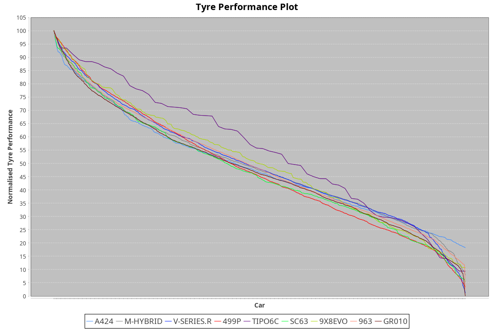

| Manufacturer     | Car        | Weight | Power   | PINC    | E/Stint | FDS     |
|:-|:-|:-|:-|:-|:-|:-|
| Alpine           | A424       | 1047kg | 519.0kw |    -    | 913MJ   |    -    |
| BMW              | M-Hybrid   | 1041kg | 510.0kw |    -    | 903MJ   |    -    |
| Cadillac         | V-Series.R | 1044kg | 507.0kw |    -    | 896MJ   |    -    |
| Ferrari          | 499P       | 1068kg | 505.0kw |    -    | 893MJ   | 190kph  |
| Isotta Fraschini | Tipo6C     | 1049kg | 520.0kw |    -    | 918MJ   | 190kph  |
| Lamborghini      | SC63       | 1035kg | 516.0kw |    -    | 904MJ   |    -    |
| Peugeot          | 9X8Evo     | 1050kg | 507.0kw |    -    | 896MJ   | 190kph  |
| Porsche          | 963        | 1048kg | 513.0kw |    -    | 899MJ   |    -    |
| Toyota           | GR010      | 1078kg | 513.0kw |    -    | 905MJ   | 190kph  |

### BoP Accuracy: 88.78%; Overall BoP Grade: B1
| Manufacturer     | Car        | Type  | RP      | QP      | Weight | Power¹  | Threshhold | PINC    | Power²   | E/Stint | AVG Vmax  | FDS     | RDLC | L/Stint | BOP-Grade | Model Accuracy | Model Points | Match%  | SimDiff |
|:-|:-|:-|:-|:-|:-|:-|:-|:-|:-|:-|:-|:-|:-|:-|:-|:-|:-|:-|:-|
| Alpine           | A424       | LMDH  | 1:34.10 | 1:30.47 | 1047kg | 519.0kw | 210.0kph   |    -    | 519.00kw |  913MJ  | 315.23kph |    -    | 1.01 | 36      | ~A1       | 100.00%        | 635          | 97.81%  | #       |
| BMW              | M-Hybrid   | LMDH  | 1:34.09 | 1:29.88 | 1041kg | 510.0kw | 210.0kph   |    -    | 510.00kw |  903MJ  | 311.76kph |    -    | 1.02 | 36      | ~A1       | 100.00%        | 1696         | 96.76%  | #       |
| Cadillac         | V-Series.R | LMDH  | 1:33.99 | 1:29.95 | 1044kg | 507.0kw | 210.0kph   |    -    | 507.00kw |  896MJ  | 306.67kph |    -    | 1.02 | 36      | ~A1       | 88.64%         | 2076         | 99.21%  | #       |
| Ferrari          | 499P       | LMHHU | 1:34.10 | 1:29.89 | 1068kg | 505.0kw | 210.0kph   |    -    | 505.00kw |  893MJ  | 309.76kph | 190kph  | 1.02 | 37      | ~A1       | 91.94%         | 2476         | 100.00% | #       |
| Isotta Fraschini | Tipo6C     | LMHHU | 1:34.75 | 1:32.43 | 1049kg | 520.0kw | 210.0kph   |    -    | 520.00kw |  918MJ  | 312.53kph | 190kph  | 1.05 | 37      | +Ω1       | 100.00%        | 66           | 25.46%  | #       |
| Lamborghini      | SC63       | LMDH  | 1:34.10 | 1:31.57 | 1035kg | 516.0kw | 210.0kph   |    -    | 516.00kw |  904MJ  | 313.44kph |    -    | 1.05 | 36      | ~A1       | 100.00%        | 504          | 95.91%  | #       |
| Peugeot          | 9X8Evo     | LMHHU | 1:34.09 | 1:30.88 | 1050kg | 507.0kw | 210.0kph   |    -    | 507.00kw |  896MJ  | 313.26kph | 190kph  | 1.00 | 37      | +B2       | 100.00%        | 249          | 83.91%  | ±0.16s  |
| Porsche          | 963        | LMDH  | 1:34.11 | 1:29.64 | 1048kg | 513.0kw | 210.0kph   |    -    | 513.00kw |  899MJ  | 310.38kph |    -    | 1.01 | 36      | ~A1       | 90.40%         | 5633         | 100.00% | #       |
| Toyota           | GR010      | LMHHU | 1:34.10 | 1:30.01 | 1078kg | 513.0kw | 210.0kph   |    -    | 513.00kw |  905MJ  | 309.31kph | 190kph  | 1.01 | 37      | ~A1       | 90.11%         | 3235         | 100.00% | #       |

## Power below Threshhold
| N/Nmax    | A424    | M-HYBRID | V-SERIES.R | 499P    | TIPO6C  | SC63    | 9X8EVO  | 963     | GR010   |
|:-|:-|:-|:-|:-|:-|:-|:-|:-|:-|
|  0.550    |  256    |  251     |  250       |  249    |  256    |  254    |  250    |  253    |  253    |
|  0.575    |  279    |  274     |  273       |  272    |  279    |  277    |  273    |  276    |  276    |
|  0.600    |  299    |  295     |  293       |  292    |  300    |  298    |  293    |  296    |  296    |
|  0.625    |  321    |  316     |  314       |  312    |  322    |  319    |  314    |  317    |  317    |
|  0.650    |  342    |  337     |  335       |  333    |  343    |  340    |  335    |  338    |  338    |
|  0.675    |  364    |  358     |  356       |  355    |  365    |  362    |  356    |  360    |  360    |
|  0.700    |  386    |  380     |  377       |  376    |  387    |  384    |  377    |  382    |  382    |
|  0.725    |  408    |  401     |  399       |  397    |  409    |  406    |  399    |  403    |  403    |
|  0.750    |  429    |  422     |  419       |  417    |  430    |  427    |  419    |  424    |  424    |
|  0.775    |  448    |  441     |  438       |  436    |  449    |  446    |  438    |  443    |  443    |
|  0.800    |  466    |  458     |  455       |  454    |  467    |  463    |  455    |  461    |  461    |
|  0.825    |  481    |  473     |  470       |  469    |  482    |  478    |  470    |  476    |  476    |
|  0.850    |  493    |  485     |  482       |  480    |  494    |  490    |  482    |  487    |  487    |
|  0.875    |  504    |  495     |  492       |  490    |  505    |  501    |  492    |  498    |  498    |
|  0.900    |  511    |  502     |  499       |  497    |  512    |  508    |  499    |  505    |  505    |
|  0.925    |  516    |  507     |  504       |  502    |  517    |  513    |  504    |  510    |  510    |
| **0.950** | **519** | **510**  | **507**    | **505** | **520** | **516** | **507** | **513** | **513** |
|  0.975    |  517    |  508     |  505       |  503    |  518    |  514    |  505    |  511    |  511    |
|  1.000    |  513    |  505     |  502       |  500    |  514    |  510    |  502    |  507    |  507    |
|  1.025    |  443    |  436     |  433       |  431    |  444    |  441    |  433    |  438    |  438    |

## Power above Threshhold
| N/Nmax    | A424    | M-HYBRID | V-SERIES.R | 499P    | TIPO6C  | SC63    | 9X8EVO  | 963     | GR010   |
|:-|:-|:-|:-|:-|:-|:-|:-|:-|:-|
|  0.550    |  256    |  251     |  250       |  249    |  256    |  254    |  250    |  253    |  253    |
|  0.575    |  279    |  274     |  273       |  272    |  279    |  277    |  273    |  276    |  276    |
|  0.600    |  299    |  295     |  293       |  292    |  300    |  298    |  293    |  296    |  296    |
|  0.625    |  321    |  316     |  314       |  312    |  322    |  319    |  314    |  317    |  317    |
|  0.650    |  342    |  337     |  335       |  333    |  343    |  340    |  335    |  338    |  338    |
|  0.675    |  364    |  358     |  356       |  355    |  365    |  362    |  356    |  360    |  360    |
|  0.700    |  386    |  380     |  377       |  376    |  387    |  384    |  377    |  382    |  382    |
|  0.725    |  408    |  401     |  399       |  397    |  409    |  406    |  399    |  403    |  403    |
|  0.750    |  429    |  422     |  419       |  417    |  430    |  427    |  419    |  424    |  424    |
|  0.775    |  448    |  441     |  438       |  436    |  449    |  446    |  438    |  443    |  443    |
|  0.800    |  466    |  458     |  455       |  454    |  467    |  463    |  455    |  461    |  461    |
|  0.825    |  481    |  473     |  470       |  469    |  482    |  478    |  470    |  476    |  476    |
|  0.850    |  493    |  485     |  482       |  480    |  494    |  490    |  482    |  487    |  487    |
|  0.875    |  504    |  495     |  492       |  490    |  505    |  501    |  492    |  498    |  498    |
|  0.900    |  511    |  502     |  499       |  497    |  512    |  508    |  499    |  505    |  505    |
|  0.925    |  516    |  507     |  504       |  502    |  517    |  513    |  504    |  510    |  510    |
| **0.950** | **519** | **510**  | **507**    | **505** | **520** | **516** | **507** | **513** | **513** |
|  0.975    |  517    |  508     |  505       |  503    |  518    |  514    |  505    |  511    |  511    |
|  1.000    |  513    |  505     |  502       |  500    |  514    |  510    |  502    |  507    |  507    |
|  1.025    |  443    |  436     |  433       |  431    |  444    |  441    |  433    |  438    |  438    |
