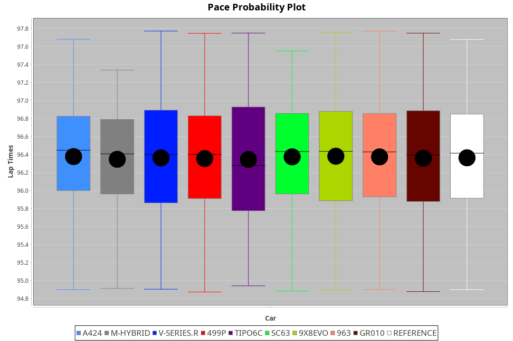
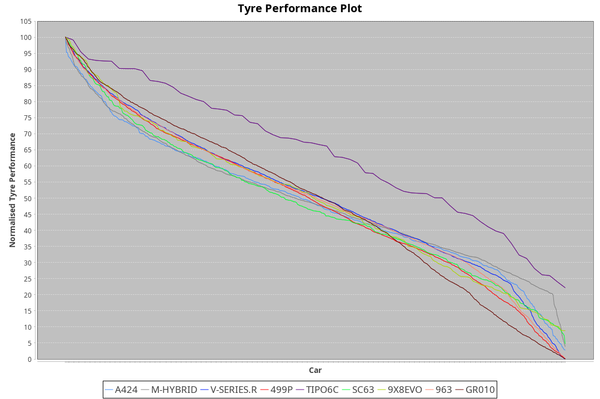

|Manufacturer|Car|Type|RP|QP|Weight|Power¹|Threshhold|PINC|Power²|E/Stint|AVG Vmax|FDS|RDLC|L/Stint|BOP-Grade|ModelAccuracy|ModelPoints|Match%|
|:-|:-|:-|:-|:-|:-|:-|:-|:-|:-|:-|:-|:-|:-|:-|:-|:-|:-|:-|
|Alpine|A424|LMDH|1:35.50|1:31.42|1030kg|509kw|210.0kph|0%|509kw|899MJ|292.32kph-311.38kph|-|1.03|37|~A1|81.46%|523|100.00%|
|BMW|M Hybrid V8 LMDh|LMDH|1:35.49|1:31.39|1043kg|513kw|210.0kph|0%|513kw|897MJ|288.18kph-309.99kph|-|1.02|37|~A1|98.60%|1690|100.00%|
|Cadillac|V-Series.R|LMDH|1:35.50|1:31.66|1038kg|508kw|210.0kph|0%|508kw|882MJ|286.90kph-309.37kph|-|1.02|37|~A1|98.38%|1765|96.65%|
|Ferrari|499P|LMHHU|1:35.48|1:31.61|1059kg|504kw|210.0kph|0%|504kw|886MJ|289.94kph-310.61kph|190kph|1.03|37|~A1|92.24%|2247|100.00%|
|Issotta Fraschini|Tipo6C|LMHHU|1:35.54|1:32.17|1030kg|520kw|210.0kph|0%|520kw|917MJ|294.85kph-304.71kph|170kph|1.08|37|+A2|66.67%|96|92.46%|
|Lamborghini|SC63|LMDH|1:35.49|1:31.31|1059kg|520kw|210.0kph|0%|520kw|901MJ|289.36kph-306.15kph|-|1.03|37|~A1|96.77%|419|96.00%|
|Porsche|963|LMDH|1:35.49|1:31.66|1036kg|510kw|210.0kph|0%|510kw|892MJ|288.90kph-310.56kph|-|1.02|37|~A1|96.81%|5438|100.00%|
|Toyota|GR010 - Hybrid|LMHHU|1:35.49|1:31.46|1064kg|509kw|210.0kph|0%|509kw|901MJ|287.68kph-317.16kph|190kph|1.03|37|~A1|86.04%|1751|100.00%|

### BoP Accuracy: 98.14%; Overall BoP Grade: A1

## Power below Threshhold
|N/Nmax|TOY|FER|CAD|POR|IF|BMW|ALP|LBG|
|:-|:-|:-|:-|:-|:-|:-|:-|:-|
|0.550|251|248|250|251|256|253|251|256|
|0.575|274|271|273|274|279|276|274|279|
|0.600|294|291|293|295|300|296|294|300|
|0.625|315|312|314|316|322|317|315|322|
|0.650|336|333|335|337|343|338|336|343|
|0.675|357|354|357|358|365|360|357|365|
|0.700|379|375|378|380|387|382|379|387|
|0.725|400|396|399|401|409|403|400|409|
|0.750|421|416|420|422|430|424|421|430|
|0.775|440|435|439|441|449|443|440|449|
|0.800|457|453|456|458|467|461|457|467|
|0.825|472|468|471|473|482|476|472|482|
|0.850|484|479|483|485|494|487|484|494|
|0.875|494|489|493|495|505|498|494|505|
|0.900|501|496|500|502|512|505|501|512|
|0.925|506|501|505|507|517|510|506|517|
|**0.950**|**509**|**504**|**508**|**510**|**520**|**513**|**509**|**520**|
|0.975|507|502|506|508|518|511|507|518|
|1.000|504|499|503|505|514|507|504|514|
|1.025|435|430|434|436|444|438|435|444|

## Power above Threshhold
|N/Nmax|TOY|FER|CAD|POR|IF|BMW|ALP|LBG|
|:-|:-|:-|:-|:-|:-|:-|:-|:-|
|0.550|251|248|250|251|256|253|251|256|
|0.575|274|271|273|274|279|276|274|279|
|0.600|294|291|293|295|300|296|294|300|
|0.625|315|312|314|316|322|317|315|322|
|0.650|336|333|335|337|343|338|336|343|
|0.675|357|354|357|358|365|360|357|365|
|0.700|379|375|378|380|387|382|379|387|
|0.725|400|396|399|401|409|403|400|409|
|0.750|421|416|420|422|430|424|421|430|
|0.775|440|435|439|441|449|443|440|449|
|0.800|457|453|456|458|467|461|457|467|
|0.825|472|468|471|473|482|476|472|482|
|0.850|484|479|483|485|494|487|484|494|
|0.875|494|489|493|495|505|498|494|505|
|0.900|501|496|500|502|512|505|501|512|
|0.925|506|501|505|507|517|510|506|517|
|**0.950**|**509**|**504**|**508**|**510**|**520**|**513**|**509**|**520**|
|0.975|507|502|506|508|518|511|507|518|
|1.000|504|499|503|505|514|507|504|514|
|1.025|435|430|434|436|444|438|435|444|
