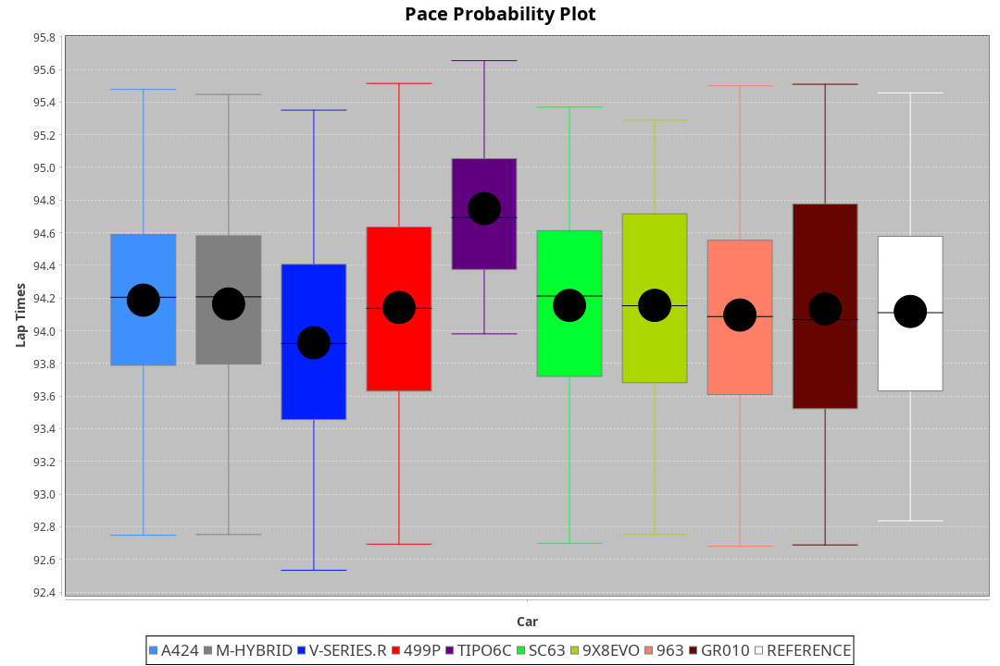
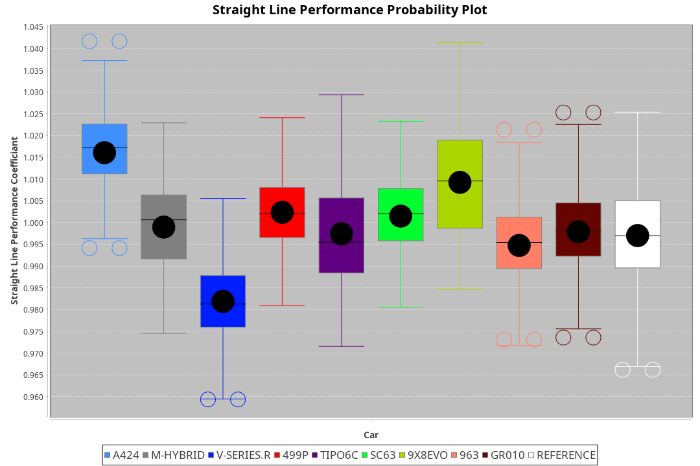
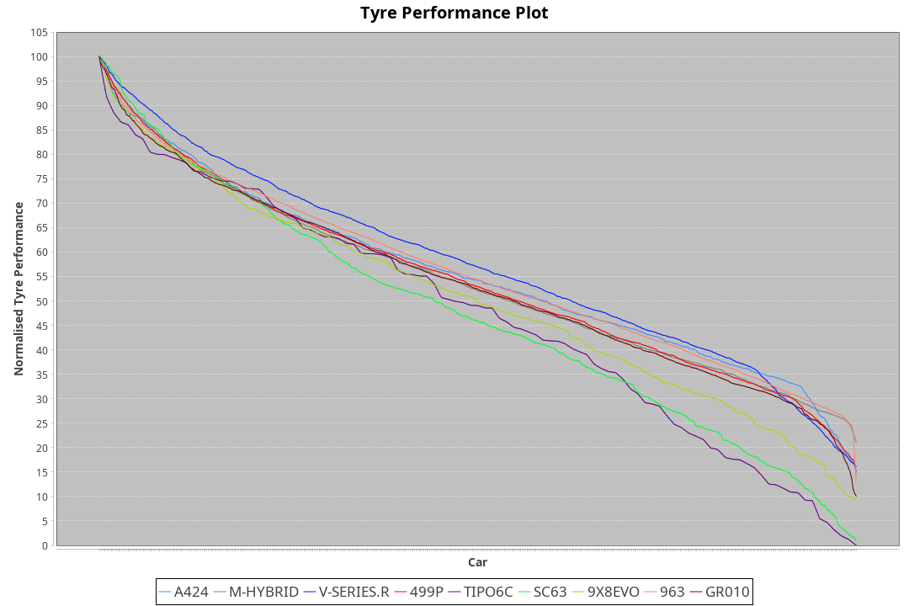

| Manufacturer     | Car        | Weight | Power   | PINC    | E/Stint | FDS     |
|:-|:-|:-|:-|:-|:-|:-|
| Alpine           | A424       | 1039kg | 510.0kw |    -    | 905MJ   |    -    |
| BMW              | M-Hybrid   | 1041kg | 510.0kw | -1.00%  | 901MJ   |    -    |
| Cadillac         | V-Series.R | 1044kg | 507.0kw | 1.00%   | 898MJ   |    -    |
| Ferrari          | 499P       | 1063kg | 508.0kw | -1.00%  | 897MJ   | 190kph  |
| Isotta Fraschini | Tipo6C     | 1049kg | 520.0kw |    -    | 916MJ   | 190kph  |
| Lamborghini      | SC63       | 1035kg | 515.0kw |    -    | 906MJ   |    -    |
| Peugeot          | 9X8Evo     | 1050kg | 510.0kw | -1.00%  | 903MJ   | 190kph  |
| Porsche          | 963        | 1048kg | 513.0kw | -1.00%  | 897MJ   |    -    |
| Toyota           | GR010      | 1078kg | 513.0kw |    -    | 905MJ   | 190kph  |

### BoP Accuracy: 94.20%; Overall BoP Grade: A2
| Manufacturer     | Car        | Type  | RP      | QP      | Weight | Power¹  | Threshhold | PINC    | Power²   | E/Stint | AVG Vmax  | FDS     | RDLC | L/Stint | BOP-Grade | Model Accuracy | Model Points | Match%  | SimDiff |
|:-|:-|:-|:-|:-|:-|:-|:-|:-|:-|:-|:-|:-|:-|:-|:-|:-|:-|:-|:-|
| Alpine           | A424       | LMDH  | 1:34.62 | 1:30.63 | 1039kg | 510.0kw | 210.0kph   |    -    | 510.00kw |  905MJ  | 313.61kph |    -    | 1.02 | 37      | ~A1       | 86.43%         | 618          | 98.39%  | ±0.05s  |
| BMW              | M-Hybrid   | LMDH  | 1:34.76 | 1:30.35 | 1041kg | 510.0kw | 210.0kph   | -1.00%  | 504.90kw |  901MJ  | 309.69kph |    -    | 1.02 | 37      | +B1       | 93.77%         | 1672         | 88.76%  | ±0.16s  |
| Cadillac         | V-Series.R | LMDH  | 1:34.57 | 1:30.57 | 1044kg | 507.0kw | 210.0kph   | 1.00%   | 512.10kw |  898MJ  | 307.28kph |    -    | 1.02 | 37      | ~A1       | 83.12%         | 1921         | 100.00% | ±0.38s  |
| Ferrari          | 499P       | LMHHU | 1:34.73 | 1:30.58 | 1063kg | 508.0kw | 210.0kph   | -1.00%  | 502.90kw |  897MJ  | 309.94kph | 190kph  | 1.02 | 37      | ~A1       | 69.49%         | 1950         | 100.00% | ±0.40s  |
| Isotta Fraschini | Tipo6C     | LMHHU | 1:34.94 | 1:32.29 | 1049kg | 520.0kw | 210.0kph   |    -    | 520.00kw |  916MJ  | 309.75kph | 190kph  | 1.06 | 37      | +D2       | 73.56%         | 64           | 64.18%  | ±0.21s  |
| Lamborghini      | SC63       | LMDH  | 1:34.62 | 1:32.10 | 1035kg | 515.0kw | 210.0kph   |    -    | 515.00kw |  906MJ  | 311.24kph |    -    | 1.05 | 37      | ~A1       | 95.82%         | 459          | 96.51%  | ±0.13s  |
| Peugeot          | 9X8Evo     | LMHHU | 1:34.75 | 1:30.65 | 1050kg | 510.0kw | 210.0kph   | -1.00%  | 504.90kw |  903MJ  | 310.09kph | 190kph  | 1.01 | 37      | ~A1       | 66.97%         | 221          | 100.00% | ±0.46s  |
| Porsche          | 963        | LMDH  | 1:34.62 | 1:30.43 | 1048kg | 513.0kw | 210.0kph   | -1.00%  | 507.90kw |  897MJ  | 309.56kph |    -    | 1.01 | 37      | ~A1       | 81.02%         | 5243         | 100.00% | ±0.37s  |
| Toyota           | GR010      | LMHHU | 1:34.62 | 1:30.61 | 1078kg | 513.0kw | 210.0kph   |    -    | 513.00kw |  905MJ  | 309.00kph | 190kph  | 1.01 | 37      | ~A1       | 73.70%         | 2701         | 100.00% | ±0.23s  |

## Power below Threshhold
| N/Nmax    | A424    | M-HYBRID | V-SERIES.R | 499P    | TIPO6C  | SC63    | 9X8EVO  | 963     | GR010   |
|:-|:-|:-|:-|:-|:-|:-|:-|:-|:-|
|  0.550    |  251    |  251     |  250       |  250    |  256    |  254    |  251    |  253    |  253    |
|  0.575    |  274    |  274     |  273       |  273    |  279    |  277    |  274    |  276    |  276    |
|  0.600    |  295    |  295     |  293       |  293    |  300    |  297    |  295    |  296    |  296    |
|  0.625    |  316    |  316     |  314       |  314    |  322    |  319    |  316    |  317    |  317    |
|  0.650    |  337    |  337     |  335       |  335    |  343    |  340    |  337    |  338    |  338    |
|  0.675    |  358    |  358     |  356       |  357    |  365    |  362    |  358    |  360    |  360    |
|  0.700    |  380    |  380     |  377       |  378    |  387    |  383    |  380    |  382    |  382    |
|  0.725    |  401    |  401     |  399       |  399    |  409    |  405    |  401    |  403    |  403    |
|  0.750    |  422    |  422     |  419       |  420    |  430    |  426    |  422    |  424    |  424    |
|  0.775    |  441    |  441     |  438       |  439    |  449    |  445    |  441    |  443    |  443    |
|  0.800    |  458    |  458     |  455       |  456    |  467    |  463    |  458    |  461    |  461    |
|  0.825    |  473    |  473     |  470       |  471    |  482    |  478    |  473    |  476    |  476    |
|  0.850    |  485    |  485     |  482       |  483    |  494    |  489    |  485    |  487    |  487    |
|  0.875    |  495    |  495     |  492       |  493    |  505    |  500    |  495    |  498    |  498    |
|  0.900    |  502    |  502     |  499       |  500    |  512    |  507    |  502    |  505    |  505    |
|  0.925    |  507    |  507     |  504       |  505    |  517    |  512    |  507    |  510    |  510    |
| **0.950** | **510** | **510**  | **507**    | **508** | **520** | **515** | **510** | **513** | **513** |
|  0.975    |  508    |  508     |  505       |  506    |  518    |  513    |  508    |  511    |  511    |
|  1.000    |  505    |  505     |  502       |  503    |  514    |  509    |  505    |  507    |  507    |
|  1.025    |  436    |  436     |  433       |  434    |  444    |  440    |  436    |  438    |  438    |

## Power above Threshhold
| N/Nmax    | A424    | M-HYBRID   | V-SERIES.R | 499P       | TIPO6C  | SC63    | 9X8EVO     | 963        | GR010   |
|:-|:-|:-|:-|:-|:-|:-|:-|:-|:-|
|  0.550    |  251    |  248.44    |  252.03    |  247.45    |  256    |  254    |  248.44    |  250.43    |  253    |
|  0.575    |  274    |  271.48    |  275.04    |  270.49    |  279    |  277    |  271.48    |  273.47    |  276    |
|  0.600    |  295    |  291.52    |  296.04    |  290.53    |  300    |  297    |  291.52    |  293.50    |  296    |
|  0.625    |  316    |  312.56    |  317.04    |  310.57    |  322    |  319    |  312.56    |  314.54    |  317    |
|  0.650    |  337    |  333.59    |  338.05    |  331.61    |  343    |  340    |  333.59    |  335.57    |  338    |
|  0.675    |  358    |  354.63    |  359.05    |  352.65    |  365    |  362    |  354.63    |  356.61    |  360    |
|  0.700    |  380    |  375.67    |  381.05    |  374.69    |  387    |  383    |  375.67    |  377.65    |  382    |
|  0.725    |  401    |  396.71    |  403.06    |  395.72    |  409    |  405    |  396.71    |  399.68    |  403    |
|  0.750    |  422    |  416.74    |  423.06    |  415.76    |  430    |  426    |  416.74    |  419.72    |  424    |
|  0.775    |  441    |  435.78    |  442.06    |  434.80    |  449    |  445    |  435.78    |  438.75    |  443    |
|  0.800    |  458    |  453.81    |  460.06    |  451.83    |  467    |  463    |  453.81    |  455.78    |  461    |
|  0.825    |  473    |  468.84    |  475.06    |  466.85    |  482    |  478    |  468.84    |  470.81    |  476    |
|  0.850    |  485    |  479.86    |  486.07    |  477.87    |  494    |  489    |  479.86    |  482.83    |  487    |
|  0.875    |  495    |  489.87    |  497.07    |  487.89    |  505    |  500    |  489.87    |  492.84    |  498    |
|  0.900    |  502    |  496.89    |  504.07    |  494.91    |  512    |  507    |  496.89    |  499.86    |  505    |
|  0.925    |  507    |  501.89    |  509.07    |  499.91    |  517    |  512    |  501.89    |  504.86    |  510    |
| **0.950** | **510** | **504.90** | **512.07** | **502.92** | **520** | **515** | **504.90** | **507.87** | **513** |
|  0.975    |  508    |  502.90    |  510.07    |  500.92    |  518    |  513    |  502.90    |  505.87    |  511    |
|  1.000    |  505    |  499.89    |  506.07    |  497.91    |  514    |  509    |  499.89    |  502.86    |  507    |
|  1.025    |  436    |  430.77    |  437.06    |  429.79    |  444    |  440    |  430.77    |  433.74    |  438    |
