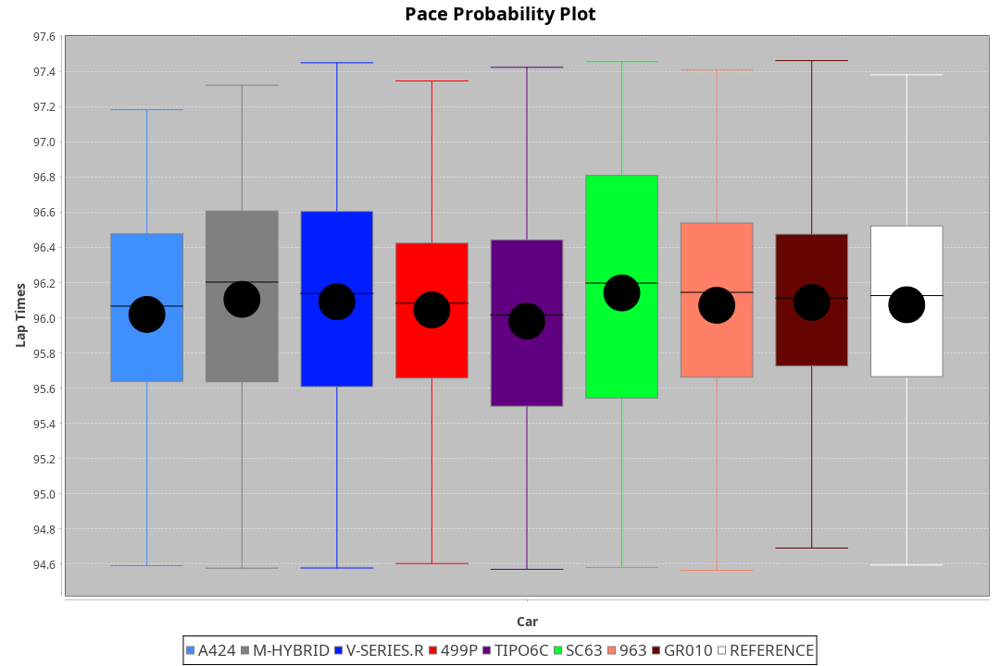
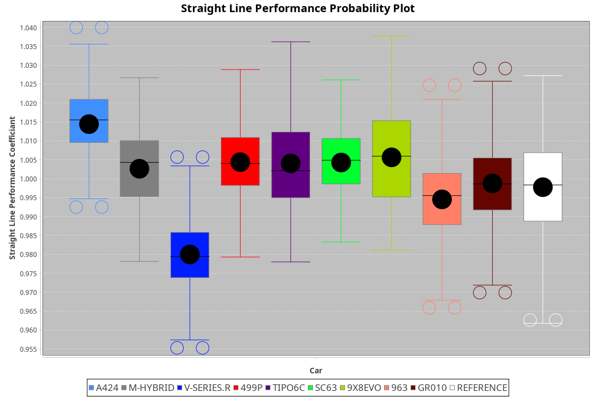
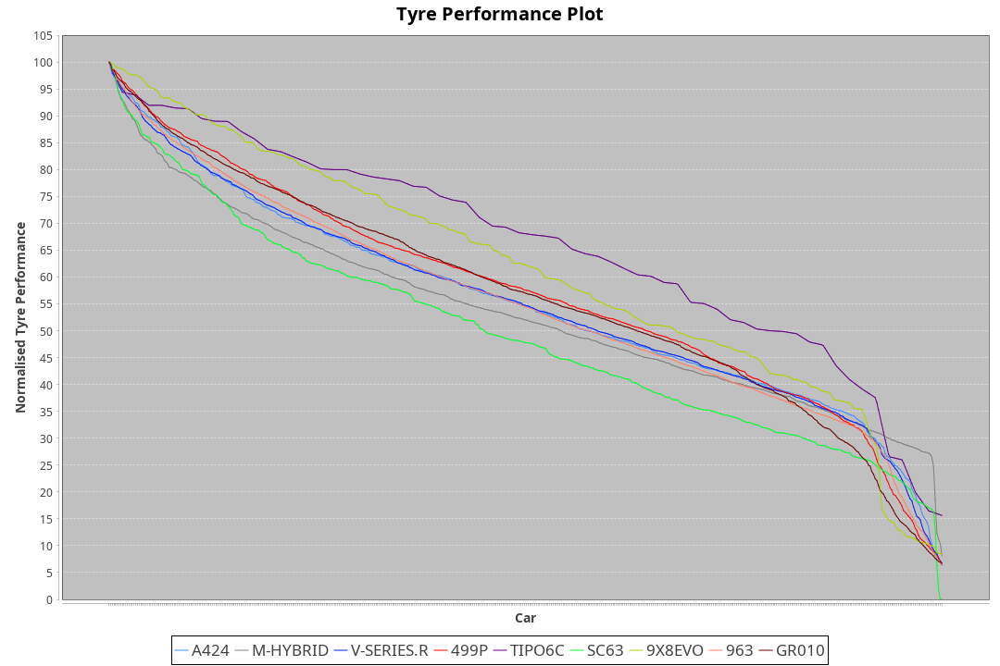

|Manufacturer|Car|Weight|Power|PINC|E/Stint|FDS|
|:-|:-|:-|:-|:-|:-|:-|
|Alpine|A424|1030kg|518kw|-4%|899MJ|-|
|BMW|M Hybrid V8 LMDh|1043kg|509kw|2%|897MJ|-|
|Cadillac|V-Series.R|1038kg|515kw|-3%|882MJ|-|
|Ferrari|499P|1059kg|520kw|-7%|886MJ|190kph|
|Issotta Fraschini|Tipo6C|1030kg|520kw|-|917MJ|170kph|
|Lamborghini|SC63|1059kg|520kw|-|901MJ|-|
|Porsche|963|1036kg|519kw|-4%|892MJ|-|
|Toyota|GR010 - Hybrid|1064kg|507kw|1%|901MJ|190kph|

### BoP Accuracy: 98.14%; Overall BoP Grade: A1

|Manufacturer|Car|Type|RP|QP|Weight|Power¹|Threshhold|PINC|Power²|E/Stint|AVG Vmax|FDS|RDLC|L/Stint|BOP-Grade|ModelAccuracy|ModelPoints|Match%|
|:-|:-|:-|:-|:-|:-|:-|:-|:-|:-|:-|:-|:-|:-|:-|:-|:-|:-|:-|
|Alpine|A424|LMDH|1:35.50|1:31.42|1030kg|518kw|210.0kph|-4%|497kw|899MJ|295.09kph|-|1.03|37|~A1|81.46%|523|100.00%|
|BMW|M Hybrid V8 LMDh|LMDH|1:35.49|1:31.39|1043kg|509kw|210.0kph|2%|519kw|897MJ|291.76kph|-|1.02|37|~A1|98.60%|1690|100.00%|
|Cadillac|V-Series.R|LMDH|1:35.50|1:31.66|1038kg|515kw|210.0kph|-3%|500kw|882MJ|294.52kph|-|1.02|37|~A1|98.38%|1765|96.65%|
|Ferrari|499P|LMHHU|1:35.48|1:31.61|1059kg|520kw|210.0kph|-7%|484kw|886MJ|294.72kph|190kph|1.03|37|~A1|92.24%|2247|100.00%|
|Issotta Fraschini|Tipo6C|LMHHU|1:35.54|1:32.17|1030kg|520kw|210.0kph|-|520kw|917MJ|296.77kph|170kph|1.08|37|+A2|66.67%|96|92.46%|
|Lamborghini|SC63|LMDH|1:35.49|1:31.31|1059kg|520kw|210.0kph|-|520kw|901MJ|292.95kph|-|1.03|37|~A1|96.77%|419|96.00%|
|Porsche|963|LMDH|1:35.49|1:31.66|1036kg|519kw|210.0kph|-4%|498kw|892MJ|294.93kph|-|1.02|37|~A1|96.81%|5438|100.00%|
|Toyota|GR010 - Hybrid|LMHHU|1:35.49|1:31.46|1064kg|507kw|210.0kph|1%|512kw|901MJ|294.60kph|190kph|1.03|37|~A1|86.04%|1751|100.00%|

## Power below Threshhold
|N/Nmax|ALP|BMW|CAD|FER|IF|LBG|POR|TOY|
|:-|:-|:-|:-|:-|:-|:-|:-|:-|
|0.550|255|251|254|256|256|256|256|250|
|0.575|278|274|277|279|279|279|279|273|
|0.600|299|294|297|300|300|300|299|293|
|0.625|321|315|319|322|322|322|321|314|
|0.650|342|336|340|343|343|343|342|335|
|0.675|364|357|362|365|365|365|364|356|
|0.700|386|379|383|387|387|387|386|377|
|0.725|407|400|405|409|409|409|408|399|
|0.750|428|421|426|430|430|430|429|419|
|0.775|447|440|445|449|449|449|448|438|
|0.800|465|457|463|467|467|467|466|455|
|0.825|480|472|478|482|482|482|481|470|
|0.850|492|484|489|494|494|494|493|482|
|0.875|503|494|500|505|505|505|504|492|
|0.900|510|501|507|512|512|512|511|499|
|0.925|515|506|512|517|517|517|516|504|
|**0.950**|**518**|**509**|**515**|**520**|**520**|**520**|**519**|**507**|
|0.975|516|507|513|518|518|518|517|505|
|1.000|512|504|509|514|514|514|513|502|
|1.025|442|435|440|444|444|444|443|433|

## Power above Threshhold
|N/Nmax|ALP|BMW|CAD|FER|IF|LBG|POR|TOY|
|:-|:-|:-|:-|:-|:-|:-|:-|:-|
|0.550|245|256|246|238|256|256|245|252|
|0.575|267|279|269|260|279|279|268|275|
|0.600|287|299|289|279|300|300|288|296|
|0.625|307|321|309|299|322|322|308|317|
|0.650|328|342|330|320|343|343|329|338|
|0.675|349|364|351|340|365|365|350|359|
|0.700|370|386|372|361|387|387|371|381|
|0.725|391|408|393|381|409|409|392|403|
|0.750|411|429|413|400|430|430|411|423|
|0.775|429|448|432|418|449|449|430|442|
|0.800|446|466|449|435|467|467|447|460|
|0.825|461|481|464|449|482|482|462|475|
|0.850|472|493|475|460|494|494|473|486|
|0.875|482|504|485|470|505|505|483|497|
|0.900|489|511|492|476|512|512|490|504|
|0.925|494|516|497|481|517|517|495|509|
|**0.950**|**497**|**519**|**500**|**484**|**520**|**520**|**498**|**512**|
|0.975|495|517|498|482|518|518|496|510|
|1.000|492|513|495|479|514|514|493|506|
|1.025|424|443|427|413|444|444|425|437|
