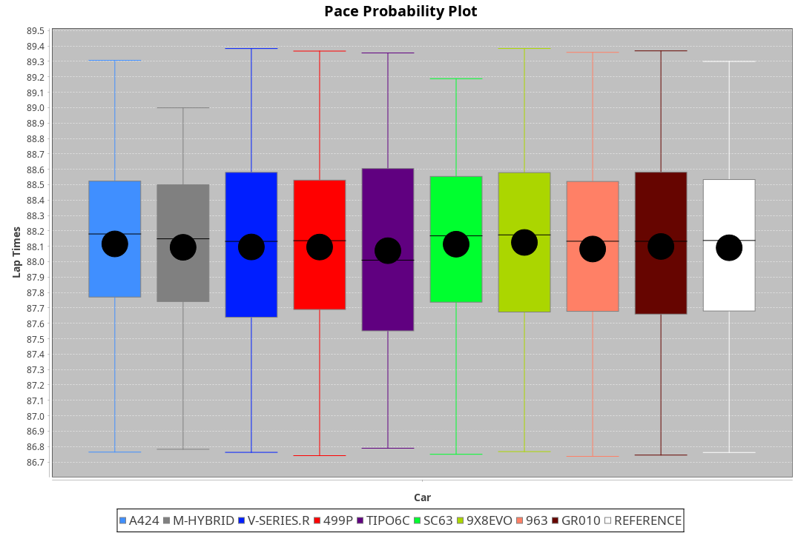
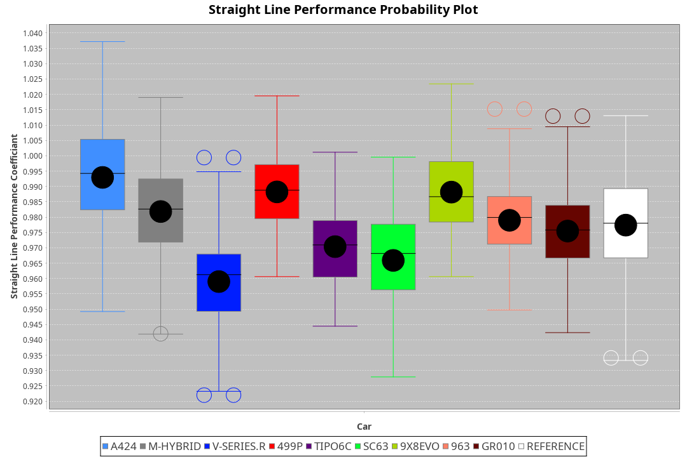
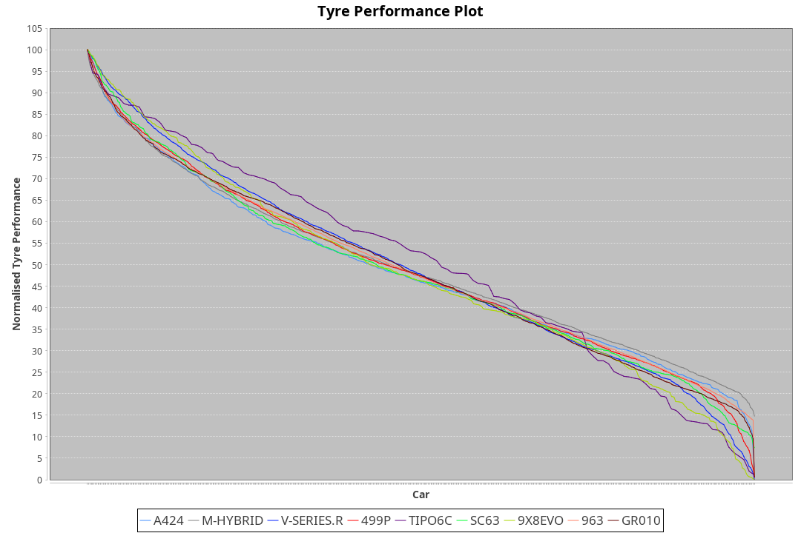

| Manufacturer     | Car        | Weight | Power   | PINC    | E/Stint | FDS     |
|:-|:-|:-|:-|:-|:-|:-|
| Alpine           | A424       | 1049kg | 480.0kw |    -    | 878MJ   |    -    |
| BMW              | M-Hybrid   | 1047kg | 480.0kw |    -    | 876MJ   |    -    |
| Cadillac         | V-Series.R | 1056kg | 480.0kw |    -    | 873MJ   |    -    |
| Ferrari          | 499P       | 1068kg | 480.0kw |    -    | 870MJ   | 190kph  |
| Isotta Fraschini | Tipo6C     | 1081kg | 520.0kw |    -    | 919MJ   | 190kph  |
| Lamborghini      | SC63       | 1062kg | 498.0kw |    -    | 891MJ   |    -    |
| Peugeot          | 9X8Evo     | 1050kg | 480.0kw |    -    | 872MJ   | 190kph  |
| Porsche          | 963        | 1056kg | 480.0kw |    -    | 871MJ   |    -    |
| Toyota           | GR010      | 1070kg | 480.0kw |    -    | 875MJ   | 190kph  |

### BoP Accuracy: 95.19%; Overall BoP Grade: A1
| Manufacturer     | Car        | Type  | RP      | QP      | Weight | Power¹  | Threshhold | PINC    | Power²   | E/Stint | AVG Vmax  | FDS     | RDLC | L/Stint | BOP-Grade | Model Accuracy | Model Points | Match%  | SimDiff |
|:-|:-|:-|:-|:-|:-|:-|:-|:-|:-|:-|:-|:-|:-|:-|:-|:-|:-|:-|:-|
| Alpine           | A424       | LMDH  | 1:28.08 | 1:25.54 | 1049kg | 480.0kw | 0.0kph     |    -    | 480.00kw |  878MJ  | 303.91kph |    -    | 1.01 | 43      | ~A1       | 100.00%        | 946          | 97.45%  | #       |
| BMW              | M-Hybrid   | LMDH  | 1:28.08 | 1:25.28 | 1047kg | 480.0kw | 0.0kph     |    -    | 480.00kw |  876MJ  | 301.90kph |    -    | 1.02 | 43      | -A2       | 100.00%        | 1998         | 91.05%  | #       |
| Cadillac         | V-Series.R | LMDH  | 1:28.07 | 1:25.52 | 1056kg | 480.0kw | 0.0kph     |    -    | 480.00kw |  873MJ  | 298.63kph |    -    | 1.01 | 43      | ~A1       | 98.11%         | 3991         | 95.75%  | #       |
| Ferrari          | 499P       | LMHHU | 1:28.06 | 1:25.39 | 1068kg | 480.0kw | 0.0kph     |    -    | 480.00kw |  870MJ  | 303.07kph | 190kph  | 1.02 | 43      | ~A1       | 98.72%         | 4180         | 100.00% | #       |
| Isotta Fraschini | Tipo6C     | LMHHU | 1:28.07 | 1:26.70 | 1081kg | 520.0kw | 0.0kph     |    -    | 520.00kw |  919MJ  | 306.66kph | 190kph  | 1.02 | 43      | +C1       | 97.73%         | 129          | 77.22%  | #       |
| Lamborghini      | SC63       | LMDH  | 1:28.07 | 1:25.92 | 1062kg | 498.0kw | 0.0kph     |    -    | 498.00kw |  891MJ  | 302.94kph |    -    | 1.02 | 43      | ~A1       | 100.00%        | 784          | 96.58%  | #       |
| Peugeot          | 9X8Evo     | LMHHU | 1:28.08 | 1:25.74 | 1050kg | 480.0kw | 0.0kph     |    -    | 480.00kw |  872MJ  | 303.50kph | 190kph  | 1.01 | 43      | ~A1       | 100.00%        | 636          | 98.68%  | #       |
| Porsche          | 963        | LMDH  | 1:28.05 | 1:25.14 | 1056kg | 480.0kw | 0.0kph     |    -    | 480.00kw |  871MJ  | 301.85kph |    -    | 1.01 | 43      | ~A1       | 99.91%         | 11713        | 100.00% | #       |
| Toyota           | GR010      | LMHHU | 1:28.06 | 1:25.25 | 1070kg | 480.0kw | 0.0kph     |    -    | 480.00kw |  875MJ  | 302.47kph | 190kph  | 1.02 | 43      | ~A1       | 99.90%         | 3123         | 100.00% | #       |

## Power below Threshhold
| N/Nmax    | A424    | M-HYBRID | V-SERIES.R | 499P    | TIPO6C  | SC63    | 9X8EVO  | 963     | GR010   |
|:-|:-|:-|:-|:-|:-|:-|:-|:-|:-|
|  0.550    |  236    |  236     |  236       |  236    |  256    |  245    |  236    |  236    |  236    |
|  0.575    |  258    |  258     |  258       |  258    |  279    |  268    |  258    |  258    |  258    |
|  0.600    |  277    |  277     |  277       |  277    |  300    |  288    |  277    |  277    |  277    |
|  0.625    |  297    |  297     |  297       |  297    |  322    |  308    |  297    |  297    |  297    |
|  0.650    |  317    |  317     |  317       |  317    |  343    |  329    |  317    |  317    |  317    |
|  0.675    |  337    |  337     |  337       |  337    |  365    |  350    |  337    |  337    |  337    |
|  0.700    |  358    |  358     |  358       |  358    |  387    |  371    |  358    |  358    |  358    |
|  0.725    |  378    |  378     |  378       |  378    |  409    |  392    |  378    |  378    |  378    |
|  0.750    |  397    |  397     |  397       |  397    |  430    |  411    |  397    |  397    |  397    |
|  0.775    |  415    |  415     |  415       |  415    |  449    |  430    |  415    |  415    |  415    |
|  0.800    |  431    |  431     |  431       |  431    |  467    |  447    |  431    |  431    |  431    |
|  0.825    |  445    |  445     |  445       |  445    |  482    |  462    |  445    |  445    |  445    |
|  0.850    |  456    |  456     |  456       |  456    |  494    |  473    |  456    |  456    |  456    |
|  0.875    |  466    |  466     |  466       |  466    |  505    |  483    |  466    |  466    |  466    |
|  0.900    |  472    |  472     |  472       |  472    |  512    |  490    |  472    |  472    |  472    |
|  0.925    |  477    |  477     |  477       |  477    |  517    |  495    |  477    |  477    |  477    |
| **0.950** | **480** | **480**  | **480**    | **480** | **520** | **498** | **480** | **480** | **480** |
|  0.975    |  478    |  478     |  478       |  478    |  518    |  496    |  478    |  478    |  478    |
|  1.000    |  475    |  475     |  475       |  475    |  514    |  493    |  475    |  475    |  475    |
|  1.025    |  410    |  410     |  410       |  410    |  444    |  425    |  410    |  410    |  410    |

## Power above Threshhold
| N/Nmax    | A424    | M-HYBRID | V-SERIES.R | 499P    | TIPO6C  | SC63    | 9X8EVO  | 963     | GR010   |
|:-|:-|:-|:-|:-|:-|:-|:-|:-|:-|
|  0.550    |  236    |  236     |  236       |  236    |  256    |  245    |  236    |  236    |  236    |
|  0.575    |  258    |  258     |  258       |  258    |  279    |  268    |  258    |  258    |  258    |
|  0.600    |  277    |  277     |  277       |  277    |  300    |  288    |  277    |  277    |  277    |
|  0.625    |  297    |  297     |  297       |  297    |  322    |  308    |  297    |  297    |  297    |
|  0.650    |  317    |  317     |  317       |  317    |  343    |  329    |  317    |  317    |  317    |
|  0.675    |  337    |  337     |  337       |  337    |  365    |  350    |  337    |  337    |  337    |
|  0.700    |  358    |  358     |  358       |  358    |  387    |  371    |  358    |  358    |  358    |
|  0.725    |  378    |  378     |  378       |  378    |  409    |  392    |  378    |  378    |  378    |
|  0.750    |  397    |  397     |  397       |  397    |  430    |  411    |  397    |  397    |  397    |
|  0.775    |  415    |  415     |  415       |  415    |  449    |  430    |  415    |  415    |  415    |
|  0.800    |  431    |  431     |  431       |  431    |  467    |  447    |  431    |  431    |  431    |
|  0.825    |  445    |  445     |  445       |  445    |  482    |  462    |  445    |  445    |  445    |
|  0.850    |  456    |  456     |  456       |  456    |  494    |  473    |  456    |  456    |  456    |
|  0.875    |  466    |  466     |  466       |  466    |  505    |  483    |  466    |  466    |  466    |
|  0.900    |  472    |  472     |  472       |  472    |  512    |  490    |  472    |  472    |  472    |
|  0.925    |  477    |  477     |  477       |  477    |  517    |  495    |  477    |  477    |  477    |
| **0.950** | **480** | **480**  | **480**    | **480** | **520** | **498** | **480** | **480** | **480** |
|  0.975    |  478    |  478     |  478       |  478    |  518    |  496    |  478    |  478    |  478    |
|  1.000    |  475    |  475     |  475       |  475    |  514    |  493    |  475    |  475    |  475    |
|  1.025    |  410    |  410     |  410       |  410    |  444    |  425    |  410    |  410    |  410    |
