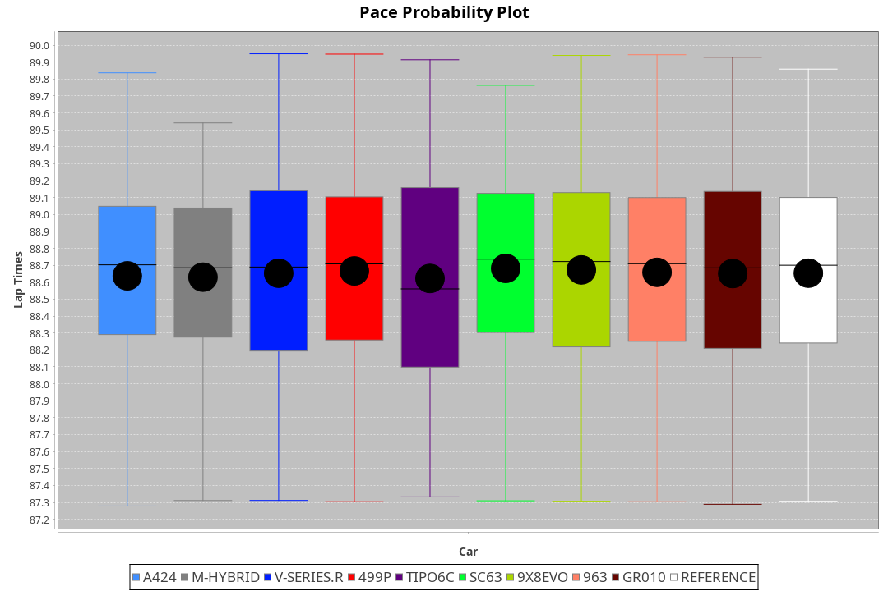
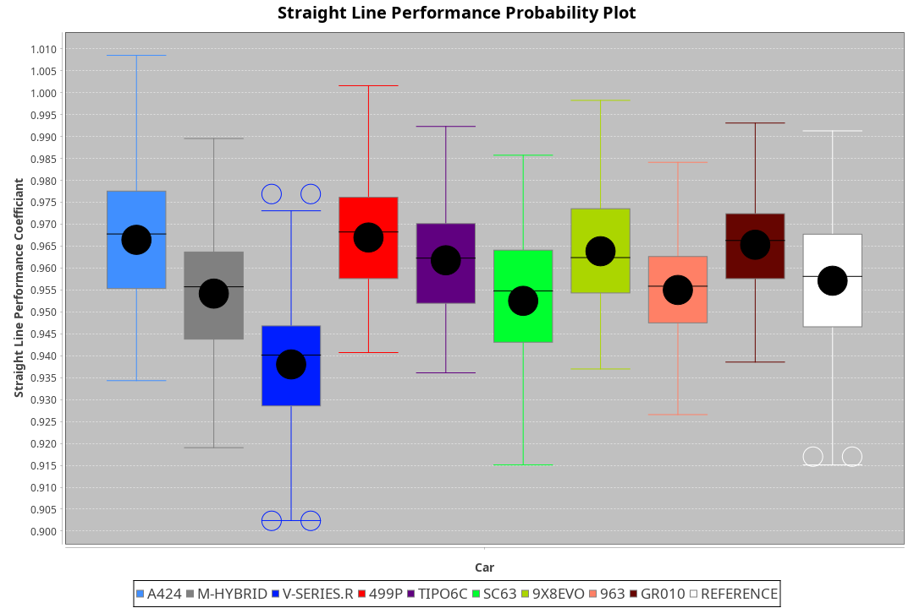
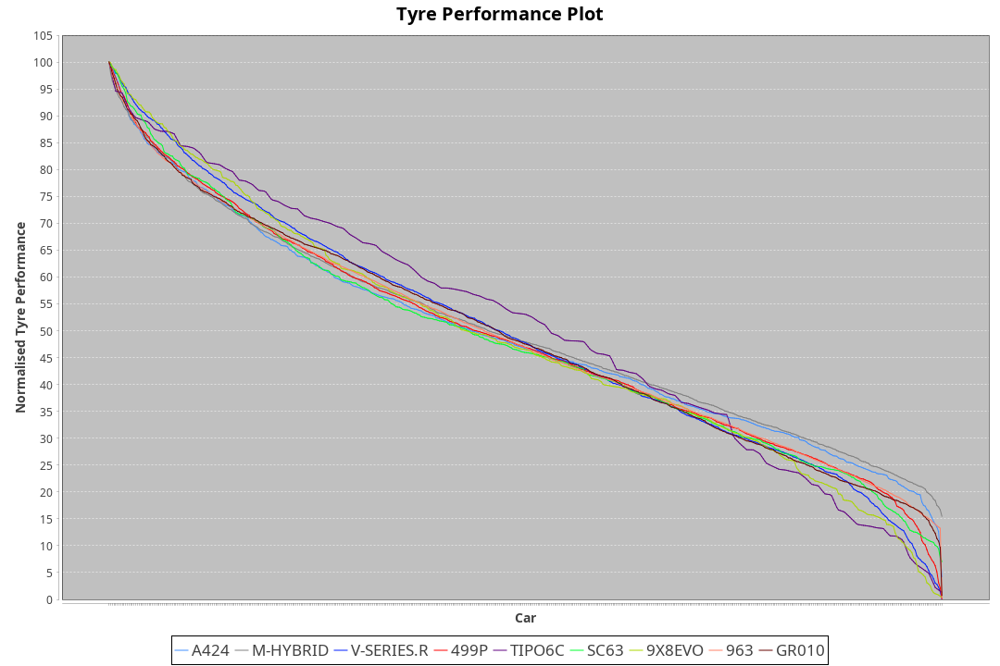

| Manufacturer     | Car        | Weight | Power   | PINC    | E/Stint | FDS     |
|:-|:-|:-|:-|:-|:-|:-|
| Alpine           | A424       | 1035kg | 509.0kw | -5.60%  | 892MJ   |    -    |
| BMW              | M-Hybrid   | 1037kg | 511.0kw | -6.00%  | 892MJ   |    -    |
| Cadillac         | V-Series.R | 1049kg | 480.0kw | 6.30%   | 892MJ   |    -    |
| Ferrari          | 499P       | 1067kg | 496.0kw | -1.90%  | 890MJ   | 190kph  |
| Isotta Fraschini | Tipo6C     | 1084kg | 520.0kw |    -    | 920MJ   | 190kph  |
| Lamborghini      | SC63       | 1068kg | 505.0kw | 2.90%   | 905MJ   |    -    |
| Peugeot          | 9X8Evo     | 1030kg | 487.0kw | -1.40%  | 883MJ   | 190kph  |
| Porsche          | 963        | 1040kg | 493.0kw | -0.40%  | 889MJ   |    -    |
| Toyota           | GR010      | 1071kg | 480.0kw | 4.40%   | 893MJ   | 190kph  |

### BoP Accuracy: 95.19%; Overall BoP Grade: A1
| Manufacturer     | Car        | Type  | RP      | QP      | Weight | Power¹  | Threshhold | PINC    | Power²   | E/Stint | AVG Vmax  | FDS     | RDLC | L/Stint | BOP-Grade | Model Accuracy | Model Points | Match%  | SimDiff |
|:-|:-|:-|:-|:-|:-|:-|:-|:-|:-|:-|:-|:-|:-|:-|:-|:-|:-|:-|:-|
| Alpine           | A424       | LMDH  | 1:28.60 | 1:25.62 | 1035kg | 509.0kw | 250.0kph   | -5.60%  | 480.50kw |  892MJ  | 279.21kph |    -    | 1.01 | 43      | ~A1       | 99.49%         | 1360         | 100.00% | +0.24   |
| BMW              | M-Hybrid   | LMDH  | 1:28.60 | 1:24.85 | 1037kg | 511.0kw | 250.0kph   | -6.00%  | 480.30kw |  892MJ  | 277.92kph |    -    | 1.01 | 43      | ~A1       | 98.62%         | 2363         | 100.00% | +0.34   |
| Cadillac         | V-Series.R | LMDH  | 1:28.60 | 1:25.16 | 1049kg | 480.0kw | 250.0kph   | 6.30%   | 510.20kw |  892MJ  | 275.79kph |    -    | 1.01 | 43      | +A2       | 98.50%         | 4201         | 94.76%  | +0.65   |
| Ferrari          | 499P       | LMHHU | 1:28.61 | 1:25.04 | 1067kg | 496.0kw | 250.0kph   | -1.90%  | 486.60kw |  890MJ  | 277.18kph | 190kph  | 1.02 | 43      | ~A1       | 100.00%        | 4441         | 99.61%  | +0.32   |
| Isotta Fraschini | Tipo6C     | LMHHU | 1:28.59 | 1:26.41 | 1084kg | 520.0kw | 250.0kph   |    -    | 520.00kw |  920MJ  | 276.54kph | 190kph  | 1.02 | 43      | +B2       | 98.48%         | 130          | 80.34%  | #       |
| Lamborghini      | SC63       | LMDH  | 1:28.62 | 1:25.71 | 1068kg | 505.0kw | 250.0kph   | 2.90%   | 519.60kw |  905MJ  | 276.49kph |    -    | 1.02 | 43      | ~A1       | 100.00%        | 784          | 98.49%  | #       |
| Peugeot          | 9X8Evo     | LMHHU | 1:28.60 | 1:25.34 | 1030kg | 487.0kw | 250.0kph   | -1.40%  | 480.20kw |  883MJ  | 278.96kph | 190kph  | 1.02 | 43      | +B2       | 100.00%        | 808          | 84.75%  | +0.67   |
| Porsche          | 963        | LMDH  | 1:28.60 | 1:24.82 | 1040kg | 493.0kw | 250.0kph   | -0.40%  | 491.00kw |  889MJ  | 277.47kph |    -    | 1.01 | 43      | ~A1       | 99.87%         | 12613        | 99.91%  | -0.07   |
| Toyota           | GR010      | LMHHU | 1:28.59 | 1:24.85 | 1071kg | 480.0kw | 250.0kph   | 4.40%   | 501.10kw |  893MJ  | 276.04kph | 190kph  | 1.02 | 43      | ~A1       | 99.73%         | 2956         | 98.82%  | +0.32   |

## Power below Threshhold
| N/Nmax    | A424    | M-HYBRID | V-SERIES.R | 499P    | TIPO6C  | SC63    | 9X8EVO  | 963     | GR010   |
|:-|:-|:-|:-|:-|:-|:-|:-|:-|:-|
|  0.550    |  251    |  252     |  236       |  244    |  256    |  249    |  240    |  243    |  236    |
|  0.575    |  274    |  275     |  258       |  267    |  279    |  272    |  262    |  265    |  258    |
|  0.600    |  294    |  295     |  277       |  287    |  300    |  292    |  281    |  285    |  277    |
|  0.625    |  315    |  316     |  297       |  307    |  322    |  312    |  301    |  305    |  297    |
|  0.650    |  336    |  337     |  317       |  327    |  343    |  333    |  322    |  325    |  317    |
|  0.675    |  357    |  359     |  337       |  348    |  365    |  355    |  342    |  346    |  337    |
|  0.700    |  379    |  380     |  358       |  369    |  387    |  376    |  363    |  367    |  358    |
|  0.725    |  400    |  402     |  378       |  390    |  409    |  397    |  383    |  388    |  378    |
|  0.750    |  421    |  422     |  397       |  410    |  430    |  417    |  403    |  407    |  397    |
|  0.775    |  440    |  441     |  415       |  429    |  449    |  436    |  421    |  426    |  415    |
|  0.800    |  457    |  459     |  431       |  445    |  467    |  454    |  437    |  443    |  431    |
|  0.825    |  472    |  474     |  445       |  460    |  482    |  469    |  452    |  457    |  445    |
|  0.850    |  484    |  485     |  456       |  471    |  494    |  480    |  463    |  468    |  456    |
|  0.875    |  494    |  496     |  466       |  481    |  505    |  490    |  473    |  478    |  466    |
|  0.900    |  501    |  503     |  472       |  488    |  512    |  497    |  479    |  485    |  472    |
|  0.925    |  506    |  508     |  477       |  493    |  517    |  502    |  484    |  490    |  477    |
| **0.950** | **509** | **511**  | **480**    | **496** | **520** | **505** | **487** | **493** | **480** |
|  0.975    |  507    |  509     |  478       |  494    |  518    |  503    |  485    |  491    |  478    |
|  1.000    |  504    |  505     |  475       |  491    |  514    |  500    |  482    |  488    |  475    |
|  1.025    |  435    |  436     |  410       |  424    |  444    |  431    |  416    |  421    |  410    |

## Power above Threshhold
| N/Nmax    | A424       | M-HYBRID   | V-SERIES.R | 499P       | TIPO6C  | SC63       | 9X8EVO     | 963        | GR010      |
|:-|:-|:-|:-|:-|:-|:-|:-|:-|:-|
|  0.550    |  236.24    |  236.17    |  251.12    |  239.28    |  256    |  256.32    |  236.09    |  242.01    |  247.06    |
|  0.575    |  258.27    |  258.18    |  274.13    |  261.31    |  279    |  279.35    |  258.10    |  264.02    |  270.06    |
|  0.600    |  277.29    |  277.20    |  295.14    |  281.33    |  300    |  299.37    |  277.11    |  284.02    |  290.07    |
|  0.625    |  297.31    |  297.21    |  316.15    |  301.36    |  322    |  321.40    |  297.11    |  304.02    |  310.07    |
|  0.650    |  317.33    |  317.22    |  337.16    |  321.38    |  343    |  342.43    |  317.12    |  324.02    |  331.08    |
|  0.675    |  337.35    |  337.24    |  358.17    |  341.40    |  365    |  364.45    |  337.13    |  345.02    |  352.08    |
|  0.700    |  358.37    |  358.25    |  380.18    |  362.43    |  387    |  386.48    |  358.14    |  366.02    |  373.09    |
|  0.725    |  378.39    |  378.27    |  401.19    |  383.45    |  409    |  408.51    |  378.14    |  386.02    |  394.09    |
|  0.750    |  397.41    |  397.28    |  422.20    |  402.48    |  430    |  429.53    |  397.15    |  406.02    |  414.10    |
|  0.775    |  415.43    |  415.29    |  441.21    |  420.50    |  449    |  448.56    |  415.16    |  424.02    |  433.10    |
|  0.800    |  431.45    |  431.31    |  458.22    |  436.52    |  467    |  466.58    |  431.16    |  441.03    |  450.11    |
|  0.825    |  445.46    |  445.32    |  473.22    |  451.53    |  482    |  481.60    |  445.17    |  455.03    |  465.11    |
|  0.850    |  456.47    |  456.32    |  485.23    |  462.55    |  494    |  493.61    |  456.17    |  466.03    |  476.11    |
|  0.875    |  466.48    |  466.33    |  495.23    |  472.56    |  505    |  504.63    |  466.18    |  476.03    |  486.12    |
|  0.900    |  472.49    |  472.33    |  502.24    |  478.57    |  512    |  511.64    |  472.18    |  483.03    |  493.12    |
|  0.925    |  477.49    |  477.34    |  507.24    |  483.57    |  517    |  516.64    |  477.18    |  488.03    |  498.12    |
| **0.950** | **480.50** | **480.34** | **510.24** | **486.58** | **520** | **519.65** | **480.18** | **491.03** | **501.12** |
|  0.975    |  478.49    |  478.34    |  508.24    |  484.57    |  518    |  517.64    |  478.18    |  489.03    |  499.12    |
|  1.000    |  475.49    |  475.34    |  505.24    |  481.57    |  514    |  513.64    |  475.18    |  486.03    |  496.12    |
|  1.025    |  410.42    |  410.29    |  436.21    |  415.49    |  444    |  443.55    |  410.16    |  419.02    |  428.10    |
