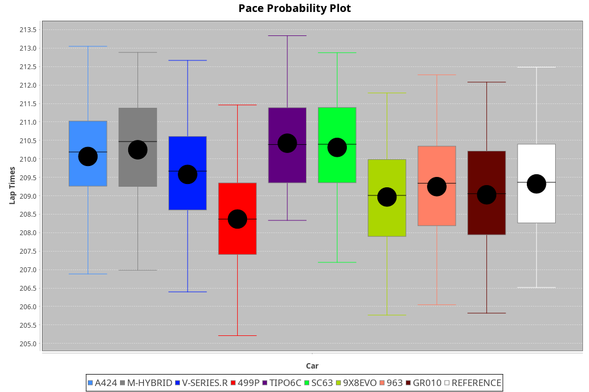
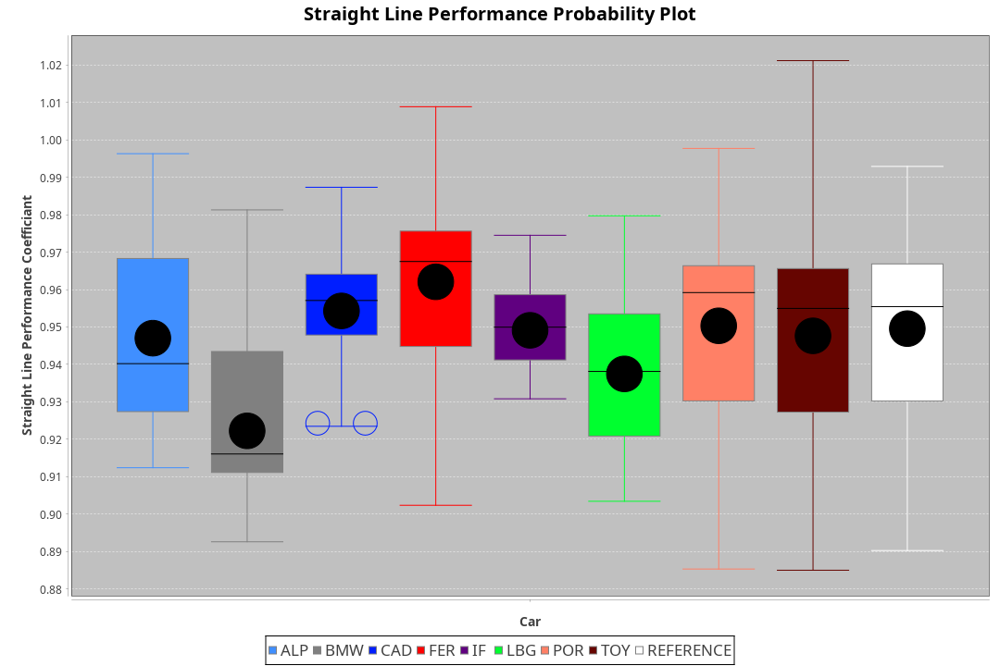
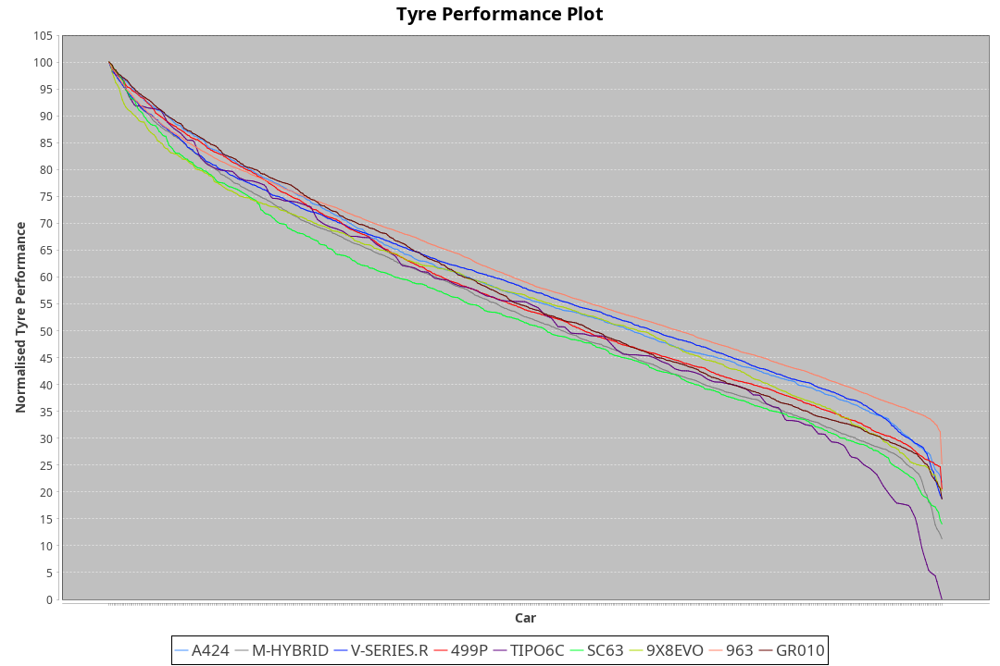

|Manufacturer|Car|Weight|Power|PINC|E/Stint|FDS|
|:-|:-|:-|:-|:-|:-|:-|
|Alpine|A424|1062kg|510kw|-|908MJ|-|
|BMW|M-Hybrid|1040kg|507kw|-|900MJ|-|
|Cadillac|V-Series.R|1032kg|503kw|-|891MJ|-|
|Ferrari|499P|1075kg|499kw|-|892MJ|190kph|
|IsottaFraschini|Tipo6C|1030kg|520kw|-|916MJ|190kph|
|Lamborghini|SC63|1047kg|512kw|-|905MJ|-|
|Porsche|963|1048kg|509kw|-|896MJ|-|
|Toyota|GR010|1092kg|507kw|-|901MJ|190kph|

### BoP Accuracy: 98.32%; Overall BoP Grade: A1
|Manufacturer|Car|Type|RP|QP|Weight|Power¹|Threshhold|PINC|Power²|E/Stint|AVG Vmax|FDS|RDLC|L/Stint|BOP-Grade|ModelAccuracy|ModelPoints|Match%|
|:-|:-|:-|:-|:-|:-|:-|:-|:-|:-|:-|:-|:-|:-|:-|:-|:-|:-|:-|
|Alpine|A424|LMDH|3:29.94|3:26.07|1062kg|510kw|210.0kph|-|510kw|908MJ|328.93kph|-|1.00|12|~A1|80.53%|517|100.00%|
|BMW|M-Hybrid|LMDH|3:29.95|3:23.41|1040kg|507kw|210.0kph|-|507kw|900MJ|325.79kph|-|1.03|12|~A1|98.60%|1690|100.00%|
|Cadillac|V-Series.R|LMDH|3:29.94|3:22.68|1032kg|503kw|210.0kph|-|503kw|891MJ|330.18kph|-|1.03|12|~A1|88.58%|2033|100.00%|
|Ferrari|499P|LMHHU|3:29.97|3:23.19|1075kg|499kw|210.0kph|-|499kw|892MJ|329.81kph|190kph|1.02|12|~A1|84.67%|2303|100.00%|
|IsottaFraschini|Tipo6C|LMHHU|3:29.89|3:27.75|1030kg|520kw|210.0kph|-|520kw|916MJ|332.96kph|190kph|1.08|12|+A2|66.67%|96|93.02%|
|Lamborghini|SC63|LMDH|3:29.90|3:28.06|1047kg|512kw|210.0kph|-|512kw|905MJ|327.84kph|-|1.05|12|+A2|96.77%|419|93.53%|
|Porsche|963|LMDH|3:29.91|3:22.80|1048kg|509kw|210.0kph|-|509kw|896MJ|330.40kph|-|1.01|12|~A1|93.05%|5740|100.00%|
|Toyota|GR010|LMHHU|3:29.89|3:23.02|1092kg|507kw|210.0kph|-|507kw|901MJ|329.67kph|190kph|1.00|12|~A1|90.17%|3255|100.00%|

## Power below Threshhold
|N/Nmax|ALPINE|BMW|CADILLAC|FERRARI|ISOTTAFRASCHINI|LAMBORGHINI|PORSCHE|TOYOTA|
|:-|:-|:-|:-|:-|:-|:-|:-|:-|
|0.550|251|250|248|246|256|252|251|250|
|0.575|274|273|271|268|279|275|274|273|
|0.600|295|293|291|288|300|296|294|293|
|0.625|316|314|311|308|322|317|315|314|
|0.650|337|335|332|329|343|338|336|335|
|0.675|358|356|353|350|365|359|357|356|
|0.700|380|377|374|371|387|381|379|377|
|0.725|401|399|395|392|409|403|400|399|
|0.750|422|419|416|412|430|423|421|419|
|0.775|441|438|435|431|449|442|440|438|
|0.800|458|455|452|448|467|460|457|455|
|0.825|473|470|467|463|482|475|472|470|
|0.850|485|482|478|474|494|486|484|482|
|0.875|495|492|488|484|505|497|494|492|
|0.900|502|499|495|491|512|504|501|499|
|0.925|507|504|500|496|517|509|506|504|
|**0.950**|**510**|**507**|**503**|**499**|**520**|**512**|**509**|**507**|
|0.975|508|505|501|497|518|510|507|505|
|1.000|505|502|498|494|514|506|504|502|
|1.025|436|433|430|426|444|437|435|433|

## Power above Threshhold
|N/Nmax|ALPINE|BMW|CADILLAC|FERRARI|ISOTTAFRASCHINI|LAMBORGHINI|PORSCHE|TOYOTA|
|:-|:-|:-|:-|:-|:-|:-|:-|:-|
|0.550|251|250|248|246|256|252|251|250|
|0.575|274|273|271|268|279|275|274|273|
|0.600|295|293|291|288|300|296|294|293|
|0.625|316|314|311|308|322|317|315|314|
|0.650|337|335|332|329|343|338|336|335|
|0.675|358|356|353|350|365|359|357|356|
|0.700|380|377|374|371|387|381|379|377|
|0.725|401|399|395|392|409|403|400|399|
|0.750|422|419|416|412|430|423|421|419|
|0.775|441|438|435|431|449|442|440|438|
|0.800|458|455|452|448|467|460|457|455|
|0.825|473|470|467|463|482|475|472|470|
|0.850|485|482|478|474|494|486|484|482|
|0.875|495|492|488|484|505|497|494|492|
|0.900|502|499|495|491|512|504|501|499|
|0.925|507|504|500|496|517|509|506|504|
|**0.950**|**510**|**507**|**503**|**499**|**520**|**512**|**509**|**507**|
|0.975|508|505|501|497|518|510|507|505|
|1.000|505|502|498|494|514|506|504|502|
|1.025|436|433|430|426|444|437|435|433|
