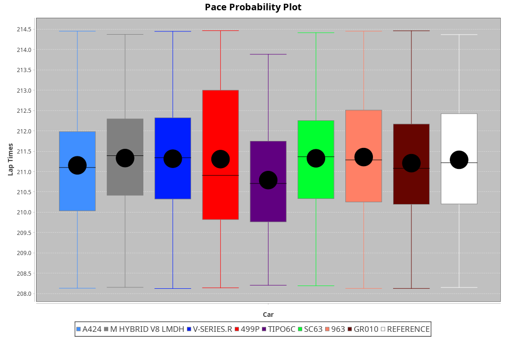
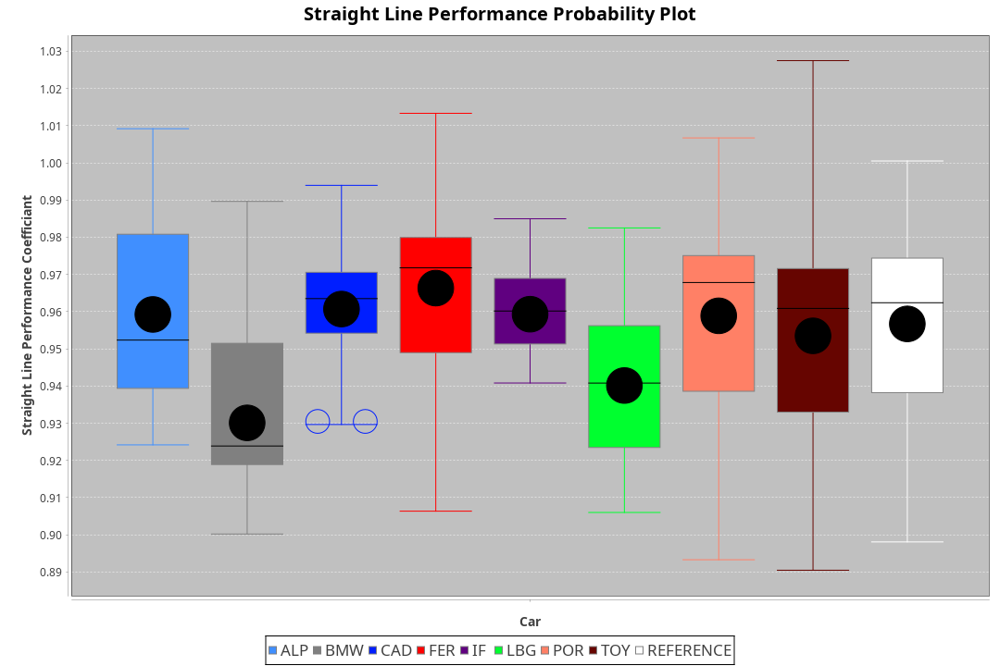
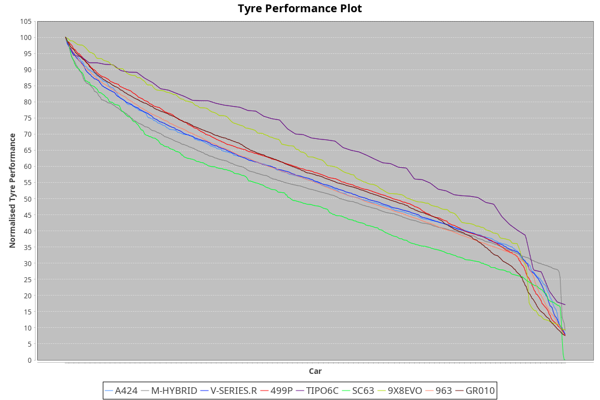

|Manufacturer|Car|Type|RP|QP|Weight|Power¹|Threshhold|PINC|Power²|E/Stint|AVG Vmax|FDS|RDLC|L/Stint|BOP-Grade|ModelAccuracy|ModelPoints|Match%|
|:-|:-|:-|:-|:-|:-|:-|:-|:-|:-|:-|:-|:-|:-|:-|:-|:-|:-|:-|
|Alpine|A424|LMDH|3:31.21|3:23.70|1032kg|510kw|210.0kph|0%|510kw|900MJ|326.89kph-348.21kph|-|1.03|12|~A1|81.46%|523|100.00%|
|BMW|M Hybrid V8 LMDh|LMDH|3:31.22|3:23.66|1045kg|513kw|210.0kph|0%|513kw|897MJ|322.11kph-346.49kph|-|1.02|12|~A1|98.60%|1690|100.00%|
|Cadillac|V-Series.R|LMDH|3:31.22|3:24.22|1037kg|507kw|210.0kph|0%|507kw|881MJ|320.76kph-345.87kph|-|1.02|12|~A1|98.38%|1765|97.04%|
|Ferrari|499P|LMHHU|3:31.24|3:24.18|1066kg|500kw|210.0kph|0%|500kw|883MJ|323.06kph-346.09kph|190kph|1.03|12|~A1|92.24%|2247|100.00%|
|Issotta Fraschini|Tipo6C|LMHHU|3:31.23|3:25.30|1030kg|520kw|210.0kph|0%|520kw|917MJ|329.73kph-340.75kph|140kph|1.08|12|+A2|66.67%|96|92.42%|
|Lamborghini|SC63|LMDH|3:31.21|3:23.47|1064kg|520kw|210.0kph|0%|520kw|902MJ|323.20kph-341.96kph|-|1.03|12|~A1|96.77%|419|95.92%|
|Porsche|963|LMDH|3:31.22|3:24.26|1037kg|510kw|210.0kph|0%|510kw|892MJ|323.00kph-347.21kph|-|1.02|12|~A1|96.81%|5438|100.00%|
|Toyota|GR010 - Hybrid|LMHHU|3:31.23|3:23.83|1068kg|505kw|210.0kph|0%|505kw|898MJ|320.77kph-353.64kph|190kph|1.02|12|~A1|86.04%|1751|100.00%|

### BoP Accuracy: 98.17%; Overall BoP Grade: A1

## Power below Threshhold
|N/Nmax|TOY|FER|CAD|POR|IF|BMW|ALP|LBG|
|:-|:-|:-|:-|:-|:-|:-|:-|:-|
|0.550|249|246|250|251|256|253|251|256|
|0.575|272|269|273|274|279|276|274|279|
|0.600|292|289|293|295|300|296|295|300|
|0.625|312|309|314|316|322|317|316|322|
|0.650|333|330|335|337|343|338|337|343|
|0.675|355|351|356|358|365|360|358|365|
|0.700|376|372|377|380|387|382|380|387|
|0.725|397|393|399|401|409|403|401|409|
|0.750|417|413|419|422|430|424|422|430|
|0.775|436|432|438|441|449|443|441|449|
|0.800|454|449|455|458|467|461|458|467|
|0.825|469|464|470|473|482|476|473|482|
|0.850|480|475|482|485|494|487|485|494|
|0.875|490|485|492|495|505|498|495|505|
|0.900|497|492|499|502|512|505|502|512|
|0.925|502|497|504|507|517|510|507|517|
|**0.950**|**505**|**500**|**507**|**510**|**520**|**513**|**510**|**520**|
|0.975|503|498|505|508|518|511|508|518|
|1.000|500|495|502|505|514|507|505|514|
|1.025|431|427|433|436|444|438|436|444|

## Power above Threshhold
|N/Nmax|TOY|FER|CAD|POR|IF|BMW|ALP|LBG|
|:-|:-|:-|:-|:-|:-|:-|:-|:-|
|0.550|249|246|250|251|256|253|251|256|
|0.575|272|269|273|274|279|276|274|279|
|0.600|292|289|293|295|300|296|295|300|
|0.625|312|309|314|316|322|317|316|322|
|0.650|333|330|335|337|343|338|337|343|
|0.675|355|351|356|358|365|360|358|365|
|0.700|376|372|377|380|387|382|380|387|
|0.725|397|393|399|401|409|403|401|409|
|0.750|417|413|419|422|430|424|422|430|
|0.775|436|432|438|441|449|443|441|449|
|0.800|454|449|455|458|467|461|458|467|
|0.825|469|464|470|473|482|476|473|482|
|0.850|480|475|482|485|494|487|485|494|
|0.875|490|485|492|495|505|498|495|505|
|0.900|497|492|499|502|512|505|502|512|
|0.925|502|497|504|507|517|510|507|517|
|**0.950**|**505**|**500**|**507**|**510**|**520**|**513**|**510**|**520**|
|0.975|503|498|505|508|518|511|508|518|
|1.000|500|495|502|505|514|507|505|514|
|1.025|431|427|433|436|444|438|436|444|
