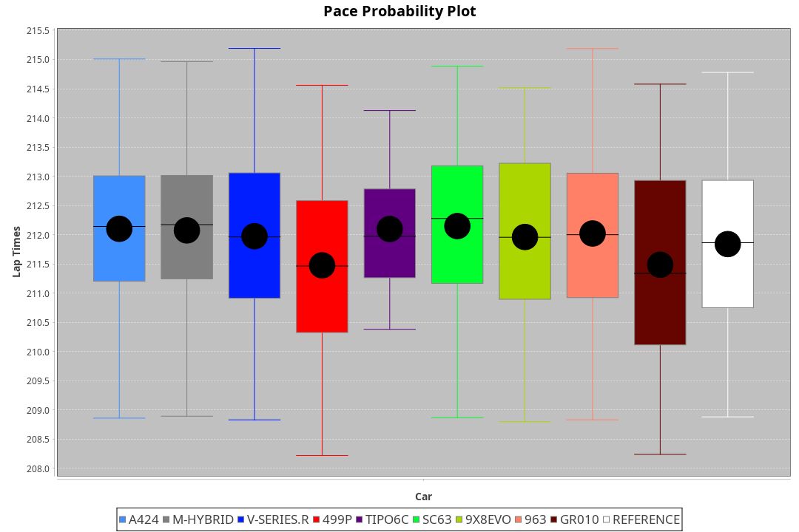
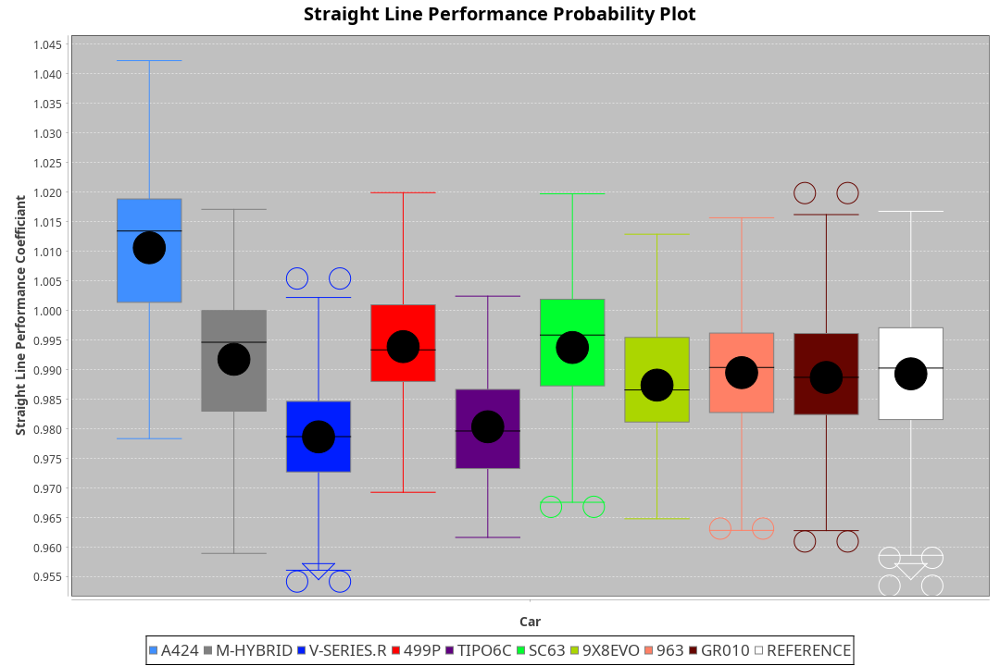
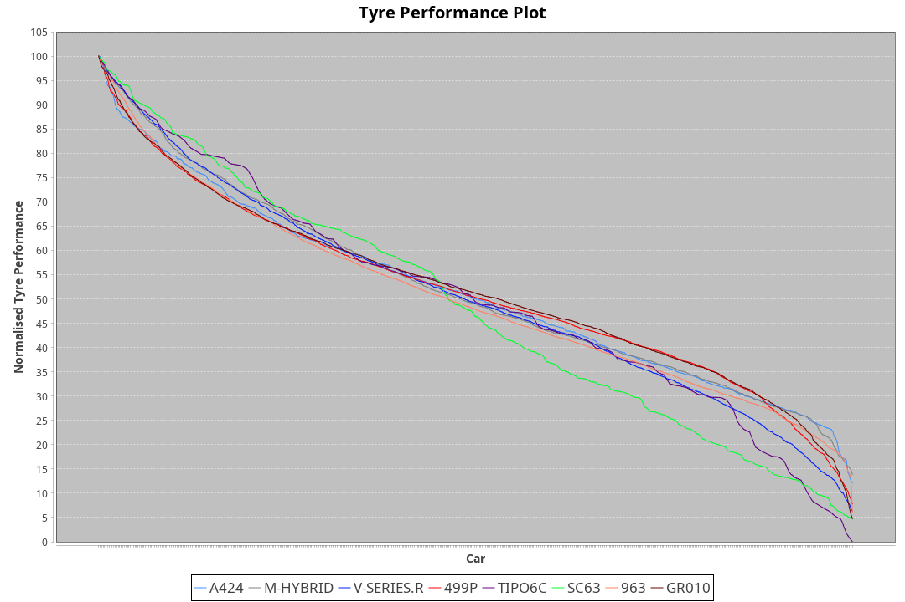

|Manufacturer|Car|Weight|Power|PINC|E/Stint|FDS|
|:-|:-|:-|:-|:-|:-|:-|
|Alpine|A424|1077kg|507kw|-1%|902MJ|-|
|BMW|M Hybrid V8 LMDh|1064kg|503kw|1%|891MJ|-|
|Cadillac|V-Series.R|1040kg|496kw|-1%|870MJ|-|
|Ferrari|499P|1085kg|500kw|-1%|884MJ|190kph|
|Issotta Fraschini|Tipo6C|1075kg|520kw|-|922MJ|190kph|
|Lamborghini|SC63|1041kg|503kw|-|884MJ|-|
|Porsche|963|1056kg|502kw|-1%|886MJ|-|
|Toyota|GR010 - Hybrid|1099kg|507kw|1%|904MJ|190kph|

### BoP Accuracy: 87.78%; Overall BoP Grade: B1

|Manufacturer|Car|Type|RP|QP|Weight|Power¹|Threshhold|PINC|Power²|E/Stint|AVG Vmax|FDS|RDLC|L/Stint|BOP-Grade|ModelAccuracy|ModelPoints|Match%|
|:-|:-|:-|:-|:-|:-|:-|:-|:-|:-|:-|:-|:-|:-|:-|:-|:-|:-|:-|
|Alpine|A424|LMDH|3:33.29|3:25.63|1077kg|507kw|210.0kph|-1%|502kw|902MJ|326.50kph|-|0.99|12|~A1|81.46%|523|97.89%|
|BMW|M Hybrid V8 LMDh|LMDH|3:33.30|3:25.59|1064kg|503kw|210.0kph|1%|508kw|891MJ|323.06kph|-|1.01|12|~A1|98.60%|1690|97.42%|
|Cadillac|V-Series.R|LMDH|3:33.32|3:26.17|1040kg|496kw|210.0kph|-1%|491kw|870MJ|327.39kph|-|1.02|12|+B1|98.38%|1765|88.76%|
|Ferrari|499P|LMHHU|3:31.98|3:24.87|1085kg|500kw|210.0kph|-1%|495kw|884MJ|328.09kph|190kph|1.01|12|-C1|92.24%|2247|77.98%|
|Issotta Fraschini|Tipo6C|LMHHU|3:33.75|3:27.69|1075kg|520kw|210.0kph|-|520kw|922MJ|328.35kph|190kph|1.03|12|+C1|66.67%|96|78.58%|
|Lamborghini|SC63|LMDH|3:33.30|3:25.41|1041kg|503kw|210.0kph|-|503kw|884MJ|326.28kph|-|1.05|12|+B1|96.77%|419|87.66%|
|Porsche|963|LMDH|3:33.30|3:26.20|1056kg|502kw|210.0kph|-1%|497kw|886MJ|327.43kph|-|1.01|12|~A1|96.81%|5438|100.00%|
|Toyota|GR010 - Hybrid|LMHHU|3:31.74|3:24.30|1099kg|507kw|210.0kph|1%|512kw|904MJ|326.63kph|190kph|1.00|12|-C2|86.04%|1751|73.95%|

## Power below Threshhold
|N/Nmax|ALP|BMW|CAD|FER|IF|LBG|POR|TOY|
|:-|:-|:-|:-|:-|:-|:-|:-|:-|
|0.550|250|248|244|246|256|248|247|250|
|0.575|273|271|267|269|279|271|270|273|
|0.600|293|291|287|289|300|291|290|293|
|0.625|314|311|307|309|322|311|310|314|
|0.650|335|332|327|330|343|332|331|335|
|0.675|356|353|348|351|365|353|352|356|
|0.700|377|374|369|372|387|374|374|377|
|0.725|399|395|390|393|409|395|395|399|
|0.750|419|416|410|413|430|416|415|419|
|0.775|438|435|429|432|449|435|434|438|
|0.800|455|452|445|449|467|452|451|455|
|0.825|470|467|460|464|482|467|466|470|
|0.850|482|478|471|475|494|478|477|482|
|0.875|492|488|481|485|505|488|487|492|
|0.900|499|495|488|492|512|495|494|499|
|0.925|504|500|493|497|517|500|499|504|
|**0.950**|**507**|**503**|**496**|**500**|**520**|**503**|**502**|**507**|
|0.975|505|501|494|498|518|501|500|505|
|1.000|502|498|491|495|514|498|497|502|
|1.025|433|430|424|427|444|430|429|433|

## Power above Threshhold
|N/Nmax|ALP|BMW|CAD|FER|IF|LBG|POR|TOY|
|:-|:-|:-|:-|:-|:-|:-|:-|:-|
|0.550|247|250|242|244|256|248|245|252|
|0.575|270|273|264|266|279|271|267|275|
|0.600|290|293|284|286|300|291|287|296|
|0.625|310|314|304|306|322|311|307|317|
|0.650|331|335|324|327|343|332|328|338|
|0.675|352|357|345|348|365|353|349|359|
|0.700|374|378|366|369|387|374|370|381|
|0.725|395|399|386|389|409|395|391|403|
|0.750|415|420|406|409|430|416|411|423|
|0.775|434|439|424|428|449|435|429|442|
|0.800|451|456|441|445|467|452|446|460|
|0.825|466|471|455|459|482|467|461|475|
|0.850|477|483|466|470|494|478|472|486|
|0.875|487|493|476|480|505|488|482|497|
|0.900|494|500|483|487|512|495|489|504|
|0.925|499|505|488|492|517|500|494|509|
|**0.950**|**502**|**508**|**491**|**495**|**520**|**503**|**497**|**512**|
|0.975|500|506|489|493|518|501|495|510|
|1.000|497|503|486|490|514|498|492|506|
|1.025|429|434|419|423|444|430|424|437|
