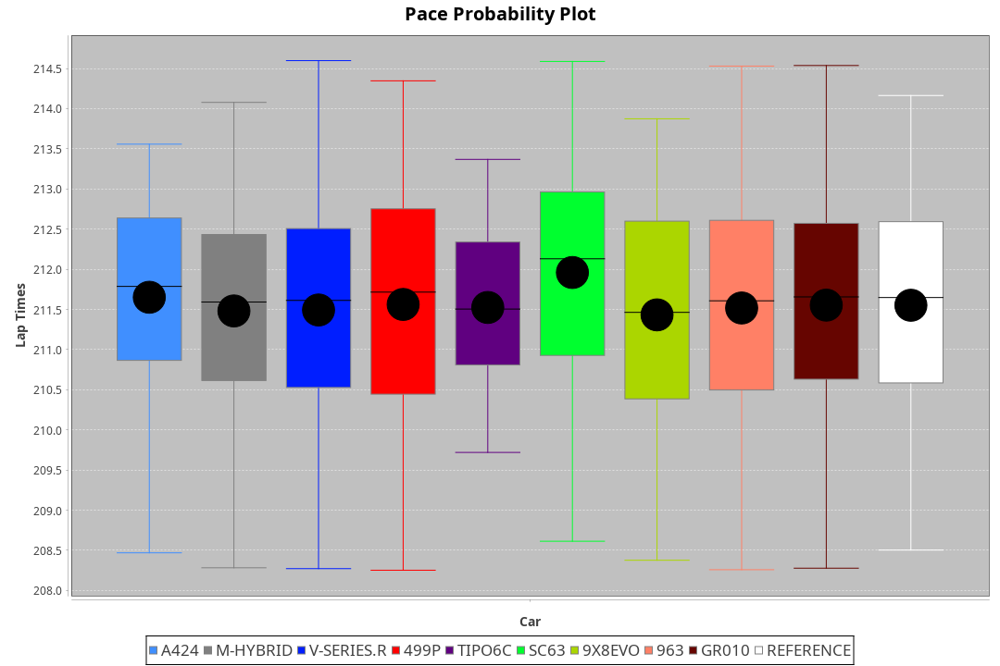
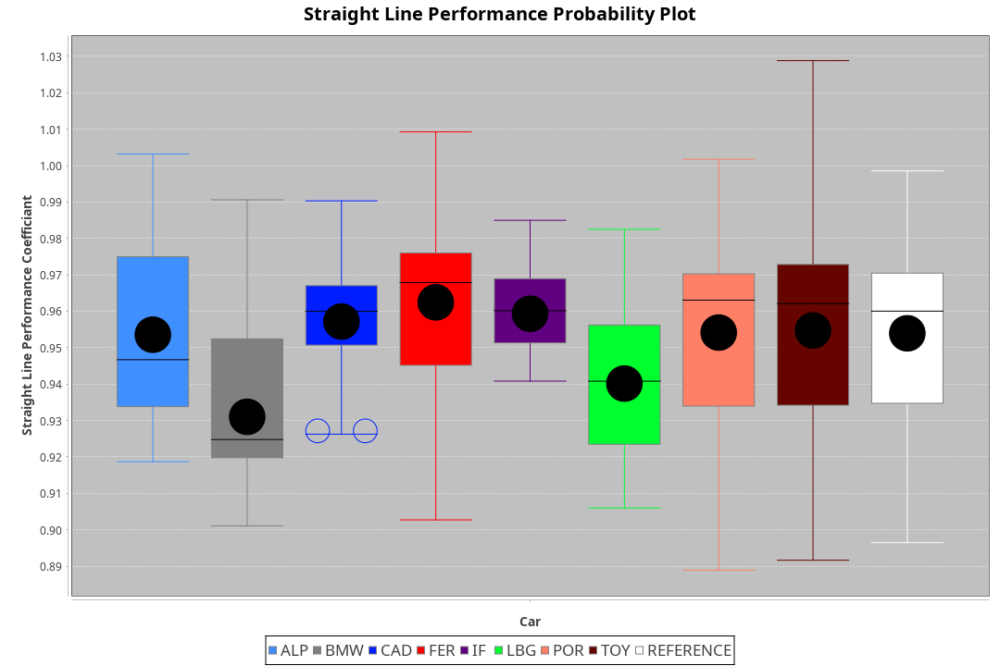
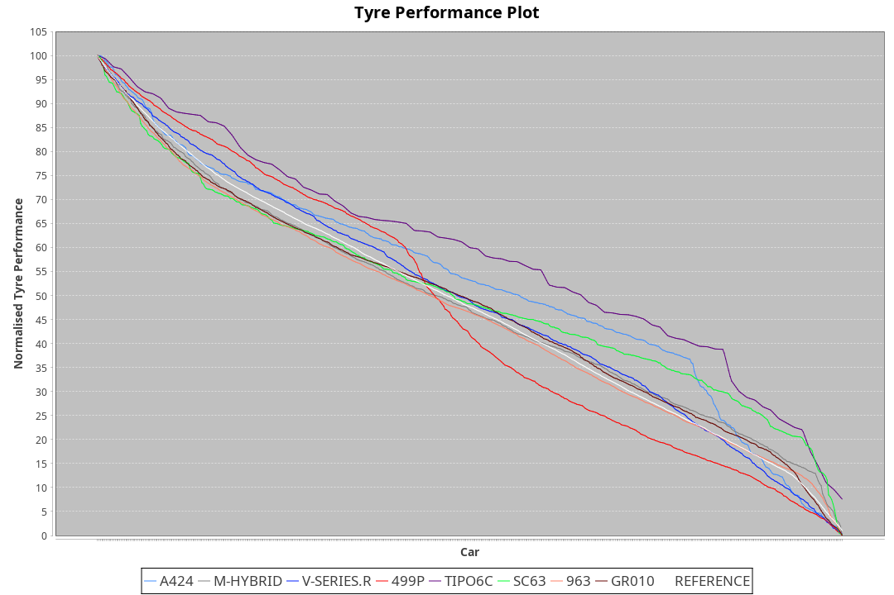

|Manufacturer|Car|Weight|Power|PINC|E/Stint|FDS|
|:-|:-|:-|:-|:-|:-|:-|
|Alpine|A424|1033kg|498kw|-3%|892MJ|-|
|BMW|M-Hybrid|1049kg|494kw|5%|894MJ|-|
|Cadillac|V-Series.R|1036kg|495kw|-1%|884MJ|-|
|Ferrari|499P|1065kg|490kw|-2%|881MJ|190kph|
|IsottaFraschini|Tipo6C|1081kg|520kw|-|922MJ|190kph|
|Lamborghini|SC63|1068kg|503kw|3%|901MJ|-|
|Porsche|963|1037kg|501kw|-4%|884MJ|-|
|Toyota|GR010|1065kg|495kw|-3%|885MJ|190kph|

### BoP Accuracy: 98.24%; Overall BoP Grade: A1
|Manufacturer|Car|Type|RP|QP|Weight|Power¹|Threshhold|PINC|Power²|E/Stint|AVG Vmax|FDS|RDLC|L/Stint|BOP-Grade|ModelAccuracy|ModelPoints|Match%|
|:-|:-|:-|:-|:-|:-|:-|:-|:-|:-|:-|:-|:-|:-|:-|:-|:-|:-|:-|
|Alpine|A424|LMDH|3:31.52|3:27.60|1033kg|498kw|210.0kph|-3%|483kw|892MJ|327.75kph|-|1.03|12|~A1|80.53%|517|100.00%|
|BMW|M-Hybrid|LMDH|3:31.53|3:24.90|1049kg|494kw|210.0kph|5%|519kw|894MJ|325.41kph|-|1.02|12|~A1|98.60%|1690|100.00%|
|Cadillac|V-Series.R|LMDH|3:31.52|3:24.16|1036kg|495kw|210.0kph|-1%|490kw|884MJ|328.04kph|-|1.02|12|~A1|88.58%|2033|100.00%|
|Ferrari|499P|LMHHU|3:31.51|3:24.63|1065kg|490kw|210.0kph|-2%|480kw|881MJ|328.07kph|190kph|1.03|12|~A1|84.67%|2303|100.00%|
|IsottaFraschini|Tipo6C|LMHHU|3:31.51|3:29.34|1081kg|520kw|210.0kph|-|520kw|922MJ|328.97kph|190kph|1.02|12|+A2|66.67%|96|93.03%|
|Lamborghini|SC63|LMDH|3:31.52|3:29.66|1068kg|503kw|210.0kph|3%|518kw|901MJ|326.22kph|-|1.03|12|+A2|96.77%|419|92.85%|
|Porsche|963|LMDH|3:31.54|3:24.32|1037kg|501kw|210.0kph|-4%|481kw|884MJ|327.97kph|-|1.02|12|~A1|93.05%|5740|100.00%|
|Toyota|GR010|LMHHU|3:31.52|3:24.54|1065kg|495kw|210.0kph|-3%|480kw|885MJ|328.25kph|190kph|1.02|12|~A1|90.17%|3255|100.00%|

## Power below Threshhold
|N/Nmax|ALPINE|BMW|CADILLAC|FERRARI|ISOTTAFRASCHINI|LAMBORGHINI|PORSCHE|TOYOTA|
|:-|:-|:-|:-|:-|:-|:-|:-|:-|
|0.550|245|243|244|241|256|248|247|244|
|0.575|268|266|266|264|279|271|270|266|
|0.600|288|285|286|283|300|291|290|286|
|0.625|308|305|306|303|322|311|310|306|
|0.650|329|326|327|324|343|332|331|327|
|0.675|350|347|348|344|365|353|352|348|
|0.700|371|368|369|365|387|374|373|369|
|0.725|392|389|389|386|409|395|394|389|
|0.750|411|408|409|405|430|416|414|409|
|0.775|430|427|428|424|449|435|433|428|
|0.800|447|444|445|440|467|452|450|445|
|0.825|462|458|459|455|482|467|465|459|
|0.850|473|469|470|466|494|478|476|470|
|0.875|483|479|480|476|505|488|486|480|
|0.900|490|486|487|482|512|495|493|487|
|0.925|495|491|492|487|517|500|498|492|
|**0.950**|**498**|**494**|**495**|**490**|**520**|**503**|**501**|**495**|
|0.975|496|492|493|488|518|501|499|493|
|1.000|493|489|490|485|514|498|496|490|
|1.025|425|422|423|419|444|430|428|423|

## Power above Threshhold
|N/Nmax|ALPINE|BMW|CADILLAC|FERRARI|ISOTTAFRASCHINI|LAMBORGHINI|PORSCHE|TOYOTA|
|:-|:-|:-|:-|:-|:-|:-|:-|:-|
|0.550|238|256|241|236|256|255|237|236|
|0.575|260|279|264|258|279|278|259|258|
|0.600|279|299|283|277|300|299|278|277|
|0.625|299|321|303|297|322|321|298|297|
|0.650|319|342|324|317|343|342|318|317|
|0.675|339|364|344|337|365|364|338|337|
|0.700|360|386|365|358|387|386|359|358|
|0.725|380|408|386|378|409|407|379|378|
|0.750|399|429|405|397|430|428|398|397|
|0.775|418|448|424|415|449|447|416|415|
|0.800|434|466|440|431|467|465|432|431|
|0.825|448|481|455|445|482|480|446|445|
|0.850|459|493|466|456|494|492|457|456|
|0.875|469|504|476|466|505|503|467|466|
|0.900|475|511|482|472|512|510|473|472|
|0.925|480|516|487|477|517|515|478|477|
|**0.950**|**483**|**519**|**490**|**480**|**520**|**518**|**481**|**480**|
|0.975|481|517|488|478|518|516|479|478|
|1.000|478|513|485|475|514|512|476|475|
|1.025|413|443|419|410|444|442|411|410|
