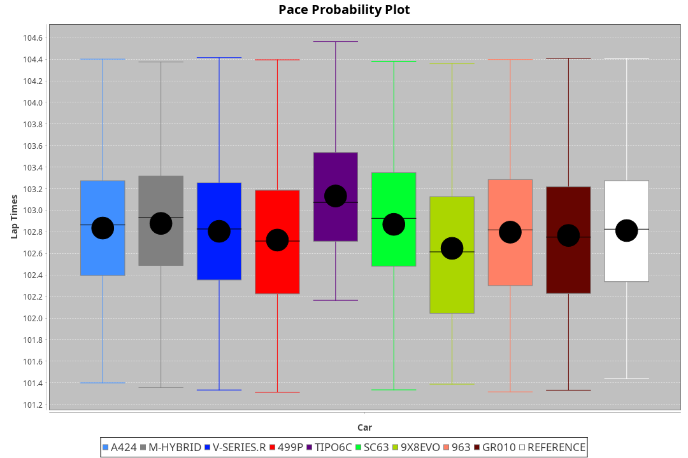
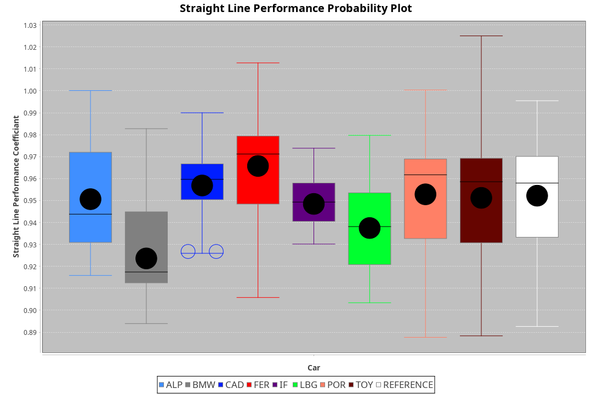
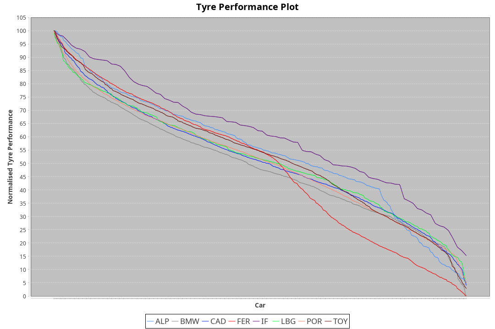

| Manufacturer     | Car        | Weight | Power   | PINC    | E/Stint | FDS     |
|:-|:-|:-|:-|:-|:-|:-|
| Alpine           | A424       | 1057kg | 517.0kw |    -    | 914MJ   |    -    |
| BMW              | M-Hybrid   | 1051kg | 509.0kw |    -    | 906MJ   |    -    |
| Cadillac         | V-Series.R | 1044kg | 507.0kw |    -    | 898MJ   |    -    |
| Ferrari          | 499P       | 1073kg | 505.0kw |    -    | 904MJ   | 190kph  |
| Isotta Fraschini | Tipo6C     | 1059kg | 520.0kw |    -    | 920MJ   | 190kph  |
| Lamborghini      | SC63       | 1052kg | 516.0kw |    -    | 909MJ   |    -    |
| Peugeot          | 9X8Evo     | 1060kg | 507.0kw |    -    | 897MJ   | 190kph  |
| Porsche          | 963        | 1057kg | 513.0kw |    -    | 908MJ   |    -    |
| Toyota           | GR010      | 1090kg | 509.0kw |    -    | 913MJ   | 190kph  |

### BoP Accuracy: 78.91%; Overall BoP Grade: C1
| Manufacturer     | Car        | Type  | RP      | QP      | Weight | Power¹  | Threshhold | PINC    | Power²   | E/Stint | AVG Vmax  | FDS     | RDLC | L/Stint | BOP-Grade | Model Accuracy | Model Points | Match%  | SimDiff |
|:-|:-|:-|:-|:-|:-|:-|:-|:-|:-|:-|:-|:-|:-|:-|:-|:-|:-|:-|:-|
| Alpine           | A424       | LMDH  | 1:42.77 | 1:40.25 | 1057kg | 517.0kw | 210.0kph   |    -    | 517.00kw |  914MJ  | 298.56kph |    -    | 0.99 | 33      | -B1       | 99.61%         | 762          | 86.10%  | ±0.13s  |
| BMW              | M-Hybrid   | LMDH  | 1:42.93 | 1:40.13 | 1051kg | 509.0kw | 210.0kph   |    -    | 509.00kw |  906MJ  | 295.77kph |    -    | 1.00 | 33      | -A2       | 100.00%        | 1826         | 91.23%  | ±0.36s  |
| Cadillac         | V-Series.R | LMDH  | 1:42.64 | 1:40.31 | 1044kg | 507.0kw | 210.0kph   |    -    | 507.00kw |  898MJ  | 293.36kph |    -    | 1.02 | 33      | -B2       | 99.00%         | 3184         | 81.23%  | ±0.24s  |
| Ferrari          | 499P       | LMHHU | 1:43.14 | 1:40.49 | 1073kg | 505.0kw | 210.0kph   |    -    | 505.00kw |  904MJ  | 294.87kph | 190kph  | 1.02 | 33      | ~A1       | 98.07%         | 3550         | 100.00% | ±0.08s  |
| Isotta Fraschini | Tipo6C     | LMHHU | 1:43.83 | 1:42.91 | 1059kg | 520.0kw | 210.0kph   |    -    | 520.00kw |  920MJ  | 295.78kph | 190kph  | 1.05 | 33      | +Ω1       | 96.81%         | 91           | 24.31%  | ±0.30s  |
| Lamborghini      | SC63       | LMDH  | 1:42.87 | 1:41.01 | 1052kg | 516.0kw | 210.0kph   |    -    | 516.00kw |  909MJ  | 296.23kph |    -    | 1.03 | 33      | -B1       | 100.00%        | 529          | 86.11%  | ±0.32s  |
| Peugeot          | 9X8Evo     | LMHHU | 1:43.32 | 1:41.22 | 1060kg | 507.0kw | 210.0kph   |    -    | 507.00kw |  897MJ  | 296.39kph | 190kph  | 0.99 | 33      | +C1       | 99.21%         | 377          | 79.94%  | #       |
| Porsche          | 963        | LMDH  | 1:42.42 | 1:39.58 | 1057kg | 513.0kw | 210.0kph   |    -    | 513.00kw |  908MJ  | 295.43kph |    -    | 1.00 | 33      | -D1       | 99.96%         | 10176        | 68.69%  | ±0.20s  |
| Toyota           | GR010      | LMHHU | 1:43.46 | 1:40.81 | 1090kg | 509.0kw | 210.0kph   |    -    | 509.00kw |  913MJ  | 293.60kph | 190kph  | 1.00 | 33      | +A2       | 99.95%         | 5509         | 92.55%  | ±0.24s  |

## Power below Threshhold
| N/Nmax    | A424    | M-HYBRID | V-SERIES.R | 499P    | TIPO6C  | SC63    | 9X8EVO  | 963     | GR010   |
|:-|:-|:-|:-|:-|:-|:-|:-|:-|:-|
|  0.550    |  255    |  251     |  250       |  249    |  256    |  254    |  250    |  253    |  251    |
|  0.575    |  278    |  274     |  273       |  272    |  279    |  277    |  273    |  276    |  274    |
|  0.600    |  298    |  294     |  293       |  292    |  300    |  298    |  293    |  296    |  294    |
|  0.625    |  320    |  315     |  314       |  312    |  322    |  319    |  314    |  317    |  315    |
|  0.650    |  341    |  336     |  335       |  333    |  343    |  340    |  335    |  338    |  336    |
|  0.675    |  363    |  357     |  356       |  355    |  365    |  362    |  356    |  360    |  357    |
|  0.700    |  385    |  379     |  377       |  376    |  387    |  384    |  377    |  382    |  379    |
|  0.725    |  407    |  400     |  399       |  397    |  409    |  406    |  399    |  403    |  400    |
|  0.750    |  427    |  421     |  419       |  417    |  430    |  427    |  419    |  424    |  421    |
|  0.775    |  446    |  440     |  438       |  436    |  449    |  446    |  438    |  443    |  440    |
|  0.800    |  464    |  457     |  455       |  454    |  467    |  463    |  455    |  461    |  457    |
|  0.825    |  479    |  472     |  470       |  469    |  482    |  478    |  470    |  476    |  472    |
|  0.850    |  491    |  484     |  482       |  480    |  494    |  490    |  482    |  487    |  484    |
|  0.875    |  502    |  494     |  492       |  490    |  505    |  501    |  492    |  498    |  494    |
|  0.900    |  509    |  501     |  499       |  497    |  512    |  508    |  499    |  505    |  501    |
|  0.925    |  514    |  506     |  504       |  502    |  517    |  513    |  504    |  510    |  506    |
| **0.950** | **517** | **509**  | **507**    | **505** | **520** | **516** | **507** | **513** | **509** |
|  0.975    |  515    |  507     |  505       |  503    |  518    |  514    |  505    |  511    |  507    |
|  1.000    |  511    |  504     |  502       |  500    |  514    |  510    |  502    |  507    |  504    |
|  1.025    |  441    |  435     |  433       |  431    |  444    |  441    |  433    |  438    |  435    |

## Power above Threshhold
| N/Nmax    | A424    | M-HYBRID | V-SERIES.R | 499P    | TIPO6C  | SC63    | 9X8EVO  | 963     | GR010   |
|:-|:-|:-|:-|:-|:-|:-|:-|:-|:-|
|  0.550    |  255    |  251     |  250       |  249    |  256    |  254    |  250    |  253    |  251    |
|  0.575    |  278    |  274     |  273       |  272    |  279    |  277    |  273    |  276    |  274    |
|  0.600    |  298    |  294     |  293       |  292    |  300    |  298    |  293    |  296    |  294    |
|  0.625    |  320    |  315     |  314       |  312    |  322    |  319    |  314    |  317    |  315    |
|  0.650    |  341    |  336     |  335       |  333    |  343    |  340    |  335    |  338    |  336    |
|  0.675    |  363    |  357     |  356       |  355    |  365    |  362    |  356    |  360    |  357    |
|  0.700    |  385    |  379     |  377       |  376    |  387    |  384    |  377    |  382    |  379    |
|  0.725    |  407    |  400     |  399       |  397    |  409    |  406    |  399    |  403    |  400    |
|  0.750    |  427    |  421     |  419       |  417    |  430    |  427    |  419    |  424    |  421    |
|  0.775    |  446    |  440     |  438       |  436    |  449    |  446    |  438    |  443    |  440    |
|  0.800    |  464    |  457     |  455       |  454    |  467    |  463    |  455    |  461    |  457    |
|  0.825    |  479    |  472     |  470       |  469    |  482    |  478    |  470    |  476    |  472    |
|  0.850    |  491    |  484     |  482       |  480    |  494    |  490    |  482    |  487    |  484    |
|  0.875    |  502    |  494     |  492       |  490    |  505    |  501    |  492    |  498    |  494    |
|  0.900    |  509    |  501     |  499       |  497    |  512    |  508    |  499    |  505    |  501    |
|  0.925    |  514    |  506     |  504       |  502    |  517    |  513    |  504    |  510    |  506    |
| **0.950** | **517** | **509**  | **507**    | **505** | **520** | **516** | **507** | **513** | **509** |
|  0.975    |  515    |  507     |  505       |  503    |  518    |  514    |  505    |  511    |  507    |
|  1.000    |  511    |  504     |  502       |  500    |  514    |  510    |  502    |  507    |  504    |
|  1.025    |  441    |  435     |  433       |  431    |  444    |  441    |  433    |  438    |  435    |
