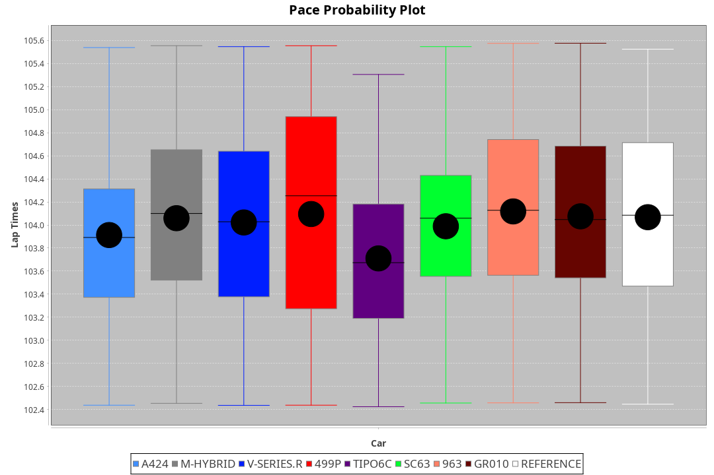
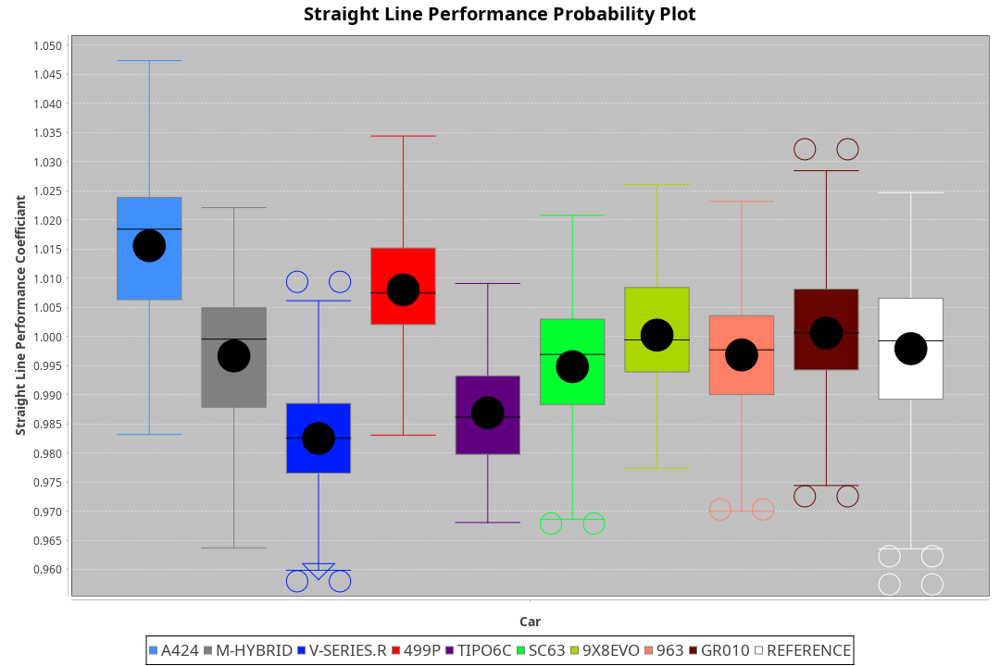
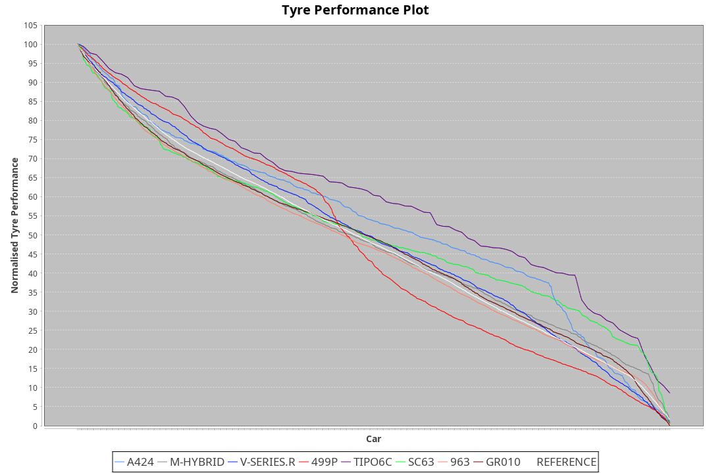

|Manufacturer|Car|Weight|Power|PINC|E/Stint|FDS|
|:-|:-|:-|:-|:-|:-|:-|
|Alpine|A424|1031kg|499kw|-|895MJ|-|
|BMW|M-Hybrid|1044kg|502kw|-|896MJ|-|
|Cadillac|V-Series.R|1036kg|499kw|-|888MJ|-|
|Ferrari|499P|1060kg|502kw|-|893MJ|190kph|
|IsottaFraschini|Tipo6C|1077kg|520kw|-|921MJ|190kph|
|Lamborghini|SC63|1060kg|507kw|-|901MJ|-|
|Porsche|963|1036kg|500kw|-|887MJ|-|
|Toyota|GR010|1061kg|503kw|-|894MJ|190kph|

### BoP Accuracy: 98.59%; Overall BoP Grade: A1
|Manufacturer|Car|Type|RP|QP|Weight|Power¹|Threshhold|PINC|Power²|E/Stint|AVG Vmax|FDS|RDLC|L/Stint|BOP-Grade|ModelAccuracy|ModelPoints|Match%|
|:-|:-|:-|:-|:-|:-|:-|:-|:-|:-|:-|:-|:-|:-|:-|:-|:-|:-|:-|
|Alpine|A424|LMDH|1:43.99|1:43.47|1031kg|499kw|0.0kph|-|499kw|895MJ|294.14kph|-|1.03|33|~A1|80.53%|517|100.00%|
|BMW|M-Hybrid|LMDH|1:44.00|1:42.05|1044kg|502kw|0.0kph|-|502kw|896MJ|289.76kph|-|1.02|33|~A1|96.62%|1656|100.00%|
|Cadillac|V-Series.R|LMDH|1:43.99|1:41.67|1036kg|499kw|0.0kph|-|499kw|888MJ|293.80kph|-|1.02|33|~A1|90.68%|2081|100.00%|
|Ferrari|499P|LMHHU|1:44.00|1:41.80|1060kg|502kw|0.0kph|-|502kw|893MJ|295.82kph|190kph|1.03|33|~A1|94.63%|2574|100.00%|
|IsottaFraschini|Tipo6C|LMHHU|1:43.98|1:44.35|1077kg|520kw|0.0kph|-|520kw|921MJ|293.86kph|190kph|1.03|33|+B1|66.67%|96|89.96%|
|Lamborghini|SC63|LMDH|1:43.99|1:44.62|1060kg|507kw|0.0kph|-|507kw|901MJ|290.97kph|-|1.03|33|~A1|92.15%|399|98.75%|
|Porsche|963|LMDH|1:44.02|1:41.80|1036kg|500kw|0.0kph|-|500kw|887MJ|294.41kph|-|1.02|33|~A1|95.67%|5902|100.00%|
|Toyota|GR010|LMHHU|1:44.02|1:41.92|1061kg|503kw|0.0kph|-|503kw|894MJ|295.76kph|190kph|1.03|33|~A1|91.69%|3310|100.00%|

## Power below Threshhold
|N/Nmax|ALPINE|BMW|CADILLAC|FERRARI|ISOTTAFRASCHINI|LAMBORGHINI|PORSCHE|TOYOTA|
|:-|:-|:-|:-|:-|:-|:-|:-|:-|
|0.550|246|247|246|247|256|250|246|248|
|0.575|268|270|268|270|279|273|269|271|
|0.600|288|290|288|290|300|293|289|291|
|0.625|308|310|308|310|322|314|309|311|
|0.650|329|331|329|331|343|335|330|332|
|0.675|350|352|350|352|365|356|351|353|
|0.700|371|374|371|374|387|377|372|374|
|0.725|392|395|392|395|409|399|393|395|
|0.750|412|415|412|415|430|419|413|416|
|0.775|431|434|431|434|449|438|432|435|
|0.800|448|451|448|451|467|455|449|452|
|0.825|463|466|463|466|482|470|464|467|
|0.850|474|477|474|477|494|482|475|478|
|0.875|484|487|484|487|505|492|485|488|
|0.900|491|494|491|494|512|499|492|495|
|0.925|496|499|496|499|517|504|497|500|
|**0.950**|**499**|**502**|**499**|**502**|**520**|**507**|**500**|**503**|
|0.975|497|500|497|500|518|505|498|501|
|1.000|494|497|494|497|514|502|495|498|
|1.025|426|429|426|429|444|433|427|430|

## Power above Threshhold
|N/Nmax|ALPINE|BMW|CADILLAC|FERRARI|ISOTTAFRASCHINI|LAMBORGHINI|PORSCHE|TOYOTA|
|:-|:-|:-|:-|:-|:-|:-|:-|:-|
|0.550|246|247|246|247|256|250|246|248|
|0.575|268|270|268|270|279|273|269|271|
|0.600|288|290|288|290|300|293|289|291|
|0.625|308|310|308|310|322|314|309|311|
|0.650|329|331|329|331|343|335|330|332|
|0.675|350|352|350|352|365|356|351|353|
|0.700|371|374|371|374|387|377|372|374|
|0.725|392|395|392|395|409|399|393|395|
|0.750|412|415|412|415|430|419|413|416|
|0.775|431|434|431|434|449|438|432|435|
|0.800|448|451|448|451|467|455|449|452|
|0.825|463|466|463|466|482|470|464|467|
|0.850|474|477|474|477|494|482|475|478|
|0.875|484|487|484|487|505|492|485|488|
|0.900|491|494|491|494|512|499|492|495|
|0.925|496|499|496|499|517|504|497|500|
|**0.950**|**499**|**502**|**499**|**502**|**520**|**507**|**500**|**503**|
|0.975|497|500|497|500|518|505|498|501|
|1.000|494|497|494|497|514|502|495|498|
|1.025|426|429|426|429|444|433|427|430|
