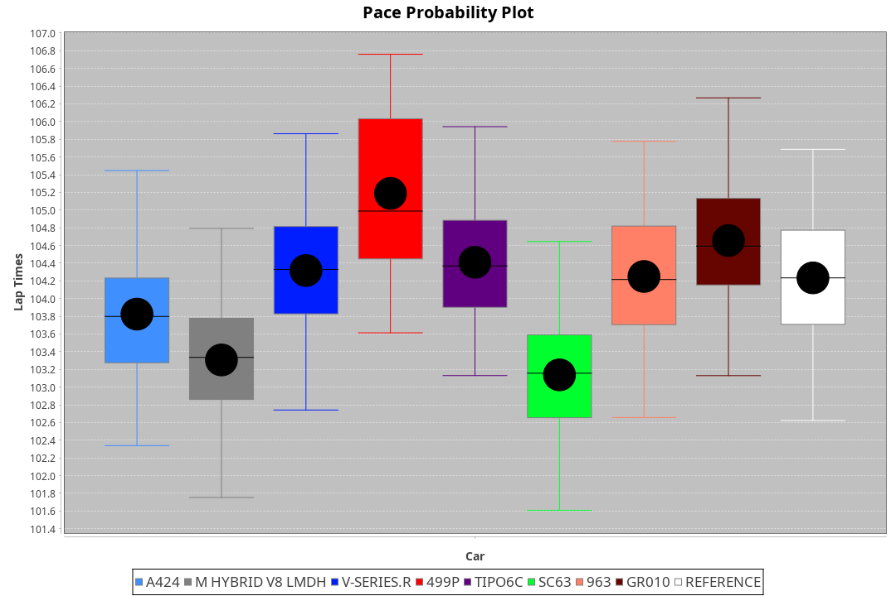
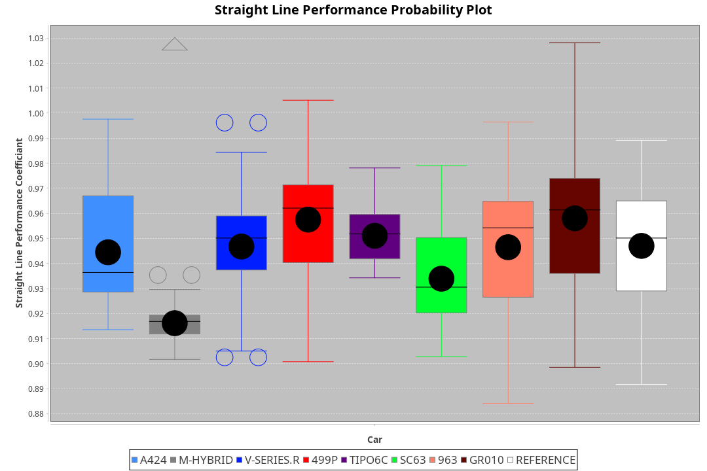
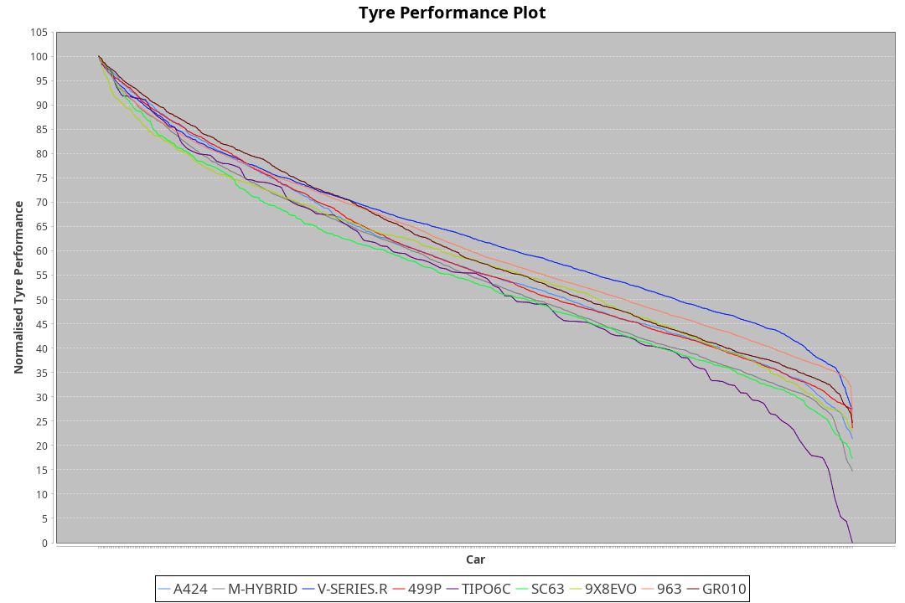

| Manufacturer     | Car        | Weight | Power   | PINC    | E/Stint | FDS     |
|:-|:-|:-|:-|:-|:-|:-|
| Alpine           | A424       | 1043kg | 511.0kw |    -    | 906MJ   |    -    |
| BMW              | M-Hybrid   | 1041kg | 509.0kw | -1.00%  | 900MJ   |    -    |
| Cadillac         | V-Series.R | 1044kg | 507.0kw | 1.00%   | 898MJ   |    -    |
| Ferrari          | 499P       | 1063kg | 506.0kw | -1.00%  | 895MJ   | 190kph  |
| Isotta Fraschini | Tipo6C     | 1049kg | 520.0kw |    -    | 916MJ   | 190kph  |
| Lamborghini      | SC63       | 1041kg | 518.0kw |    -    | 909MJ   |    -    |
| Peugeot          | 9X8Evo     | 1050kg | 508.0kw | -1.00%  | 901MJ   | 190kph  |
| Porsche          | 963        | 1050kg | 513.0kw | -1.00%  | 898MJ   |    -    |
| Toyota           | GR010      | 1078kg | 513.0kw |    -    | 905MJ   | 190kph  |

### BoP Accuracy: 94.20%; Overall BoP Grade: A2
| Manufacturer     | Car        | Type  | RP      | QP      | Weight | Power¹  | Threshhold | PINC    | Power²   | E/Stint | AVG Vmax  | FDS     | RDLC | L/Stint | BOP-Grade | Model Accuracy | Model Points | Match%  | SimDiff |
|:-|:-|:-|:-|:-|:-|:-|:-|:-|:-|:-|:-|:-|:-|:-|:-|:-|:-|:-|:-|
| Alpine           | A424       | LMDH  | 1:42.87 | 1:40.47 | 1043kg | 511.0kw | 210.0kph   |    -    | 511.00kw |  906MJ  | 299.43kph |    -    | 1.01 | 33      | ~A1       | 86.43%         | 618          | 98.41%  | ±0.13s  |
| BMW              | M-Hybrid   | LMDH  | 1:42.97 | 1:40.11 | 1041kg | 509.0kw | 210.0kph   | -1.00%  | 503.90kw |  900MJ  | 295.70kph |    -    | 1.01 | 33      | +A2       | 93.77%         | 1672         | 91.13%  | ±0.20s  |
| Cadillac         | V-Series.R | LMDH  | 1:42.75 | 1:40.34 | 1044kg | 507.0kw | 210.0kph   | 1.00%   | 512.10kw |  898MJ  | 293.57kph |    -    | 1.02 | 33      | ~A1       | 83.12%         | 1921         | 100.00% | ±0.26s  |
| Ferrari          | 499P       | LMHHU | 1:42.97 | 1:40.40 | 1063kg | 506.0kw | 210.0kph   | -1.00%  | 500.90kw |  895MJ  | 295.73kph | 190kph  | 1.03 | 33      | ~A1       | 69.49%         | 1950         | 100.00% | ±0.02s  |
| Isotta Fraschini | Tipo6C     | LMHHU | 1:43.24 | 1:42.33 | 1049kg | 520.0kw | 210.0kph   |    -    | 520.00kw |  916MJ  | 295.95kph | 190kph  | 1.06 | 33      | +D2       | 73.56%         | 64           | 61.77%  | ±0.17s  |
| Lamborghini      | SC63       | LMDH  | 1:42.86 | 1:42.09 | 1041kg | 518.0kw | 210.0kph   |    -    | 518.00kw |  909MJ  | 297.37kph |    -    | 1.05 | 33      | ~A1       | 95.82%         | 459          | 96.52%  | ±0.17s  |
| Peugeot          | 9X8Evo     | LMHHU | 1:43.00 | 1:40.47 | 1050kg | 508.0kw | 210.0kph   | -1.00%  | 502.90kw |  901MJ  | 295.87kph | 190kph  | 1.00 | 33      | ~A1       | 66.97%         | 221          | 100.00% | #       |
| Porsche          | 963        | LMDH  | 1:42.87 | 1:40.25 | 1050kg | 513.0kw | 210.0kph   | -1.00%  | 507.90kw |  898MJ  | 295.59kph |    -    | 1.01 | 33      | ~A1       | 81.02%         | 5243         | 100.00% | ±0.12s  |
| Toyota           | GR010      | LMHHU | 1:42.87 | 1:40.45 | 1078kg | 513.0kw | 210.0kph   |    -    | 513.00kw |  905MJ  | 295.23kph | 190kph  | 1.01 | 33      | ~A1       | 73.70%         | 2701         | 100.00% | ±0.31s  |

## Power below Threshhold
| N/Nmax    | A424    | M-HYBRID | V-SERIES.R | 499P    | TIPO6C  | SC63    | 9X8EVO  | 963     | GR010   |
|:-|:-|:-|:-|:-|:-|:-|:-|:-|:-|
|  0.550    |  252    |  251     |  250       |  249    |  256    |  255    |  250    |  253    |  253    |
|  0.575    |  275    |  274     |  273       |  272    |  279    |  278    |  273    |  276    |  276    |
|  0.600    |  295    |  294     |  293       |  292    |  300    |  299    |  293    |  296    |  296    |
|  0.625    |  316    |  315     |  314       |  313    |  322    |  321    |  314    |  317    |  317    |
|  0.650    |  337    |  336     |  335       |  334    |  343    |  342    |  335    |  338    |  338    |
|  0.675    |  359    |  357     |  356       |  355    |  365    |  364    |  357    |  360    |  360    |
|  0.700    |  380    |  379     |  377       |  377    |  387    |  386    |  378    |  382    |  382    |
|  0.725    |  402    |  400     |  399       |  398    |  409    |  407    |  399    |  403    |  403    |
|  0.750    |  422    |  421     |  419       |  418    |  430    |  428    |  420    |  424    |  424    |
|  0.775    |  441    |  440     |  438       |  437    |  449    |  447    |  439    |  443    |  443    |
|  0.800    |  459    |  457     |  455       |  454    |  467    |  465    |  456    |  461    |  461    |
|  0.825    |  474    |  472     |  470       |  469    |  482    |  480    |  471    |  476    |  476    |
|  0.850    |  485    |  484     |  482       |  481    |  494    |  492    |  483    |  487    |  487    |
|  0.875    |  496    |  494     |  492       |  491    |  505    |  503    |  493    |  498    |  498    |
|  0.900    |  503    |  501     |  499       |  498    |  512    |  510    |  500    |  505    |  505    |
|  0.925    |  508    |  506     |  504       |  503    |  517    |  515    |  505    |  510    |  510    |
| **0.950** | **511** | **509**  | **507**    | **506** | **520** | **518** | **508** | **513** | **513** |
|  0.975    |  509    |  507     |  505       |  504    |  518    |  516    |  506    |  511    |  511    |
|  1.000    |  505    |  504     |  502       |  501    |  514    |  512    |  503    |  507    |  507    |
|  1.025    |  436    |  435     |  433       |  432    |  444    |  442    |  434    |  438    |  438    |

## Power above Threshhold
| N/Nmax    | A424    | M-HYBRID   | V-SERIES.R | 499P       | TIPO6C  | SC63    | 9X8EVO     | 963        | GR010   |
|:-|:-|:-|:-|:-|:-|:-|:-|:-|:-|
|  0.550    |  252    |  248.45    |  252.03    |  246.46    |  256    |  255    |  247.45    |  250.43    |  253    |
|  0.575    |  275    |  271.49    |  275.04    |  269.51    |  279    |  278    |  270.49    |  273.47    |  276    |
|  0.600    |  295    |  291.53    |  296.04    |  289.54    |  300    |  299    |  290.53    |  293.50    |  296    |
|  0.625    |  316    |  311.56    |  317.04    |  309.58    |  322    |  321    |  310.57    |  314.54    |  317    |
|  0.650    |  337    |  332.60    |  338.05    |  330.62    |  343    |  342    |  331.61    |  335.57    |  338    |
|  0.675    |  359    |  353.64    |  359.05    |  351.66    |  365    |  364    |  352.65    |  356.61    |  360    |
|  0.700    |  380    |  374.68    |  381.05    |  372.70    |  387    |  386    |  374.69    |  377.65    |  382    |
|  0.725    |  402    |  395.71    |  403.06    |  393.74    |  409    |  407    |  395.72    |  399.68    |  403    |
|  0.750    |  422    |  416.75    |  423.06    |  413.78    |  430    |  428    |  415.76    |  419.72    |  424    |
|  0.775    |  441    |  435.79    |  442.06    |  432.81    |  449    |  447    |  434.80    |  438.75    |  443    |
|  0.800    |  459    |  452.82    |  460.06    |  449.84    |  467    |  465    |  451.83    |  455.78    |  461    |
|  0.825    |  474    |  467.84    |  475.06    |  464.87    |  482    |  480    |  466.85    |  470.81    |  476    |
|  0.850    |  485    |  478.86    |  486.07    |  475.89    |  494    |  492    |  477.87    |  482.83    |  487    |
|  0.875    |  496    |  488.88    |  497.07    |  485.91    |  505    |  503    |  487.89    |  492.84    |  498    |
|  0.900    |  503    |  495.90    |  504.07    |  492.92    |  512    |  510    |  494.91    |  499.86    |  505    |
|  0.925    |  508    |  500.90    |  509.07    |  497.93    |  517    |  515    |  499.91    |  504.86    |  510    |
| **0.950** | **511** | **503.91** | **512.07** | **500.94** | **520** | **518** | **502.92** | **507.87** | **513** |
|  0.975    |  509    |  501.91    |  510.07    |  498.94    |  518    |  516    |  500.92    |  505.87    |  511    |
|  1.000    |  505    |  498.90    |  506.07    |  495.93    |  514    |  512    |  497.91    |  502.86    |  507    |
|  1.025    |  436    |  430.78    |  437.06    |  427.80    |  444    |  442    |  429.79    |  433.74    |  438    |
