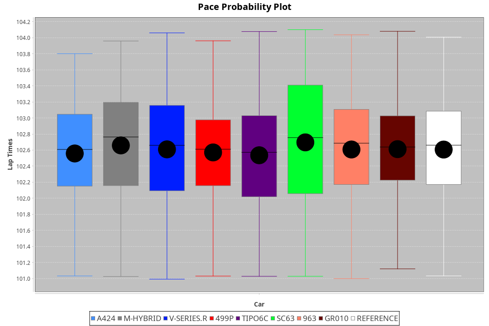
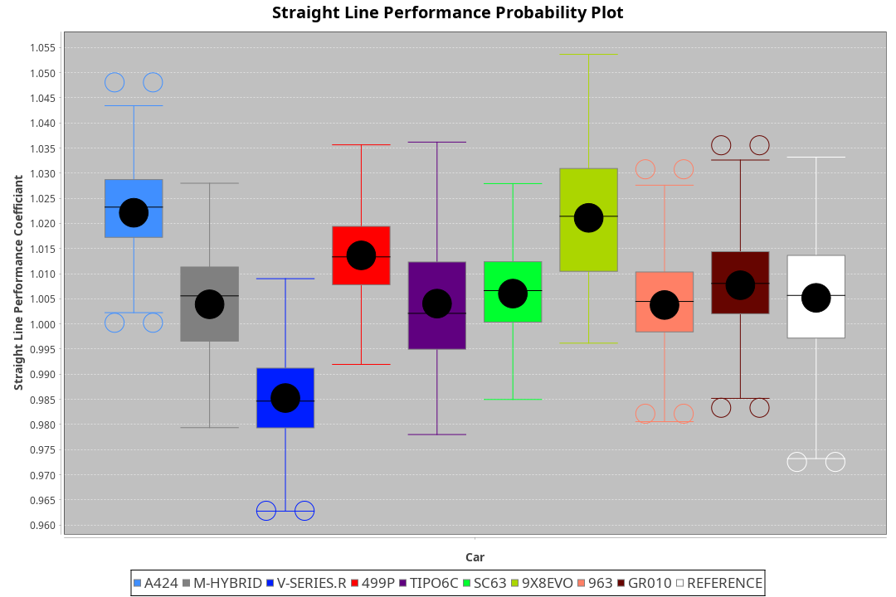
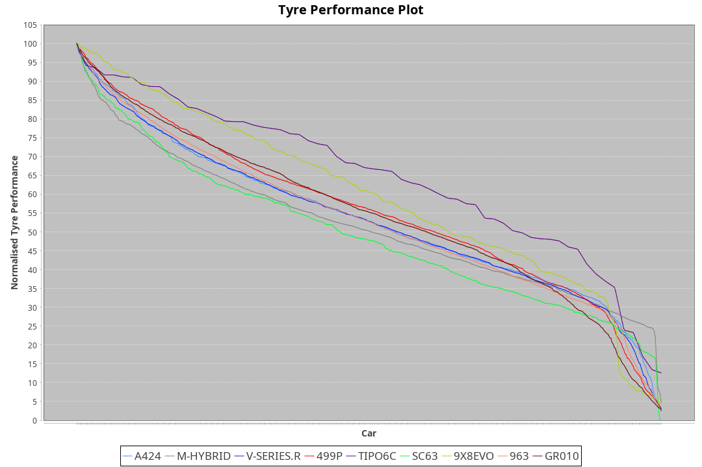

| Manufacturer     | Car        | Weight | Power | PINC    | E/Stint | FDS     |
|:-|:-|:-|:-|:-|:-|:-|
| Alpine           | A424       | 1033kg | 505kw | -2%     | 897MJ   |    -    |
| BMW              | M-Hybrid   | 1045kg | 494kw | 5%      | 898MJ   |    -    |
| Cadillac         | V-Series.R | 1038kg | 501kw |    -    | 890MJ   |    -    |
| Ferrari          | 499P       | 1060kg | 520kw | -7%     | 896MJ   | 190kph  |
| Isotta Fraschini | Tipo6C     | 1040kg | 520kw |    -    | 917MJ   | 190kph  |
| Lamborghini      | SC63       | 1061kg | 520kw |    -    | 913MJ   |    -    |
| Porsche          | 963        | 1036kg | 504kw | -2%     | 887MJ   |    -    |
| Toyota           | GR010      | 1060kg | 518kw | -7%     | 894MJ   | 190kph  |

### BoP Accuracy: 93.70%; Overall BoP Grade: A2
| Manufacturer     | Car        | Type  | RP      | QP      | Weight | Power¹ | Threshhold | PINC    | Power² | E/Stint | AVG Vmax  | FDS     | RDLC | L/Stint | BOP-Grade | Model Accuracy | Model Points | Match%  |
|:-|:-|:-|:-|:-|:-|:-|:-|:-|:-|:-|:-|:-|:-|:-|:-|:-|:-|:-|
| Alpine           | A424       | LMDH  | 1:42.54 | 1:41.46 | 1033kg | 505kw  | 210.0kph   | -2%     | 495kw  |  897MJ  | 293.85kph |    -    | 1.03 | 33      | +C1       | 100.00%        | 642          | 75.08%  |
| BMW              | M-Hybrid   | LMDH  | 1:42.56 | 1:40.57 | 1045kg | 494kw  | 210.0kph   | 5%      | 519kw  |  898MJ  | 291.13kph |    -    | 1.02 | 33      | ~A1       | 100.00%        | 1714         | 99.25%  |
| Cadillac         | V-Series.R | LMDH  | 1:42.52 | 1:40.25 | 1038kg | 501kw  | 210.0kph   |    -    | 501kw  |  890MJ  | 293.96kph |    -    | 1.02 | 33      | ~A1       | 98.95%         | 2271         | 100.00% |
| Ferrari          | 499P       | LMHHU | 1:42.52 | 1:40.21 | 1060kg | 520kw  | 210.0kph   | -7%     | 484kw  |  896MJ  | 294.79kph | 190kph  | 1.03 | 33      | ~A1       | 99.93%         | 2718         | 98.35%  |
| Isotta Fraschini | Tipo6C     | LMHHU | 1:42.56 | 1:41.98 | 1040kg | 520kw  | 0.0kph     |    -    | 520kw  |  917MJ  | 296.44kph | 190kph  | 1.07 | 33      | +C1       | 92.36%         | 133          | 76.95%  |
| Lamborghini      | SC63       | LMDH  | 1:42.56 | 1:42.89 | 1061kg | 520kw  | 210.0kph   |    -    | 520kw  |  913MJ  | 292.75kph |    -    | 1.03 | 33      | ~A1       | 96.54%         | 418          | 100.00% |
| Porsche          | 963        | LMDH  | 1:42.54 | 1:40.21 | 1036kg | 504kw  | 210.0kph   | -2%     | 494kw  |  887MJ  | 293.97kph |    -    | 1.02 | 33      | ~A1       | 99.98%         | 6168         | 100.00% |
| Toyota           | GR010      | LMHHU | 1:42.54 | 1:40.24 | 1060kg | 518kw  | 210.0kph   | -7%     | 482kw  |  894MJ  | 294.35kph | 190kph  | 1.03 | 33      | ~A1       | 98.53%         | 3557         | 100.00% |

## Power below Threshhold
| N/Nmax    | A424    | M-HYBRID | V-SERIES.R | 499P    | TIPO6C  | SC63    | 963     | GR010   |
|:-|:-|:-|:-|:-|:-|:-|:-|:-|
|  0.550    |  249    |  243     |  247       |  256    |  256    |  256    |  248    |  255    |
|  0.575    |  272    |  266     |  270       |  279    |  279    |  279    |  271    |  278    |
|  0.600    |  292    |  285     |  290       |  300    |  300    |  300    |  291    |  299    |
|  0.625    |  312    |  305     |  310       |  322    |  322    |  322    |  312    |  321    |
|  0.650    |  333    |  326     |  331       |  343    |  343    |  343    |  333    |  342    |
|  0.675    |  355    |  347     |  352       |  365    |  365    |  365    |  354    |  364    |
|  0.700    |  376    |  368     |  373       |  387    |  387    |  387    |  375    |  386    |
|  0.725    |  397    |  389     |  394       |  409    |  409    |  409    |  396    |  407    |
|  0.750    |  417    |  408     |  414       |  430    |  430    |  430    |  416    |  428    |
|  0.775    |  436    |  427     |  433       |  449    |  449    |  449    |  435    |  447    |
|  0.800    |  454    |  444     |  450       |  467    |  467    |  467    |  453    |  465    |
|  0.825    |  469    |  458     |  465       |  482    |  482    |  482    |  468    |  480    |
|  0.850    |  480    |  469     |  476       |  494    |  494    |  494    |  479    |  492    |
|  0.875    |  490    |  479     |  486       |  505    |  505    |  505    |  489    |  503    |
|  0.900    |  497    |  486     |  493       |  512    |  512    |  512    |  496    |  510    |
|  0.925    |  502    |  491     |  498       |  517    |  517    |  517    |  501    |  515    |
| **0.950** | **505** | **494**  | **501**    | **520** | **520** | **520** | **504** | **518** |
|  0.975    |  503    |  492     |  499       |  518    |  518    |  518    |  502    |  516    |
|  1.000    |  500    |  489     |  496       |  514    |  514    |  514    |  499    |  512    |
|  1.025    |  431    |  422     |  428       |  444    |  444    |  444    |  430    |  442    |

## Power above Threshhold
| N/Nmax    | A424    | M-HYBRID | V-SERIES.R | 499P    | TIPO6C  | SC63    | 963     | GR010   |
|:-|:-|:-|:-|:-|:-|:-|:-|:-|
|  0.550    |  244    |  256     |  247       |  238    |  256    |  256    |  243    |  237    |
|  0.575    |  266    |  279     |  270       |  260    |  279    |  279    |  266    |  259    |
|  0.600    |  286    |  299     |  290       |  279    |  300    |  300    |  285    |  278    |
|  0.625    |  306    |  321     |  310       |  299    |  322    |  322    |  305    |  298    |
|  0.650    |  327    |  342     |  331       |  320    |  343    |  343    |  326    |  318    |
|  0.675    |  348    |  364     |  352       |  340    |  365    |  365    |  347    |  338    |
|  0.700    |  369    |  386     |  373       |  361    |  387    |  387    |  368    |  359    |
|  0.725    |  389    |  408     |  394       |  381    |  409    |  409    |  389    |  380    |
|  0.750    |  409    |  429     |  414       |  400    |  430    |  430    |  408    |  399    |
|  0.775    |  428    |  448     |  433       |  418    |  449    |  449    |  427    |  417    |
|  0.800    |  445    |  466     |  450       |  435    |  467    |  467    |  444    |  433    |
|  0.825    |  459    |  481     |  465       |  449    |  482    |  482    |  458    |  447    |
|  0.850    |  470    |  493     |  476       |  460    |  494    |  494    |  469    |  458    |
|  0.875    |  480    |  504     |  486       |  470    |  505    |  505    |  479    |  468    |
|  0.900    |  487    |  511     |  493       |  476    |  512    |  512    |  486    |  474    |
|  0.925    |  492    |  516     |  498       |  481    |  517    |  517    |  491    |  479    |
| **0.950** | **495** | **519**  | **501**    | **484** | **520** | **520** | **494** | **482** |
|  0.975    |  493    |  517     |  499       |  482    |  518    |  518    |  492    |  480    |
|  1.000    |  490    |  513     |  496       |  479    |  514    |  514    |  489    |  477    |
|  1.025    |  423    |  443     |  428       |  413    |  444    |  444    |  422    |  412    |
