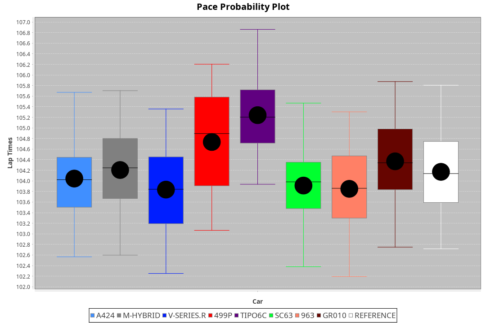
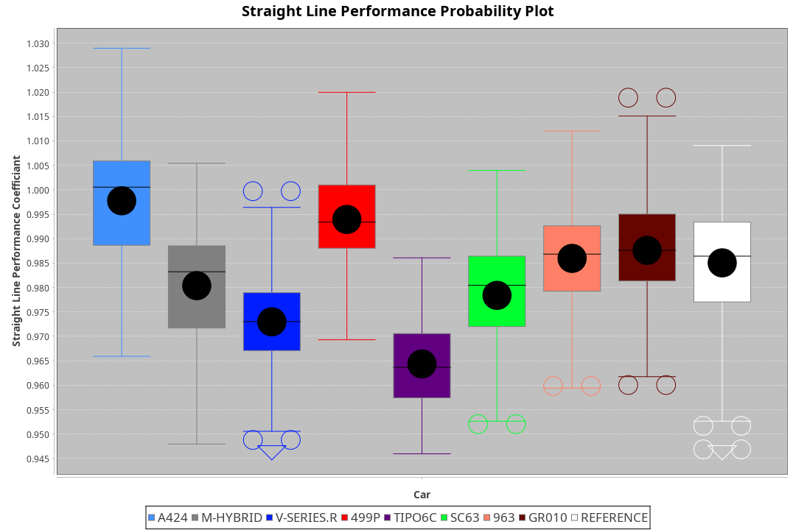
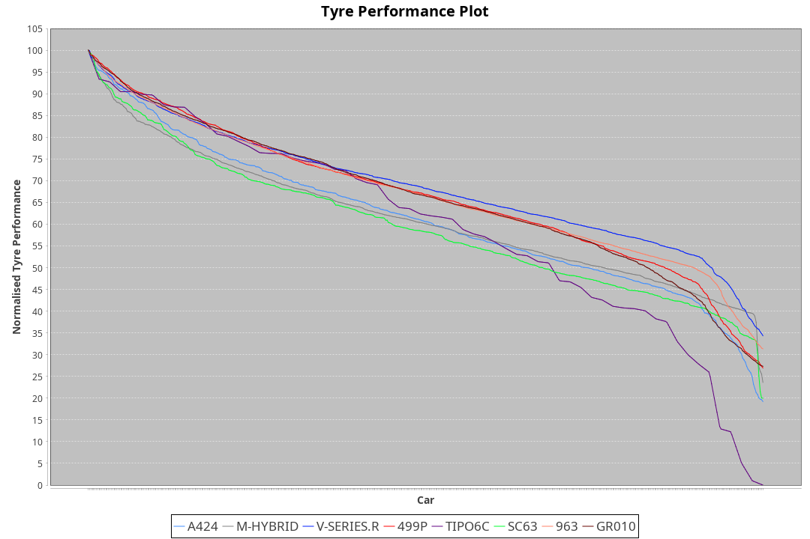

| Manufacturer     | Car        | Weight | Power   | PINC    | E/Stint | FDS     |
|:-|:-|:-|:-|:-|:-|:-|
| Alpine           | A424       | 1070kg | 510.0kw |    -    | 909MJ   |    -    |
| BMW              | M-Hybrid   | 1060kg | 506.0kw |    -    | 904MJ   |    -    |
| Cadillac         | V-Series.R | 1032kg | 499.0kw |    -    | 890MJ   |    -    |
| Ferrari          | 499P       | 1075kg | 503.0kw |    -    | 902MJ   | 190kph  |
| Isotta Fraschini | Tipo6C     | 1085kg | 514.0kw |    -    | 917MJ   | 190kph  |
| Lamborghini      | SC63       | 1041kg | 502.0kw |    -    | 895MJ   |    -    |
| Porsche          | 963        | 1048kg | 505.0kw |    -    | 900MJ   |    -    |
| Toyota           | GR010      | 1089kg | 510.0kw |    -    | 914MJ   | 190kph  |

### BoP Accuracy: 72.08%; Overall BoP Grade: C2
| Manufacturer     | Car        | Type  | RP      | QP      | Weight | Power¹  | Threshhold | PINC    | Power²   | E/Stint | AVG Vmax  | FDS     | RDLC | L/Stint | BOP-Grade | Model Accuracy | Model Points | Match%  | SimDiff |
|:-|:-|:-|:-|:-|:-|:-|:-|:-|:-|:-|:-|:-|:-|:-|:-|:-|:-|:-|:-|
| Alpine           | A424       | LMDH  | 1:43.61 | 1:41.09 | 1070kg | 510.0kw | 0.0kph     |    -    | 510.00kw |  909MJ  | 295.02kph |    -    | 0.98 | 33      | +B2       | 100.00%        | 870          | 82.81%  | ±0.07s  |
| BMW              | M-Hybrid   | LMDH  | 1:43.40 | 1:40.56 | 1060kg | 506.0kw | 0.0kph     |    -    | 506.00kw |  904MJ  | 293.09kph |    -    | 1.00 | 33      | -A2       | 100.00%        | 1914         | 94.49%  | ±0.32s  |
| Cadillac         | V-Series.R | LMDH  | 1:42.39 | 1:39.61 | 1032kg | 499.0kw | 0.0kph     |    -    | 499.00kw |  890MJ  | 291.74kph |    -    | 1.03 | 33      | -E2       | 98.03%         | 3773         | 52.35%  | ±0.77s  |
| Ferrari          | 499P       | LMHHU | 1:43.21 | 1:40.27 | 1075kg | 503.0kw | 0.0kph     |    -    | 503.00kw |  902MJ  | 293.86kph | 190kph  | 1.02 | 33      | -A2       | 100.00%        | 4212         | 90.54%  | ±0.20s  |
| Isotta Fraschini | Tipo6C     | LMHHU | 1:45.01 | 1:43.88 | 1085kg | 514.0kw | 0.0kph     |    -    | 514.00kw |  917MJ  | 291.13kph | 190kph  | 1.02 | 33      | +Ω2       | 100.00%        | 105          | -10.61% | ±0.42s  |
| Lamborghini      | SC63       | LMDH  | 1:43.37 | 1:41.40 | 1041kg | 502.0kw | 0.0kph     |    -    | 502.00kw |  895MJ  | 293.39kph |    -    | 1.05 | 33      | ~A1       | 100.00%        | 597          | 100.00% | ±0.55s  |
| Porsche          | 963        | LMDH  | 1:42.68 | 1:39.72 | 1048kg | 505.0kw | 0.0kph     |    -    | 505.00kw |  900MJ  | 294.27kph |    -    | 1.01 | 33      | -D1       | 99.21%         | 10753        | 67.08%  | ±0.27s  |
| Toyota           | GR010      | LMHHU | 1:43.40 | 1:40.30 | 1089kg | 510.0kw | 0.0kph     |    -    | 510.00kw |  914MJ  | 293.24kph | 190kph  | 1.00 | 33      | ~A1       | 99.54%         | 3271         | 100.00% | ±0.21s  |

## Power below Threshhold
| N/Nmax    | A424    | M-HYBRID | V-SERIES.R | 499P    | TIPO6C  | SC63    | 963     | GR010   |
|:-|:-|:-|:-|:-|:-|:-|:-|:-|
|  0.550    |  251    |  249     |  246       |  248    |  253    |  247    |  249    |  251    |
|  0.575    |  274    |  272     |  268       |  271    |  276    |  270    |  272    |  274    |
|  0.600    |  295    |  292     |  288       |  291    |  297    |  290    |  292    |  295    |
|  0.625    |  316    |  313     |  308       |  311    |  318    |  310    |  312    |  316    |
|  0.650    |  337    |  334     |  329       |  332    |  339    |  331    |  333    |  337    |
|  0.675    |  358    |  355     |  350       |  353    |  361    |  352    |  355    |  358    |
|  0.700    |  380    |  377     |  371       |  374    |  383    |  374    |  376    |  380    |
|  0.725    |  401    |  398     |  392       |  395    |  404    |  395    |  397    |  401    |
|  0.750    |  422    |  418     |  412       |  416    |  425    |  415    |  417    |  422    |
|  0.775    |  441    |  437     |  431       |  435    |  444    |  434    |  436    |  441    |
|  0.800    |  458    |  454     |  448       |  452    |  462    |  451    |  454    |  458    |
|  0.825    |  473    |  469     |  463       |  467    |  477    |  466    |  469    |  473    |
|  0.850    |  485    |  481     |  474       |  478    |  488    |  477    |  480    |  485    |
|  0.875    |  495    |  491     |  484       |  488    |  499    |  487    |  490    |  495    |
|  0.900    |  502    |  498     |  491       |  495    |  506    |  494    |  497    |  502    |
|  0.925    |  507    |  503     |  496       |  500    |  511    |  499    |  502    |  507    |
| **0.950** | **510** | **506**  | **499**    | **503** | **514** | **502** | **505** | **510** |
|  0.975    |  508    |  504     |  497       |  501    |  512    |  500    |  503    |  508    |
|  1.000    |  505    |  501     |  494       |  498    |  508    |  497    |  500    |  505    |
|  1.025    |  436    |  432     |  426       |  430    |  439    |  429    |  431    |  436    |

## Power above Threshhold
| N/Nmax    | A424    | M-HYBRID | V-SERIES.R | 499P    | TIPO6C  | SC63    | 963     | GR010   |
|:-|:-|:-|:-|:-|:-|:-|:-|:-|
|  0.550    |  251    |  249     |  246       |  248    |  253    |  247    |  249    |  251    |
|  0.575    |  274    |  272     |  268       |  271    |  276    |  270    |  272    |  274    |
|  0.600    |  295    |  292     |  288       |  291    |  297    |  290    |  292    |  295    |
|  0.625    |  316    |  313     |  308       |  311    |  318    |  310    |  312    |  316    |
|  0.650    |  337    |  334     |  329       |  332    |  339    |  331    |  333    |  337    |
|  0.675    |  358    |  355     |  350       |  353    |  361    |  352    |  355    |  358    |
|  0.700    |  380    |  377     |  371       |  374    |  383    |  374    |  376    |  380    |
|  0.725    |  401    |  398     |  392       |  395    |  404    |  395    |  397    |  401    |
|  0.750    |  422    |  418     |  412       |  416    |  425    |  415    |  417    |  422    |
|  0.775    |  441    |  437     |  431       |  435    |  444    |  434    |  436    |  441    |
|  0.800    |  458    |  454     |  448       |  452    |  462    |  451    |  454    |  458    |
|  0.825    |  473    |  469     |  463       |  467    |  477    |  466    |  469    |  473    |
|  0.850    |  485    |  481     |  474       |  478    |  488    |  477    |  480    |  485    |
|  0.875    |  495    |  491     |  484       |  488    |  499    |  487    |  490    |  495    |
|  0.900    |  502    |  498     |  491       |  495    |  506    |  494    |  497    |  502    |
|  0.925    |  507    |  503     |  496       |  500    |  511    |  499    |  502    |  507    |
| **0.950** | **510** | **506**  | **499**    | **503** | **514** | **502** | **505** | **510** |
|  0.975    |  508    |  504     |  497       |  501    |  512    |  500    |  503    |  508    |
|  1.000    |  505    |  501     |  494       |  498    |  508    |  497    |  500    |  505    |
|  1.025    |  436    |  432     |  426       |  430    |  439    |  429    |  431    |  436    |
