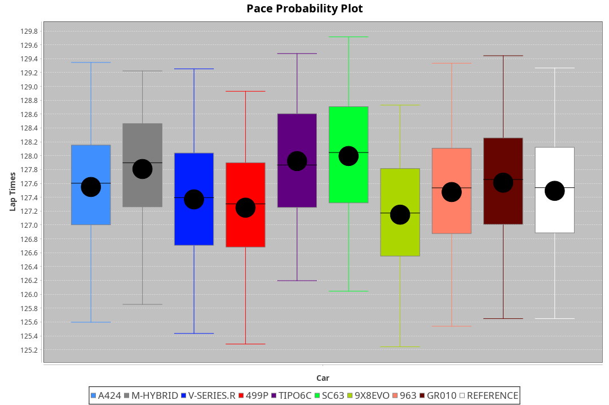
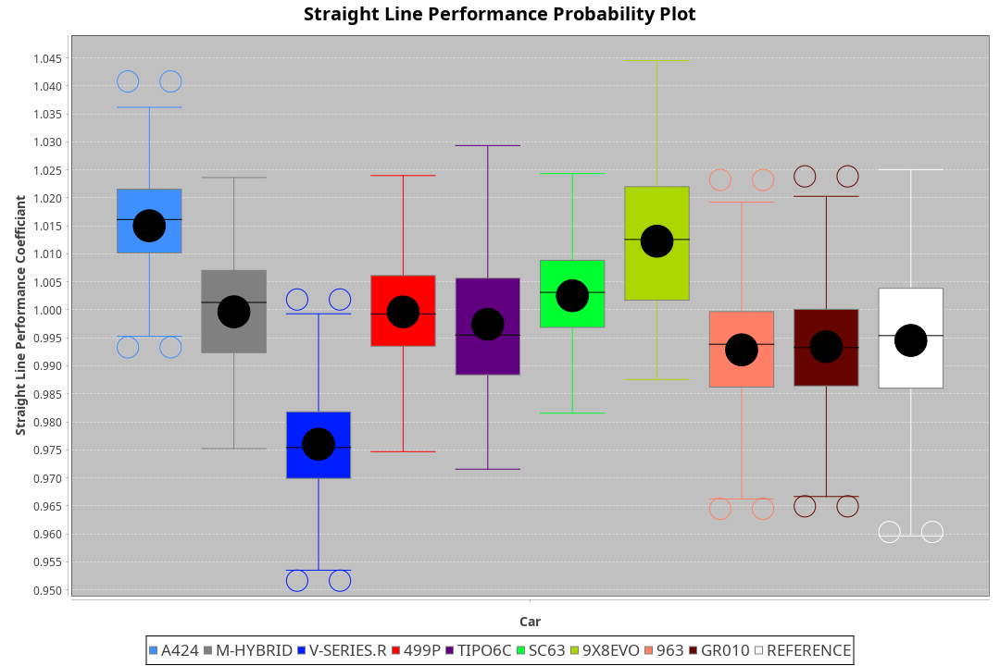
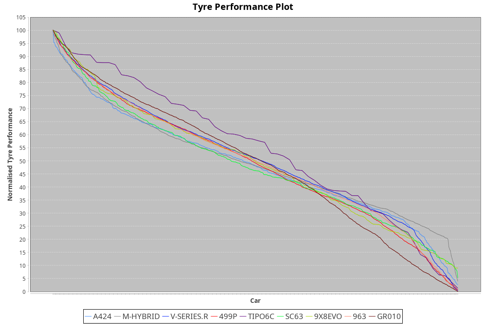

| Manufacturer     | Car        | Weight | Power   | PINC    | E/Stint | FDS     |
|:-|:-|:-|:-|:-|:-|:-|
| Alpine           | A424       | 1048kg | 519.0kw |    -    | 913MJ   |    -    |
| BMW              | M-Hybrid   | 1039kg | 512.0kw |    -    | 904MJ   |    -    |
| Cadillac         | V-Series.R | 1042kg | 507.0kw |    -    | 896MJ   |    -    |
| Ferrari          | 499P       | 1066kg | 505.0kw |    -    | 893MJ   | 190kph  |
| Isotta Fraschini | Tipo6C     | 1049kg | 520.0kw |    -    | 918MJ   | 190kph  |
| Lamborghini      | SC63       | 1036kg | 518.0kw |    -    | 906MJ   |    -    |
| Peugeot          | 9X8Evo     | 1050kg | 507.0kw |    -    | 896MJ   | 190kph  |
| Porsche          | 963        | 1048kg | 515.0kw |    -    | 901MJ   |    -    |
| Toyota           | GR010      | 1081kg | 512.0kw |    -    | 904MJ   | 190kph  |

### BoP Accuracy: 89.99%; Overall BoP Grade: B1
| Manufacturer     | Car        | Type  | RP      | QP      | Weight | Power¹  | Threshhold | PINC    | Power²   | E/Stint | AVG Vmax  | FDS     | RDLC | L/Stint | BOP-Grade | Model Accuracy | Model Points | Match%  | SimDiff |
|:-|:-|:-|:-|:-|:-|:-|:-|:-|:-|:-|:-|:-|:-|:-|:-|:-|:-|:-|:-|
| Alpine           | A424       | LMDH  | 2:06.97 | 2:02.25 | 1048kg | 519.0kw | 210.0kph   |    -    | 519.00kw |  913MJ  | 312.27kph |    -    | 1.00 | 25      | ~A1       | 100.00%        | 635          | 98.48%  | #       |
| BMW              | M-Hybrid   | LMDH  | 2:06.96 | 2:01.45 | 1039kg | 512.0kw | 210.0kph   |    -    | 512.00kw |  904MJ  | 309.59kph |    -    | 1.02 | 25      | ~A1       | 100.00%        | 1696         | 97.13%  | #       |
| Cadillac         | V-Series.R | LMDH  | 2:06.95 | 2:01.67 | 1042kg | 507.0kw | 210.0kph   |    -    | 507.00kw |  896MJ  | 304.11kph |    -    | 1.02 | 25      | ~A1       | 88.64%         | 2076         | 100.00% | #       |
| Ferrari          | 499P       | LMHHU | 2:06.94 | 2:01.43 | 1066kg | 505.0kw | 210.0kph   |    -    | 505.00kw |  893MJ  | 307.17kph | 190kph  | 1.03 | 25      | ~A1       | 91.94%         | 2476         | 100.00% | #       |
| Isotta Fraschini | Tipo6C     | LMHHU | 2:07.62 | 2:04.69 | 1049kg | 520.0kw | 210.0kph   |    -    | 520.00kw |  918MJ  | 309.70kph | 190kph  | 1.05 | 25      | +Ω1       | 100.00%        | 66           | 34.37%  | #       |
| Lamborghini      | SC63       | LMDH  | 2:06.96 | 2:03.73 | 1036kg | 518.0kw | 210.0kph   |    -    | 518.00kw |  906MJ  | 310.93kph |    -    | 1.05 | 25      | ~A1       | 100.00%        | 504          | 96.02%  | #       |
| Peugeot          | 9X8Evo     | LMHHU | 2:06.98 | 2:02.82 | 1050kg | 507.0kw | 210.0kph   |    -    | 507.00kw |  896MJ  | 310.43kph | 190kph  | 1.00 | 25      | +B2       | 100.00%        | 249          | 83.92%  | #       |
| Porsche          | 963        | LMDH  | 2:06.97 | 2:01.11 | 1048kg | 515.0kw | 210.0kph   |    -    | 515.00kw |  901MJ  | 308.00kph |    -    | 1.01 | 25      | ~A1       | 90.40%         | 5633         | 100.00% | #       |
| Toyota           | GR010      | LMHHU | 2:06.96 | 2:01.62 | 1081kg | 512.0kw | 210.0kph   |    -    | 512.00kw |  904MJ  | 305.99kph | 190kph  | 1.01 | 25      | ~A1       | 90.11%         | 3235         | 100.00% | #       |

## Power below Threshhold
| N/Nmax    | A424    | M-HYBRID | V-SERIES.R | 499P    | TIPO6C  | SC63    | 9X8EVO  | 963     | GR010   |
|:-|:-|:-|:-|:-|:-|:-|:-|:-|:-|
|  0.550    |  256    |  252     |  250       |  249    |  256    |  255    |  250    |  254    |  252    |
|  0.575    |  279    |  275     |  273       |  272    |  279    |  278    |  273    |  277    |  275    |
|  0.600    |  299    |  296     |  293       |  292    |  300    |  299    |  293    |  297    |  296    |
|  0.625    |  321    |  317     |  314       |  312    |  322    |  321    |  314    |  319    |  317    |
|  0.650    |  342    |  338     |  335       |  333    |  343    |  342    |  335    |  340    |  338    |
|  0.675    |  364    |  359     |  356       |  355    |  365    |  364    |  356    |  362    |  359    |
|  0.700    |  386    |  381     |  377       |  376    |  387    |  386    |  377    |  383    |  381    |
|  0.725    |  408    |  403     |  399       |  397    |  409    |  407    |  399    |  405    |  403    |
|  0.750    |  429    |  423     |  419       |  417    |  430    |  428    |  419    |  426    |  423    |
|  0.775    |  448    |  442     |  438       |  436    |  449    |  447    |  438    |  445    |  442    |
|  0.800    |  466    |  460     |  455       |  454    |  467    |  465    |  455    |  463    |  460    |
|  0.825    |  481    |  475     |  470       |  469    |  482    |  480    |  470    |  478    |  475    |
|  0.850    |  493    |  486     |  482       |  480    |  494    |  492    |  482    |  489    |  486    |
|  0.875    |  504    |  497     |  492       |  490    |  505    |  503    |  492    |  500    |  497    |
|  0.900    |  511    |  504     |  499       |  497    |  512    |  510    |  499    |  507    |  504    |
|  0.925    |  516    |  509     |  504       |  502    |  517    |  515    |  504    |  512    |  509    |
| **0.950** | **519** | **512**  | **507**    | **505** | **520** | **518** | **507** | **515** | **512** |
|  0.975    |  517    |  510     |  505       |  503    |  518    |  516    |  505    |  513    |  510    |
|  1.000    |  513    |  506     |  502       |  500    |  514    |  512    |  502    |  509    |  506    |
|  1.025    |  443    |  437     |  433       |  431    |  444    |  442    |  433    |  440    |  437    |

## Power above Threshhold
| N/Nmax    | A424    | M-HYBRID | V-SERIES.R | 499P    | TIPO6C  | SC63    | 9X8EVO  | 963     | GR010   |
|:-|:-|:-|:-|:-|:-|:-|:-|:-|:-|
|  0.550    |  256    |  252     |  250       |  249    |  256    |  255    |  250    |  254    |  252    |
|  0.575    |  279    |  275     |  273       |  272    |  279    |  278    |  273    |  277    |  275    |
|  0.600    |  299    |  296     |  293       |  292    |  300    |  299    |  293    |  297    |  296    |
|  0.625    |  321    |  317     |  314       |  312    |  322    |  321    |  314    |  319    |  317    |
|  0.650    |  342    |  338     |  335       |  333    |  343    |  342    |  335    |  340    |  338    |
|  0.675    |  364    |  359     |  356       |  355    |  365    |  364    |  356    |  362    |  359    |
|  0.700    |  386    |  381     |  377       |  376    |  387    |  386    |  377    |  383    |  381    |
|  0.725    |  408    |  403     |  399       |  397    |  409    |  407    |  399    |  405    |  403    |
|  0.750    |  429    |  423     |  419       |  417    |  430    |  428    |  419    |  426    |  423    |
|  0.775    |  448    |  442     |  438       |  436    |  449    |  447    |  438    |  445    |  442    |
|  0.800    |  466    |  460     |  455       |  454    |  467    |  465    |  455    |  463    |  460    |
|  0.825    |  481    |  475     |  470       |  469    |  482    |  480    |  470    |  478    |  475    |
|  0.850    |  493    |  486     |  482       |  480    |  494    |  492    |  482    |  489    |  486    |
|  0.875    |  504    |  497     |  492       |  490    |  505    |  503    |  492    |  500    |  497    |
|  0.900    |  511    |  504     |  499       |  497    |  512    |  510    |  499    |  507    |  504    |
|  0.925    |  516    |  509     |  504       |  502    |  517    |  515    |  504    |  512    |  509    |
| **0.950** | **519** | **512**  | **507**    | **505** | **520** | **518** | **507** | **515** | **512** |
|  0.975    |  517    |  510     |  505       |  503    |  518    |  516    |  505    |  513    |  510    |
|  1.000    |  513    |  506     |  502       |  500    |  514    |  512    |  502    |  509    |  506    |
|  1.025    |  443    |  437     |  433       |  431    |  444    |  442    |  433    |  440    |  437    |
