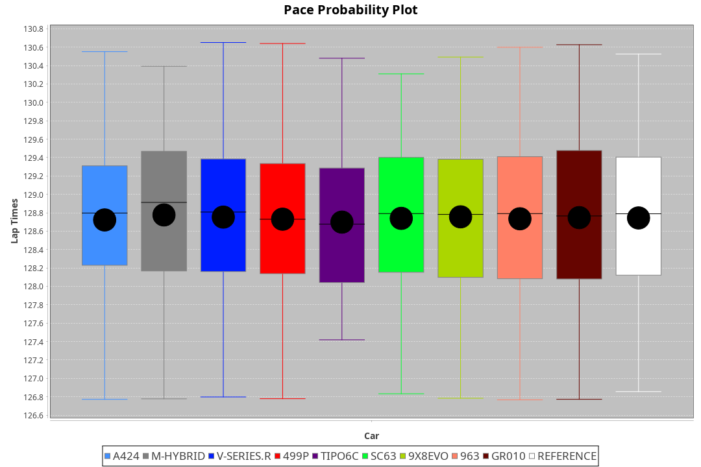
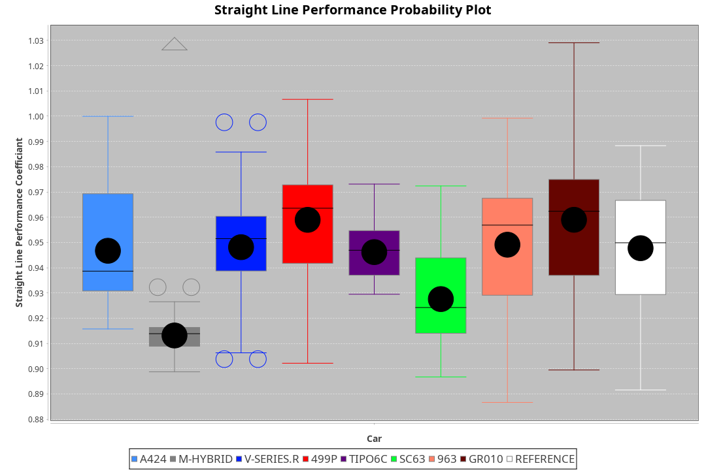
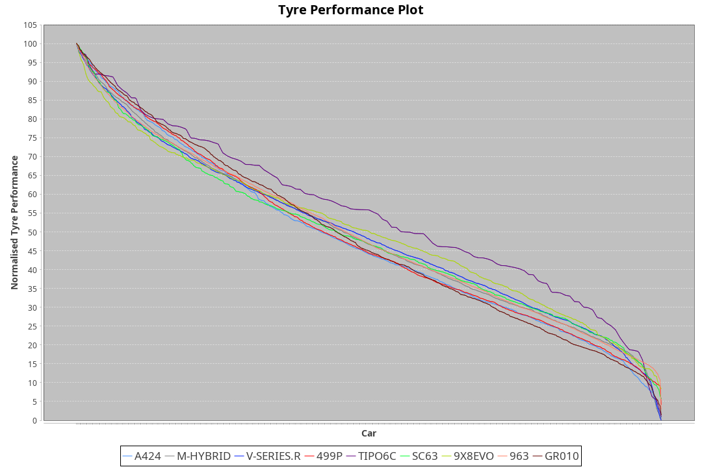

|Manufacturer|Car|Type|RP|QP|Weight|Power¹|Threshhold|PINC|Power²|E/Stint|AVG Vmax|FDS|RDLC|L/Stint|BOP-Grade|ModelAccuracy|ModelPoints|Match%|
|:-|:-|:-|:-|:-|:-|:-|:-|:-|:-|:-|:-|:-|:-|:-|:-|:-|:-|:-|
|Alpine|A424|LMDH|2:06.74|2:00.95|1030kg|510kw|210.0kph|0%|510kw|900MJ|304.95kph|-|1.03|25|~A1|81.46%|523|100.00%|
|BMW|M Hybrid V8 LMDh|LMDH|2:06.74|2:00.92|1049kg|514kw|210.0kph|0%|514kw|898MJ|299.75kph|-|1.02|25|~A1|98.60%|1690|100.00%|
|Cadillac|V-Series.R|LMDH|2:06.75|2:01.26|1043kg|509kw|210.0kph|0%|509kw|883MJ|303.70kph|-|1.02|25|~A1|98.38%|1765|96.72%|
|Ferrari|499P|LMHHU|2:06.74|2:01.23|1068kg|503kw|210.0kph|0%|503kw|886MJ|304.25kph|190kph|1.02|25|~A1|92.24%|2247|100.00%|
|Issotta Fraschini|Tipo6C|LMHHU|2:06.75|2:01.91|1030kg|520kw|210.0kph|0%|520kw|917MJ|305.63kph|150kph|1.08|25|+A2|66.67%|96|92.42%|
|Lamborghini|SC63|LMDH|2:06.73|2:00.81|1066kg|520kw|210.0kph|0%|520kw|902MJ|301.19kph|-|1.02|25|~A1|96.77%|419|96.02%|
|Porsche|963|LMDH|2:06.74|2:01.29|1045kg|512kw|210.0kph|0%|512kw|895MJ|304.28kph|-|1.02|25|~A1|96.81%|5438|100.00%|
|Toyota|GR010 - Hybrid|LMHHU|2:06.74|2:01.02|1074kg|508kw|210.0kph|0%|508kw|901MJ|302.24kph|190kph|1.02|25|~A1|86.04%|1751|100.00%|

### BoP Accuracy: 98.15%; Overall BoP Grade: A1

## Power below Threshhold
|N/Nmax|TOY|FER|CAD|POR|IF|BMW|ALP|LBG|
|:-|:-|:-|:-|:-|:-|:-|:-|:-|
|0.550|250|248|251|252|256|253|251|256|
|0.575|273|271|274|275|279|276|274|279|
|0.600|293|291|294|296|300|297|295|300|
|0.625|314|311|315|317|322|318|316|322|
|0.650|335|332|336|338|343|339|337|343|
|0.675|357|353|357|359|365|361|358|365|
|0.700|378|374|379|381|387|383|380|387|
|0.725|399|395|400|403|409|404|401|409|
|0.750|420|416|421|423|430|425|422|430|
|0.775|439|435|440|442|449|444|441|449|
|0.800|456|452|457|460|467|462|458|467|
|0.825|471|467|472|475|482|477|473|482|
|0.850|483|478|484|486|494|488|485|494|
|0.875|493|488|494|497|505|499|495|505|
|0.900|500|495|501|504|512|506|502|512|
|0.925|505|500|506|509|517|511|507|517|
|**0.950**|**508**|**503**|**509**|**512**|**520**|**514**|**510**|**520**|
|0.975|506|501|507|510|518|512|508|518|
|1.000|503|498|504|506|514|508|505|514|
|1.025|434|430|435|437|444|439|436|444|

## Power above Threshhold
|N/Nmax|TOY|FER|CAD|POR|IF|BMW|ALP|LBG|
|:-|:-|:-|:-|:-|:-|:-|:-|:-|
|0.550|250|248|251|252|256|253|251|256|
|0.575|273|271|274|275|279|276|274|279|
|0.600|293|291|294|296|300|297|295|300|
|0.625|314|311|315|317|322|318|316|322|
|0.650|335|332|336|338|343|339|337|343|
|0.675|357|353|357|359|365|361|358|365|
|0.700|378|374|379|381|387|383|380|387|
|0.725|399|395|400|403|409|404|401|409|
|0.750|420|416|421|423|430|425|422|430|
|0.775|439|435|440|442|449|444|441|449|
|0.800|456|452|457|460|467|462|458|467|
|0.825|471|467|472|475|482|477|473|482|
|0.850|483|478|484|486|494|488|485|494|
|0.875|493|488|494|497|505|499|495|505|
|0.900|500|495|501|504|512|506|502|512|
|0.925|505|500|506|509|517|511|507|517|
|**0.950**|**508**|**503**|**509**|**512**|**520**|**514**|**510**|**520**|
|0.975|506|501|507|510|518|512|508|518|
|1.000|503|498|504|506|514|508|505|514|
|1.025|434|430|435|437|444|439|436|444|
