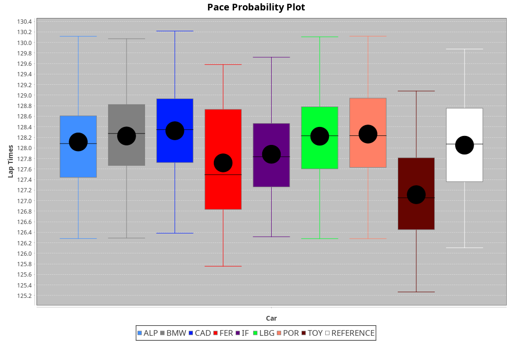
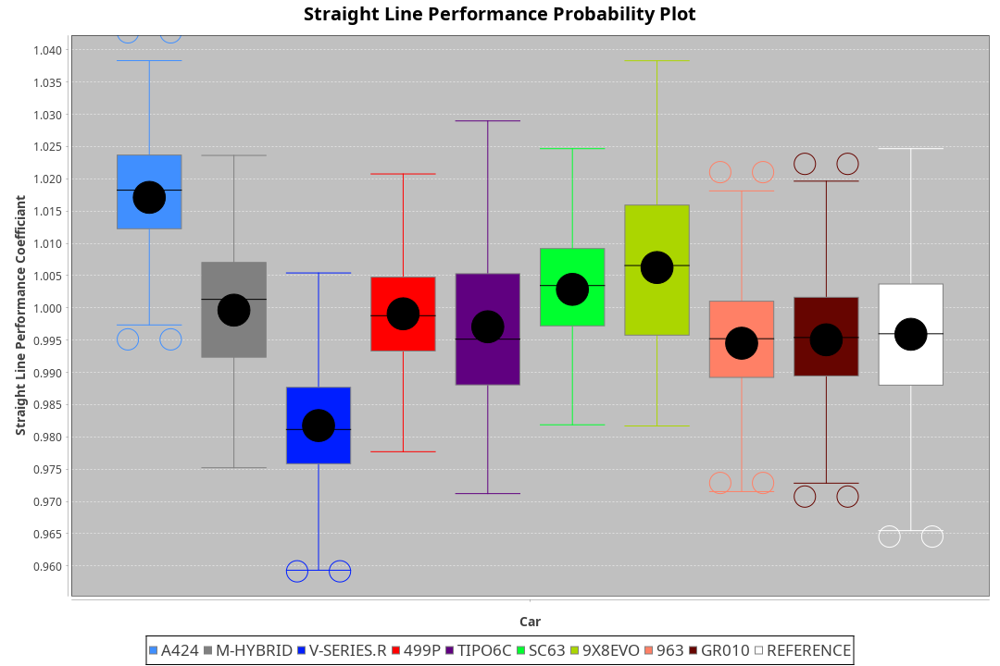
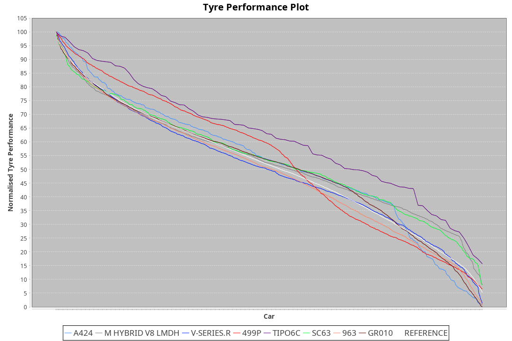

| Manufacturer     | Car        | Weight | Power | PINC    | E/Stint | FDS     |
|:-|:-|:-|:-|:-|:-|:-|
| Alpine           | A424       | 1070kg | 510kw | -1%     | 907MJ   |    -    |
| BMW              | M-Hybrid   | 1053kg | 505kw | 1%      | 901MJ   |    -    |
| Cadillac         | V-Series.R | 1044kg | 502kw | -1%     | 890MJ   |    -    |
| Ferrari          | 499P       | 1075kg | 500kw | -1%     | 891MJ   | 190kph  |
| Isotta Fraschini | Tipo6C     | 1040kg | 484kw |    -    | 885MJ   | 190kph  |
| Lamborghini      | SC63       | 1055kg | 506kw | 1%      | 902MJ   |    -    |
| Porsche          | 963        | 1058kg | 507kw | -1%     | 893MJ   |    -    |
| Toyota           | GR010      | 1082kg | 507kw |    -    | 900MJ   | 190kph  |

### BoP Accuracy: 56.89%; Overall BoP Grade: E1
| Manufacturer     | Car        | Type  | RP      | QP      | Weight | Power¹ | Threshhold | PINC    | Power² | E/Stint | AVG Vmax  | FDS     | RDLC | L/Stint | BOP-Grade | Model Accuracy | Model Points | Match% |
|:-|:-|:-|:-|:-|:-|:-|:-|:-|:-|:-|:-|:-|:-|:-|:-|:-|:-|:-|
| Alpine           | A424       | LMDH  | 2:11.84 | 2:07.38 | 1070kg | 510kw  | 210.0kph   | -1%     | 505kw  |  907MJ  | 300.42kph |    -    | 1.00 | 25      | +Ω1       | 100.00%        | 642          | 40.93% |
| BMW              | M-Hybrid   | LMDH  | 2:09.47 | 2:04.02 | 1053kg | 505kw  | 210.0kph   | 1%      | 510kw  |  901MJ  | 297.92kph |    -    | 1.02 | 25      | -Ω1       | 100.00%        | 1714         | 44.93% |
| Cadillac         | V-Series.R | LMDH  | 2:09.03 | 2:03.27 | 1044kg | 502kw  | 210.0kph   | -1%     | 497kw  |  890MJ  | 301.09kph |    -    | 1.02 | 25      | -Ω1       | 98.95%         | 2271         | 31.30% |
| Ferrari          | 499P       | LMHHU | 2:11.91 | 2:05.87 | 1075kg | 500kw  | 210.0kph   | -1%     | 495kw  |  891MJ  | 301.93kph | 190kph  | 1.02 | 25      | +C2       | 99.93%         | 2718         | 70.78% |
| Isotta Fraschini | Tipo6C     | LMHHU | 2:11.89 | 2:08.08 | 1040kg | 484kw  | 210.0kph   |    -    | 484kw  |  885MJ  | 298.97kph | 190kph  | 1.07 | 25      | +Ω1       | 92.36%         | 133          | 34.90% |
| Lamborghini      | SC63       | LMDH  | 2:10.27 | 2:07.69 | 1055kg | 506kw  | 210.0kph   | 1%      | 511kw  |  902MJ  | 299.56kph |    -    | 1.04 | 25      | -B2       | 96.54%         | 418          | 81.42% |
| Porsche          | 963        | LMDH  | 2:10.32 | 2:04.38 | 1058kg | 507kw  | 210.0kph   | -1%     | 502kw  |  893MJ  | 301.31kph |    -    | 1.01 | 25      | -B2       | 99.98%         | 6168         | 80.81% |
| Toyota           | GR010      | LMHHU | 2:11.88 | 2:05.84 | 1082kg | 507kw  | 210.0kph   |    -    | 507kw  |  900MJ  | 302.80kph | 190kph  | 1.01 | 25      | +C2       | 98.53%         | 3557         | 70.07% |

## Power below Threshhold
| N/Nmax    | A424    | M-HYBRID | V-SERIES.R | 499P    | TIPO6C  | SC63    | 963     | GR010   |
|:-|:-|:-|:-|:-|:-|:-|:-|:-|
|  0.550    |  251    |  249     |  247       |  246    |  238    |  249    |  250    |  250    |
|  0.575    |  274    |  272     |  270       |  269    |  260    |  272    |  273    |  273    |
|  0.600    |  295    |  292     |  290       |  289    |  279    |  292    |  293    |  293    |
|  0.625    |  316    |  312     |  310       |  309    |  299    |  313    |  314    |  314    |
|  0.650    |  337    |  333     |  331       |  330    |  320    |  334    |  335    |  335    |
|  0.675    |  358    |  355     |  352       |  351    |  340    |  355    |  356    |  356    |
|  0.700    |  380    |  376     |  374       |  372    |  361    |  377    |  377    |  377    |
|  0.725    |  401    |  397     |  395       |  393    |  381    |  398    |  399    |  399    |
|  0.750    |  422    |  417     |  415       |  413    |  400    |  418    |  419    |  419    |
|  0.775    |  441    |  436     |  434       |  432    |  418    |  437    |  438    |  438    |
|  0.800    |  458    |  454     |  451       |  449    |  435    |  454    |  455    |  455    |
|  0.825    |  473    |  469     |  466       |  464    |  449    |  469    |  470    |  470    |
|  0.850    |  485    |  480     |  477       |  475    |  460    |  481    |  482    |  482    |
|  0.875    |  495    |  490     |  487       |  485    |  470    |  491    |  492    |  492    |
|  0.900    |  502    |  497     |  494       |  492    |  476    |  498    |  499    |  499    |
|  0.925    |  507    |  502     |  499       |  497    |  481    |  503    |  504    |  504    |
| **0.950** | **510** | **505**  | **502**    | **500** | **484** | **506** | **507** | **507** |
|  0.975    |  508    |  503     |  500       |  498    |  482    |  504    |  505    |  505    |
|  1.000    |  505    |  500     |  497       |  495    |  479    |  501    |  502    |  502    |
|  1.025    |  436    |  431     |  429       |  427    |  413    |  432    |  433    |  433    |

## Power above Threshhold
| N/Nmax    | A424    | M-HYBRID | V-SERIES.R | 499P    | TIPO6C  | SC63    | 963     | GR010   |
|:-|:-|:-|:-|:-|:-|:-|:-|:-|
|  0.550    |  249    |  251     |  245       |  244    |  238    |  252    |  247    |  250    |
|  0.575    |  272    |  274     |  267       |  266    |  260    |  275    |  270    |  273    |
|  0.600    |  292    |  295     |  287       |  286    |  279    |  295    |  290    |  293    |
|  0.625    |  312    |  316     |  307       |  306    |  299    |  316    |  310    |  314    |
|  0.650    |  333    |  337     |  328       |  327    |  320    |  337    |  331    |  335    |
|  0.675    |  355    |  358     |  349       |  348    |  340    |  359    |  352    |  356    |
|  0.700    |  376    |  380     |  370       |  369    |  361    |  380    |  374    |  377    |
|  0.725    |  397    |  401     |  391       |  389    |  381    |  402    |  395    |  399    |
|  0.750    |  417    |  422     |  411       |  409    |  400    |  422    |  415    |  419    |
|  0.775    |  436    |  441     |  429       |  428    |  418    |  441    |  434    |  438    |
|  0.800    |  454    |  458     |  446       |  445    |  435    |  459    |  451    |  455    |
|  0.825    |  469    |  473     |  461       |  459    |  449    |  474    |  466    |  470    |
|  0.850    |  480    |  485     |  472       |  470    |  460    |  485    |  477    |  482    |
|  0.875    |  490    |  495     |  482       |  480    |  470    |  496    |  487    |  492    |
|  0.900    |  497    |  502     |  489       |  487    |  476    |  503    |  494    |  499    |
|  0.925    |  502    |  507     |  494       |  492    |  481    |  508    |  499    |  504    |
| **0.950** | **505** | **510**  | **497**    | **495** | **484** | **511** | **502** | **507** |
|  0.975    |  503    |  508     |  495       |  493    |  482    |  509    |  500    |  505    |
|  1.000    |  500    |  505     |  492       |  490    |  479    |  505    |  497    |  502    |
|  1.025    |  431    |  436     |  424       |  423    |  413    |  436    |  429    |  433    |
