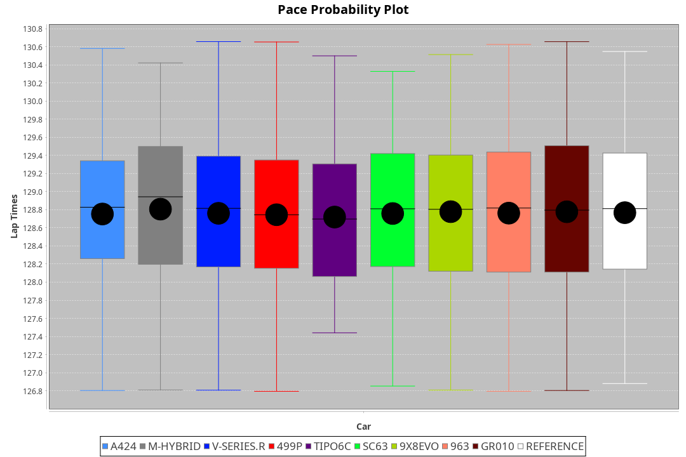
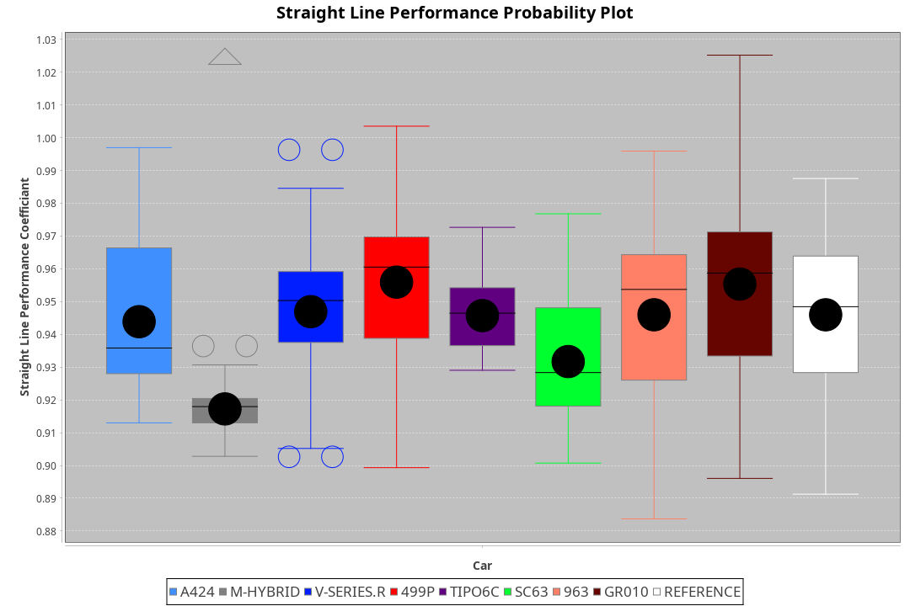
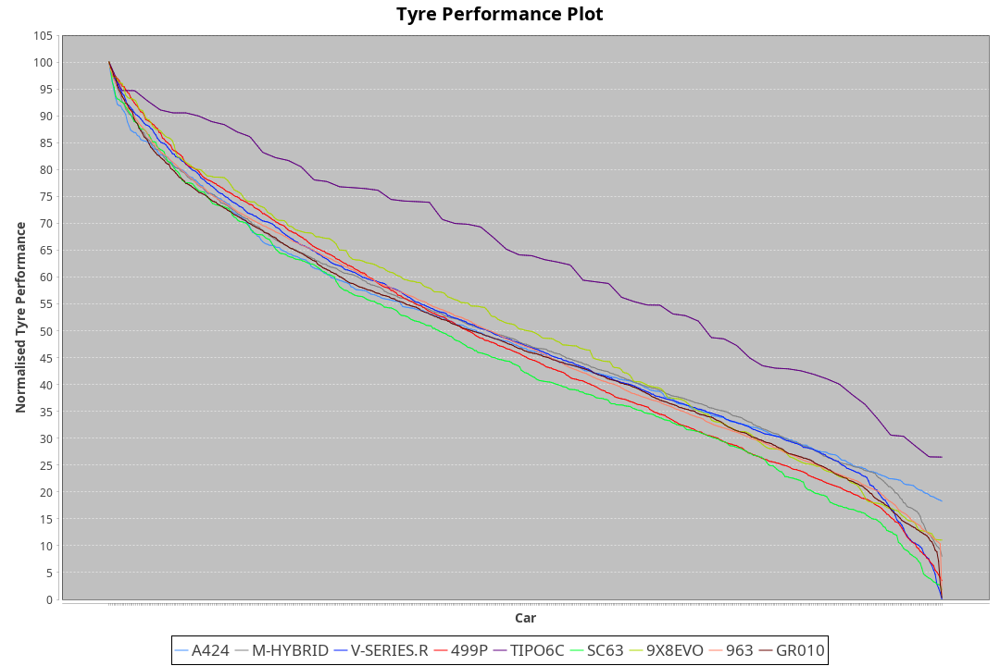

|Manufacturer|Car|Type|RP|QP|Weight|Power¹|Threshhold|PINC|Power²|E/Stint|AVG Vmax|FDS|RDLC|L/Stint|BOP-Grade|ModelAccuracy|ModelPoints|Match%|
|:-|:-|:-|:-|:-|:-|:-|:-|:-|:-|:-|:-|:-|:-|:-|:-|:-|:-|:-|
|Alpine|A424|LMDH|2:06.76|2:00.97|1031kg|520kw|210.0kph|-5%|494kw|900MJ|299.93kph-319.49kph|-|1.03|25|~A1|81.46%|523|100.00%|
|BMW|M Hybrid V8 LMDh|LMDH|2:06.74|2:00.92|1049kg|510kw|210.0kph|2%|520kw|898MJ|296.93kph-319.41kph|-|1.02|25|~A1|98.60%|1690|100.00%|
|Cadillac|V-Series.R|LMDH|2:06.75|2:01.26|1043kg|517kw|210.0kph|-4%|496kw|883MJ|294.38kph-317.44kph|-|1.02|25|~A1|98.38%|1765|96.98%|
|Ferrari|499P|LMHHU|2:06.74|2:01.23|1068kg|515kw|210.0kph|-6%|484kw|886MJ|296.48kph-317.61kph|190kph|1.02|25|~A1|92.24%|2247|100.00%|
|Issotta Fraschini|Tipo6C|LMHHU|2:06.75|2:01.91|1030kg|520kw|210.0kph|0%|520kw|917MJ|303.65kph-313.81kph|150kph|1.08|25|+A2|66.67%|96|92.42%|
|Lamborghini|SC63|LMDH|2:06.75|2:00.83|1067kg|520kw|210.0kph|0%|520kw|902MJ|297.43kph-314.69kph|-|1.02|25|~A1|96.77%|419|95.35%|
|Porsche|963|LMDH|2:06.75|2:01.29|1040kg|519kw|210.0kph|-4%|498kw|894MJ|296.51kph-318.74kph|-|1.02|25|~A1|96.81%|5438|100.00%|
|Toyota|GR010 - Hybrid|LMHHU|2:06.74|2:01.02|1074kg|504kw|210.0kph|2%|514kw|901MJ|295.87kph-326.18kph|190kph|1.02|25|~A1|86.04%|1751|100.00%|

### BoP Accuracy: 98.09%; Overall BoP Grade: A1

## Power below Threshhold
|N/Nmax|TOY|FER|CAD|POR|IF|BMW|ALP|LBG|
|:-|:-|:-|:-|:-|:-|:-|:-|:-|
|0.550|248|254|255|256|256|251|256|256|
|0.575|271|277|278|279|279|274|279|279|
|0.600|291|297|298|299|300|295|300|300|
|0.625|312|319|320|321|322|316|322|322|
|0.650|333|340|341|342|343|337|343|343|
|0.675|354|362|363|364|365|358|365|365|
|0.700|375|383|385|386|387|380|387|387|
|0.725|396|405|407|408|409|401|409|409|
|0.750|416|426|427|429|430|422|430|430|
|0.775|435|445|446|448|449|441|449|449|
|0.800|453|463|464|466|467|458|467|467|
|0.825|468|478|479|481|482|473|482|482|
|0.850|479|489|491|493|494|485|494|494|
|0.875|489|500|502|504|505|495|505|505|
|0.900|496|507|509|511|512|502|512|512|
|0.925|501|512|514|516|517|507|517|517|
|**0.950**|**504**|**515**|**517**|**519**|**520**|**510**|**520**|**520**|
|0.975|502|513|515|517|518|508|518|518|
|1.000|499|509|511|513|514|505|514|514|
|1.025|430|440|441|443|444|436|444|444|

## Power above Threshhold
|N/Nmax|TOY|FER|CAD|POR|IF|BMW|ALP|LBG|
|:-|:-|:-|:-|:-|:-|:-|:-|:-|
|0.550|253|238|244|245|256|256|243|256|
|0.575|276|260|267|268|279|279|266|279|
|0.600|297|279|287|288|300|300|285|300|
|0.625|318|299|307|308|322|322|305|322|
|0.650|339|320|327|329|343|343|326|343|
|0.675|361|340|348|350|365|365|347|365|
|0.700|383|361|369|371|387|387|368|387|
|0.725|404|381|390|392|409|409|389|409|
|0.750|425|400|410|411|430|430|408|430|
|0.775|444|418|429|430|449|449|427|449|
|0.800|462|435|445|447|467|467|444|467|
|0.825|477|449|460|462|482|482|458|482|
|0.850|488|460|471|473|494|494|469|494|
|0.875|499|470|481|483|505|505|479|505|
|0.900|506|476|488|490|512|512|486|512|
|0.925|511|481|493|495|517|517|491|517|
|**0.950**|**514**|**484**|**496**|**498**|**520**|**520**|**494**|**520**|
|0.975|512|482|494|496|518|518|492|518|
|1.000|508|479|491|493|514|514|489|514|
|1.025|439|413|424|425|444|444|422|444|
