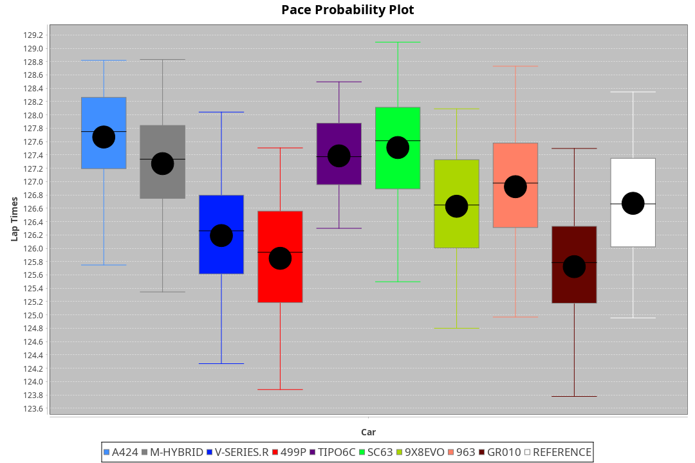
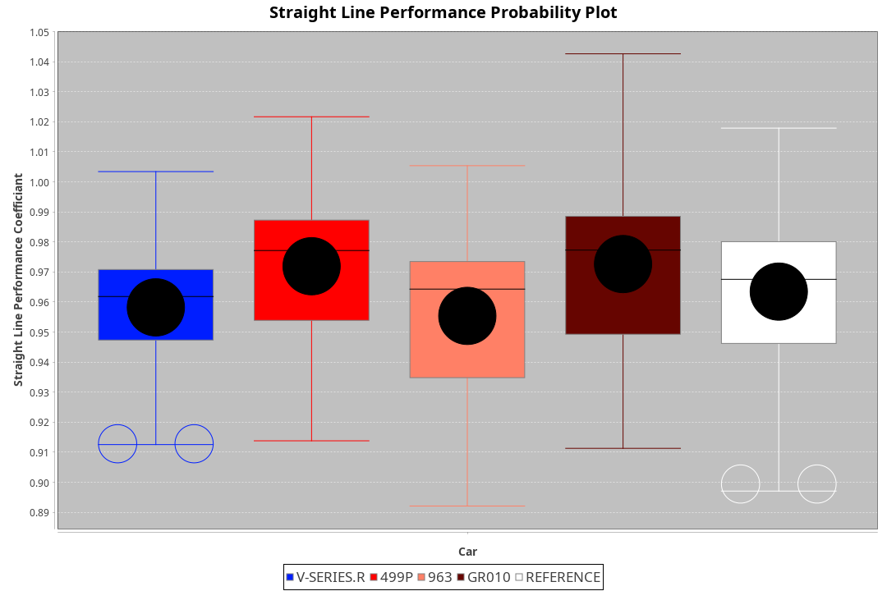
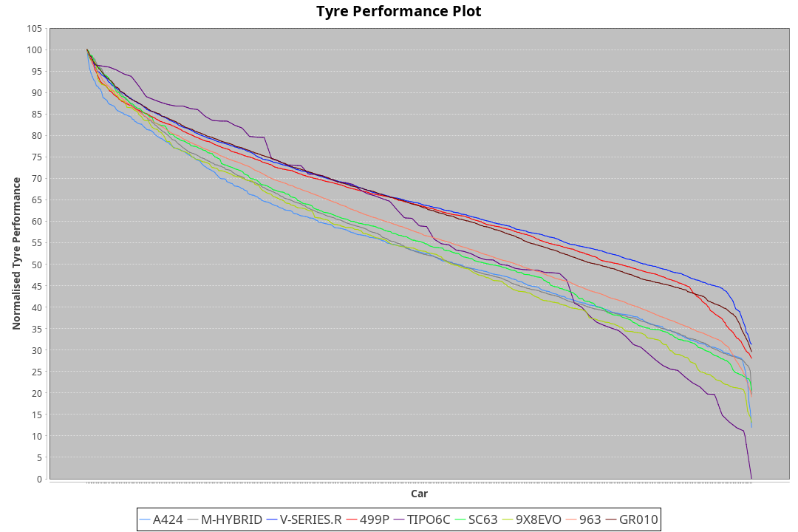

| Manufacturer     | Car        | Weight | Power | PINC    | E/Stint | FDS     |
|:-|:-|:-|:-|:-|:-|:-|
| Alpine           | A424       | 1045kg | 513kw |    -    | 908MJ   |    -    |
| BMW              | M-Hybrid   | 1038kg | 510kw |    -    | 902MJ   |    -    |
| Cadillac         | V-Series.R | 1030kg | 516kw |    -    | 903MJ   |    -    |
| Ferrari          | 499P       | 1053kg | 508kw |    -    | 898MJ   | 190kph  |
| Isotta Fraschini | Tipo6C     | 1059kg | 520kw |    -    | 917MJ   | 190kph  |
| Lamborghini      | SC63       | 1035kg | 514kw |    -    | 905MJ   |    -    |
| Peugeot          | 9X8Evo     | 1065kg | 508kw |    -    | 905MJ   | 190kph  |
| Porsche          | 963        | 1037kg | 507kw |    -    | 893MJ   |    -    |
| Toyota           | GR010      | 1064kg | 515kw |    -    | 905MJ   | 190kph  |

### BoP Accuracy: 81.74%; Overall BoP Grade: B2
| Manufacturer     | Car        | Type  | RP      | QP      | Weight | Power¹ | Threshhold | PINC    | Power² | E/Stint | AVG Vmax  | FDS     | RDLC | L/Stint | BOP-Grade | Model Accuracy | Model Points | Match%  | SimDiff |
|:-|:-|:-|:-|:-|:-|:-|:-|:-|:-|:-|:-|:-|:-|:-|:-|:-|:-|:-|:-|
| Alpine           | A424       | LMDH  | 2:07.28 | 2:02.10 | 1045kg | 513kw  | 210.0kph   |    -    | 513kw  |  908MJ  | 310.78kph |    -    | 1.01 | 25      | +B1       | 86.43%         | 618          | 88.70%  | ±2.41s  |
| BMW              | M-Hybrid   | LMDH  | 2:07.10 | 2:01.39 | 1038kg | 510kw  | 210.0kph   |    -    | 510kw  |  902MJ  | 308.02kph |    -    | 1.02 | 25      | +A2       | 93.77%         | 1672         | 92.23%  | ±2.67s  |
| Cadillac         | V-Series.R | LMDH  | 2:06.34 | 2:01.20 | 1030kg | 516kw  | 210.0kph   |    -    | 516kw  |  903MJ  | 307.15kph |    -    | 1.03 | 25      | -C2       | 83.12%         | 1921         | 74.45%  | ±3.33s  |
| Ferrari          | 499P       | LMHHU | 2:06.49 | 2:01.16 | 1053kg | 508kw  | 210.0kph   |    -    | 508kw  |  898MJ  | 309.01kph | 190kph  | 1.04 | 25      | -B1       | 69.49%         | 1950         | 89.37%  | ±2.92s  |
| Isotta Fraschini | Tipo6C     | LMHHU | 2:08.13 | 2:04.74 | 1059kg | 520kw  | 210.0kph   |    -    | 520kw  |  917MJ  | 305.90kph | 190kph  | 1.04 | 25      | +Ω1       | 73.56%         | 64           | 28.01%  | ±2.88s  |
| Lamborghini      | SC63       | LMDH  | 2:07.47 | 2:04.26 | 1035kg | 514kw  | 210.0kph   |    -    | 514kw  |  905MJ  | 308.21kph |    -    | 1.05 | 25      | +C1       | 95.82%         | 459          | 79.24%  | ±2.70s  |
| Peugeot          | 9X8Evo     | LMHHU | 2:07.56 | 2:02.22 | 1065kg | 508kw  | 210.0kph   |    -    | 508kw  |  905MJ  | 306.09kph | 190kph  | 0.99 | 25      | ~A1       | 66.97%         | 221          | 100.00% | ±2.84s  |
| Porsche          | 963        | LMDH  | 2:07.00 | 2:01.57 | 1037kg | 507kw  | 210.0kph   |    -    | 507kw  |  893MJ  | 307.44kph |    -    | 1.02 | 25      | ~A1       | 81.02%         | 5243         | 100.00% | ±2.17s  |
| Toyota           | GR010      | LMHHU | 2:06.42 | 2:01.28 | 1064kg | 515kw  | 210.0kph   |    -    | 515kw  |  905MJ  | 308.10kph | 190kph  | 1.02 | 25      | -B2       | 73.70%         | 2701         | 83.63%  | ±3.33s  |

## Power below Threshhold
| N/Nmax    | A424    | M-HYBRID | V-SERIES.R | 499P    | TIPO6C  | SC63    | 9X8EVO  | 963     | GR010   |
|:-|:-|:-|:-|:-|:-|:-|:-|:-|:-|
|  0.550    |  253    |  251     |  254       |  250    |  256    |  253    |  250    |  250    |  254    |
|  0.575    |  276    |  274     |  277       |  273    |  279    |  276    |  273    |  273    |  277    |
|  0.600    |  296    |  295     |  298       |  293    |  300    |  297    |  293    |  293    |  297    |
|  0.625    |  317    |  316     |  319       |  314    |  322    |  318    |  314    |  314    |  319    |
|  0.650    |  338    |  337     |  340       |  335    |  343    |  339    |  335    |  335    |  340    |
|  0.675    |  360    |  358     |  362       |  357    |  365    |  361    |  357    |  356    |  362    |
|  0.700    |  382    |  380     |  384       |  378    |  387    |  383    |  378    |  377    |  383    |
|  0.725    |  403    |  401     |  406       |  399    |  409    |  404    |  399    |  399    |  405    |
|  0.750    |  424    |  422     |  427       |  420    |  430    |  425    |  420    |  419    |  426    |
|  0.775    |  443    |  441     |  446       |  439    |  449    |  444    |  439    |  438    |  445    |
|  0.800    |  461    |  458     |  463       |  456    |  467    |  462    |  456    |  455    |  463    |
|  0.825    |  476    |  473     |  478       |  471    |  482    |  477    |  471    |  470    |  478    |
|  0.850    |  487    |  485     |  490       |  483    |  494    |  488    |  483    |  482    |  489    |
|  0.875    |  498    |  495     |  501       |  493    |  505    |  499    |  493    |  492    |  500    |
|  0.900    |  505    |  502     |  508       |  500    |  512    |  506    |  500    |  499    |  507    |
|  0.925    |  510    |  507     |  513       |  505    |  517    |  511    |  505    |  504    |  512    |
| **0.950** | **513** | **510**  | **516**    | **508** | **520** | **514** | **508** | **507** | **515** |
|  0.975    |  511    |  508     |  514       |  506    |  518    |  512    |  506    |  505    |  513    |
|  1.000    |  507    |  505     |  510       |  503    |  514    |  508    |  503    |  502    |  509    |
|  1.025    |  438    |  436     |  441       |  434    |  444    |  439    |  434    |  433    |  440    |

## Power above Threshhold
| N/Nmax    | A424    | M-HYBRID | V-SERIES.R | 499P    | TIPO6C  | SC63    | 9X8EVO  | 963     | GR010   |
|:-|:-|:-|:-|:-|:-|:-|:-|:-|:-|
|  0.550    |  253    |  251     |  254       |  250    |  256    |  253    |  250    |  250    |  254    |
|  0.575    |  276    |  274     |  277       |  273    |  279    |  276    |  273    |  273    |  277    |
|  0.600    |  296    |  295     |  298       |  293    |  300    |  297    |  293    |  293    |  297    |
|  0.625    |  317    |  316     |  319       |  314    |  322    |  318    |  314    |  314    |  319    |
|  0.650    |  338    |  337     |  340       |  335    |  343    |  339    |  335    |  335    |  340    |
|  0.675    |  360    |  358     |  362       |  357    |  365    |  361    |  357    |  356    |  362    |
|  0.700    |  382    |  380     |  384       |  378    |  387    |  383    |  378    |  377    |  383    |
|  0.725    |  403    |  401     |  406       |  399    |  409    |  404    |  399    |  399    |  405    |
|  0.750    |  424    |  422     |  427       |  420    |  430    |  425    |  420    |  419    |  426    |
|  0.775    |  443    |  441     |  446       |  439    |  449    |  444    |  439    |  438    |  445    |
|  0.800    |  461    |  458     |  463       |  456    |  467    |  462    |  456    |  455    |  463    |
|  0.825    |  476    |  473     |  478       |  471    |  482    |  477    |  471    |  470    |  478    |
|  0.850    |  487    |  485     |  490       |  483    |  494    |  488    |  483    |  482    |  489    |
|  0.875    |  498    |  495     |  501       |  493    |  505    |  499    |  493    |  492    |  500    |
|  0.900    |  505    |  502     |  508       |  500    |  512    |  506    |  500    |  499    |  507    |
|  0.925    |  510    |  507     |  513       |  505    |  517    |  511    |  505    |  504    |  512    |
| **0.950** | **513** | **510**  | **516**    | **508** | **520** | **514** | **508** | **507** | **515** |
|  0.975    |  511    |  508     |  514       |  506    |  518    |  512    |  506    |  505    |  513    |
|  1.000    |  507    |  505     |  510       |  503    |  514    |  508    |  503    |  502    |  509    |
|  1.025    |  438    |  436     |  441       |  434    |  444    |  439    |  434    |  433    |  440    |
