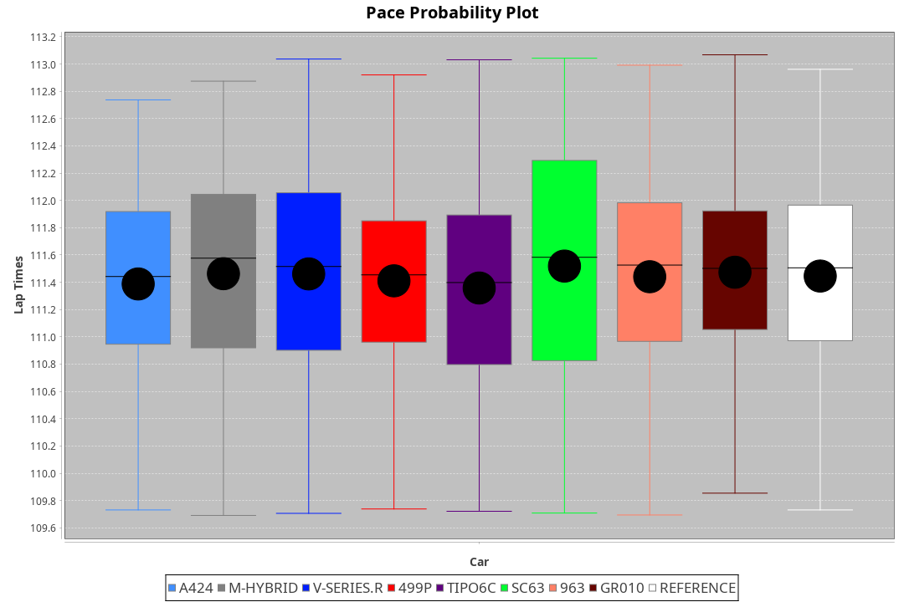
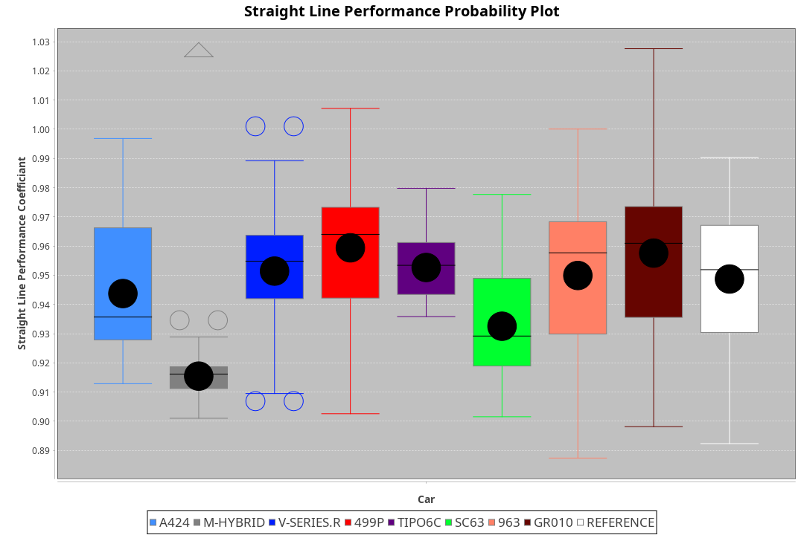
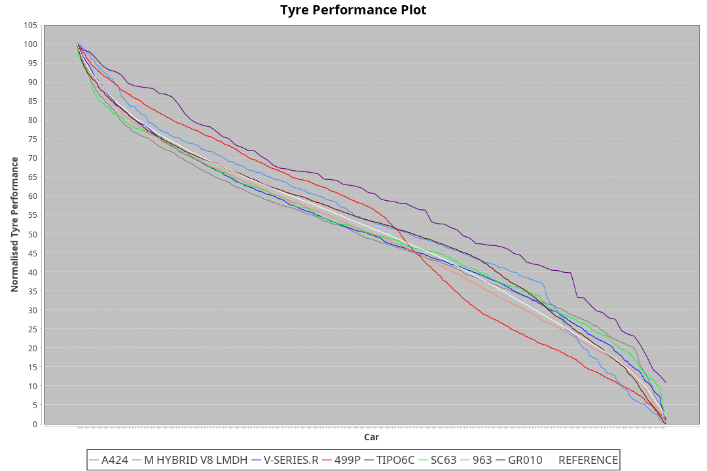

| Manufacturer     | Car        | Weight | Power   | PINC    | E/Stint | FDS     |
|:-|:-|:-|:-|:-|:-|:-|
| Alpine           | A424       | 1057kg | 517.0kw |    -    | 915MJ   |    -    |
| BMW              | M-Hybrid   | 1051kg | 509.0kw |    -    | 906MJ   |    -    |
| Cadillac         | V-Series.R | 1044kg | 507.0kw |    -    | 900MJ   |    -    |
| Ferrari          | 499P       | 1073kg | 505.0kw |    -    | 903MJ   | 190kph  |
| Isotta Fraschini | Tipo6C     | 1059kg | 520.0kw |    -    | 917MJ   | 190kph  |
| Lamborghini      | SC63       | 1052kg | 516.0kw |    -    | 906MJ   |    -    |
| Peugeot          | 9X8Evo     | 1060kg | 507.0kw |    -    | 906MJ   | 190kph  |
| Porsche          | 963        | 1057kg | 513.0kw |    -    | 909MJ   |    -    |
| Toyota           | GR010      | 1090kg | 509.0kw |    -    | 908MJ   | 190kph  |

### BoP Accuracy: 83.68%; Overall BoP Grade: B2
| Manufacturer     | Car        | Type  | RP      | QP      | Weight | Power¹  | Threshhold | PINC    | Power²   | E/Stint | AVG Vmax  | FDS     | RDLC | L/Stint | BOP-Grade | Model Accuracy | Model Points | Match%  | SimDiff |
|:-|:-|:-|:-|:-|:-|:-|:-|:-|:-|:-|:-|:-|:-|:-|:-|:-|:-|:-|:-|
| Alpine           | A424       | LMDH  | 1:50.35 | 1:46.92 | 1057kg | 517.0kw | 210.0kph   |    -    | 517.00kw |  915MJ  | 292.51kph |    -    | 1.00 | 33      | -B1       | 99.49%         | 1360         | 85.47%  | +0.47   |
| BMW              | M-Hybrid   | LMDH  | 1:50.72 | 1:46.32 | 1051kg | 509.0kw | 210.0kph   |    -    | 509.00kw |  906MJ  | 290.24kph |    -    | 1.00 | 33      | ~A1       | 98.62%         | 2363         | 100.00% | +0.81   |
| Cadillac         | V-Series.R | LMDH  | 1:50.31 | 1:46.31 | 1044kg | 507.0kw | 210.0kph   |    -    | 507.00kw |  900MJ  | 286.16kph |    -    | 1.02 | 33      | -B2       | 98.50%         | 4201         | 83.62%  | +1.39   |
| Ferrari          | 499P       | LMHHU | 1:50.65 | 1:46.47 | 1073kg | 505.0kw | 210.0kph   |    -    | 505.00kw |  903MJ  | 289.17kph | 190kph  | 1.02 | 33      | ~A1       | 100.00%        | 4441         | 96.40%  | +0.67   |
| Isotta Fraschini | Tipo6C     | LMHHU | 1:51.55 | 1:49.06 | 1059kg | 520.0kw | 210.0kph   |    -    | 520.00kw |  917MJ  | 288.11kph | 190kph  | 1.04 | 33      | +Ω1       | 98.48%         | 130          | 38.91%  | #       |
| Lamborghini      | SC63       | LMDH  | 1:50.90 | 1:47.54 | 1052kg | 516.0kw | 210.0kph   |    -    | 516.00kw |  906MJ  | 287.14kph |    -    | 1.03 | 33      | +A2       | 100.00%        | 784          | 94.15%  | #       |
| Peugeot          | 9X8Evo     | LMHHU | 1:50.85 | 1:47.06 | 1060kg | 507.0kw | 210.0kph   |    -    | 507.00kw |  906MJ  | 290.53kph | 190kph  | 0.99 | 33      | +B2       | 100.00%        | 808          | 82.04%  | +1.47   |
| Porsche          | 963        | LMDH  | 1:50.21 | 1:45.82 | 1057kg | 513.0kw | 210.0kph   |    -    | 513.00kw |  909MJ  | 289.42kph |    -    | 1.00 | 33      | -C1       | 99.87%         | 12613        | 76.58%  | +0.88   |
| Toyota           | GR010      | LMHHU | 1:50.74 | 1:46.36 | 1090kg | 509.0kw | 210.0kph   |    -    | 509.00kw |  908MJ  | 285.97kph | 190kph  | 1.00 | 33      | ~A1       | 99.73%         | 2956         | 95.93%  | +0.74   |

## Power below Threshhold
| N/Nmax    | A424    | M-HYBRID | V-SERIES.R | 499P    | TIPO6C  | SC63    | 9X8EVO  | 963     | GR010   |
|:-|:-|:-|:-|:-|:-|:-|:-|:-|:-|
|  0.550    |  255    |  251     |  250       |  249    |  256    |  254    |  250    |  253    |  251    |
|  0.575    |  278    |  274     |  273       |  272    |  279    |  277    |  273    |  276    |  274    |
|  0.600    |  298    |  294     |  293       |  292    |  300    |  298    |  293    |  296    |  294    |
|  0.625    |  320    |  315     |  314       |  312    |  322    |  319    |  314    |  317    |  315    |
|  0.650    |  341    |  336     |  335       |  333    |  343    |  340    |  335    |  338    |  336    |
|  0.675    |  363    |  357     |  356       |  355    |  365    |  362    |  356    |  360    |  357    |
|  0.700    |  385    |  379     |  377       |  376    |  387    |  384    |  377    |  382    |  379    |
|  0.725    |  407    |  400     |  399       |  397    |  409    |  406    |  399    |  403    |  400    |
|  0.750    |  427    |  421     |  419       |  417    |  430    |  427    |  419    |  424    |  421    |
|  0.775    |  446    |  440     |  438       |  436    |  449    |  446    |  438    |  443    |  440    |
|  0.800    |  464    |  457     |  455       |  454    |  467    |  463    |  455    |  461    |  457    |
|  0.825    |  479    |  472     |  470       |  469    |  482    |  478    |  470    |  476    |  472    |
|  0.850    |  491    |  484     |  482       |  480    |  494    |  490    |  482    |  487    |  484    |
|  0.875    |  502    |  494     |  492       |  490    |  505    |  501    |  492    |  498    |  494    |
|  0.900    |  509    |  501     |  499       |  497    |  512    |  508    |  499    |  505    |  501    |
|  0.925    |  514    |  506     |  504       |  502    |  517    |  513    |  504    |  510    |  506    |
| **0.950** | **517** | **509**  | **507**    | **505** | **520** | **516** | **507** | **513** | **509** |
|  0.975    |  515    |  507     |  505       |  503    |  518    |  514    |  505    |  511    |  507    |
|  1.000    |  511    |  504     |  502       |  500    |  514    |  510    |  502    |  507    |  504    |
|  1.025    |  441    |  435     |  433       |  431    |  444    |  441    |  433    |  438    |  435    |

## Power above Threshhold
| N/Nmax    | A424    | M-HYBRID | V-SERIES.R | 499P    | TIPO6C  | SC63    | 9X8EVO  | 963     | GR010   |
|:-|:-|:-|:-|:-|:-|:-|:-|:-|:-|
|  0.550    |  255    |  251     |  250       |  249    |  256    |  254    |  250    |  253    |  251    |
|  0.575    |  278    |  274     |  273       |  272    |  279    |  277    |  273    |  276    |  274    |
|  0.600    |  298    |  294     |  293       |  292    |  300    |  298    |  293    |  296    |  294    |
|  0.625    |  320    |  315     |  314       |  312    |  322    |  319    |  314    |  317    |  315    |
|  0.650    |  341    |  336     |  335       |  333    |  343    |  340    |  335    |  338    |  336    |
|  0.675    |  363    |  357     |  356       |  355    |  365    |  362    |  356    |  360    |  357    |
|  0.700    |  385    |  379     |  377       |  376    |  387    |  384    |  377    |  382    |  379    |
|  0.725    |  407    |  400     |  399       |  397    |  409    |  406    |  399    |  403    |  400    |
|  0.750    |  427    |  421     |  419       |  417    |  430    |  427    |  419    |  424    |  421    |
|  0.775    |  446    |  440     |  438       |  436    |  449    |  446    |  438    |  443    |  440    |
|  0.800    |  464    |  457     |  455       |  454    |  467    |  463    |  455    |  461    |  457    |
|  0.825    |  479    |  472     |  470       |  469    |  482    |  478    |  470    |  476    |  472    |
|  0.850    |  491    |  484     |  482       |  480    |  494    |  490    |  482    |  487    |  484    |
|  0.875    |  502    |  494     |  492       |  490    |  505    |  501    |  492    |  498    |  494    |
|  0.900    |  509    |  501     |  499       |  497    |  512    |  508    |  499    |  505    |  501    |
|  0.925    |  514    |  506     |  504       |  502    |  517    |  513    |  504    |  510    |  506    |
| **0.950** | **517** | **509**  | **507**    | **505** | **520** | **516** | **507** | **513** | **509** |
|  0.975    |  515    |  507     |  505       |  503    |  518    |  514    |  505    |  511    |  507    |
|  1.000    |  511    |  504     |  502       |  500    |  514    |  510    |  502    |  507    |  504    |
|  1.025    |  441    |  435     |  433       |  431    |  444    |  441    |  433    |  438    |  435    |
