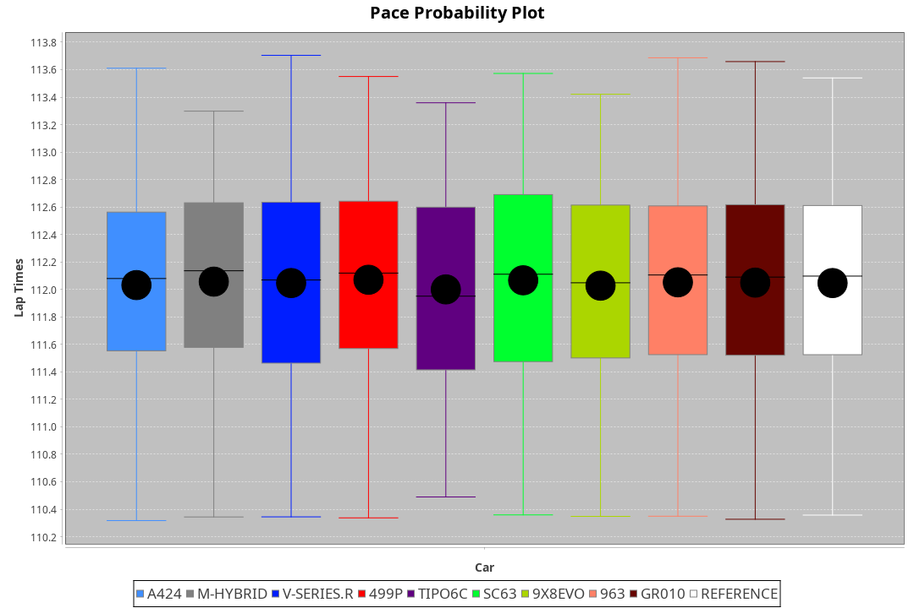
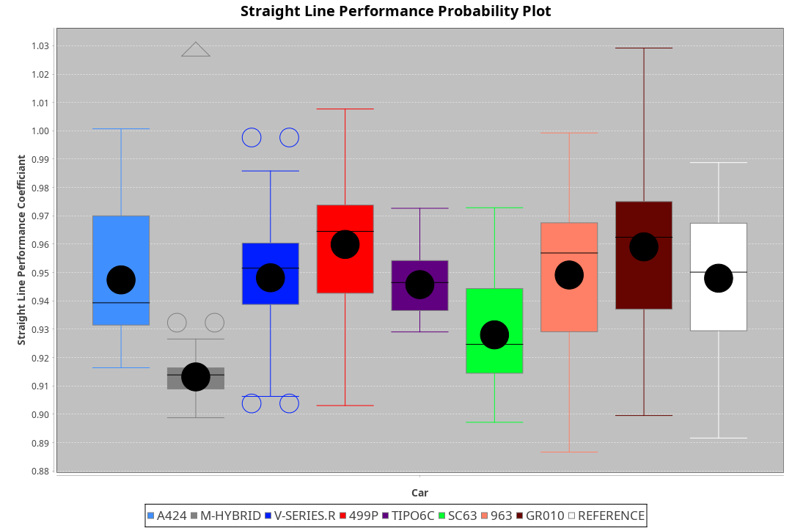
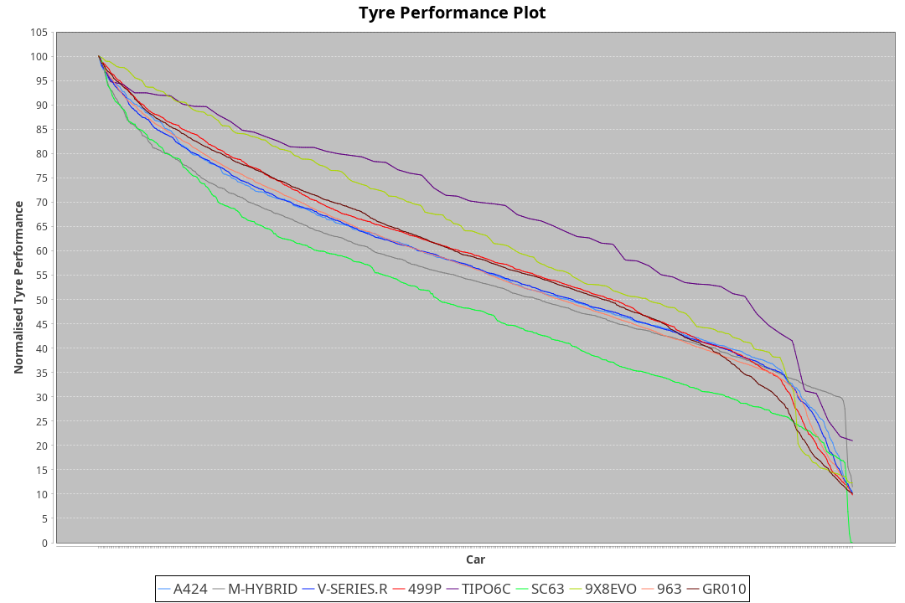

|Manufacturer|Car|Type|RP|QP|Weight|Power¹|Threshhold|PINC|Power²|E/Stint|AVG Vmax|FDS|RDLC|L/Stint|BOP-Grade|ModelAccuracy|ModelPoints|Match%|
|:-|:-|:-|:-|:-|:-|:-|:-|:-|:-|:-|:-|:-|:-|:-|:-|:-|:-|:-|
|Alpine|A424|LMDH|1:50.43|1:46.44|1030kg|512kw|210.0kph|0%|512kw|902MJ|286.33kph|-|1.03|33|~A1|81.46%|523|100.00%|
|BMW|M Hybrid V8 LMDh|LMDH|1:50.44|1:46.42|1045kg|515kw|210.0kph|0%|515kw|899MJ|281.57kph|-|1.02|33|~A1|98.60%|1690|100.00%|
|Cadillac|V-Series.R|LMDH|1:50.44|1:46.72|1036kg|510kw|210.0kph|0%|510kw|883MJ|285.49kph|-|1.02|33|~A1|98.38%|1765|96.61%|
|Ferrari|499P|LMHHU|1:50.43|1:46.68|1061kg|505kw|210.0kph|0%|505kw|887MJ|286.14kph|190kph|1.03|33|~A1|92.24%|2247|100.00%|
|Issotta Fraschini|Tipo6C|LMHHU|1:50.43|1:47.27|1030kg|520kw|210.0kph|0%|520kw|917MJ|286.68kph|140kph|1.08|33|+A2|66.67%|96|92.41%|
|Lamborghini|SC63|LMDH|1:50.43|1:46.32|1059kg|520kw|210.0kph|0%|520kw|901MJ|282.99kph|-|1.03|33|~A1|96.77%|419|95.67%|
|Porsche|963|LMDH|1:50.44|1:46.73|1034kg|512kw|210.0kph|0%|512kw|894MJ|286.17kph|-|1.02|33|~A1|96.81%|5438|100.00%|
|Toyota|GR010 - Hybrid|LMHHU|1:50.43|1:46.50|1064kg|509kw|210.0kph|0%|509kw|901MJ|284.31kph|190kph|1.03|33|~A1|86.04%|1751|100.00%|

### BoP Accuracy: 98.09%; Overall BoP Grade: A1

## Power below Threshhold
|N/Nmax|ALP|BMW|CAD|FER|IF|LBG|POR|TOY|
|:-|:-|:-|:-|:-|:-|:-|:-|:-|
|0.550|252|254|251|249|256|256|252|251|
|0.575|275|277|274|272|279|279|275|274|
|0.600|296|297|295|292|300|300|296|294|
|0.625|317|319|316|312|322|322|317|315|
|0.650|338|340|337|333|343|343|338|336|
|0.675|359|362|358|355|365|365|359|357|
|0.700|381|383|380|376|387|387|381|379|
|0.725|403|405|401|397|409|409|403|400|
|0.750|423|426|422|417|430|430|423|421|
|0.775|442|445|441|436|449|449|442|440|
|0.800|460|463|458|454|467|467|460|457|
|0.825|475|478|473|469|482|482|475|472|
|0.850|486|489|485|480|494|494|486|484|
|0.875|497|500|495|490|505|505|497|494|
|0.900|504|507|502|497|512|512|504|501|
|0.925|509|512|507|502|517|517|509|506|
|**0.950**|**512**|**515**|**510**|**505**|**520**|**520**|**512**|**509**|
|0.975|510|513|508|503|518|518|510|507|
|1.000|506|509|505|500|514|514|506|504|
|1.025|437|440|436|431|444|444|437|435|

## Power above Threshhold
|N/Nmax|ALP|BMW|CAD|FER|IF|LBG|POR|TOY|
|:-|:-|:-|:-|:-|:-|:-|:-|:-|
|0.550|252|254|251|249|256|256|252|251|
|0.575|275|277|274|272|279|279|275|274|
|0.600|296|297|295|292|300|300|296|294|
|0.625|317|319|316|312|322|322|317|315|
|0.650|338|340|337|333|343|343|338|336|
|0.675|359|362|358|355|365|365|359|357|
|0.700|381|383|380|376|387|387|381|379|
|0.725|403|405|401|397|409|409|403|400|
|0.750|423|426|422|417|430|430|423|421|
|0.775|442|445|441|436|449|449|442|440|
|0.800|460|463|458|454|467|467|460|457|
|0.825|475|478|473|469|482|482|475|472|
|0.850|486|489|485|480|494|494|486|484|
|0.875|497|500|495|490|505|505|497|494|
|0.900|504|507|502|497|512|512|504|501|
|0.925|509|512|507|502|517|517|509|506|
|**0.950**|**512**|**515**|**510**|**505**|**520**|**520**|**512**|**509**|
|0.975|510|513|508|503|518|518|510|507|
|1.000|506|509|505|500|514|514|506|504|
|1.025|437|440|436|431|444|444|437|435|
