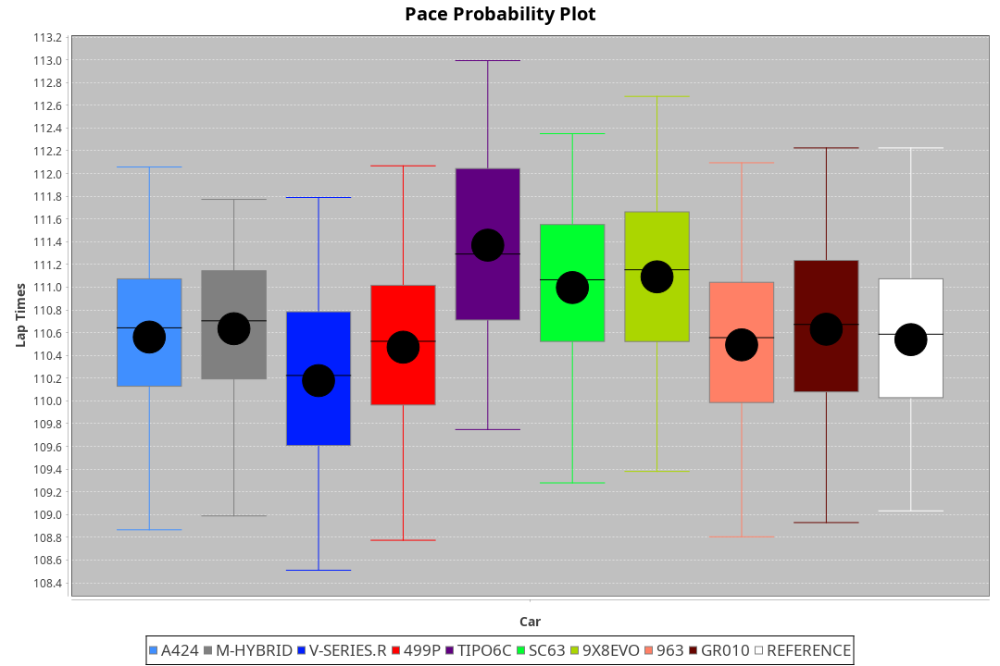
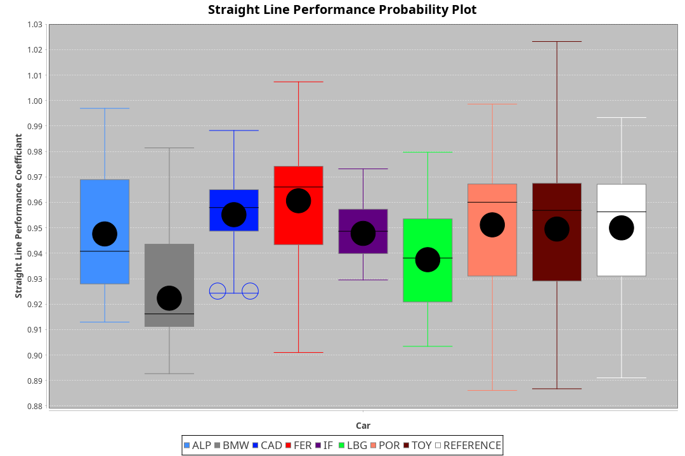
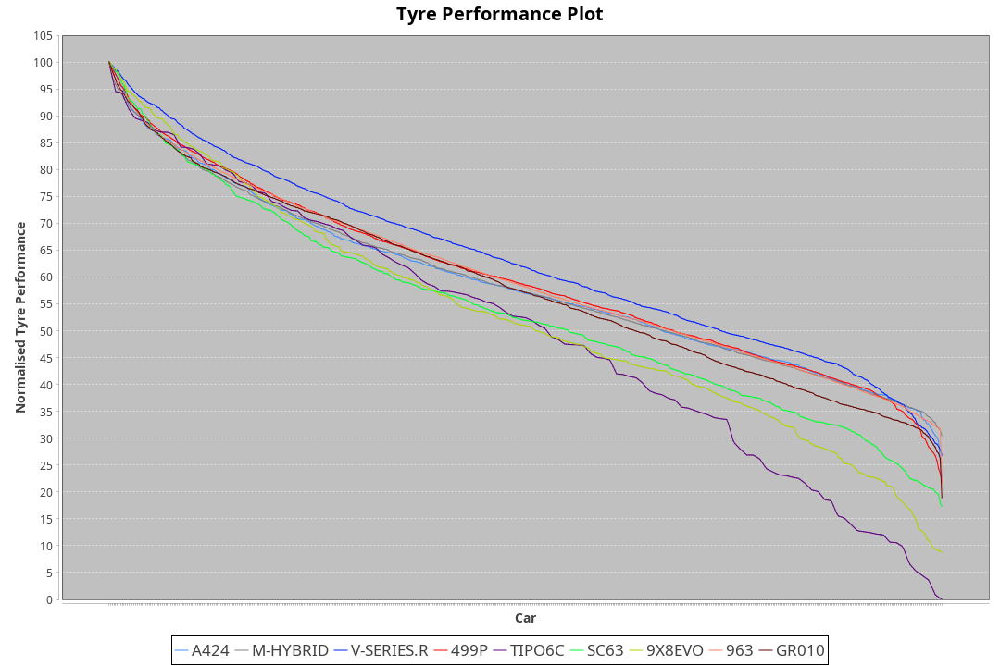

| Manufacturer     | Car        | Weight | Power   | PINC    | E/Stint | FDS     |
|:-|:-|:-|:-|:-|:-|:-|
| Alpine           | A424       | 1057kg | 517.0kw | -1.00%  | 913MJ   |    -    |
| BMW              | M-Hybrid   | 1051kg | 509.0kw | -1.00%  | 904MJ   |    -    |
| Cadillac         | V-Series.R | 1044kg | 507.0kw | 1.00%   | 902MJ   |    -    |
| Ferrari          | 499P       | 1073kg | 505.0kw | -1.00%  | 901MJ   | 190kph  |
| Isotta Fraschini | Tipo6C     | 1059kg | 520.0kw |    -    | 917MJ   | 190kph  |
| Lamborghini      | SC63       | 1052kg | 516.0kw |    -    | 906MJ   |    -    |
| Peugeot          | 9X8Evo     | 1060kg | 507.0kw | -1.00%  | 904MJ   | 190kph  |
| Porsche          | 963        | 1057kg | 513.0kw | -1.00%  | 907MJ   |    -    |
| Toyota           | GR010      | 1090kg | 509.0kw | 1.00%   | 910MJ   | 190kph  |

### BoP Accuracy: 83.70%; Overall BoP Grade: B2
| Manufacturer     | Car        | Type  | RP      | QP      | Weight | Power¹  | Threshhold | PINC    | Power²   | E/Stint | AVG Vmax  | FDS     | RDLC | L/Stint | BOP-Grade | Model Accuracy | Model Points | Match%  | SimDiff |
|:-|:-|:-|:-|:-|:-|:-|:-|:-|:-|:-|:-|:-|:-|:-|:-|:-|:-|:-|:-|
| Alpine           | A424       | LMDH  | 1:50.52 | 1:47.08 | 1057kg | 517.0kw | 210.0kph   | -1.00%  | 511.80kw |  913MJ  | 291.73kph |    -    | 1.00 | 33      | -A2       | 99.49%         | 1360         | 90.85%  | +0.47   |
| BMW              | M-Hybrid   | LMDH  | 1:50.89 | 1:46.48 | 1051kg | 509.0kw | 210.0kph   | -1.00%  | 503.90kw |  904MJ  | 289.47kph |    -    | 1.00 | 33      | ~A1       | 98.62%         | 2363         | 100.00% | +0.81   |
| Cadillac         | V-Series.R | LMDH  | 1:50.14 | 1:46.16 | 1044kg | 507.0kw | 210.0kph   | 1.00%   | 512.10kw |  902MJ  | 286.92kph |    -    | 1.02 | 33      | -C2       | 98.50%         | 4201         | 72.71%  | +1.39   |
| Ferrari          | 499P       | LMHHU | 1:50.82 | 1:46.63 | 1073kg | 505.0kw | 210.0kph   | -1.00%  | 500.00kw |  901MJ  | 288.40kph | 190kph  | 1.02 | 33      | ~A1       | 100.00%        | 4441         | 100.00% | +0.67   |
| Isotta Fraschini | Tipo6C     | LMHHU | 1:51.55 | 1:49.06 | 1059kg | 520.0kw | 210.0kph   |    -    | 520.00kw |  917MJ  | 288.11kph | 190kph  | 1.04 | 33      | +Ω1       | 98.48%         | 130          | 41.57%  | #       |
| Lamborghini      | SC63       | LMDH  | 1:50.90 | 1:47.54 | 1052kg | 516.0kw | 210.0kph   |    -    | 516.00kw |  906MJ  | 287.14kph |    -    | 1.03 | 33      | ~A1       | 100.00%        | 784          | 96.76%  | #       |
| Peugeot          | 9X8Evo     | LMHHU | 1:51.02 | 1:47.22 | 1060kg | 507.0kw | 210.0kph   | -1.00%  | 501.90kw |  904MJ  | 289.76kph | 190kph  | 0.99 | 33      | +C1       | 100.00%        | 808          | 76.80%  | +1.47   |
| Porsche          | 963        | LMDH  | 1:50.38 | 1:45.97 | 1057kg | 513.0kw | 210.0kph   | -1.00%  | 507.90kw |  907MJ  | 288.65kph |    -    | 1.00 | 33      | -B2       | 99.87%         | 12613        | 81.93%  | +0.88   |
| Toyota           | GR010      | LMHHU | 1:50.57 | 1:46.21 | 1090kg | 509.0kw | 210.0kph   | 1.00%   | 514.10kw |  910MJ  | 286.72kph | 190kph  | 1.00 | 33      | -A2       | 99.73%         | 2956         | 92.68%  | +0.74   |

## Power below Threshhold
| N/Nmax    | A424    | M-HYBRID | V-SERIES.R | 499P    | TIPO6C  | SC63    | 9X8EVO  | 963     | GR010   |
|:-|:-|:-|:-|:-|:-|:-|:-|:-|:-|
|  0.550    |  255    |  251     |  250       |  249    |  256    |  254    |  250    |  253    |  251    |
|  0.575    |  278    |  274     |  273       |  272    |  279    |  277    |  273    |  276    |  274    |
|  0.600    |  298    |  294     |  293       |  292    |  300    |  298    |  293    |  296    |  294    |
|  0.625    |  320    |  315     |  314       |  312    |  322    |  319    |  314    |  317    |  315    |
|  0.650    |  341    |  336     |  335       |  333    |  343    |  340    |  335    |  338    |  336    |
|  0.675    |  363    |  357     |  356       |  355    |  365    |  362    |  356    |  360    |  357    |
|  0.700    |  385    |  379     |  377       |  376    |  387    |  384    |  377    |  382    |  379    |
|  0.725    |  407    |  400     |  399       |  397    |  409    |  406    |  399    |  403    |  400    |
|  0.750    |  427    |  421     |  419       |  417    |  430    |  427    |  419    |  424    |  421    |
|  0.775    |  446    |  440     |  438       |  436    |  449    |  446    |  438    |  443    |  440    |
|  0.800    |  464    |  457     |  455       |  454    |  467    |  463    |  455    |  461    |  457    |
|  0.825    |  479    |  472     |  470       |  469    |  482    |  478    |  470    |  476    |  472    |
|  0.850    |  491    |  484     |  482       |  480    |  494    |  490    |  482    |  487    |  484    |
|  0.875    |  502    |  494     |  492       |  490    |  505    |  501    |  492    |  498    |  494    |
|  0.900    |  509    |  501     |  499       |  497    |  512    |  508    |  499    |  505    |  501    |
|  0.925    |  514    |  506     |  504       |  502    |  517    |  513    |  504    |  510    |  506    |
| **0.950** | **517** | **509**  | **507**    | **505** | **520** | **516** | **507** | **513** | **509** |
|  0.975    |  515    |  507     |  505       |  503    |  518    |  514    |  505    |  511    |  507    |
|  1.000    |  511    |  504     |  502       |  500    |  514    |  510    |  502    |  507    |  504    |
|  1.025    |  441    |  435     |  433       |  431    |  444    |  441    |  433    |  438    |  435    |

## Power above Threshhold
| N/Nmax    | A424       | M-HYBRID   | V-SERIES.R | 499P       | TIPO6C  | SC63    | 9X8EVO     | 963        | GR010      |
|:-|:-|:-|:-|:-|:-|:-|:-|:-|:-|
|  0.550    |  252.41    |  248.45    |  252.03    |  246.47    |  256    |  254    |  247.46    |  250.43    |  253.04    |
|  0.575    |  275.45    |  271.49    |  275.04    |  268.51    |  279    |  277    |  270.50    |  273.47    |  276.05    |
|  0.600    |  295.48    |  291.53    |  296.04    |  288.55    |  300    |  298    |  290.54    |  293.50    |  297.05    |
|  0.625    |  316.51    |  311.56    |  317.04    |  308.59    |  322    |  319    |  310.58    |  314.54    |  318.06    |
|  0.650    |  337.55    |  332.60    |  338.05    |  329.63    |  343    |  340    |  331.61    |  335.57    |  339.06    |
|  0.675    |  359.58    |  353.64    |  359.05    |  350.67    |  365    |  362    |  352.65    |  356.61    |  361.06    |
|  0.700    |  380.62    |  374.68    |  381.05    |  371.71    |  387    |  384    |  373.69    |  377.65    |  383.07    |
|  0.725    |  402.65    |  395.71    |  403.06    |  392.75    |  409    |  406    |  394.73    |  399.68    |  404.07    |
|  0.750    |  422.69    |  416.75    |  423.06    |  412.78    |  430    |  427    |  414.77    |  419.72    |  425.07    |
|  0.775    |  441.72    |  435.79    |  442.06    |  431.82    |  449    |  446    |  433.80    |  438.75    |  444.08    |
|  0.800    |  459.75    |  452.82    |  460.06    |  448.85    |  467    |  463    |  450.84    |  455.78    |  462.08    |
|  0.825    |  474.77    |  467.84    |  475.06    |  463.88    |  482    |  478    |  465.86    |  470.81    |  477.08    |
|  0.850    |  485.79    |  478.86    |  486.07    |  474.90    |  494    |  490    |  476.88    |  482.83    |  488.09    |
|  0.875    |  496.81    |  488.88    |  497.07    |  484.92    |  505    |  501    |  486.90    |  492.84    |  499.09    |
|  0.900    |  503.82    |  495.90    |  504.07    |  491.93    |  512    |  508    |  493.92    |  499.86    |  506.09    |
|  0.925    |  508.83    |  500.90    |  509.07    |  496.94    |  517    |  513    |  498.92    |  504.86    |  511.09    |
| **0.950** | **511.83** | **503.91** | **512.07** | **499.95** | **520** | **516** | **501.93** | **507.87** | **514.09** |
|  0.975    |  509.83    |  501.91    |  510.07    |  497.95    |  518    |  514    |  499.93    |  505.87    |  512.09    |
|  1.000    |  505.82    |  498.90    |  506.07    |  494.94    |  514    |  510    |  496.92    |  502.86    |  508.09    |
|  1.025    |  436.71    |  430.78    |  437.06    |  426.81    |  444    |  441    |  428.79    |  433.74    |  439.08    |
