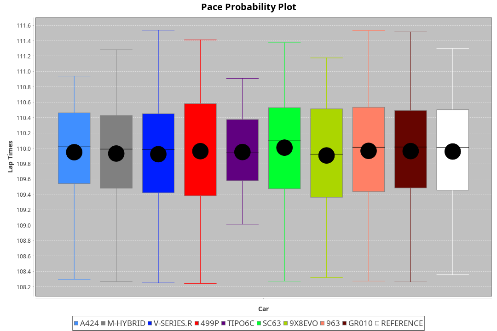
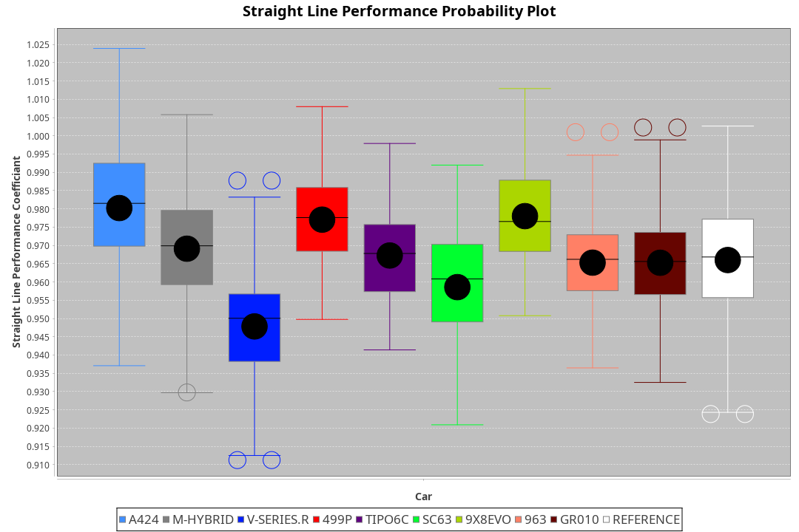
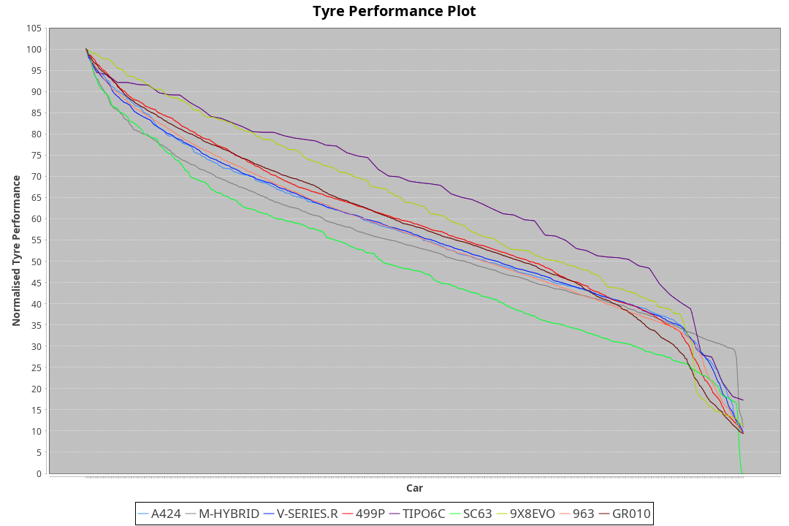

| Manufacturer     | Car        | Weight | Power   | PINC    | E/Stint | FDS     |
|:-|:-|:-|:-|:-|:-|:-|
| Alpine           | A424       | 1034kg | 520.0kw |    -    | 913MJ   |    -    |
| BMW              | M-Hybrid   | 1034kg | 520.0kw | -0.30%  | 910MJ   |    -    |
| Cadillac         | V-Series.R | 1040kg | 519.0kw | 0.10%   | 907MJ   |    -    |
| Ferrari          | 499P       | 1058kg | 520.0kw | -0.40%  | 908MJ   | 190kph  |
| Isotta Fraschini | Tipo6C     | 1030kg | 520.0kw |    -    | 914MJ   | 140kph  |
| Lamborghini      | SC63       | 1030kg | 520.0kw |    -    | 910MJ   |    -    |
| Peugeot          | 9X8Evo     | 1030kg | 520.0kw | -1.90%  | 907MJ   | 190kph  |
| Porsche          | 963        | 1035kg | 518.0kw | -0.30%  | 902MJ   |    -    |
| Toyota           | GR010      | 1063kg | 520.0kw |    -    | 910MJ   | 190kph  |

### BoP Accuracy: 94.03%; Overall BoP Grade: A2
| Manufacturer     | Car        | Type  | RP      | QP      | Weight | Power¹  | Threshhold | PINC    | Power²   | E/Stint | AVG Vmax  | FDS     | RDLC | L/Stint | BOP-Grade | Model Accuracy | Model Points | Match%  | SimDiff |
|:-|:-|:-|:-|:-|:-|:-|:-|:-|:-|:-|:-|:-|:-|:-|:-|:-|:-|:-|:-|
| Alpine           | A424       | LMDH  | 1:49.68 | 1:45.74 | 1034kg | 520.0kw | 0.0kph     |    -    | 520.00kw |  913MJ  | 295.02kph |    -    | 1.02 | 33      | ~A1       | 86.43%         | 618          | 98.43%  | #       |
| BMW              | M-Hybrid   | LMDH  | 1:49.67 | 1:45.26 | 1034kg | 520.0kw | 250.0kph   | -0.30%  | 518.40kw |  910MJ  | 292.07kph |    -    | 1.02 | 33      | +A2       | 93.77%         | 1672         | 92.68%  | #       |
| Cadillac         | V-Series.R | LMDH  | 1:49.65 | 1:45.70 | 1040kg | 519.0kw | 250.0kph   | 0.10%   | 519.50kw |  907MJ  | 288.71kph |    -    | 1.02 | 33      | ~A1       | 83.12%         | 1921         | 100.00% | #       |
| Ferrari          | 499P       | LMHHU | 1:49.67 | 1:45.55 | 1058kg | 520.0kw | 250.0kph   | -0.40%  | 517.90kw |  908MJ  | 292.43kph | 190kph  | 1.03 | 33      | ~A1       | 69.49%         | 1950         | 100.00% | #       |
| Isotta Fraschini | Tipo6C     | LMHHU | 1:49.72 | 1:47.34 | 1030kg | 520.0kw | 0.0kph     |    -    | 520.00kw |  914MJ  | 290.77kph | 140kph  | 1.07 | 33      | +C1       | 73.56%         | 64           | 75.42%  | #       |
| Lamborghini      | SC63       | LMDH  | 1:50.03 | 1:47.78 | 1030kg | 520.0kw | 0.0kph     |    -    | 520.00kw |  910MJ  | 291.76kph |    -    | 1.05 | 33      | +C1       | 95.82%         | 459          | 79.74%  | #       |
| Peugeot          | 9X8Evo     | LMHHU | 1:49.66 | 1:45.59 | 1030kg | 520.0kw | 250.0kph   | -1.90%  | 510.10kw |  907MJ  | 292.45kph | 190kph  | 1.03 | 33      | ~A1       | 66.97%         | 221          | 100.00% | #       |
| Porsche          | 963        | LMDH  | 1:49.66 | 1:45.48 | 1035kg | 518.0kw | 250.0kph   | -0.30%  | 516.40kw |  902MJ  | 291.53kph |    -    | 1.02 | 33      | ~A1       | 81.02%         | 5243         | 100.00% | #       |
| Toyota           | GR010      | LMHHU | 1:49.67 | 1:45.71 | 1063kg | 520.0kw | 250.0kph   |    -    | 520.00kw |  910MJ  | 291.04kph | 190kph  | 1.02 | 33      | ~A1       | 73.70%         | 2701         | 100.00% | #       |

## Power below Threshhold
| N/Nmax    | A424    | M-HYBRID | V-SERIES.R | 499P    | TIPO6C  | SC63    | 9X8EVO  | 963     | GR010   |
|:-|:-|:-|:-|:-|:-|:-|:-|:-|:-|
|  0.550    |  256    |  256     |  256       |  256    |  256    |  256    |  256    |  255    |  256    |
|  0.575    |  279    |  279     |  279       |  279    |  279    |  279    |  279    |  278    |  279    |
|  0.600    |  300    |  300     |  299       |  300    |  300    |  300    |  300    |  299    |  300    |
|  0.625    |  322    |  322     |  321       |  322    |  322    |  322    |  322    |  321    |  322    |
|  0.650    |  343    |  343     |  342       |  343    |  343    |  343    |  343    |  342    |  343    |
|  0.675    |  365    |  365     |  364       |  365    |  365    |  365    |  365    |  364    |  365    |
|  0.700    |  387    |  387     |  386       |  387    |  387    |  387    |  387    |  386    |  387    |
|  0.725    |  409    |  409     |  408       |  409    |  409    |  409    |  409    |  407    |  409    |
|  0.750    |  430    |  430     |  429       |  430    |  430    |  430    |  430    |  428    |  430    |
|  0.775    |  449    |  449     |  448       |  449    |  449    |  449    |  449    |  447    |  449    |
|  0.800    |  467    |  467     |  466       |  467    |  467    |  467    |  467    |  465    |  467    |
|  0.825    |  482    |  482     |  481       |  482    |  482    |  482    |  482    |  480    |  482    |
|  0.850    |  494    |  494     |  493       |  494    |  494    |  494    |  494    |  492    |  494    |
|  0.875    |  505    |  505     |  504       |  505    |  505    |  505    |  505    |  503    |  505    |
|  0.900    |  512    |  512     |  511       |  512    |  512    |  512    |  512    |  510    |  512    |
|  0.925    |  517    |  517     |  516       |  517    |  517    |  517    |  517    |  515    |  517    |
| **0.950** | **520** | **520**  | **519**    | **520** | **520** | **520** | **520** | **518** | **520** |
|  0.975    |  518    |  518     |  517       |  518    |  518    |  518    |  518    |  516    |  518    |
|  1.000    |  514    |  514     |  513       |  514    |  514    |  514    |  514    |  512    |  514    |
|  1.025    |  444    |  444     |  443       |  444    |  444    |  444    |  444    |  442    |  444    |

## Power above Threshhold
| N/Nmax    | A424    | M-HYBRID   | V-SERIES.R | 499P       | TIPO6C  | SC63    | 9X8EVO     | 963        | GR010   |
|:-|:-|:-|:-|:-|:-|:-|:-|:-|:-|
|  0.550    |  256    |  255.22    |  256.26    |  255.45    |  256    |  256    |  251.06    |  254.22    |  256    |
|  0.575    |  279    |  278.24    |  279.28    |  278.49    |  279    |  279    |  274.06    |  277.24    |  279    |
|  0.600    |  300    |  299.25    |  299.30    |  298.53    |  300    |  300    |  295.07    |  298.26    |  300    |
|  0.625    |  322    |  321.27    |  321.32    |  320.57    |  322    |  322    |  316.07    |  319.28    |  322    |
|  0.650    |  343    |  342.29    |  342.34    |  341.61    |  343    |  343    |  337.08    |  340.29    |  343    |
|  0.675    |  365    |  364.31    |  364.36    |  363.65    |  365    |  365    |  358.08    |  362.31    |  365    |
|  0.700    |  387    |  386.33    |  386.39    |  385.69    |  387    |  387    |  380.09    |  384.33    |  387    |
|  0.725    |  409    |  407.35    |  408.41    |  407.72    |  409    |  409    |  401.09    |  406.35    |  409    |
|  0.750    |  430    |  428.36    |  429.43    |  427.76    |  430    |  430    |  422.10    |  427.37    |  430    |
|  0.775    |  449    |  447.38    |  448.45    |  446.79    |  449    |  449    |  441.10    |  446.39    |  449    |
|  0.800    |  467    |  465.39    |  466.47    |  464.83    |  467    |  467    |  458.11    |  463.40    |  467    |
|  0.825    |  482    |  480.41    |  481.48    |  479.85    |  482    |  482    |  473.11    |  478.41    |  482    |
|  0.850    |  494    |  492.42    |  493.49    |  491.87    |  494    |  494    |  485.11    |  490.42    |  494    |
|  0.875    |  505    |  503.43    |  504.50    |  502.89    |  505    |  505    |  495.12    |  501.43    |  505    |
|  0.900    |  512    |  510.43    |  511.51    |  509.91    |  512    |  512    |  502.12    |  508.44    |  512    |
|  0.925    |  517    |  515.44    |  516.52    |  514.91    |  517    |  517    |  507.12    |  513.44    |  517    |
| **0.950** | **520** | **518.44** | **519.52** | **517.92** | **520** | **520** | **510.12** | **516.45** | **520** |
|  0.975    |  518    |  516.44    |  517.52    |  515.92    |  518    |  518    |  508.12    |  514.44    |  518    |
|  1.000    |  514    |  512.43    |  513.51    |  511.91    |  514    |  514    |  505.12    |  510.44    |  514    |
|  1.025    |  444    |  442.38    |  443.44    |  441.78    |  444    |  444    |  436.10    |  441.38    |  444    |
