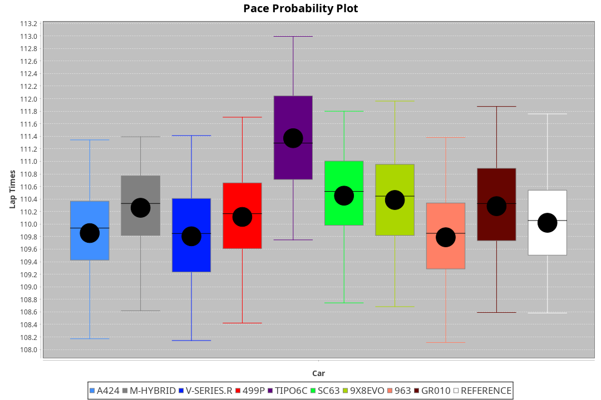
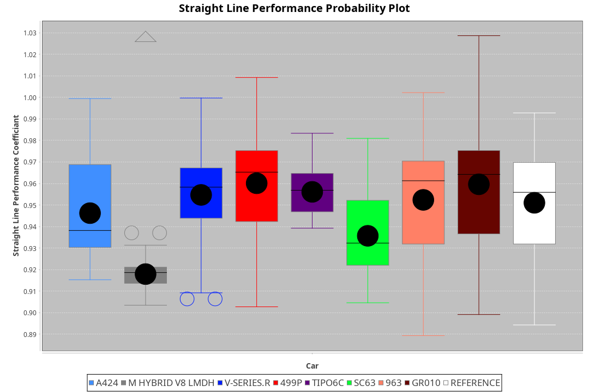
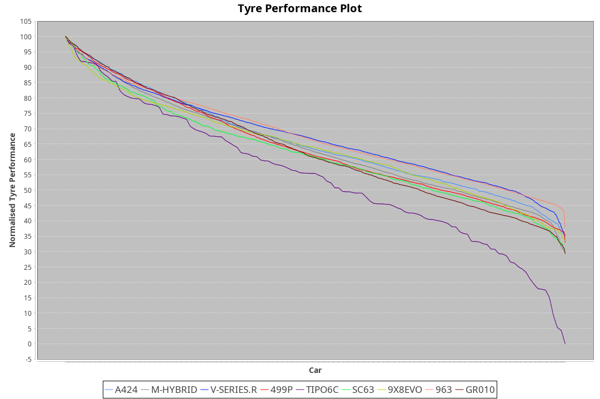

|Manufacturer|Car|Weight|Power|PINC|E/Stint|FDS|
|:-|:-|:-|:-|:-|:-|:-|
|Alpine|A424|1070kg|510kw|-|905MJ|-|
|BMW|M Hybrid V8 LMDh|1060kg|506kw|-|892MJ|-|
|Cadillac|V-Series.R|1032kg|499kw|-|873MJ|-|
|Ferrari|499P|1075kg|503kw|-|887MJ|190kph|
|Issotta Fraschini|Tipo6C|1085kg|514kw|-|918MJ|190kph|
|Lamborghini|SC63|1041kg|502kw|-|883MJ|-|
|Porsche|963|1048kg|505kw|-|889MJ|-|
|Toyota|GR010 - Hybrid|1089kg|510kw|-|905MJ|190kph|

### BoP Accuracy: 78.68%; Overall BoP Grade: C1

|Manufacturer|Car|Type|RP|QP|Weight|Power¹|Threshhold|PINC|Power²|E/Stint|AVG Vmax|FDS|RDLC|L/Stint|BOP-Grade|ModelAccuracy|ModelPoints|Match%|
|:-|:-|:-|:-|:-|:-|:-|:-|:-|:-|:-|:-|:-|:-|:-|:-|:-|:-|:-|
|Alpine|A424|LMDH|1:51.45|1:47.39|1070kg|510kw|210.0kph|-|510kw|905MJ|283.34kph|-|1.00|33|~A1|81.46%|523|100.00%|
|BMW|M Hybrid V8 LMDh|LMDH|1:51.75|1:47.63|1060kg|506kw|210.0kph|-|506kw|892MJ|279.34kph|-|1.01|33|~A1|98.60%|1690|99.55%|
|Cadillac|V-Series.R|LMDH|1:51.64|1:47.83|1032kg|499kw|210.0kph|-|499kw|873MJ|284.21kph|-|1.03|33|~A1|98.38%|1765|96.65%|
|Ferrari|499P|LMHHU|1:50.93|1:47.14|1075kg|503kw|210.0kph|-|503kw|887MJ|284.92kph|190kph|1.02|33|-D1|92.24%|2247|69.29%|
|Issotta Fraschini|Tipo6C|LMHHU|1:52.81|1:49.51|1085kg|514kw|210.0kph|-|514kw|918MJ|282.16kph|190kph|1.02|33|+Ω1|66.67%|96|31.84%|
|Lamborghini|SC63|LMDH|1:52.15|1:47.92|1041kg|502kw|210.0kph|-|502kw|883MJ|281.71kph|-|1.05|33|+D1|96.77%|419|69.79%|
|Porsche|963|LMDH|1:51.50|1:47.72|1048kg|505kw|210.0kph|-|505kw|889MJ|284.23kph|-|1.02|33|~A1|96.81%|5438|96.30%|
|Toyota|GR010 - Hybrid|LMHHU|1:50.82|1:46.86|1089kg|510kw|210.0kph|-|510kw|905MJ|282.80kph|190kph|1.01|33|-D1|86.04%|1751|66.00%|

## Power below Threshhold
|N/Nmax|ALP|BMW|CAD|FER|IF|LBG|POR|TOY|
|:-|:-|:-|:-|:-|:-|:-|:-|:-|
|0.550|251|249|246|248|253|247|249|251|
|0.575|274|272|268|271|276|270|272|274|
|0.600|295|292|288|291|297|290|292|295|
|0.625|316|313|308|311|318|310|312|316|
|0.650|337|334|329|332|339|331|333|337|
|0.675|358|355|350|353|361|352|355|358|
|0.700|380|377|371|374|383|374|376|380|
|0.725|401|398|392|395|404|395|397|401|
|0.750|422|418|412|416|425|415|417|422|
|0.775|441|437|431|435|444|434|436|441|
|0.800|458|454|448|452|462|451|454|458|
|0.825|473|469|463|467|477|466|469|473|
|0.850|485|481|474|478|488|477|480|485|
|0.875|495|491|484|488|499|487|490|495|
|0.900|502|498|491|495|506|494|497|502|
|0.925|507|503|496|500|511|499|502|507|
|**0.950**|**510**|**506**|**499**|**503**|**514**|**502**|**505**|**510**|
|0.975|508|504|497|501|512|500|503|508|
|1.000|505|501|494|498|508|497|500|505|
|1.025|436|432|426|430|439|429|431|436|

## Power above Threshhold
|N/Nmax|ALP|BMW|CAD|FER|IF|LBG|POR|TOY|
|:-|:-|:-|:-|:-|:-|:-|:-|:-|
|0.550|251|249|246|248|253|247|249|251|
|0.575|274|272|268|271|276|270|272|274|
|0.600|295|292|288|291|297|290|292|295|
|0.625|316|313|308|311|318|310|312|316|
|0.650|337|334|329|332|339|331|333|337|
|0.675|358|355|350|353|361|352|355|358|
|0.700|380|377|371|374|383|374|376|380|
|0.725|401|398|392|395|404|395|397|401|
|0.750|422|418|412|416|425|415|417|422|
|0.775|441|437|431|435|444|434|436|441|
|0.800|458|454|448|452|462|451|454|458|
|0.825|473|469|463|467|477|466|469|473|
|0.850|485|481|474|478|488|477|480|485|
|0.875|495|491|484|488|499|487|490|495|
|0.900|502|498|491|495|506|494|497|502|
|0.925|507|503|496|500|511|499|502|507|
|**0.950**|**510**|**506**|**499**|**503**|**514**|**502**|**505**|**510**|
|0.975|508|504|497|501|512|500|503|508|
|1.000|505|501|494|498|508|497|500|505|
|1.025|436|432|426|430|439|429|431|436|
