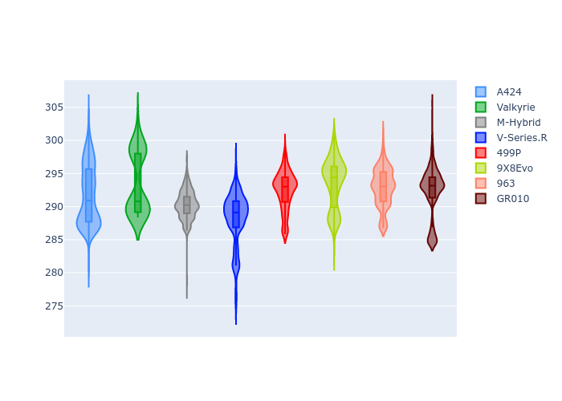

# Combined Plots

## Metadata

- BoP Accuracy: 98.87%
- Overall BoP Grade: A1
- Track: BAHRAIN
- Threshhold: 210.0kph

## BoP Table
| Manufacturer   | Car        | Weight   | Power   | PINC   | E/Stint   | FDS    |
|:---------------|:-----------|:---------|:--------|:-------|:----------|:-------|
| Alpine         | A424       | 1067kg   | 520.0kw | -1.00% | 921MJ     | -      |
| Aston Martin   | Valkyrie   | 1042kg   | 506.0kw | +0.40% | 901MJ     | -      |
| BMW            | M-Hybrid   | 1061kg   | 512.0kw | +1.00% | 913MJ     | -      |
| Cadillac       | V-Series.R | 1054kg   | 510.0kw | +1.00% | 905MJ     | -      |
| Ferrari        | 499P       | 1083kg   | 508.0kw | -1.00% | 906MJ     | 190kph |
| Peugeot        | 9X8Evo     | 1070kg   | 510.0kw | -1.00% | 910MJ     | 190kph |
| Porsche        | 963        | 1067kg   | 516.0kw | -1.00% | 911MJ     | -      |
| Toyota         | GR010      | 1100kg   | 512.0kw | +1.00% | 915MJ     | 190kph |

## Performance Table
| Manufacturer   | Car        | RP      | QP      | Vavg      |   RDLC | BOP-Grade   | Match   |
|:---------------|:-----------|:--------|:--------|:----------|-------:|:------------|:--------|
| Alpine         | A424       | 1:50.83 | 1:46.62 | 289.38kph |   1.04 | ~A1         | 99.81%  |
| Aston Martin   | Valkyrie   | 1:52.03 | 1:46.99 | 289.14kph |   1.05 | ~A1         | 97.81%  |
| BMW            | M-Hybrid   | 1:51.01 | 1:46.44 | 288.88kph |   1.04 | ~A1         | 99.84%  |
| Cadillac       | V-Series.R | 1:51.40 | 1:46.89 | 285.95kph |   1.04 | ~A1         | 99.87%  |
| Ferrari        | 499P       | 1:51.16 | 1:46.50 | 287.88kph |   1.04 | ~A1         | 99.86%  |
| Peugeot        | 9X8Evo     | 1:51.95 | 1:47.33 | 288.86kph |   1.04 | +A2         | 94.10%  |
| Porsche        | 963        | 1:51.07 | 1:46.57 | 287.70kph |   1.04 | ~A1         | 99.87%  |
| Toyota         | GR010      | 1:50.98 | 1:46.23 | 289.14kph |   1.04 | ~A1         | 99.80%  |

## Race Laptimes

## Quali Laptimes

## Topspeeds

## Laptimes Lineplot

