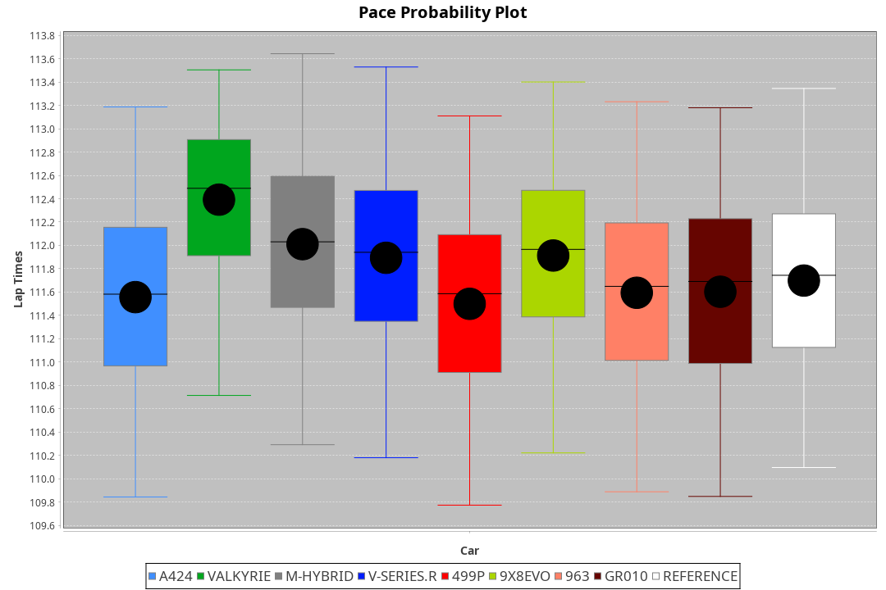
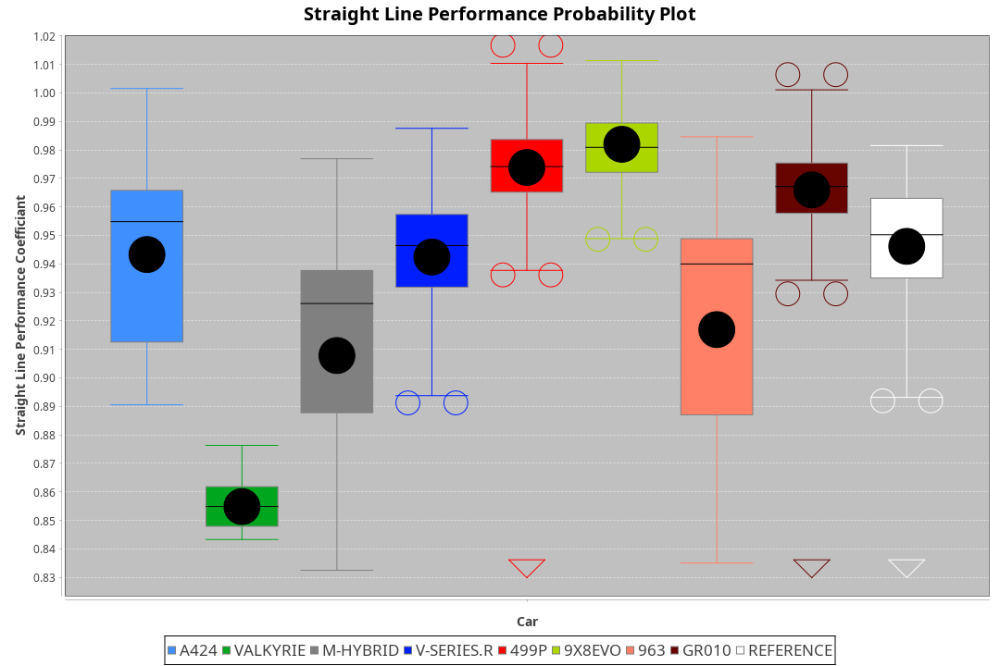
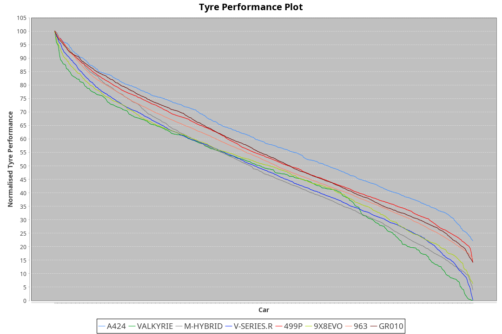

| Manufacturer | Car        | Weight | Power   | PINC    | E/Stint | FDS     |
|:-|:-|:-|:-|:-|:-|:-|
| Alpine       | A424       | 1051kg | 517.0kw |    -    | 919MJ   |    -    |
| Aston Martin | Valkyrie   | 1032kg | 520.0kw |    -    | 911MJ   |    -    |
| BMW          | M-Hybrid   | 1039kg | 512.0kw |    -    | 908MJ   |    -    |
| Cadillac     | V-Series.R | 1042kg | 507.0kw |    -    | 899MJ   |    -    |
| Ferrari      | 499P       | 1073kg | 505.0kw |    -    | 905MJ   | 190kph  |
| Peugeot      | 9X8Evo     | 1057kg | 507.0kw |    -    | 908MJ   | 190kph  |
| Porsche      | 963        | 1057kg | 513.0kw |    -    | 910MJ   |    -    |
| Toyota       | GR010      | 1090kg | 509.0kw |    -    | 909MJ   | 190kph  |

### BoP Accuracy: 73.85%; Overall BoP Grade: C2
| Manufacturer | Car        | Type  | RP      | QP      | Weight | Power¹  | Threshhold | PINC    | Power²   | E/Stint | AVG Vmax  | FDS     | RDLC | L/Stint | BOP-Grade | Model Accuracy | Model Points | Match% | SimDiff |
|:-|:-|:-|:-|:-|:-|:-|:-|:-|:-|:-|:-|:-|:-|:-|:-|:-|:-|:-|:-|
| Alpine       | A424       | LMDH  | 1:51.47 | 1:47.58 | 1051kg | 517.0kw | 210.0kph   |    -    | 517.00kw |  919MJ  | 293.63kph |    -    | 1.00 | 34      | -A2       | 99.49%         | 1360         | 91.14% | -0.54   |
| Aston Martin | Valkyrie   | LMHNH | 1:54.18 | 1:49.36 | 1032kg | 520.0kw | 210.0kph   |    -    | 520.00kw |  911MJ  | 286.71kph |    -    | 1.04 | 34      | +Ω1       | 100.00%        | 312          | 0.54%  | #       |
| BMW          | M-Hybrid   | LMDH  | 1:51.48 | 1:46.65 | 1039kg | 512.0kw | 210.0kph   |    -    | 512.00kw |  908MJ  | 292.59kph |    -    | 1.01 | 34      | -A2       | 98.62%         | 2363         | 91.44% | -0.16   |
| Cadillac     | V-Series.R | LMDH  | 1:51.48 | 1:47.03 | 1042kg | 507.0kw | 210.0kph   |    -    | 507.00kw |  899MJ  | 286.87kph |    -    | 1.02 | 34      | -A2       | 98.50%         | 4201         | 92.03% | +0.72   |
| Ferrari      | 499P       | LMHHU | 1:51.16 | 1:46.57 | 1073kg | 505.0kw | 210.0kph   |    -    | 505.00kw |  905MJ  | 289.68kph | 190kph  | 1.02 | 34      | -C2       | 100.00%        | 4441         | 73.56% | +0.79   |
| Peugeot      | 9X8Evo     | LMHHU | 1:51.48 | 1:47.27 | 1057kg | 507.0kw | 210.0kph   |    -    | 507.00kw |  908MJ  | 291.34kph | 190kph  | 0.99 | 34      | +B2       | 100.00%        | 808          | 81.68% | +0.68   |
| Porsche      | 963        | LMDH  | 1:51.38 | 1:46.53 | 1057kg | 513.0kw | 210.0kph   |    -    | 513.00kw |  910MJ  | 289.94kph |    -    | 1.00 | 34      | -B1       | 99.87%         | 12613        | 85.08% | +0.16   |
| Toyota       | GR010      | LMHHU | 1:51.15 | 1:46.36 | 1090kg | 509.0kw | 210.0kph   |    -    | 509.00kw |  909MJ  | 286.48kph | 190kph  | 1.00 | 34      | -C1       | 99.73%         | 2956         | 75.31% | +0.80   |

## Power below Threshhold
| N/Nmax    | A424    | VALKYRIE | M-HYBRID | V-SERIES.R | 499P    | 9X8EVO  | 963     | GR010   |
|:-|:-|:-|:-|:-|:-|:-|:-|:-|
|  0.550    |  255    |  256     |  252     |  250       |  249    |  250    |  253    |  251    |
|  0.575    |  278    |  279     |  275     |  273       |  272    |  273    |  276    |  274    |
|  0.600    |  298    |  300     |  296     |  293       |  292    |  293    |  296    |  294    |
|  0.625    |  320    |  322     |  317     |  314       |  312    |  314    |  317    |  315    |
|  0.650    |  341    |  343     |  338     |  335       |  333    |  335    |  338    |  336    |
|  0.675    |  363    |  365     |  359     |  356       |  355    |  356    |  360    |  357    |
|  0.700    |  385    |  387     |  381     |  377       |  376    |  377    |  382    |  379    |
|  0.725    |  407    |  409     |  403     |  399       |  397    |  399    |  403    |  400    |
|  0.750    |  427    |  430     |  423     |  419       |  417    |  419    |  424    |  421    |
|  0.775    |  446    |  449     |  442     |  438       |  436    |  438    |  443    |  440    |
|  0.800    |  464    |  467     |  460     |  455       |  454    |  455    |  461    |  457    |
|  0.825    |  479    |  482     |  475     |  470       |  469    |  470    |  476    |  472    |
|  0.850    |  491    |  494     |  486     |  482       |  480    |  482    |  487    |  484    |
|  0.875    |  502    |  505     |  497     |  492       |  490    |  492    |  498    |  494    |
|  0.900    |  509    |  512     |  504     |  499       |  497    |  499    |  505    |  501    |
|  0.925    |  514    |  517     |  509     |  504       |  502    |  504    |  510    |  506    |
| **0.950** | **517** | **520**  | **512**  | **507**    | **505** | **507** | **513** | **509** |
|  0.975    |  515    |  518     |  510     |  505       |  503    |  505    |  511    |  507    |
|  1.000    |  511    |  514     |  506     |  502       |  500    |  502    |  507    |  504    |
|  1.025    |  441    |  444     |  437     |  433       |  431    |  433    |  438    |  435    |

## Power above Threshhold
| N/Nmax    | A424    | VALKYRIE | M-HYBRID | V-SERIES.R | 499P    | 9X8EVO  | 963     | GR010   |
|:-|:-|:-|:-|:-|:-|:-|:-|:-|
|  0.550    |  255    |  256     |  252     |  250       |  249    |  250    |  253    |  251    |
|  0.575    |  278    |  279     |  275     |  273       |  272    |  273    |  276    |  274    |
|  0.600    |  298    |  300     |  296     |  293       |  292    |  293    |  296    |  294    |
|  0.625    |  320    |  322     |  317     |  314       |  312    |  314    |  317    |  315    |
|  0.650    |  341    |  343     |  338     |  335       |  333    |  335    |  338    |  336    |
|  0.675    |  363    |  365     |  359     |  356       |  355    |  356    |  360    |  357    |
|  0.700    |  385    |  387     |  381     |  377       |  376    |  377    |  382    |  379    |
|  0.725    |  407    |  409     |  403     |  399       |  397    |  399    |  403    |  400    |
|  0.750    |  427    |  430     |  423     |  419       |  417    |  419    |  424    |  421    |
|  0.775    |  446    |  449     |  442     |  438       |  436    |  438    |  443    |  440    |
|  0.800    |  464    |  467     |  460     |  455       |  454    |  455    |  461    |  457    |
|  0.825    |  479    |  482     |  475     |  470       |  469    |  470    |  476    |  472    |
|  0.850    |  491    |  494     |  486     |  482       |  480    |  482    |  487    |  484    |
|  0.875    |  502    |  505     |  497     |  492       |  490    |  492    |  498    |  494    |
|  0.900    |  509    |  512     |  504     |  499       |  497    |  499    |  505    |  501    |
|  0.925    |  514    |  517     |  509     |  504       |  502    |  504    |  510    |  506    |
| **0.950** | **517** | **520**  | **512**  | **507**    | **505** | **507** | **513** | **509** |
|  0.975    |  515    |  518     |  510     |  505       |  503    |  505    |  511    |  507    |
|  1.000    |  511    |  514     |  506     |  502       |  500    |  502    |  507    |  504    |
|  1.025    |  441    |  444     |  437     |  433       |  431    |  433    |  438    |  435    |
