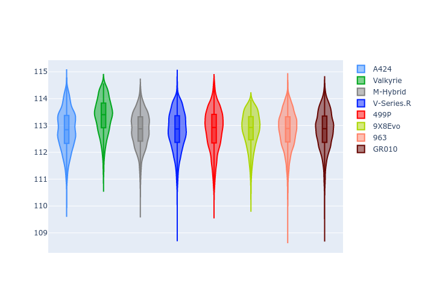
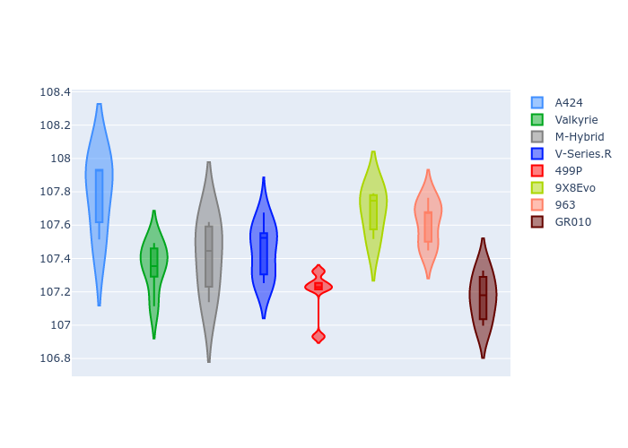
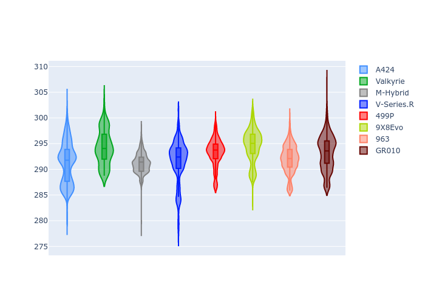
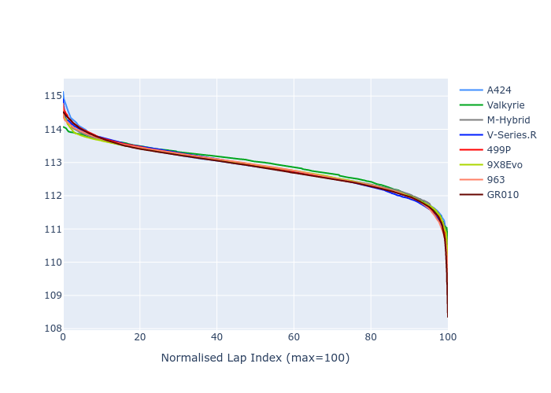

# Combined Plots

## Metadata

- BoP Accuracy: 99.90%
- Overall BoP Grade: A1
- Track: BAHRAIN
- Threshhold: 0.0kph
- Average Laptime: 1:52.90
- Average Quali Laptime: 1:47.65
- Laptime Std Dev: 0.17 seconds
- Filtered Average Topspeed: 294.18kph

## BoP Table
| Manufacturer   | Car        | Weight   | Power   | PINC   | E/Stint   | FDS    | RDP    | QDP    | TDP    |
|:---------------|:-----------|:---------|:--------|:-------|:----------|:-------|:-------|:-------|:-------|
| Alpine         | A424       | 1040kg   | 514.0kw | -      | 916MJ     | -      | 52.20% | 54.51% | 24.58% |
| Aston Martin   | Valkyrie   | 1030kg   | 520.0kw | -      | 911MJ     | -      | 53.39% | 54.11% | 23.71% |
| BMW            | M-Hybrid   | 1040kg   | 515.0kw | -      | 911MJ     | -      | 53.47% | 52.95% | 33.73% |
| Cadillac       | V-Series.R | 1043kg   | 520.0kw | -      | 911MJ     | -      | 49.22% | 60.31% | 18.04% |
| Ferrari        | 499P       | 1060kg   | 512.0kw | -      | 910MJ     | 190kph | 51.56% | 44.72% | 9.86%  |
| Peugeot        | 9X8Evo     | 1031kg   | 514.0kw | -      | 912MJ     | 190kph | 50.17% | 49.36% | 17.73% |
| Porsche        | 963        | 1035kg   | 510.0kw | -      | 905MJ     | -      | 50.78% | 41.25% | 27.61% |
| Toyota         | GR010      | 1059kg   | 511.0kw | -      | 907MJ     | 200kph | 51.68% | 51.25% | 14.48% |

## Performance Table
| Manufacturer   | Car        | RP      | QP      | Vavg      |   RDLC | BOP-Grade   | Match   |
|:---------------|:-----------|:--------|:--------|:----------|-------:|:------------|:--------|
| Alpine         | A424       | 1:52.83 | 1:47.77 | 293.03kph |   1.05 | ~A1         | 99.94%  |
| Aston Martin   | Valkyrie   | 1:53.34 | 1:48.26 | 292.66kph |   1.05 | ~A1         | 99.93%  |
| BMW            | M-Hybrid   | 1:52.85 | 1:47.51 | 292.99kph |   1.05 | ~A1         | 100.00% |
| Cadillac       | V-Series.R | 1:52.82 | 1:47.51 | 291.89kph |   1.05 | ~A1         | 99.84%  |
| Ferrari        | 499P       | 1:52.84 | 1:47.46 | 295.72kph |   1.05 | ~A1         | 99.72%  |
| Peugeot        | 9X8Evo     | 1:52.84 | 1:47.73 | 295.57kph |   1.05 | ~A1         | 100.00% |
| Porsche        | 963        | 1:52.83 | 1:47.60 | 295.20kph |   1.05 | ~A1         | 99.92%  |
| Toyota         | GR010      | 1:52.83 | 1:47.33 | 296.36kph |   1.05 | ~A1         | 99.85%  |

## Race Laptimes

## Quali Laptimes

## Topspeeds

## Laptimes Lineplot

